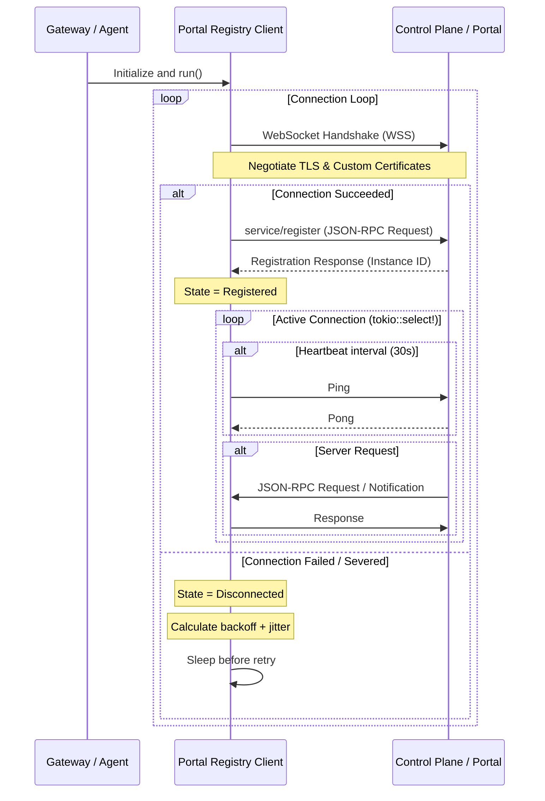

# Controller Registry Client

The **Controller Registry Client** (`portal-registry`) manages the connection between a gateway (or agent) instance and the Light Portal control plane. It enables runtime instance registration, service discovery queries, and dynamic configuration synchronization over a secure WebSocket connection.

---

## Architecture Overview

The registry client operates as a background service inside the runtime. It establishes a persistent connection to the controller and handles bidirectional communication.

---

## Core Features

### 1. WebSocket Protocol & Handshake
The connection is established over standard WebSocket (secured via TLS: `wss://`). Once connected, the client performs an initial JSON-RPC handshake:
- **Method**: `service/register`
- **Parameters**: `ServiceRegistrationParams` (containing `serviceId`, `version`, host `address`, listening `port`, `tags`, `envTag`, and a verification `jwt` token).
- **Result**: `RegistrationResponse` returning a unique `runtimeInstanceId` assigned by the control plane.

### 2. Heartbeat (Ping/Pong)
To prevent network firewalls from dropping inactive connections and to detect silent TCP half-open connection drops, the client sends a WebSocket `Ping` frame every **30 seconds**.
- If the control plane fails to reply, or the socket write fails, the connection loop is terminated immediately to initiate reconnection.
- The client also responds immediately with a `Pong` to any inbound `Ping` frames received from the controller.

### 3. Exponential Backoff with Jitter
When a connection is lost, terminated, or fails to initialize, the client retries using an exponential backoff strategy:
- **Base delay** starts at `1 second` and doubles on subsequent retries up to a maximum of `60 seconds`.
- **Random Jitter** of `0-1000 milliseconds` is added to each sleep duration.
- **Thundering Herd Prevention**: Jitter prevents synchronized gateway instances (e.g., in a Kubernetes cluster) from flooding the control plane with connection requests at the exact same moment when it restarts.

### 4. TLS & Certificate Verification
The client supports establishing WSS connections with two cert verification modes:
- **Standard Verification** (`verifyHostname: true`): Validates the server certificate chain against loaded CA certificates and verifies that the certificate hostname matches the controller domain.
- **No-Hostname Verification** (`verifyHostname: false`): Useful in local development or custom routing networks. It validates the certificate chain against the trusted CA bundle but bypasses hostname verification.

---

## Component Configuration

Registry settings are loaded from `portal-registry.yml` or mapped in startup configuration:

| Configuration Property | Type | Default | Description |
| --- | --- | --- | --- |
| `portalUrl` | String | | The API endpoint of the Portal Registry controller |
| `portalToken` | String | | JWT verification token used for handshakes |
| `controllerDiscoveryToken` | String | | Token utilized for discovery lookups |
| `bootstrapCaCertPath` | Path | | Optional path to CA certificate bundle |

---

## Verification & Testing

The registry client behaves predictably under connection drops and can be verified via:
- **Handshake Verification**: `registration_and_metadata_update_match_controller_protocol` (defined in `crates/portal-registry/src/client.rs`) asserts correct JSON-RPC registration format and success handling.
- **WebSocket Gateway integration**: `websocket_gateway_proxies_text_binary_close_subprotocol_and_headers` (defined in `apps/light-gateway/src/main.rs`) tests end-to-end WebSocket proxying alongside a mock controller registry.
- **Reconnect Loop Verification**: `test_registry_client_reconnects_and_reregisters_on_run_level` (defined in `crates/portal-registry/src/client.rs`) verifies that client terminates connection on socket drop, calculates backoff delay, reconnects, and re-registers automatically.
- **Heartbeat Timeout Verification**: `test_heartbeat_timeout_detects_silent_controller_loss` (defined in `crates/portal-registry/src/client.rs`) tests that the client detects silent connection drops by terminating and transitioning to `Disconnected` if the controller does not respond to Ping within the configured heartbeat timeout window.
