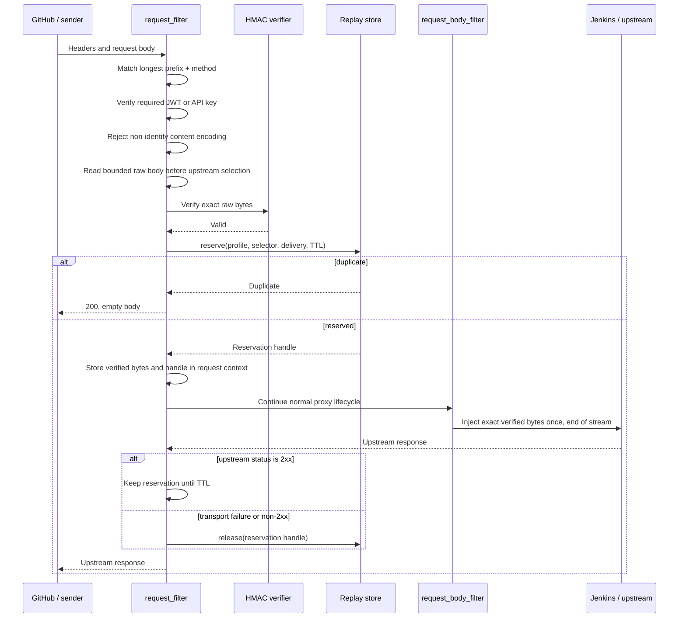

# HMAC Webhook Authentication

Status: Proposed design for `light-gateway`. The first provider profile is
GitHub. Implementation has not started.

Tracking issue: [networknt/light-4j#2772](https://github.com/networknt/light-4j/issues/2772)

## Purpose

`light-gateway` needs to authenticate webhook requests whose sender proves
possession of a shared secret by signing the request body. The first use case
is a GitHub webhook that triggers a Jenkins build, but the verifier must be
configurable enough to support other providers that use the same raw-body HMAC
model.

HMAC is an authentication mechanism, while Unified Security owns route policy.
The cryptographic and body-buffering implementation must therefore be reusable,
but route configuration must be able to require:

- HMAC by itself;
- HMAC and JWT; or
- HMAC and API key.

Every required factor must pass before the request is admitted. A verified
request body must be forwarded without parsing, re-encoding, or otherwise
changing its entity bytes.

## Document Boundary

This page is the Rust `light-fabric` implementation design. It also records the
external contract that Java and Rust should share, such as the GitHub headers,
signature format, body-size limit, and duplicate response behavior.

The Java implementation should have a separate design in `light-4j`. Java is in
maintenance mode, uses first-match prefix routing, and needs the smallest
handler-chain change compatible with its existing production deployments. This
Rust design does not require Java to adopt Rust's longest-prefix matcher,
request lifecycle, replay-store implementation, or internal type model.

## Resolved Decisions

- GitHub is the first provider profile. Tests for another real provider are not
  required.
- Version 1 supports HMAC-SHA-256 over the exact raw entity body.
- Provider-specific signing algorithms that include timestamps, paths, or
  selected headers are future strategies, not a configurable canonicalization
  language in version 1.
- Signature header, prefix, encoding, secret selection, replay ID header, body
  limit, and replay retention are configurable by profile.
- GitHub uses `X-Hub-Signature-256`, the `sha256=` prefix, hexadecimal encoding,
  and `X-GitHub-Delivery` for duplicate suppression.
- `X-GitHub-Hook-ID` selects one or more candidate secrets. One shared default
  secret is also supported when explicitly configured.
- Secrets are loaded from named environment variables. Secret values never
  appear in configuration snapshots, logs, metrics, or management responses.
- Secret rotation uses an ordered active/previous list. Module reload can switch
  among environment variables that were present when the process started.
  Changing an environment variable's value requires a rolling process restart.
- The maximum request body is configurable and defaults to 16 MiB.
- Non-identity `Content-Encoding` is rejected in version 1.
- Duplicate deliveries return an empty `200` response and are not sent to the
  upstream service.
- A failed upstream invocation releases its replay reservation. A successful
  `2xx` keeps the reservation until its retention period expires.
- Replay retention is configurable and defaults to seven days. GitHub currently
  supports manual redelivery for deliveries from the previous three days and
  reuses the original `X-GitHub-Delivery` value.
- A replay-store SPI supports local and distributed implementations. If no
  provider is configured, the gateway uses a process-local store.
- An unavailable explicitly configured distributed store fails closed with
  `503`; it does not silently fall back to local state.
- Rust retains longest-prefix route selection and adds method-aware matching.
  Java retains its current first-match behavior.
- HMAC-protected routes cannot also match `anonymousPrefixes`.

GitHub's signature and redelivery behavior are documented in:

- [Validating webhook deliveries](https://docs.github.com/en/webhooks/using-webhooks/validating-webhook-deliveries)
- [Best practices for using webhooks](https://docs.github.com/en/webhooks/using-webhooks/best-practices-for-using-webhooks)
- [Redelivering webhooks](https://docs.github.com/en/webhooks/testing-and-troubleshooting-webhooks/redelivering-webhooks)

## Goals

- Authenticate a GitHub webhook before any request body reaches Jenkins.
- Preserve the exact authenticated entity-body bytes for proxy forwarding.
- Compose HMAC with the existing JWT and API-key mechanisms.
- Support one shared secret or a header-selected secret map.
- Allow an active and previous secret during rotation.
- Suppress duplicate deliveries atomically.
- Provide process-local and distributed replay-store implementations.
- Permit an authorized operator to remove one replay record before intentional
  redelivery.
- Hot-reload policy, profiles, and pre-provisioned secret references atomically.
- Keep logs and metrics useful without exposing signatures, secrets, bodies, or
  high-cardinality delivery identifiers.

## Non-Goals

- Do not create an arbitrary canonical signing-expression language.
- Do not parse JSON or form data before signature verification.
- Do not support decompressed-body verification in version 1.
- Do not promise that proxy hop-by-hop headers or HTTP chunk boundaries remain
  byte-for-byte identical. Existing Pingora proxy normalization still applies.
- Do not implement provider-specific GitHub event filtering or Jenkins build
  semantics.
- Do not make a non-idempotent callee safe. Jenkins or the service that starts a
  build must still enforce its own idempotency key.
- Do not build a complete Rust HTTP session framework as a prerequisite. The
  replay SPI is intentionally smaller and requires atomic reserve/release
  semantics that a general session CRUD API does not provide.
- Do not redesign Java prefix matching or Unified Security in this document.
- Do not support HMAC body gating for direct application handlers such as MCP or
  LLM endpoints in the first phase. Version 1 targets proxy/router chains.

## Threat Model and Security Invariants

The design protects against:

- body tampering without possession of the configured secret;
- use of an unknown or missing secret selector;
- replay of the same GitHub delivery within the configured retention window;
- concurrent delivery of the same replay ID to one or more gateway instances;
- accidental authentication bypass through `anonymousPrefixes`;
- signature verification against parsed, normalized, decompressed, or otherwise
  reconstructed content; and
- partial authentication where HMAC passes but a required JWT or API key does
  not.

The following invariants are mandatory:

1. HMAC input is exactly the entity-body byte sequence received from the
   downstream connection.
2. HMAC comparison is constant-time.
3. All configured authentication factors pass before upstream selection.
4. No request-body byte is forwarded before HMAC validation and replay
   reservation succeed.
5. The forwarded entity body is the same byte sequence that was authenticated.
6. The untrusted hook ID only selects candidate secrets; it is never accepted as
   authenticated identity on its own.
7. Replay reservation is an atomic insert-if-absent operation.
8. A configured distributed replay-store outage fails closed.
9. Secret material is excluded from serializable module configuration and
   operational output.
10. A runtime reload either installs one completely validated security runtime
    or leaves the previous runtime active.

### Replay Limitation

GitHub signs the request body, not `X-GitHub-Delivery`. Duplicate suppression
using that header follows GitHub's recommendation and stops an unchanged
captured delivery, but it is not a complete cryptographic anti-replay protocol:
an attacker who possesses a valid body and signature could change an unsigned
delivery header. A finite cache also permits replay after expiry, local state is
lost on restart, and a process can fail after reserving an ID but before invoking
the upstream.

These limitations make callee idempotency mandatory. A future strict profile
may additionally fence a signature/body fingerprint, with the documented
tradeoff that two legitimate deliveries with identical bodies could be treated
as duplicates.

## Architecture

The design separates policy, HMAC mechanics, request-body gating, and replay
storage:

```text
unified-security.yml
        |
        v
Unified Security policy compiler -----> JWT / API-key factors
        |                                      |
        | references profile                   |
        v                                      |
     hmac.yml                                  |
        |                                      |
        v                                      |
HMAC profile + resolved secret keyring         |
        |                                      |
        +------------------+-------------------+
                           v
                 pre-upstream body gate
                           |
                   HMAC verification
                           |
                    replay reservation
                           |
                           v
                  normal Pingora proxy
                           |
                retain or release replay ID
```

### Unified Security Owns Policy

HMAC is not another independent route matcher in the handler chain. Unified
Security selects the route and composes the required factors. The HMAC verifier
is an independent reusable component invoked by the compiled Unified Security
runtime.

This prevents two configurations from disagreeing about which route is
protected. It also makes HMAC-only a normal Unified Security policy containing
one required factor rather than a special anonymous route.

The existing legacy boolean fields remain supported. A route uses either the
legacy fields or the new `authentication` object, never both:

```yaml
pathPrefixAuths:
  # Existing configuration: behavior remains unchanged.
  - prefix: /legacy-api
    jwt: true
    jwkServiceIds:
      - com.networknt.oauth2-token-1.0.0

  # HMAC only.
  - prefix: /github-webhook
    methods: [POST]
    authentication:
      allOf:
        - type: hmac
          profile: github

  # HMAC and JWT.
  - prefix: /partner-webhook
    methods: [POST]
    authentication:
      allOf:
        - type: hmac
          profile: partner
        - type: jwt
          jwkServiceIds:
            - com.networknt.oauth2-partner-1.0.0

  # HMAC and API key.
  - prefix: /signed-build
    methods: [POST]
    authentication:
      allOf:
        - type: hmac
          profile: build-system
        - type: apiKey
```

Version 1 supports one HMAC factor and at most one header authentication factor
per `allOf`. JWT or API key is checked first so an invalid header factor can be
rejected without buffering the request body. Acceptance is still contingent on
all factors.

### Route Matching

Rust selects the longest matching prefix among rules whose optional `methods`
contains the request method. An absent or empty method list means all methods for
backward compatibility. Configuration loading rejects:

- duplicate rules with the same prefix and overlapping methods;
- a rule that mixes legacy booleans with `authentication`;
- an unknown factor type or HMAC profile;
- more than one HMAC factor;
- an empty `allOf`; and
- any overlap between an HMAC-protected route and `anonymousPrefixes`.

The overlap check applies only when an HMAC policy is introduced. Existing
legacy configurations without HMAC retain their current anonymous-prefix
behavior.

### HMAC Profiles

`hmac.yml` contains cryptographic profiles and replay-store configuration. A
profile does not contain route prefixes.

```yaml
profiles:
  github:
    signedInput: rawBody
    algorithm: hmacSha256
    signatureHeader: X-Hub-Signature-256
    signaturePrefix: "sha256="
    signatureEncoding: hex
    maxBodyBytes: 16777216
    bodyReadTimeoutMillis: 10000

    secrets:
      selectorHeader: X-GitHub-Hook-ID
      bySelector:
        "12345678":
          - GITHUB_HOOK_12345678_CURRENT_SECRET
          - GITHUB_HOOK_12345678_PREVIOUS_SECRET
        "87654321":
          - GITHUB_HOOK_87654321_CURRENT_SECRET
      defaultEnvNames: []

    replay:
      enabled: true
      idHeader: X-GitHub-Delivery
      store: webhook-replay
      retentionSeconds: 604800

  shared-build-system:
    signedInput: rawBody
    algorithm: hmacSha256
    signatureHeader: X-Build-Signature
    signaturePrefix: ""
    signatureEncoding: base64
    maxBodyBytes: 16777216
    bodyReadTimeoutMillis: 10000
    secrets:
      selectorHeader: ""
      bySelector: {}
      defaultEnvNames:
        - BUILD_WEBHOOK_CURRENT_SECRET
        - BUILD_WEBHOOK_PREVIOUS_SECRET
    replay:
      enabled: true
      idHeader: X-Build-Delivery
      store: webhook-replay
      retentionSeconds: 604800

replayStores:
  webhook-replay:
    type: redis
    urlEnv: WEBHOOK_REPLAY_REDIS_URL
    keyPrefix: "light:hmac-replay:"
    connectTimeoutMillis: 1000
    operationTimeoutMillis: 1000
```

Supported version 1 values are:

| Field | Values and behavior |
|---|---|
| `signedInput` | `rawBody` only |
| `algorithm` | `hmacSha256` only |
| `signatureEncoding` | `hex` or `base64` |
| `signaturePrefix` | Exact optional prefix removed before decoding |
| `maxBodyBytes` | Positive value, default and recommended maximum 16 MiB |
| `bodyReadTimeoutMillis` | Positive bounded body-read timeout |
| `selectorHeader` | Optional header used for exact secret-map lookup |
| `defaultEnvNames` | Explicit shared-secret fallback; empty means no fallback |
| `retentionSeconds` | Positive TTL; default seven days |

Header names are case-insensitive according to HTTP rules. Multiple values for
the signature, selector, or replay ID header are rejected. Selector values are
matched exactly after trimming optional HTTP whitespace; they are not parsed as
numbers.

The ordered secret list is active first, previous second. Verification computes
and compares every configured candidate rather than returning after the first
match. This bounds secret-version timing differences. Configuration limits the
number of candidates per selector and default to two.

Missing or unknown selectors fail unless `defaultEnvNames` is explicitly
non-empty. If several hooks use one default secret, the selector header is not
an authenticated hook identity.

### Secret Resolution and Rotation

The serializable config retains environment-variable names only. Runtime loading
resolves them into a non-serializable keyring whose debug and serialization
representations are redacted.

Startup and reload fail if a referenced environment variable is absent, empty,
or cannot initialize HMAC. Deployments should use randomly generated secrets of
at least 32 bytes, although compatibility with an existing provider secret may
require accepting a shorter non-empty value.

Safe rotation is:

1. Provision `CURRENT` and `PREVIOUS` environment variables before process
   startup.
2. Configure the ordered list as `[CURRENT, PREVIOUS]` and reload the module.
3. Change the provider to use `CURRENT`.
4. After the overlap window, remove `PREVIOUS` from `hmac.yml` and reload.
5. Use a rolling restart when the bytes assigned to an environment variable
   must change.

An in-flight request pins the `Arc<UnifiedSecurityRuntime>` captured when its
policy was selected. Reload never changes the secrets or replay-store reference
halfway through that request.

## Rust Request Lifecycle

The current `verify_unified_security` function executes in
`GatewayProxy::request_filter`, while `GatewayProxy::request_body_filter`
normally sees streaming chunks after upstream selection. HMAC cannot be added
only to the streaming filter: duplicate detection must be able to return a local
`200` without contacting Jenkins, and no body may reach the upstream before
validation.

For a matched HMAC policy, the pre-upstream flow is:



The request context needs at least:

```rust
struct PendingVerifiedBody {
    bytes: bytes::Bytes,
    injected: bool,
}

struct WebhookReplayReservation {
    key: WebhookReplayKey,
    owner_token: uuid::Uuid,
    released: bool,
}
```

`request_filter` consumes the downstream body with the configured size and time
bounds. Once verification and reservation pass, `request_body_filter` injects
the stored bytes as the single final upstream body chunk. Later body-aware
filters, including tokenization and request access control, operate on that
re-injected body. HMAC must always run before any body mutation.

The security feature does not modify application headers. Existing proxy
behavior may still normalize hop-by-hop headers and transfer framing. The
entity body, `Content-Type`, GitHub event headers, and other end-to-end headers
continue through the normal proxy path.

### Phase 0 Body-Gate Proof

Before implementing the complete feature, a focused spike must prove this
lifecycle against the pinned Pingora version:

1. `request_filter` can consume a bounded HTTP/1.1 body before upstream peer
   selection.
2. The same flow works for HTTP/2 downstream requests.
3. `request_body_filter` receives end-of-stream after the earlier read and can
   inject the stored bytes exactly once.
4. The upstream receives no connection or request when HMAC is invalid or the
   replay store reports a duplicate.
5. The upstream receives the exact original entity bytes when validation passes.
6. `Content-Length` and chunked downstream requests both produce a correct
   upstream request.

An integration test must use a counting fake upstream; an in-memory verifier
test is not sufficient. If Pingora cannot satisfy these assertions, the team
must stop and choose either a gateway-core pre-buffer hook or a dedicated
buffered proxy path. Streaming an unauthenticated request toward the upstream
is not an acceptable fallback.

Routes using HMAC are initially restricted to proxy/router chains. Startup
validation rejects a chain where a later direct application handler expects to
read the already-consumed body from `Session`. A future shared buffered-body
contract can remove that restriction.

## HMAC Verification

The verifier performs these steps in order:

1. Confirm the method and route were selected by compiled Unified Security
   policy.
2. Reject a `Content-Encoding` other than absent or `identity` with `415`.
3. Read at most `maxBodyBytes`; return `413` on overflow and `408` on timeout.
4. Read exactly one signature header and remove the configured prefix.
5. Decode the remaining signature as configured hex or base64 and require a
   SHA-256-sized result.
6. Select the candidate secret list using the optional selector header.
7. Compute HMAC-SHA-256 over the unmodified bytes for every candidate.
8. Compare every result using the `hmac` crate's constant-time verification.
9. Return one generic `401` result for a missing header, unknown selector,
   malformed signature, or signature mismatch.
10. Only after all authentication factors pass, reserve the replay key.

Parsing a GitHub JSON or form payload happens only in the upstream service, after
authentication. No UTF-8 conversion is required by the verifier.

## Replay Store

Replay protection needs a purpose-specific contract rather than the current
observability-oriented `RuntimeCache` trait:

```rust
#[async_trait::async_trait]
pub trait WebhookReplayStore: Send + Sync {
    async fn reserve(
        &self,
        key: &WebhookReplayKey,
        retention: std::time::Duration,
    ) -> Result<ReserveOutcome, ReplayStoreError>;

    async fn release(
        &self,
        reservation: &ReplayReservation,
    ) -> Result<(), ReplayStoreError>;

    async fn force_remove(
        &self,
        key: &WebhookReplayKey,
    ) -> Result<bool, ReplayStoreError>;
}

pub enum ReserveOutcome {
    Reserved(ReplayReservation),
    Duplicate,
}
```

The logical key contains `profile`, normalized selector or `shared`, and replay
ID. Providers may hash that canonical tuple before persistence. The reservation
stores a random owner token. Normal failure release uses atomic compare-and-delete
so an old request cannot delete a newer reservation after expiry and re-reserve.
The operator-only `force_remove` intentionally ignores the owner token.

### Local Store

If no replay store is configured, use a process-local implementation. It must:

- implement atomic insert-if-absent under concurrency;
- expire entries after the requested retention;
- enforce a configured maximum without evicting unexpired entries silently;
- return an unavailable/capacity error, producing `503`, if it cannot preserve
  the replay guarantee; and
- register a safe summary with `CacheRegistry` for operational visibility.

Process restart loses local replay history, and multiple instances do not share
it. Startup logs and metrics must clearly report `scope=local`.

### Redis Store

The first distributed provider should be Redis. Reservation maps to `SET key
owner-token NX PX retention`. Release uses an atomic compare-and-delete script,
and operator removal uses `DEL`.

The deployment should use a Redis namespace/database whose eviction policy does
not discard unexpired replay entries. Connection or operation timeout fails the
webhook with `503`. Distributed storage is recommended whenever a route is
served by more than one gateway instance.

A future general Rust cache/session abstraction may host this provider, but its
contract must preserve atomic reserve and compare-and-delete semantics. A CRUD
session repository or get-then-put cache adapter is insufficient.

### Retention and Upstream Outcome

The default retention is 604800 seconds (seven days). Operators may reduce or
increase it per profile. Documentation must explain that finite retention means
finite replay protection.

Outcome handling is:

| Outcome | Reservation behavior |
|---|---|
| Duplicate before upstream selection | Return empty `200`; existing reservation remains |
| Upstream `2xx` response header received | Keep until TTL, even if the downstream client disconnects later |
| Upstream non-`2xx` | Release before completing the downstream response |
| Connect failure or proxy failure before an upstream response | Release from the final async logging/error phase |
| Release-store failure | Log and count it; return the original upstream failure; operator can remove the stale record |
| Gateway crash after reserve | Reservation remains until TTL or operator removal |

Keeping a reservation after an observed upstream `2xx` prevents a downstream
write failure from triggering the Jenkins build again. Ambiguous failures still
require callee idempotency.

## Operator Redelivery

Expose a protected runtime MCP operation rather than asking operators to know a
provider-native cache key:

```json
{
  "name": "remove_webhook_replay",
  "arguments": {
    "profile": "github",
    "selector": "12345678",
    "deliveryId": "6f3f8b40-..."
  }
}
```

The controller adds and routes by `runtimeInstanceId` using its existing runtime
MCP path. The response reports whether an entry was removed and whether the
store scope is `local` or `distributed`; it never returns provider keys or
stored values.

For a local store, the operation must be executed on every gateway instance
that can serve the route. For a distributed store, one removal is sufficient.
The operation requires administrative authorization and emits an audit event.
The expected workflow is remove first, then request GitHub redelivery.

## Hot Reload

Replace the current config-only value with a compiled runtime:

```rust
pub struct UnifiedSecurityRuntime {
    policy: CompiledUnifiedSecurityPolicy,
    hmac_profiles: std::collections::BTreeMap<String, HmacProfileRuntime>,
    replay_stores: std::collections::BTreeMap<String, Arc<dyn WebhookReplayStore>>,
}
```

The Unified Security reloader loads `unified-security.yml` and, only when a
referenced HMAC factor exists, `hmac.yml`. It validates all cross-references,
resolves secret environment names, connects configured stores, and constructs
one candidate runtime. `ConfigManager` swaps the candidate only after every
step succeeds.

Module registry output exposes the public HMAC configuration with secret
environment names masked or omitted. Resolved bytes are never registered.

## Failure Contract

| Condition | HTTP status | Behavior |
|---|---:|---|
| Missing/malformed signature, unknown selector, or mismatch | `401` | Generic invalid webhook authentication response |
| Missing/malformed replay ID when replay is enabled | `401` | Reject without reserving or forwarding |
| Unsupported `Content-Encoding` | `415` | Reject before reading/forwarding body |
| Body exceeds configured maximum | `413` | Stop reading and reject |
| Body read timeout | `408` | Reject and close/drain according to Pingora safety rules |
| Duplicate replay ID | `200` | Empty local response; do not contact upstream |
| Configured replay store unavailable or full | `503` | Fail closed; do not contact upstream |
| Upstream non-`2xx` | Upstream status | Release reservation and forward response |
| Upstream connection/proxy failure | Existing gateway error | Release reservation when outcome is not a known `2xx` |

Error responses must not reveal whether the selector existed, which secret
matched, or whether active versus previous material was used.

## Observability

Recommended metrics are:

- `hmac_webhook_requests_total{profile,outcome}` where outcome is `accepted`,
  `duplicate`, `invalid`, `too_large`, `unsupported_encoding`, `timeout`, or
  `store_unavailable`;
- `hmac_webhook_verification_duration_seconds{profile}`;
- `hmac_webhook_body_bytes{profile}`;
- `hmac_replay_operations_total{store_type,operation,outcome}`; and
- `hmac_replay_local_entries` for the local provider.

Logs may include profile, route, correlation ID, store type, status, and a
one-way truncated hash of the selector/delivery tuple when troubleshooting is
required. Do not log the raw body, signature, secret, delivery ID, selector, JWT,
or API key. Do not put selector or delivery ID into metric labels.

Startup and reload logs must state whether each profile uses local or
distributed replay protection. Local fallback is a warning in multi-instance
deployments.

## Validation Plan

### Configuration

- Legacy Unified Security rules deserialize and behave unchanged.
- New `allOf` rules reject mixed legacy fields, unknown factors, empty factors,
  missing profiles, duplicate methods, and anonymous overlap.
- Profile parsing accepts hex and base64 encoding and rejects unsupported signed
  input or algorithms.
- Missing/empty secret environment variables fail startup/reload without
  replacing the active runtime.
- In-flight requests continue using the old runtime after reload.

### Cryptography and Bytes

- Use GitHub's published secret/payload/signature test vector.
- Validate non-ASCII payload bytes, whitespace changes, empty bodies, and bodies
  split across different downstream chunk boundaries.
- Prove that parsing or re-serializing the same logical JSON does not validate
  unless its bytes match the signature.
- Reject malformed prefixes, wrong decoded lengths, duplicate signature headers,
  invalid hex/base64, and wrong signatures with the same generic response.
- Verify both active and previous secrets without reporting which one matched.

### Authentication Composition

- HMAC-only accepts a valid signed request.
- HMAC plus JWT requires both factors.
- HMAC plus API key requires both factors.
- A valid HMAC never compensates for a missing/invalid JWT or API key.
- A valid JWT/API key never compensates for invalid HMAC.
- HMAC routes cannot bypass through `anonymousPrefixes`.
- Longest-prefix and method matching select the expected Rust rule.

### Body Gate

- Run the Phase 0 HTTP/1.1 and HTTP/2 integration proof.
- Validate exactly 16 MiB and reject 16 MiB plus one byte.
- Reject non-identity content encoding.
- Verify a fake upstream sees no request for invalid HMAC, duplicate delivery,
  replay-store failure, oversized body, or timeout.
- Verify a successful upstream receives the exact authenticated bytes and
  expected end-to-end headers.
- Exercise interaction with request tokenization and body-aware access control.
- Reject unsupported direct application-handler chains at startup.

### Replay

- Race many reservations for one key; exactly one wins in both local and Redis
  providers.
- A duplicate returns `200` and does not increment the upstream request count.
- A `2xx` retains the reservation.
- A non-`2xx` and a pre-response transport failure release it.
- A downstream disconnect after an upstream `2xx` retains it.
- Compare-and-delete cannot remove a newer owner's reservation.
- Local capacity exhaustion and configured Redis outage fail closed.
- Operator removal allows a subsequent intentional redelivery.
- Controller fan-out removes local entries from every selected instance.

### End-to-End GitHub/Jenkins

- Configure one GitHub hook ID with an active secret and trigger one Jenkins
  build from a GitHub webhook.
- Confirm the delivered body and headers match the authenticated request.
- Resend the same delivery and confirm `200` with no second Jenkins invocation.
- Make Jenkins return a failure, confirm release, and then redeliver successfully.
- Rotate from previous to active secret using module reload and verify the overlap
  window.
- No other service provider integration test is required for version 1.

## Implementation Phases

### Phase 0: Prove the Pre-Upstream Body Gate

- Add the minimal HMAC-independent body consume/re-inject integration fixture.
- Prove HTTP/1.1, HTTP/2, duplicate local response, no upstream contact, exact
  bytes, content length, and chunked input.
- Stop the implementation if the pinned Pingora lifecycle cannot meet the
  security invariants.

### Phase 1: Configuration and Verification Core

- Add `frameworks/light-pingora/src/hmac.rs` with profile/config parsing and the
  raw-body HMAC-SHA-256 verifier.
- Extend Unified Security with method-aware `authentication.allOf` policies.
- Compile and validate `unified-security.yml` plus `hmac.yml` into one runtime.
- Add cryptographic, selection, composition, and reload unit tests.

### Phase 2: Replay Stores and Administration

- Add `WebhookReplayStore`, the no-early-eviction local provider, and Redis
  provider.
- Add owner-token compare-and-delete.
- Register safe local-store summaries with `CacheRegistry`.
- Add the protected `remove_webhook_replay` runtime MCP operation.

### Phase 3: Gateway Integration

- Integrate body gating and verified-body reinjection into `GatewayProxy`.
- Track reservation outcome in `GatewayRequestContext`.
- Retain/release from upstream response and final error phases.
- Add metrics, redacted logs, handler-chain validation, and hot reload.

### Phase 4: Qualification

- Run focused `light-pingora`, `light-runtime`, and `light-gateway` tests.
- Run the HTTP/1.1 and HTTP/2 counting-upstream integration matrix.
- Qualify the Redis provider under concurrent gateway instances.
- Complete one GitHub-to-Jenkins end-to-end test and secret-rotation exercise.

## Java Compatibility Follow-Up

The later Java design should reuse the external fixtures and behavior contract
from this page but optimize for maintenance-mode risk:

- retain first-match prefix semantics;
- retain the established handler-chain and hot-reload mechanisms;
- use the existing 16 MiB request buffering ceiling;
- add the smallest body-aware HMAC component needed for HMAC-only and HMAC plus
  JWT/API key;
- define a dedicated atomic replay-store interface rather than using
  `SessionRepository` get/save as a replay fence; and
- use local fallback plus an optional distributed implementation informed by
  `light-session-4j` providers.

Cross-runtime conformance should be asserted with shared raw request fixtures,
not by forcing both implementations to have the same internal architecture.

