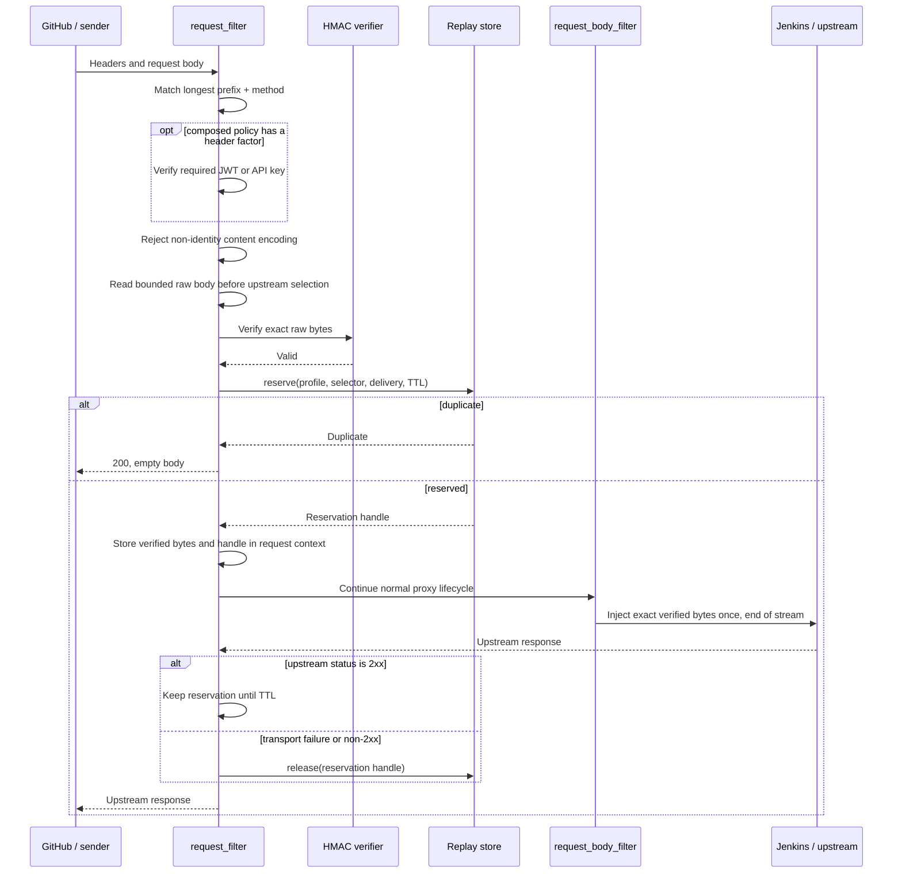

# HMAC Webhook Authentication

Status: Implemented through Phase 4 local qualification for `light-gateway`,
informed by the completed Java implementation. The selected gateway-core
pre-buffer hook, configuration and policy compilation, secret resolution,
raw-body verification, replay stores, gateway integration, and protected replay
administration are implemented. Production HTTP/2 over TLS, multi-process
gateway/Redis, and deployed GitHub-to-Jenkins acceptance remain release gates.
The first provider profile is GitHub.

Tracking issue: [networknt/light-4j#2772](https://github.com/networknt/light-4j/issues/2772)

## Purpose

`light-gateway` needs to authenticate webhook requests whose sender proves
possession of a shared secret by signing the request body. The first use case
is a GitHub webhook that triggers a Jenkins build, but the verifier must be
configurable enough to support other providers that use the same raw-body HMAC
model.

HMAC is an authentication mechanism. A standalone `hmac` handler owns HMAC-only
route policy, while Unified Security owns composed route policy. The
cryptographic and body-buffering implementation is shared, and route
configuration can require:

- HMAC by itself;
- HMAC and JWT; or
- HMAC and API key.

Every required factor must pass before the request is admitted. A verified
request body must be forwarded without parsing, re-encoding, or otherwise
changing its entity bytes.

## Document Boundary

This page is the Rust `light-fabric` implementation design. It also records the
external contract that Java and Rust should share, such as the GitHub headers,
signature format, body-size limit, and duplicate response behavior.

The Java implementation should have a separate design in `light-4j`. Java is in
maintenance mode, uses first-match prefix routing, and needs the smallest
handler-chain change compatible with its existing production deployments. This
Rust design does not require Java to adopt Rust's longest-prefix matcher,
request lifecycle, replay-store implementation, or internal type model.

## Resolved Decisions

- GitHub is the first provider profile. Tests for another real provider are not
  required.
- Version 1 supports HMAC-SHA-256 over the exact raw entity body.
- Provider-specific signing algorithms that include timestamps, paths, or
  selected headers are future strategies, not a configurable canonicalization
  language in version 1.
- Signature header, prefix, encoding, secret selection, replay ID header, body
  limit, and replay retention are configurable by profile.
- GitHub uses `X-Hub-Signature-256`, the `sha256=` prefix, hexadecimal encoding,
  and `X-GitHub-Delivery` for duplicate suppression.
- `X-GitHub-Hook-ID` selects one or more candidate secrets. One shared default
  secret is also supported when explicitly configured.
- Secrets are loaded from named environment variables. Secret values never
  appear in configuration snapshots, logs, metrics, or management responses.
- Secret rotation uses an ordered active/previous list. Module reload can switch
  among environment variables that were present when the process started.
  Changing an environment variable's value requires a rolling process restart.
- The maximum request body is configurable and defaults to 16 MiB.
- Non-identity `Content-Encoding` is rejected in version 1.
- Duplicate deliveries return an empty `200` response and are not sent to the
  upstream service.
- A failed upstream invocation releases its replay reservation. A successful
  `2xx` keeps the reservation until its retention period expires.
- Replay retention is configurable and defaults to seven days. GitHub currently
  supports manual redelivery for deliveries from the previous three days and
  reuses the original `X-GitHub-Delivery` value.
- A purpose-specific replay-store trait supports local and distributed
  implementations. Every replay-enabled profile explicitly selects a configured
  provider; `type: local` is an intentional deployment choice, not a fallback.
- An unavailable explicitly configured distributed store fails closed with
  `503`; it does not silently fall back to local state.
- Rust retains longest-prefix route selection and adds method-aware matching.
  Java retains its current first-match behavior.
- HMAC-protected routes cannot also match `anonymousPrefixes`.
- The reusable HMAC body gate has two handler entry points: the standalone
  `hmac` handler for HMAC-only routes, and the `hmac` factor inside
  `unified-security` when JWT or API-key composition is required.

GitHub's signature and redelivery behavior are documented in:

- [Validating webhook deliveries](https://docs.github.com/en/webhooks/using-webhooks/validating-webhook-deliveries)
- [Best practices for using webhooks](https://docs.github.com/en/webhooks/using-webhooks/best-practices-for-using-webhooks)
- [Redelivering webhooks](https://docs.github.com/en/webhooks/testing-and-troubleshooting-webhooks/redelivering-webhooks)

## Goals

- Authenticate a GitHub webhook before any request body reaches Jenkins.
- Preserve the exact authenticated entity-body bytes for proxy forwarding.
- Compose HMAC with the existing JWT and API-key mechanisms.
- Support one shared secret or a header-selected secret map.
- Allow an active and previous secret during rotation.
- Suppress duplicate deliveries atomically.
- Provide process-local and distributed replay-store implementations.
- Permit an authorized operator to remove one replay record before intentional
  redelivery.
- Hot-reload policy, profiles, and pre-provisioned secret references atomically.
- Keep logs and metrics useful without exposing signatures, secrets, bodies, or
  high-cardinality delivery identifiers.

## Non-Goals

- Do not create an arbitrary canonical signing-expression language.
- Do not parse JSON or form data before signature verification.
- Do not support decompressed-body verification in version 1.
- Do not promise that proxy hop-by-hop headers or HTTP chunk boundaries remain
  byte-for-byte identical. Existing Pingora proxy normalization still applies.
- Do not implement provider-specific GitHub event filtering or Jenkins build
  semantics.
- Do not make a non-idempotent callee safe. Jenkins or the service that starts a
  build must still enforce its own idempotency key.
- Do not build a complete Rust HTTP session framework as a prerequisite. The
  replay-store trait is intentionally smaller and requires atomic reserve/release
  semantics that a general session CRUD API does not provide.
- Do not redesign Java prefix matching or Unified Security in this document.
- Do not support HMAC body gating for direct application handlers such as MCP or
  LLM endpoints in the first phase. Version 1 targets proxy/router chains.

## Threat Model and Security Invariants

The design protects against:

- body tampering without possession of the configured secret;
- use of an unknown or missing secret selector;
- replay of the same GitHub delivery within the configured retention window;
- concurrent delivery of the same replay ID to one or more gateway instances;
- accidental authentication bypass through `anonymousPrefixes`;
- signature verification against parsed, normalized, decompressed, or otherwise
  reconstructed content; and
- partial authentication where HMAC passes but a required JWT or API key does
  not.

The following invariants are mandatory:

1. HMAC input is exactly the entity-body byte sequence received from the
   downstream connection.
2. HMAC comparison is constant-time.
3. All configured authentication factors pass before upstream selection.
4. No request-body byte is forwarded before HMAC validation and replay
   reservation succeed.
5. The forwarded entity body is the same byte sequence that was authenticated.
6. The untrusted hook ID only selects candidate secrets; it is never accepted as
   authenticated identity on its own.
7. Replay reservation is an atomic insert-if-absent operation.
8. A configured distributed replay-store outage fails closed.
9. Secret material is excluded from serializable module configuration and
   operational output.
10. A runtime reload either installs one completely validated security runtime
    or leaves the previous runtime active.

### Replay Limitation

GitHub signs the request body, not `X-GitHub-Delivery`. Duplicate suppression
using that header follows GitHub's recommendation and stops an unchanged
captured delivery, but it is not a complete cryptographic anti-replay protocol:
an attacker who possesses a valid body and signature could change an unsigned
delivery header. A finite cache also permits replay after expiry, local state is
lost on restart, and a process can fail after reserving an ID but before invoking
the upstream.

These limitations make callee idempotency mandatory. A future strict profile
may additionally fence a signature/body fingerprint, with the documented
tradeoff that two legitimate deliveries with identical bodies could be treated
as duplicates.

## Architecture

The design separates policy, HMAC mechanics, request-body gating, and replay
storage:

```text
handler.yml                              unified-security.yml
    |                                             |
    | standalone `hmac`                           | `hmac` factor
    v                                             v
hmac.yml standalone rule                 Unified Security compiler
    |                                             |
    +------------------+--------------------------+
                       | references profile
                       v
             hmac.yml profile + keyring
                       |
                       v
             reusable pre-upstream body gate
                       |
                HMAC verification
                       |
                replay reservation
                       |
                       v
              normal Pingora proxy
                       |
            retain or release replay ID
```

### Standalone and Unified Security Entry Points

HMAC follows the existing JWT and API-key integration model. The `hmac` handler
can protect an HMAC-only route independently. When a route requires HMAC plus
JWT or API key, `unified-security` owns the composed policy and invokes the same
HMAC body gate as one required factor.

The cryptographic verifier, bounded body reader, replay reservation, and request
context are shared. The two entry points differ only in policy selection:

- standalone `hmac` selects a method-aware `hmac.yml.pathPrefixAuths` rule; and
- `unified-security` selects a method-aware `unified-security.yml.pathPrefixAuths`
  rule and passes its HMAC profile to the shared gate.

A request must use only one authentication-policy entry point. Startup and
reload reject an effective chain that contains standalone `hmac` and
`unified-security` for the same path and method, even when the Unified Security
rule is JWT-only or API-key-only. Authentication composition belongs in one
Unified Security `allOf`; it must not emerge accidentally from two independent
handlers. They also reject a protected route whose effective chain omits or
disables the selected entry point.

The inverse is validated as well: every path and method mapped to a runnable
chain containing standalone `hmac` must be covered by at least one standalone
HMAC rule, from which longest-prefix matching selects one. Overlapping catch-all
and more-specific prefixes are valid; the separate duplicate-prefix rule is the
uniqueness constraint. A default chain containing `hmac` therefore needs a
covering rule, such as prefix `/` with the applicable methods, or startup/reload
fails. This turns an otherwise per-request fail-closed `503` into a configuration
error. Validation is performed against the runnable chain after handler
references and module `enabled` states are resolved, not against the raw
`handler.yml` `exec` list.

The standalone `hmac` handler retains a defensive fail-closed response if no
rule matches at runtime, but a valid compiled snapshot cannot reach that state.

For example, HMAC-only and composed routes use different handler chains while
sharing the same HMAC implementation and profiles:

```yaml
# handler.yml excerpt
handlers:
  - correlation
  - hmac
  - unified-security
  - limit
  - router

chains:
  github-webhook:
    exec: [correlation, limit, hmac, router]
  partner-webhook:
    exec: [correlation, unified-security, limit, router]

paths:
  - path: /github-webhook
    method: post
    exec: [github-webhook]
  - path: /partner-webhook
    method: post
    exec: [partner-webhook]
```

For the HMAC-only chain, `limit` deliberately runs before `hmac` so an
unauthenticated sender cannot force a full body buffer and replay-store
round-trip for every attempt. The pre-HMAC limiter must be body-independent and
keyed only by trusted connection and route attributes, not by an unverified
selector or delivery header. A deployment may place an additional authenticated
limiter after HMAC when it needs identity-aware quotas.

The composed chain deliberately keeps `limit` after `unified-security`.
Unified Security checks the required JWT or API key before it buffers the body,
so an invalid header credential is rejected early; after authentication, the
limiter can safely apply identity-aware quotas. A deployment may additionally
place the same body-independent connection/route limiter before Unified
Security when it needs both protections.

The existing legacy boolean fields remain supported. A route uses either the
legacy fields or the new `authentication` object, never both:

```yaml
pathPrefixAuths:
  # Existing configuration: behavior remains unchanged.
  - prefix: /legacy-api
    jwt: true
    jwkServiceIds:
      - com.networknt.oauth2-token-1.0.0

  # HMAC only.
  - prefix: /github-webhook
    methods: [POST]
    authentication:
      allOf:
        - type: hmac
          profile: github

  # HMAC and JWT.
  - prefix: /partner-webhook
    methods: [POST]
    authentication:
      allOf:
        - type: hmac
          profile: partner
        - type: jwt
          jwkServiceIds:
            - com.networknt.oauth2-partner-1.0.0

  # HMAC and API key.
  - prefix: /signed-build
    methods: [POST]
    authentication:
      allOf:
        - type: hmac
          profile: build-system
        - type: apiKey
```

Version 1 supports one HMAC factor and at most one header authentication factor
per `allOf`. JWT or API key is checked first so an invalid header factor can be
rejected without buffering the request body. Acceptance is still contingent on
all factors.

### Route Matching

Both standalone HMAC rules and Unified Security rules select the longest
matching prefix among rules whose optional `methods` contains the request
method. An absent or empty method list means all methods for backward
compatibility. Matching retains Rust's existing raw-prefix behavior; for
example, `/hook` also matches `/hook-v2`. Operators should use a trailing slash
or an exact handler path when a path-segment boundary is required.

Configuration loading rejects:

- duplicate rules with the same prefix and overlapping methods;
- a rule that mixes legacy booleans with `authentication`;
- an unknown factor type or HMAC profile;
- more than one HMAC factor;
- an empty `allOf`; and
- any overlap between an HMAC-protected route and `anonymousPrefixes`.

For every pair of prefix-overlapping rules where exactly one selected policy
requires HMAC, validation proves that no path-and-method combination in the
overlap can fall through to the non-HMAC rule. This comparison crosses policy
sources: standalone `hmac.yml` rules are checked against legacy JWT/API-key
rules in `unified-security.yml`, not only against composed HMAC rules. It
rejects both:

- a more-specific non-HMAC rule whose methods override a broader HMAC rule; and
- a broader non-HMAC ancestor that matches methods omitted by a more-specific
  HMAC rule.

For example, an all-method JWT rule on `/webhook` cannot be combined with a
POST-only HMAC rule on `/webhook/github`, because PUT
`/webhook/github` would fall through to JWT-only authentication. The HMAC rule
must cover every method inherited from the ancestor, the ancestor must exclude
the uncovered methods, or the routes must not overlap. Version 1 has no implicit
security downgrade or `allowHmacOverride` escape hatch. Standalone and Unified
Security HMAC rules may reuse a profile, but their effective handler-chain
coverage may not overlap.

The overlap check applies only when an HMAC policy is introduced. Existing
legacy configurations without HMAC retain their current anonymous-prefix
behavior.

### HMAC Profiles

`hmac.yml` contains standalone route-to-profile rules, cryptographic profiles,
and replay-store configuration. A profile itself does not contain route
prefixes. `pathPrefixAuths` is consulted only by the standalone `hmac` handler;
Unified Security continues to own its own route rules.

`enabled` gates the shared HMAC module, not one particular entry point. The
module is required when either an effective chain contains `hmac` or an enabled
Unified Security rule references an HMAC factor. A required but disabled or
missing module fails startup/reload.

```yaml
enabled: true
maxBufferedBodyBytes: 268435456

pathPrefixAuths:
  - prefix: /github-webhook
    methods: [POST]
    profile: github

profiles:
  github:
    signedInput: rawBody
    algorithm: hmacSha256
    signatureHeader: X-Hub-Signature-256
    signaturePrefix: "sha256="
    signatureEncoding: hex
    maxBodyBytes: 16777216
    bodyReadTimeoutMillis: 10000

    secrets:
      selectorHeader: X-GitHub-Hook-ID
      bySelector:
        "12345678":
          - GITHUB_HOOK_12345678_CURRENT_SECRET
          - GITHUB_HOOK_12345678_PREVIOUS_SECRET
        "87654321":
          - GITHUB_HOOK_87654321_CURRENT_SECRET
      defaultEnvNames: []

    replay:
      enabled: true
      idHeader: X-GitHub-Delivery
      store: webhook-replay
      retentionSeconds: 604800

  shared-build-system:
    signedInput: rawBody
    algorithm: hmacSha256
    signatureHeader: X-Build-Signature
    signaturePrefix: ""
    signatureEncoding: base64
    maxBodyBytes: 16777216
    bodyReadTimeoutMillis: 10000
    secrets:
      selectorHeader: ""
      bySelector: {}
      defaultEnvNames:
        - BUILD_WEBHOOK_CURRENT_SECRET
        - BUILD_WEBHOOK_PREVIOUS_SECRET
    replay:
      enabled: true
      idHeader: X-Build-Delivery
      store: webhook-replay
      retentionSeconds: 604800

replayStores:
  webhook-replay:
    type: redis
    urlEnv: WEBHOOK_REPLAY_REDIS_URL
    keyPrefix: "light:hmac-replay:"
    connectTimeoutMillis: 1000
    operationTimeoutMillis: 1000
```

Supported version 1 values are:

| Field | Values and behavior |
|---|---|
| `maxBufferedBodyBytes` | Positive gateway-wide HMAC buffering budget; default 268435456 bytes (256 MiB) |
| `signedInput` | `rawBody` only |
| `algorithm` | `hmacSha256` only |
| `signatureEncoding` | `hex` or `base64` |
| `signaturePrefix` | Exact optional prefix removed before decoding |
| `maxBodyBytes` | Positive value, default and recommended maximum 16 MiB |
| `bodyReadTimeoutMillis` | Positive bounded body-read timeout |
| `selectorHeader` | Optional header used for exact secret-map lookup |
| `defaultEnvNames` | Explicit shared-secret fallback; empty means no fallback |
| `retentionSeconds` | Positive TTL; default seven days |

Each standalone rule requires a non-empty `prefix` and a known `profile`.
When `methods` is present and non-empty, every value is normalized and
validated; absent or empty means all methods. Duplicate prefixes with
overlapping methods are rejected. Each replay-enabled profile requires a
non-empty `replay.store` that references exactly one declared provider.
`maxBufferedBodyBytes` must be at least as large as the largest enabled
profile's `maxBodyBytes`. Size it no higher than the memory the process can
safely dedicate to webhook bodies and normally near `maxBodyBytes` multiplied by
the intended concurrent HMAC-body admissions. The implementation acquires
budget incrementally as chunks arrive or reserves the known bounded
`Content-Length`; it never allocates beyond the acquired amount and releases all
budget on every terminal path.

Header names are case-insensitive according to HTTP rules. Multiple values for
the signature, selector, or replay ID header are rejected. Selector values are
matched exactly after trimming optional HTTP whitespace; they are not parsed as
numbers.

The ordered secret list is active first, previous second. Verification computes
and compares every configured candidate rather than returning after the first
match. This bounds secret-version timing differences. Configuration limits each
selector candidate list and `defaultEnvNames` to at most two entries.

Missing or unknown selectors fail unless `defaultEnvNames` is explicitly
non-empty. If several hooks use one default secret, the selector header is not
an authenticated hook identity.

### Secret Resolution and Rotation

The serializable config retains environment-variable names only. Runtime loading
resolves them into a non-serializable keyring whose debug and serialization
representations are redacted.

Startup and reload fail if a referenced environment variable is absent, empty,
or cannot initialize HMAC. Deployments should use randomly generated secrets of
at least 32 bytes, although compatibility with an existing provider secret may
require accepting a shorter non-empty value.

Safe rotation is:

1. Provision `CURRENT` and `PREVIOUS` environment variables before process
   startup.
2. Configure the ordered list as `[CURRENT, PREVIOUS]` and reload the module.
3. Change the provider to use `CURRENT`.
4. After the overlap window, remove `PREVIOUS` from `hmac.yml` and reload.
5. Use a rolling restart when the bytes assigned to an environment variable
   must change.

An in-flight request pins the `Arc<GatewaySecurityExecutionSnapshot>` captured
before its handler chain and policy are selected. Reload never changes its
handlers, factors, secrets, or replay-store reference halfway through that
request.

## Rust Request Lifecycle

The current `verify_unified_security` function executes in
`GatewayProxy::request_filter`, while `GatewayProxy::request_body_filter`
normally sees streaming chunks after upstream selection. HMAC cannot be added
only to the streaming filter: duplicate detection must be able to return a local
`200` without contacting Jenkins, and no body may reach the upstream before
validation.

For a matched HMAC policy, the pre-upstream flow is:



The request context needs at least:

```rust
struct PendingVerifiedBody {
    bytes: bytes::Bytes,
    injected: bool,
}

enum WebhookReplayState {
    NotRequired,
    Reserved(ReplayReservation),
    Committed2xx,
    Releasing,
    Released,
}
```

The context also pins the `Arc<GatewaySecurityExecutionSnapshot>` and records
whether the HMAC gate was entered through standalone `hmac` or
`unified-security`. A second entry attempt is a fail-closed chain error.

`request_filter` consumes the downstream body with the configured size and time
bounds. A `Content-Length` above the limit is rejected immediately, but framing
metadata is never trusted as proof of the actual size. The reader continues
until end-of-stream or `maxBodyBytes + 1`; exactly `maxBodyBytes` is accepted only
after end-of-stream is observed, and the first extra byte produces `413`.

Once verification and reservation pass, `request_body_filter` injects the
stored bytes as the single final upstream body chunk. Later body-aware filters,
including tokenization and request access control, operate on that re-injected
body. HMAC must always run before any body mutation.

In addition to the per-profile limit, the gateway enforces a configurable
weighted admission budget for the total number of HMAC body bytes buffered by
in-flight requests. Budget exhaustion fails closed before allocating the full
body. The permit is request-owned and released on rejection, duplicate,
reinjection, cancellation, or final completion.

The security feature does not modify application headers. Existing proxy
behavior may still normalize hop-by-hop headers and transfer framing. The
entity body, `Content-Type`, GitHub event headers, and other end-to-end headers
continue through the normal proxy path.

### Phase 0 Body-Gate Proof

Before implementing the complete feature, a focused spike must prove this
lifecycle against the pinned Pingora version:

1. `request_filter` can consume a bounded HTTP/1.1 body before upstream peer
   selection.
2. The same flow works for HTTP/2 downstream requests.
3. `request_body_filter` receives end-of-stream after the earlier read and can
   inject the stored bytes exactly once.
4. The upstream receives no connection or request when HMAC is invalid or the
   replay store reports a duplicate.
5. The upstream receives the exact original entity bytes when validation passes.
6. `Content-Length` and chunked downstream requests both produce a correct
   upstream request.

An integration test must use a counting fake upstream; an in-memory verifier
test is not sufficient. If Pingora cannot satisfy these assertions, the team
must stop and choose either a gateway-core pre-buffer hook or a dedicated
buffered proxy path. Streaming an unauthenticated request toward the upstream
is not an acceptable fallback.

#### Phase 0 Result: Gateway-Core Pre-Buffer Hook Selected

Phase 0 first proved that the unmodified Pingora `0.8.1` lifecycle could not
meet assertions 3, 5, and 6 at the required 16 MiB limit. After
`request_filter` consumed a non-empty body, Pingora replayed it only while the
internal retry buffer remained available. The pinned HTTP/1.1 and HTTP/2
implementations hard-code that buffer to 64 KiB, so a 64 KiB plus one-byte body
could reach the upstream as headers without the authenticated entity bytes.

The selected resolution is a narrow gateway-core extension to the pinned
`pingora-proxy` crate. `ProxyHttp::prebuffered_request_body` is consulted only
after the original downstream body reports completion. When it returns bytes,
the proxy core sends them through the normal `request_body_filter` as one
end-of-stream chunk. The callback is repeatable for an upstream retry and its
default implementation returns `None`, leaving every non-participating proxy
unchanged.

The patched crate and provenance note are in `patches/pingora-proxy`. The
reproducer remains `apps/hmac-phase0-spikes`, its counting-upstream integration
test is `apps/hmac-phase0-spikes/tests/body_gate.rs`, and
`scripts/run-hmac-phase0-gates.sh` is the repeatable gate. The completed proof
covers exact 16 MiB capture and replay, 16 MiB plus one-byte rejection,
HTTP/1.1 content-length and chunked inputs, HTTP/2 above the old 64 KiB ceiling,
end-to-end header preservation, and local duplicate short-circuiting.

The hook is infrastructure, not authentication. Only a request whose compiled
HMAC policy has completed bounded capture and verification may return a body
from it. Phase 1 registers policy and verifier state but keeps standalone and
composed HMAC traffic fail closed until the Phase 3 gateway lifecycle integration
sets that verified request state.

Routes using HMAC are initially restricted to proxy/router chains. Startup
validation rejects a chain where a later direct application handler expects to
read the already-consumed body from `Session`. A future shared buffered-body
contract can remove that restriction.

## HMAC Verification

The verifier performs these steps in order:

1. Confirm the method and route were selected by either compiled standalone
   HMAC policy or compiled Unified Security policy, matching the active entry
   point.
2. Reject a `Content-Encoding` other than absent or `identity` with `415`.
3. Read through end-of-stream with a `maxBodyBytes + 1` overflow probe; return
   `413` on the first extra byte and `408` on timeout.
4. Read exactly one signature header and remove the configured prefix.
5. Decode the remaining signature as configured hex or base64 and require a
   SHA-256-sized result.
6. Select the candidate secret list using the optional selector header.
7. Compute HMAC-SHA-256 over the unmodified bytes for every candidate.
8. Compare every result using the `hmac` crate's constant-time verification.
9. Return one generic `401` result for a missing header, unknown selector,
   malformed signature, or signature mismatch.
10. Only after HMAC and any composed header factor pass, reserve the replay key.

Parsing a GitHub JSON or form payload happens only in the upstream service, after
authentication. No UTF-8 conversion is required by the verifier.

## Replay Store

Replay protection needs a purpose-specific contract rather than the current
observability-oriented `RuntimeCache` trait:

```rust
#[async_trait::async_trait]
pub trait WebhookReplayStore: Send + Sync {
    async fn reserve(
        &self,
        key: &WebhookReplayKey,
        retention: std::time::Duration,
    ) -> Result<ReserveOutcome, ReplayStoreError>;

    async fn release(
        &self,
        reservation: &ReplayReservation,
    ) -> Result<(), ReplayStoreError>;

    async fn force_remove(
        &self,
        key: &WebhookReplayKey,
    ) -> Result<bool, ReplayStoreError>;
}

pub enum ReserveOutcome {
    Reserved(ReplayReservation),
    Duplicate,
}
```

The logical key contains `profile`, normalized selector or `shared`, and replay
ID. Java and Rust use the same persistent digest so replay protection remains
effective during migration or active-active operation across runtimes. The
canonical input is the three UTF-8 values in that order, each preceded by its
unsigned four-byte big-endian byte length. The persistent identity is the
lowercase hexadecimal SHA-256 digest of that byte sequence. Providers prepend
only their configured namespace; they do not invent another tuple encoding.

The reservation stores a random owner token. Normal failure release uses atomic
compare-and-delete so an old request cannot delete a newer reservation after
expiry and re-reserve. The operator-only `force_remove` intentionally ignores
the owner token. Shared conformance fixtures cover empty-forbidden values,
`shared`, non-ASCII selectors, embedded separators, the final digest, and the
provider key prefix.

### Local Store

The process-local implementation is used only when a replay-enabled profile
explicitly references a store with `type: local`. It must:

- implement atomic insert-if-absent under concurrency;
- expire entries after the requested retention;
- enforce a configured maximum without evicting unexpired entries silently;
- return an unavailable/capacity error, producing `503`, if it cannot preserve
  the replay guarantee; and
- register a safe summary with `CacheRegistry` for operational visibility.

Local scope is selected with a referenced provider, not by omitting the store:

```yaml
profiles:
  development-hook:
    replay:
      enabled: true
      idHeader: X-Delivery
      store: development-local
      retentionSeconds: 604800

replayStores:
  development-local:
    type: local
    maxEntries: 100000
```

Process restart loses local replay history, and multiple instances do not share
it. Startup logs and metrics must clearly report `scope=local`. A missing store,
an unknown reference, or an enabled replay policy without `replay.store` fails
startup or reload; it never falls back to local state.

### Redis Store

The first distributed provider should be Redis. Reservation maps to `SET key
owner-token NX PX retention`. Release uses an atomic compare-and-delete script,
and operator removal uses `DEL`.

The deployment should use a Redis namespace/database whose eviction policy does
not discard unexpired replay entries. Connection or operation timeout fails the
webhook with `503`. Distributed storage is recommended whenever a route is
served by more than one gateway instance.

A future general Rust cache/session abstraction may host this provider, but its
contract must preserve atomic reserve and compare-and-delete semantics. A CRUD
session repository or get-then-put cache adapter is insufficient.

### Retention and Upstream Outcome

The default retention is 604800 seconds (seven days). Operators may reduce or
increase it per profile. Documentation must explain that finite retention means
finite replay protection.

Outcome handling is:

| Outcome | Reservation behavior |
|---|---|
| Duplicate before upstream selection | Return empty `200`; existing reservation remains |
| Upstream `2xx` response header received | Atomically transition `Reserved` to `Committed2xx`; keep until TTL even if later response processing or the downstream write fails |
| Upstream non-`2xx` | Transition to `Releasing` and release before completing the downstream response |
| Local rejection after reservation | Release from the final async completion phase; this includes rate limiting, access control, validation, and other later handlers |
| Body reinjection or final proxy failure before an upstream response | Release from the final async completion phase |
| Retried upstream attempt | Keep the reservation between attempts; commit on the first observed `2xx`, otherwise release only after the final failed attempt |
| Release-store failure | Log and count it; return the original upstream failure; operator can remove the stale record |
| Gateway crash after reserve | Reservation remains until TTL or operator removal |

The final callback releases any state still `Reserved`, even when Pingora reports
no error because a later handler produced a normal local response. Release is
idempotent, and only one task may perform the `Reserved` to `Releasing`
transition. Keeping `Committed2xx` after an observed upstream `2xx` prevents a
downstream write failure from triggering the Jenkins build again. Ambiguous
failures still require callee idempotency.

## Operator Redelivery

Expose a protected runtime MCP operation rather than asking operators to know a
provider-native cache key:

```json
{
  "name": "remove_webhook_replay",
  "arguments": {
    "profile": "github",
    "selector": "12345678",
    "deliveryId": "6f3f8b40-..."
  }
}
```

The controller adds and routes by `runtimeInstanceId` using its existing runtime
MCP path. The response reports whether an entry was removed and whether the
store scope is `local` or `distributed`; it never returns provider keys or
stored values.

For a local store, the operation must be executed on every gateway instance
that can serve the route. For a distributed store, one removal is sufficient.
The operation requires administrative authorization and emits an audit event.
The expected workflow is remove first, then request GitHub redelivery.

## Hot Reload

Replace the current independently loaded handler and authentication values with
one generation-pinned execution snapshot:

```rust
pub struct HmacRuntime {
    standalone_policy: CompiledStandaloneHmacPolicy,
    profiles: std::collections::BTreeMap<String, HmacProfileRuntime>,
    replay_stores: std::collections::BTreeMap<String, Arc<dyn WebhookReplayStore>>,
}

pub struct UnifiedSecurityRuntime {
    policy: CompiledUnifiedSecurityPolicy,
    hmac: Option<Arc<HmacRuntime>>,
}

pub struct GatewaySecurityExecutionSnapshot {
    generation: u64,
    active_handlers: Arc<ActiveHandlerSet>,
    hmac: Option<Arc<HmacRuntime>>,
    unified_security: Option<Arc<UnifiedSecurityRuntime>>,
    api_key: Option<Arc<ApiKeyConfig>>,
    basic_auth: Option<Arc<BasicAuthConfig>>,
    security: Option<Arc<SecurityRuntime>>,
}
```

The coordinated security-execution reloader is triggered by changes to
`handler.yml`, `hmac.yml`, `unified-security.yml`, or authentication configuration
referenced by a composed policy. It loads the effective handler set and all
required authentication inputs, validates their cross-references, resolves
secret environment names, connects configured stores, and constructs one
candidate snapshot.

Validation covers every method-aware standalone and composed HMAC rule against
the runnable handler chain. A standalone rule requires exactly one enabled
`hmac` entry point. A composed rule requires exactly one enabled
`unified-security` entry point. A covered path and method may not execute both
standalone `hmac` and `unified-security`, regardless of whether the selected
Unified Security rule itself contains HMAC. Every chain containing standalone
`hmac` must be covered by a standalone rule for each path and method it serves,
and HMAC must precede any terminal application handler. Disabled modules are
evaluated as disabled behavior even when their IDs remain in the expanded
handler list.

`ConfigManager` swaps the candidate only after every step succeeds. The request
captures one `Arc<GatewaySecurityExecutionSnapshot>` before resolving its chain
and uses that same generation for handler selection and every authentication
factor. A failed reload leaves the previous complete snapshot active; the
implementation must not perform a series of observable per-module stores.

Module registry output exposes the public HMAC configuration with secret
environment names masked or omitted. Resolved bytes are never registered.

## Failure Contract

| Condition | HTTP status | Behavior |
|---|---:|---|
| Missing/malformed signature, unknown selector, or mismatch | `401` | Generic invalid webhook authentication response |
| Missing/malformed replay ID when replay is enabled | `401` | Reject without reserving or forwarding |
| Unsupported `Content-Encoding` | `415` | Reject before reading/forwarding body |
| Body exceeds configured maximum | `413` | Stop reading and reject |
| Body read timeout | `408` | Reject and close/drain according to Pingora safety rules |
| Global HMAC body-buffer budget exhausted | `503` | Fail closed before allocating or forwarding the full body |
| Duplicate replay ID | `200` | Empty local response; do not contact upstream |
| Configured replay store unavailable or full | `503` | Fail closed; do not contact upstream |
| Missing/mismatched handler entry point or runtime generation | `503` | Fail closed and record a chain/runtime error; startup and reload validation should normally prevent this |
| Unexpected verifier/runtime failure | `503` | Fail closed and record `runtime_error`, not `store_unavailable` |
| Upstream non-`2xx` | Upstream status | Release reservation and forward response |
| Upstream connection/proxy failure | Existing gateway error | Release reservation when outcome is not a known `2xx` |

Error responses must not reveal whether the selector existed, which secret
matched, or whether active versus previous material was used.

## Observability

Recommended metrics are:

- `hmac_webhook_requests_total{profile,outcome}` where outcome is `accepted`,
  `duplicate`, `invalid`, `too_large`, `unsupported_encoding`, `timeout`,
  `buffer_unavailable`, `store_unavailable`, `chain_error`, or `runtime_error`;
- `hmac_webhook_verification_duration_seconds{profile}`;
- `hmac_webhook_body_bytes{profile}`;
- `hmac_replay_operations_total{store_type,operation,outcome}`; and
- `hmac_replay_local_entries` for the local provider.

The gateway publishes these as structured `light_pingora::metrics` events with
cumulative counter values or observations. This is the runtime's operational
metric-export surface; deployments may translate the events to their metrics
backend. They are not private in-process counters only.

Logs may include profile, route, correlation ID, store type, status, and a
one-way truncated hash of the selector/delivery tuple when troubleshooting is
required. Do not log the raw body, signature, secret, delivery ID, selector, JWT,
or API key. Do not put selector or delivery ID into metric labels.

Startup and reload logs must state whether each profile uses local or
distributed replay protection. Explicit local scope is always logged as a
warning because the runtime cannot prove that the deployment has only one
instance. Unexpected exceptions include the error chain in logs without body,
credential, selector, or delivery values. `store_unavailable` is reserved for
replay-provider failures so store-health alerts remain actionable.

## Validation Plan

### Configuration

- Legacy Unified Security rules deserialize and behave unchanged.
- Standalone HMAC rules select the longest matching prefix and method and fail
  closed when the `hmac` handler has no matching rule.
- New `allOf` rules reject mixed legacy fields, unknown factors, empty factors,
  missing profiles, duplicate methods, and anonymous overlap.
- Reject both a more-specific non-HMAC override of a broader HMAC rule and
  non-HMAC ancestor-method fallthrough around a more-specific HMAC rule,
  including standalone-HMAC versus legacy-Unified-Security pairs.
- Reject overlapping standalone and composed HMAC coverage.
- Reject missing, unknown, duplicate, or implicit replay-store selection; accept
  explicit `type: local` and `type: redis` providers.
- Profile parsing accepts hex and base64 encoding and rejects unsupported signed
  input or algorithms.
- Missing/empty secret environment variables fail startup/reload without
  replacing the active runtime.
- In-flight requests continue using one old handler/security snapshot after
  reload; no request observes mixed generations.

### Cryptography and Bytes

- Use GitHub's published secret/payload/signature test vector.
- Validate non-ASCII payload bytes, whitespace changes, empty bodies, and bodies
  split across different downstream chunk boundaries.
- Prove that parsing or re-serializing the same logical JSON does not validate
  unless its bytes match the signature.
- Reject malformed prefixes, wrong decoded lengths, duplicate signature headers,
  invalid hex/base64, and wrong signatures with the same generic response.
- Verify both active and previous secrets without reporting which one matched.

### Authentication Composition

- A standalone `hmac` chain accepts a valid signed request without requiring
  Unified Security.
- HMAC plus JWT requires both factors.
- HMAC plus API key requires both factors.
- A valid HMAC never compensates for a missing/invalid JWT or API key.
- A valid JWT/API key never compensates for invalid HMAC.
- HMAC routes cannot bypass through `anonymousPrefixes`.
- Longest-prefix and method matching select the expected Rust rule.
- Missing or disabled standalone `hmac` and composed `unified-security` entry
  points fail startup/reload.
- A chain containing standalone `hmac` and `unified-security` for the same path
  and method fails startup/reload, including when Unified Security selects a
  JWT-only or API-key-only rule. A defensive second runtime entry fails closed.
- Every path and method served by a chain containing standalone `hmac` has a
  matching standalone rule; uncovered default-chain traffic fails validation.
- Chain validation uses effective module-enabled behavior rather than only the
  raw `handler.yml` `exec` list.

### Body Gate

- Run the Phase 0 HTTP/1.1 and HTTP/2 integration proof.
- Validate exactly 16 MiB and reject 16 MiB plus one byte.
- Validate an incorrect or absent `Content-Length` cannot bypass the
  `maxBodyBytes + 1` end-of-stream proof.
- Exhaust the aggregate HMAC body budget and verify fail-closed recovery without
  leaking permits.
- Reject non-identity content encoding.
- Verify a fake upstream sees no request for invalid HMAC, duplicate delivery,
  replay-store failure, oversized body, or timeout.
- Verify a successful upstream receives the exact authenticated bytes and
  expected end-to-end headers.
- Exercise interaction with request tokenization and body-aware access control.
- Reject unsupported direct application-handler chains at startup.

### Replay

- Race many reservations for one key; exactly one wins in both local and Redis
  providers.
- A duplicate returns `200` and does not increment the upstream request count.
- A `2xx` retains the reservation.
- A non-`2xx` and a pre-response transport failure release it.
- A local rate-limit/access-control rejection after reservation releases it.
- A body-reinjection failure and a later handler exception release it.
- A connect failure followed by a successful Pingora retry retains one
  reservation; final retry exhaustion releases it.
- A downstream disconnect after an upstream `2xx` retains it.
- Compare-and-delete cannot remove a newer owner's reservation.
- Local capacity exhaustion and configured Redis outage fail closed.
- Operator removal allows a subsequent intentional redelivery.
- Controller fan-out removes local entries from every selected instance.
- Java and Rust produce the same replay-key digest for shared conformance
  vectors, including non-ASCII and embedded-separator inputs.

### End-to-End GitHub/Jenkins

- Configure one GitHub hook ID with an active secret and trigger one Jenkins
  build from a GitHub webhook.
- Confirm the delivered body and headers match the authenticated request.
- Resend the same delivery and confirm `200` with no second Jenkins invocation.
- Make Jenkins return a failure, confirm release, and then redeliver successfully.
- Rotate from previous to active secret using module reload and verify the overlap
  window.
- No other service provider integration test is required for version 1.

## Implementation Phases

### Phase 0: Prove the Pre-Upstream Body Gate

- **Complete — gateway-core pre-buffer hook selected and proven.**
- The initial spike records the standard-hook 64 KiB limitation; the pinned
  proxy extension then proves exact 16 MiB replay for HTTP/1.1 and body replay
  above 64 KiB for HTTP/2.
- Local short-circuiting, content-length and chunked input, exact bytes, header
  preservation, and 16 MiB plus one-byte rejection pass the counting-upstream
  integration gate.

### Phase 1: Configuration and Verification Core

- **Complete.** `frameworks/light-pingora/src/hmac.rs` provides profile/config
  parsing, off-path environment-secret resolution, and raw-body HMAC-SHA-256
  verification.
- The standalone `hmac` descriptor and method-aware longest-prefix
  `hmac.yml.pathPrefixAuths` policy are registered and compiled.
- Unified Security accepts method-aware `authentication.allOf` policies for
  HMAC-only, HMAC plus JWT, and HMAC plus API key, while legacy rules remain
  compatible.
- Startup and reload compile one reusable HMAC runtime, validate referenced
  profiles and overlap/fallthrough rules, omit secret environment names from
  registered public configuration, and retain the previous runtime after a
  failed candidate reload.
- GitHub's published vector, raw-byte sensitivity, active/previous/default
  secret selection, malformed/duplicate headers, policy selection,
  composition, overlap validation, and reload behavior have focused tests.
- Until Phase 3 connects bounded capture to the verifier and pre-buffer hook,
  both HMAC entry points return a defensive `503` rather than partially
  authenticating traffic.

### Phase 2: Replay Stores and Administration

- **Complete.** `WebhookReplayStore` now has capacity-safe local and Redis
  providers, atomic reservation, owner-checked release, and operator-only
  removal.
- Every replay-enabled profile selects an explicit named provider; missing,
  invalid, or unavailable configuration fails closed without a local fallback.
- `WebhookReplayKey` implements the shared Java/Rust length-prefixed SHA-256
  digest and provider namespaces expose neither logical input nor owner token.
- Unchanged providers are reused across HMAC reloads so local replay history is
  not silently reset by a valid configuration refresh.
- Local providers publish redacted, read-only summaries through
  `CacheRegistry`; generic bulk clearing is explicitly unsupported.
- The controller runtime MCP surface discovers the protected
  `remove_webhook_replay` operation, which removes one logical key, reports
  local or distributed scope, and emits a redacted audit event.

### Phase 3: Gateway Integration

- **Complete.** `GatewayProxy` now consumes the bounded exact body before
  upstream selection, verifies it through either standalone or composed HMAC,
  and exposes only verified bytes through the Phase 0 pre-buffer hook.
- Each request pins one `GatewaySecurityExecutionSnapshot`; handler and direct
  authentication reloads publish complete generations without changing an
  in-flight request's chain, factors, secrets, or replay-store reference.
- `GatewayRequestContext` owns the verified body, aggregate byte permit, entry
  point, profile, and one-way replay state. Duplicate reservations return an
  empty local `200` without upstream selection.
- An observed upstream `2xx` commits the reservation. Non-`2xx` responses and
  final local/proxy failure paths perform owner-checked release, while retries
  retain the same request-owned reservation and verified body.
- Materialized-chain validation covers standalone and composed entry points,
  duplicate entry, uncovered standalone chains, and proxy/router ordering.
  Metrics and logs use redacted profile/outcome/store-scope dimensions only.
- `scripts/run-hmac-phase3-gates.sh` runs the earlier phase gates plus the full
  gateway suite and live exact-body, duplicate, and non-`2xx` release proof.

### Phase 4: Qualification

- **Local qualification complete; external release qualification pending.**
  `scripts/run-hmac-phase4-gates.sh` runs the cumulative focused
  `light-pingora`, `light-runtime`, and `light-gateway` suites, including the
  Phase 0 HTTP/1.1 and h2c body-hook counting-upstream matrix. That h2c spike is
  not a full HMAC request through the production TLS listener; HTTP/2 over TLS
  with the complete HMAC chain remains an external release gate.
- A disposable Redis 7 instance qualifies atomic concurrent reservation from
  two independently connected provider objects in one test process,
  cross-connection duplicate visibility, owner-checked release, and stale-owner
  protection. Two concurrently running gateway processes against one Redis
  deployment remain an external release gate.
- Live gateway tests cover standalone and API-key-plus-HMAC composition,
  generation-pinned reload, exact upstream bytes and GitHub event headers,
  duplicate suppression, non-`2xx` release, later local-router rejection, and
  final upstream connection failure followed by successful redelivery.
- `fixtures/hmac-webhook-conformance-v1.json` is the Rust version-1 conformance
  mirror of Java's language-neutral fixture contract. It covers published and
  binary raw-request signatures plus length-prefixed replay keys containing
  non-ASCII and embedded-separator inputs; the repositories do not consume one
  physical fixture file.
- The in-process counting HTTP upstream simulates the Jenkins lifecycle and
  proves one call for a successful GitHub
  delivery, no second build for its duplicate, release after a failed build,
  and successful redelivery. The secret-rotation exercise reloads active plus
  previous secrets atomically and proves that an older pinned generation keeps
  its original secret set.
- A deployed GitHub webhook reaching a real Jenkins target, including duplicate,
  non-`2xx` redelivery, and secret rotation, remains an external release gate.

## Java Implementation Lessons and Cross-Runtime Conformance

The completed Java implementation keeps its maintenance-oriented architecture:
first-match prefix rules, request interception for exact-body verification, a
materialized handler-chain validator, `service.yml` replay-store dependency
injection, and a completion listener for replay release. Rust does not copy
those internals, but incorporates the correctness lessons:

- validate HMAC structure in always-loaded policy configuration so missing
  optional wiring cannot hide a protected rule;
- compare prefix overlaps in both directions and account for Rust's
  longest-prefix and method-aware selection;
- validate the effective runnable chain, including disabled modules, rather
  than the raw configured chain;
- pin one immutable runtime generation per request and avoid repeated
  startup-grade validation on the request hot path;
- distinguish replay-store failures from generic runtime failures;
- release reservations from every final non-success path, including later local
  handler rejection; and
- require an explicit replay-store implementation when replay is enabled.

Java and Rust share raw request/signature fixtures, duplicate behavior, header
preservation, maximum-body boundary cases, the exact length-prefixed replay-key
digest, and the status cases both implementations expose: invalid `401`, body
limit `413`, unsupported encoding `415`, fail-closed `503`, and duplicate empty
`200`. Rust-only lifecycle controls such as body-read timeout `408` and aggregate
buffer-budget exhaustion are not cross-runtime status fixtures. The runtimes are
also not required to share prefix selection, request lifecycle,
dependency-injection mechanism, or internal type model.
