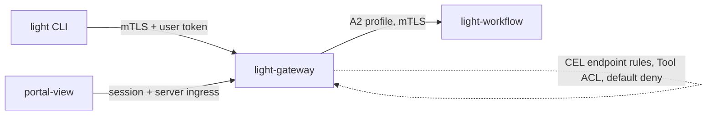

# Light CLI

Status: implemented in `apps/light-cli` (binary `light`). **Revised 2026-09-22: the CLI is a public
client.** It has no certificate and no enrollment: it signs the user in with the OAuth device grant
and calls the Gateway with the user's own access token alone. It still carries the dev application
token (below), a public identifier that config-server and, later, controller-rs ask for. The sections that describe a per-install certificate, the bootstrap token,
the issuer, renewal and the dual-identity contract for the CLI (Identity Model, The Peer Pinning
Problem, Enrollment And Revocation, and the flow in Bootstrap And Connection Flow) record the design
this replaced; they still describe how a *controlled* workload (an agent, a runner) is enrolled, and
are kept for that and for history. See [Revision 2026-09-22](#revision-2026-09-22-a-public-client).

This document covers a first-party command-line client for workflow
interaction: starting stages, answering human-in-the-loop decisions, and
operator recovery. The web surface in `portal-view` remains the primary
interface for enterprise approvers; see [Interfaces And Personas](#interfaces-and-personas)
for the boundary between them.

## Revision 2026-09-22: A Public Client

The first design gave every install a certificate from `light-identity-issuer`, enrolled once with
an app token packaged in the download, and had the Gateway trust the CLI by CA. The reasoning was
that the application leg tells the Gateway *which program* is calling. That does not survive an
open-source, downloadable client:

- The enrolling credential ships in a download anyone can take, so anyone can enroll. A certificate
  proves that some program enrolled, not that it is the real CLI. It is friction, not a defence,
  and the same is true of the app token itself.
- OAuth's guidance for native apps (RFC 8252) is the same: they cannot keep secrets, so they are
  public clients acting for a user. That is how `portal-view`'s browser already works: it holds no
  application credential either.
- The certificate cost a CA, a bootstrap secret, Gateway trust configuration and a renewal
  protocol, for no security the user's own token does not already provide.

So the CLI carries only the user's login. What it may do is decided by that user's roles and the
route's ACL, never by a claim about which program it is. Consequences:

- **CLI:** no `bootstrap` or `renew`, and no key or certificate store. Exit code 4 ("not enrolled")
  is retired. It keeps the long-lived **dev application token** in `start-cli.sh` (checked in on
  purpose, so a checkout works out of the box). That token identifies the *program*, is public by
  nature (it ships in a download) and authorises nothing on the user's behalf. It is what the
  services that ask "which application is this" are given: the config server today (it reads the
  CLI's settings with it), and controller-rs when the CLI registers. It is **never** sent to the
  Gateway or to light-oauth, and the tests check that.
- **Gateway:** `/mcp` with workflow actions enabled used to require an app token, a verified peer
  and a user token from every caller. `RoutePolicy.interactiveUserOnly` (off by default) admits a
  caller that presents **no application credential** on its user token alone, as an interactive
  caller with no action reference. A caller that does present one is judged exactly as before, and a
  request that claims a workflow action without one is refused. See `dual_identity::admit`.
- **light-identity-issuer** stays, for agents and runners deployed in a controlled pipeline, where
  the delivery of the credential can be trusted.

## Revision 2026-09-23: One Persistent Session

`light` is one long-lived terminal, like Claude Code, that stays open until `/exit`. The one-shot
subcommands (`light auth login`, `light gateway check`, ...) are gone; every capability is a slash
command inside the session, and `start-cli.sh` just starts it. The reason is what the CLI is for: a
workflow reaches a human-in-the-loop step and the person should see it and answer it where they
already are, chat with an agent across many turns, and look at status and audit without a fresh
process (and a fresh login check) per question.

- **Commands** (implemented): `/login`, `/logout`, `/whoami`, `/agents`, `/chat [agent]`, `/new`,
  `/disconnect`, `/tools`, `/help`, `/exit`. Anything that is not a command is said to the agent
  you are chatting with; `//x` says a message that begins with a slash. The prompt shows the agent.
- **Same engine three ways.** The terminal (line editor, history, replies printed above the line
  being typed), piped input, and `light -c '<line>'` all drive one `Shell`, so a script behaves like
  a person and a test drives it line by line. In a script, a message waits for the agent's reply
  before the next line runs, so `/exit` cannot cut it off. Exit code is that of the first failing
  line; `/whoami` when signed out counts (6), so `light -c /whoami` still answers "am I signed in".
- **Not a TUI.** No full-screen layout, panes or mouse. It is a scrolling terminal with a prompt;
  ordinary terminal features (scrollback, copy, pipes) keep working.
- **`--json` is gone** with the subcommands. Structured output comes back per command when a
  command needs it for scripting; nothing asks for it yet.
- **Agent chat** (`chat.rs`) uses the Gateway's `/chat` WebSocket as a *native* client: only
  `Authorization: Bearer <user token>`, none of what the Gateway takes for a browser (`Origin`,
  the CSRF cookie or subprotocol), and never the token in the URL. The frames are the ones
  `portal-view`'s chat page uses. When the login's access token expires (`authentication_required`
  or close code 4401) it fetches a fresh token and reconnects with the same `sessionId`. A message
  the server may have accepted is **never** sent again automatically: the person is told whether it
  was refused (send it again) or may have arrived (check before repeating). Reconnects are bounded.
  Text from an agent is untrusted and is stripped of terminal control sequences (ESC, C1, bidi and
  zero-width characters) before it is printed.
- **Approvals from the CLI** are allowed, as the same audited operation the web UI performs, and
  each one will require explicit confirmation naming what is being approved. Not built yet.
- **Agents** come from `cli.agentServiceIds` (comma-separated service ids; the config server can
  set it). Discovery from the Portal's instance registry is later, and needs `/portal/query` to
  accept a bearer token on the Gateway.

Next, in order: the human-task inbox (list, claim, choose an option, comment, complete, with
confirmation), workflow status and audit views, log follow, then controller registration.

## Decision And Scope

Provide a CLI, not a TUI. The CLI connects to `light-gateway` over the same
MCP/action surface `portal-view` already uses, never directly to
`light-workflow`. It authenticates as the signed-in user with a user access token
(see the revision above; the original design also had a per-install certificate for an
application leg, which was dropped).

The CLI carries **no authority of its own**. It acts as the signed-in user
with that user's existing grants. It never fabricates, auto-enrolls, or
escalates a grant, consistent with the decision already recorded for the
Portal enrollment prompt.

Out of scope: a full-screen TUI (the interactive session described in the 2026-09-23 revision is a
scrolling prompt, not a TUI); replacing the worklist for
enterprise approvers; direct access to Workflow's internal routes; any
long-lived static application secret distributed with the binary.

## Interfaces And Personas

| Persona | Primary surface | Rationale |
| --- | --- | --- |
| Enterprise approver | Web (`portal-view`) | SSO, audit trail, mobile, no install; episodic decisions |
| Developer in the coding loop | CLI | Already in a terminal on the pilot VM; context switch to a browser is the friction |
| Platform operator | CLI | Recovery and diagnosis must be scriptable and diffable |
| Automation and gates | CLI | Daily qualification gates cannot depend on an operator driving dialogs |

The CLI is additive. Where both surfaces expose an action they must call the
same Gateway operation, so authorization and audit cannot drift between them.

## Why Gateway, Not Workflow

`light-gateway` is already the single authorization chokepoint: CEL endpoint
rules, default-deny access control, Tool ACL, and the A2 `workflow-actions`
profile that reaches Workflow over verified mTLS. Pointing the CLI there means
one authorization implementation, one audit path, and no second copy of the
policy chain to keep in sync.

Connecting directly to Workflow's listener would bypass that chain, couple the
CLI to internal route shapes, and require Workflow to grow a second caller
contract. Both are rejected.

This also matches the commercial boundary: the CLI and Gateway are open source
in `light-fabric`, while the policy that governs them — tenancy, grants,
access-control snapshots, audit retention — is published by the commercial
control plane. The client is free; the governed backend is the product.

## Identity Model

`dual_identity::authenticate` requires, and this design does not weaken:

- a **verified TLS peer fingerprint taken from transport context only**, never
  a header or forwarded assertion, failing closed when absent;
- a registered application service ID whose profile lists approved peer
  fingerprints;
- a user bearer token validated against the route policy issuer and audience.

The CLI therefore needs two credentials, and neither may be embedded in a
distributed binary:

| Leg | Credential | Obtained by | Lifetime |
| --- | --- | --- | --- |
| Application ("what") | Per-install client certificate | Enrollment, once per install | Medium, renewable, revocable |
| User ("who") | Access token | Pairing or device grant, per user | Short, refreshed under proof of possession |

The install certificate identifies the installation, not the person. The user
token identifies the person. Neither alone is sufficient, which is the
property that makes a stolen token or a copied binary insufficient on its own.

Registered origin is `Interactive`, alongside the existing Portal ingress
identity — not `Workflow`, which additionally requires an action reference and
is reserved for service-origin callers.

## The Peer Pinning Problem

This is the decision the CLI forces, and it should be settled before
implementation.

`AppProfile.peer_sha256` is a list of **exact SHA-256 leaf fingerprints**,
validated as 64 hex characters and required to be non-empty. That model is
sound for a small set of long-lived services. It does not scale to a CLI: every
developer installation produces a new leaf, so every install would append an
entry to a published access-control snapshot, and every revocation would
require republishing it.

Three options:

1. **CA-based peer trust (recommended).** Extend `AppProfile` with a variant
   that trusts an enrollment CA and requires a verified certificate attribute
   binding the leaf to the CLI service ID, plus revocation checking. Peer
   identity stays transport-derived and fail-closed; only the matching rule
   changes from "this exact leaf" to "issued by this CA for this service ID."
2. **Enrollment-managed fingerprint list (interim).** Keep leaf pinning, and
   have enrollment append the new fingerprint to a CLI-specific service ID
   with a bounded list size and expiry. Acceptable for the single-VM pilot,
   operationally unacceptable at fleet scale.
3. **Brokered ingress.** A server-side component holds one application
   credential on behalf of many CLIs, as `portal-view`'s Vite ingress does
   today. This relocates the problem rather than solving it, adds a hop, and
   creates a trusted intermediary that can act for any user.

Recommend (1), with (2) as an explicitly time-boxed interim for the pilot.
Do not adopt (3) for the CLI; the browser needed it because a browser cannot
hold a client certificate, and a CLI can.

## Obtaining The User Leg Without A Browser Redirect

Decided 2026-09-21: the **RFC 8628 device authorization grant**, served by
`light-oauth`. The full design, the security analysis and the protocol are in
`light-portal-doc/src/design/light-oauth/device-authorization.md`; this section
records only what the CLI does with it.

The earlier options are superseded. A loopback redirect does not work on a VM
without a browser; a pasted cookie or token does not either, because the browser
session's tokens are short-lived and the CLI cannot renew them; and Portal-initiated
pairing needs a new code type. The device grant is the standard answer, covers cloud
and enterprise sign-in (including SSO and MFA, which happen in the user's own browser),
and needs no browser on the CLI's machine.

The CLI is a **public client** (no secret) of `light-oauth`, reached through the Gateway
like everything else; the standard grant needs nothing else. It also presents its install
certificate on those requests, so a Gateway that wants only enrolled installs to be able to
start a sign-in can require it. The user approves on `portal-view`'s `/device` page. Signing
in lasts one day, or 90 days if the user ticks "remember me"; both lengths are `light-oauth`
server settings, the end is enforced by the server, and it does not slide. The CLI never prompts for a password, never opens a browser unless asked
(`--open`, and never over SSH), and never accepts a token typed by the user. `light auth
login` shows a code; the user approves it in any browser.

## Enrollment And Revocation

Enrollment mirrors the runner enrollment precedent in `controller-rs`, which
already issues a durable per-instance identity bound to an approved peer.

1. The CLI generates a key pair locally and produces a CSR. The private key
   never leaves the host.
2. Pairing (or device grant) authenticates the user leg and authorizes
   enrollment for that user and Host.
3. The broker issues a certificate bound to an install ID, user, and Host, and
   registers it under the CLI service ID according to the peer-trust decision
   above.
4. The CLI stores the install ID and credentials, and obtains short-lived
   access tokens thereafter.

Refresh is bound to the install certificate as proof of possession, so a
captured refresh token alone cannot mint access tokens. The issuer records
token fingerprints rather than bearer values, consistent with existing
behaviour. Portal lists a user's enrolled installs with last-seen data and can
revoke one without disturbing the others; revocation must take effect at the
Gateway without requiring a client to cooperate.

Credential storage uses the OS keychain where available and a `0600` file
fallback otherwise. Credentials are never logged, never placed in argv, and
never emitted in diagnostics.

## Bootstrap And Connection Flow

Owner-specified 2026-09-20. The code facts below were checked by reading the
tree on that date; none of the flow has been run end to end.

### What the CLI connects to

Four services: `config-server`, `controller-rs`, `light-identity-issuer` and
`light-gateway`. It never connects to `light-workflow` or `light-agent`
directly; those are reached through the Gateway.

### Distribution

The CLI is downloaded per environment and per version. A download from
`dev.lightapi.net` ships a default `startup.yml` with the `dev` env tag and that
domain; a download from `lightapi.net` ships the production env tag and
domain. Each release is a new download. The package carries the environment,
the endpoints, and a **bootstrap CA bundle** (the CAs that verify config-server,
the Controller, the issuer and the Gateway's server certificate).

How the bootstrap credential reaches `startup.yml` is **not settled**: one token
shared by every download of a version, or a token minted per download for a
signed-in user. See [Open Questions](#open-questions).

### Sequence

1. **Install.** The user downloads and unpacks the package described above.
2. **First start: configuration and registration.** The CLI authenticates to
   `config-server` with the bootstrap credential over TLS verified by the
   bootstrap CA bundle, and downloads `values.yml`. That file carries the URL of
   the `light-identity-issuer` for this environment. The CLI also registers with
   `controller-rs`. Neither call needs a client certificate.
3. **Enrollment.** The CLI generates a key pair locally and sends the issuer a
   CSR; the private key never leaves the host. `POST /v1/csr` carries the env tag,
   the bootstrap credential and the CSR. The issuer returns a leaf certificate
   and its issuing CA certificate, so the CLI can present the chain (see
   [Gateway handshake](#gateway-handshake)). The issuer accepts the bootstrap
   credential once per install and never again for renewal. The issuer does not
   issue a "server certificate": the CLI is a client, and verifies servers with
   its CA bundle.
4. **User leg.** The user signs in to Portal and gives the CLI a user access
   token, pasted into the CLI. Production access tokens last 10–15 minutes, so
   a pasted access token alone means re-pasting every quarter hour; production
   needs the refresh token delivered as well, or a one-time code the CLI
   redeems for both. Input is read without echo, and the refresh token is stored
   in the OS keychain or a `0600` file, never in argv, logs or diagnostics.
5. **Connection.** Every request to `light-gateway` travels over mTLS with the
   enrolled certificate chain, and carries the application token and the user
   access token. This is the dual-identity contract, unchanged.
6. **Renewal.** Runs automatically; see [Renewal](#renewal).
7. **Recovery.** If the key and certificate are both lost, download and
   reinstall. That only works if each download supplies a fresh bootstrap
   credential, because the issuer accepts a given one once.

### Gateway handshake

The Gateway does **not** need the client certificate or its fingerprint. With CA
trust it needs:

- **The issuer's CA certificate in its incoming client CA file**
  (`incomingClientCaFile`). The Gateway's TLS listener treats a client
  certificate as optional (`allow_unauthenticated`), but verifies any certificate
  that is presented against that file. A certificate from an unknown CA fails the
  handshake, and one that is absent is rejected later by the caller policy.
- **An app profile** for the CLI service ID with origin `interactive` and a
  `caTrust` entry: the SHA-256 of the issuing CA certificate (`issuerSha256`),
  environment, and role. This replaces per-leaf `peerSha256` pinning for managed workloads.
- **A client that presents `[leaf, issuing CA]`.** The Gateway derives
  `issuer_digest` from the *second* certificate in the presented chain
  (`peer_certificates[1]`). A leaf-only chain leaves it empty and `caTrust` never
  matches.

The identity in the certificate is the URI SAN
`spiffe://lightapi.local/<role>/<service-id>/<install-id>`. That trust domain is
hard-coded on both the Gateway (`CaTrust::matches`) and the issuer; they agree.
The environment is carried in the issuer-controlled subject `O=` attribute and must match the
profile's `caTrust.environment`. Separate issuing CAs per environment remain recommended for
blast-radius isolation, but environment separation does not rely on that operational choice. The
Gateway's server certificate is verified by the CLI's bootstrap CA bundle and is
usually signed by a different CA from the issuer's.

### Renewal

Owner decision: after bootstrap, renewal is authenticated by the **old key and
certificate only**, whether or not the certificate has expired. It replaces both
the key and the certificate. It involves no token and no user; purely
service-to-service callers renew the same way.

The renewal request carries:

- the env tag;
- the old certificate;
- a new CSR made with a newly generated key;
- a signature made with the **old private key** over the new CSR digest, the env
  tag and a fresh timestamp or nonce.

The issuer verifies that the old certificate chains to its CA (ignoring
`notAfter`), verifies the signature with the old certificate's public key,
rejects a stale timestamp or reused nonce, takes the identity from the old
certificate (never from the request), and signs the new CSR. The proof is an
application-layer signature rather than mTLS, because an expired certificate
cannot complete a handshake.

CLI behaviour:

- Check on every start. Renew when `now >= renewAt`; the issuer computes that
  deadline as `notAfter - renewLeadSeconds`, which includes an already-expired
  certificate, and renew before connecting to the Gateway.
- Keep the old key until the new certificate is safely stored, then swap
  atomically. A file lock prevents two parallel invocations (for example the
  daily gate's scripts) from racing.
- If the certificate is still valid and renewal fails, continue with it. If it
  has expired and renewal fails, exit with a distinct exit code.

**Implementation status.** Implemented 2026-09-20 in `light-identity-issuer`, with
tests, but **not deployed**: the running issuer is still the older image, whose
`/v1/renew` accepts only the certificate and a CSR, verifies neither the CA
signature nor any possession signature, and rejects expired certificates. The
renewal request also now carries the proof as a `proof` object (`timestamp`,
`nonce`, base64 `signature`), and the issuance response carries `chainPem`,
`caCertificatePem`, `installId`, `serviceId`, `role`, `notAfter`, and the
policy-derived `renewAt`. The first-issuance
request carries no identity: the issuer derives it from the bootstrap credential.
Remaining gaps are tracked in the
[issuance implementation plan](../../../../implementation/light-fabric/2026-09-19-WorkloadIdentityIssuanceImplementationPlan.md)
section 6.1.

### Configuration files

`config/startup.yml` is the standard file, identical in shape for every
app (`host`, `serviceId`, `envTag`, `acceptHeader`, `timeout`, `connectTimeout`,
`configServerUri`, `authorization`, `bootstrapCaCertPath`). The CLI uses it to know which
environment it is in and which config server to ask. **Which config server it asks decides which
instance it belongs to**: a CLI downloaded from an instance carries that instance's `startup.yml`,
and the settings below (its Gateway, its OAuth provider, and through the provider the sign-in
page) come from that instance's config server. Everything specific to the CLI lives in
`config/cli.yml`, a template whose `${cli.<property>:<default>}` placeholders resolve, highest
priority first, from an environment variable (`CLI_OAUTHPROVIDERID`), then the config server's
`values.yml` (key `cli.oauthProviderId`), then the default. If the config server cannot be reached
the defaults apply; that is never fatal. To manage them centrally, create a config named `cli` in
Portal with these properties, add it to the `com.networknt.light-cli-1.0.0` instance, and publish a
snapshot:

| Property | Type | Default | Meaning |
| --- | --- | --- | --- |
| `gatewayUri` | string | `https://localhost` | Base URL of `light-gateway`; the CLI calls `/mcp` on it |
| `oauthUri` | string | `https://localhost` | Base URL of `light-oauth` as the Gateway exposes it; must be https |
| `oauthProviderId` | string | dev provider id | The provider segment of `/oauth2/{providerId}/...`. `light-oauth` puts it in the sign-in link (`?provider=`), which is how `portal-view` learns it; nothing in `portal-view` names a provider |
| `oauthClientId` | string | `01a0bf82-e900-7739-93b0-f33c06db6edb` | The device client: Client Profile `cli`, Client Type `public` or `trusted` (the Light CLI's own client is `trusted`), set on Portal's client page (`all-in-lt/device-authorization/README.md`) |

### Implementation status of this flow

Superseded in part 2026-09-22 (see the revision above). Steps 3, 5 and 6 as written here (enrollment,
the certificate connection, renewal) were implemented and verified live on 2026-09-20, then
**removed** from the CLI. Step 2 (configuration lookup, with the application token) stays. The CLI enrolls nothing, holds no key or certificate, and
`light gateway check` calls `/mcp` with the user's access token alone. Step 4 (the user token) is
`light auth login | status | logout`, below. Controller registration is not implemented.

`light gateway check` is tested against a stand-in Gateway that records what it received: the user
token in `authorization`, no `x-scope-token`, no client certificate, and nothing from the ignored
`authorization` line of `startup.yml`. The real Gateway needs `interactiveUserOnly` in its
`workflow-actions.yml` policy (`workflow-actions/prepare.py` sets it, and `prepare-light-cli.py`
applies it to a running Gateway); this needs a Gateway build that knows the field, and has not yet
been run live.

### The user token: `light auth`

Since 2026-09-23 these are slash commands in the session: `light auth login` is `/login`, `auth status`
is `/whoami`, `auth logout` is `/logout`, and `gateway check` is `/tools`. The behaviour below is unchanged;
the approval code now prints on stdout, with the rest of the session's output.

Implemented 2026-09-21 in `apps/light-cli` (`auth.rs`, `oauth.rs`, `session.rs`) and tested
against a stand-in for light-oauth behind a mutual-TLS front (like the Gateway); the server side
is in `light-oauth` (`src/device.rs`) and the approval page in `portal-view`
(`src/pages/oauth/DeviceApproval.tsx`). Revised 2026-09-22 from a separate mutual-TLS listener
to the standard grant on light-oauth's one port; see the design in `light-portal-doc`.

- `light auth login` requests a device code, prints the code and the approval address to **stderr**
  (stdout stays clean for `--json`), and polls at the server's interval, honouring
  `slow_down`, until the code is approved, denied or expired. Three consecutive network
  failures while waiting end the attempt; one or two do not.
- `light auth status` reads only the local session: who is signed in, when the access token
  and the login end. It exits 6 when nobody is signed in or the login has ended.
- `light auth logout` revokes the login on the server, then deletes the local tokens. If the
  server cannot be reached it deletes nothing and says so; `--local` deletes the local
  tokens anyway.
- **Every Gateway call** (`light gateway check`) uses the session's access token, refreshing
  first if it has under 60 seconds left. `LIGHT_USER_ACCESS_TOKEN` still wins when set.
- **Refresh rules.** The rotated refresh token is saved (atomic replace, under the store
  lock) before the new access token is used, so a crash or a parallel invocation cannot lose
  the only valid one; parallel invocations refresh once. A refresh answered `invalid_grant`
  deletes the local session and exits **6** ("sign in again"). Any other failure, a network
  error included, leaves the session alone. The login end is absolute: refreshing never
  extends it. Refresh and logout go to the endpoint recorded in the session, not to whatever
  `cli.yml` says now.
- **Storage.** `~/.light/<env>/user-session.json`, mode `0600`. The device code is never
  stored; the CLI never prints a token.
- **Exit code 6** is new: sign in again. Codes 0, 1, 3, 4 and 5 are unchanged.

Not yet verified live end to end: it needs the Gateway routes and rate limits for the OAuth
paths (`/oauth2/*/device_authorization`, `token`, `revoke`, and the two approval routes) in the
Portal snapshot.

### Differences from earlier sections

This section is the owner's current intent. It conflicts with statements
elsewhere in this document, which are left as written until the design is
reconciled:

- *Enrollment And Revocation* has pairing or a device grant authenticate the user
  and authorize enrollment. In this flow enrollment is authorized by the
  bootstrap credential, and the user leg is obtained separately in step 4.
- *Obtaining The User Leg* says neither path may "accept a token typed by the
  user". Step 4 has the user paste a token.
- *Enrollment And Revocation* binds refresh to the install certificate as proof
  of possession, and says revocation must take effect at the Gateway. Here,
  refresh handling of the user token is unspecified, and certificate revocation
  is deferred: user lock-out and refresh-token revocation are a separate layer on
  top of mTLS, unrelated to certificate renewal.
- *Out of scope* lists "any long-lived static application secret distributed
  with the binary". A package carrying a token shared by every download of a
  version would contradict that.

## Authorization

No new authorization surface. The CLI's requests traverse the same CEL
endpoint rules, default-deny access control, and Tool ACL as the web UI. The
effective authority is the intersection of the user's grants and the CLI
service ID's registration.

Two additional requirements:

- **Confirmation and attribution for destructive operations.** Cancel-and-
  release-VM, replan, and supersession require explicit confirmation with the
  expected feature version and reservation generation, and the audit record
  carries the install ID alongside the user.
- **No implicit grant acquisition.** If a required grant is absent the CLI
  reports what is missing and stops. It does not enroll one on the user's
  behalf.

## Command Surface

A deliberate subset, shaped by the routes and tools that exist rather than by
what a UI can show. Illustrative, not final:

| Area | Commands |
| --- | --- |
| Auth | `auth login`, `auth logout`, `auth status` (implemented) |
| Features | `feature list`, `feature show`, `feature start`, `feature accept`, `feature replan`, `feature cancel` |
| Decisions | `task list`, `task show`, `task approve`, `task reject`, `task request-changes` |
| Runs | `run status`, `run result`, `run cancel` |
| Operator | `vm list`, `vm holder`, `vm release` |
| Evidence | `findings list`, `artifact get`, `diff show` |

Every command supports `--json` for machine consumption, because the daily
qualification gate is a first-class consumer, not an afterthought. Human
output is the default; JSON is the contract.

## Current Implementation Boundary

Checked 2026-09-19 against the working tree.

| Capability | Current boundary |
| --- | --- |
| CLI | None. No command-line framework dependency anywhere in `light-fabric` |
| Dual identity | `crates/light-security/src/dual_identity.rs` requires a transport-verified peer fingerprint, a registered service ID with non-empty exact-leaf `peer_sha256`, and a user bearer token |
| Peer trust | Exact leaf pinning only; no CA-based variant exists |
| Origins | `Interactive`, `Workflow`, `Gateway`, `Receiver`; Workflow-origin callers additionally require an action reference |
| Interactive caller precedent | `portal-view` registers a server-side ingress application identity with a pinned peer fingerprint; the browser holds no application credential |
| Credential broker | `apps/light-workflow/src/credential_broker_api.rs` exposes enroll, complete, and revoke on separate listeners |
| Issuer | `portal-service/apps/light-oauth`, including the workflow broker's one-time-code acquisition over mTLS |
| Device grant | Implemented 2026-09-21 in `light-oauth` (`src/device.rs`) and the CLI (`light auth`); see the design in `light-portal-doc` |
| Enrollment precedent | `controller-rs` runner enrollment issues durable per-instance identity bound to an approved peer |

Update 2026-09-20, verified by reading the tree, not by running it:

- **Peer trust:** the CA-based variant now exists as `AppProfile.ca_trust`
  (`issuer_sha256` plus `role`), alongside exact-leaf `peer_sha256`. No live
  Gateway policy uses it yet.
- **Issuer:** `light-identity-issuer` (`crates/light-identity-issuer`,
  `apps/light-identity-issuer`) exists and runs in the local stack, with several
  blocking gaps recorded in the issuance plan's section 6.1.

## Open Questions

- Which peer-trust option is adopted, and whether option 2 ships at all or the
  pilot waits for CA-based trust.
- Whether the CLI binary is named `light`, `lightctl`, or something else, and
  whether it is a single binary or per-domain subcommands.
- Whether approvals carrying legal or compliance weight are permitted from the
  CLI at all, or must be completed in the web UI for evidentiary reasons.
- ~~How install certificate renewal behaves on a host that has been offline past
  expiry.~~ Resolved 2026-09-20: renewal works after expiry, authenticated by the
  old key and certificate (see [Renewal](#renewal)).
- **How the bootstrap credential reaches `startup.yml`.** A token shared by every
  download of a version cannot satisfy a once-per-install guard, would be a public
  bootstrap credential, and, if it is also used at `config-server` and
  `controller-rs`, would expose those services. A token minted per download for a
  signed-in user avoids all three and makes "download and reinstall" a working
  recovery. This also decides whether the *Out of scope* statement above stands.
- How a Portal-issued user token, and in production its refresh token, reaches the
  CLI: pasted, or redeemed from a one-time code.
- What the CLI needs from `controller-rs`. That decides the bootstrap credential's
  scope.
- How a retired release is cut off. A `sid` that carries the version
  (`com.networknt.light-cli-1.0.0`) would let a release be retired by removing
  its Gateway profile and refusing its `sid` at the issuer, without a revocation
  list. This depends on Gateway policy being distributed rather than hand-edited.
- Whether `--json` output is versioned as a stability contract once the daily
  gate depends on it.

## References

- [User, Application, And Workflow Authorization](user-application-workflow-authorization.md)
- [Access Control Handler](access-control.md)
- [Fine-Grained Authorization](fine-grained-authorization.md)
- [Unified Security Handler](unified-security.md)
- [MCP Router](mcp-router.md)
- [Controller Registry Client](controller-registry.md)
- [LLM Gateway](llm-gateway.md)
- [Personal Development Workflow Orchestration](../product/light-agent/development-workflow-orchestration.md)
