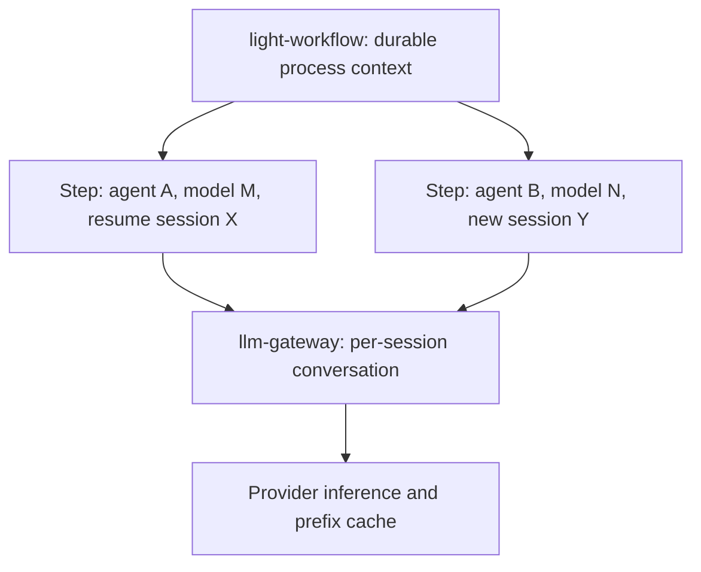

# LLM Gateway

Status: design proposal, 2026-09-19. Nothing below is implemented. It records
the intended direction for the LLM data plane as agent traffic grows beyond
single request/response routing, and the boundary decisions that follow.
The current implementation boundary is recorded at the end of this document;
do not read any section here as a description of shipped behaviour.

This document covers the LLM data plane shared by every agent profile. The
per-feature agent lifecycle lives in [Light-Agent Execution](light-agent-execution.md),
and durable business process state lives in
[Light-Workflow Runner](light-workflow-runner.md).

## Decision And Scope

Agents address one normalized inference interface. The gateway owns
provider adaptation, routing, admission, usage accounting, and audit. It does
**not** own the semantic content of an agent's conversation.

Two deployment profiles are recognized as first-class, not as a temporary
split. In the enterprise profile the gateway is inline on the inference path.
In the personal/subscription profile the model call egresses directly to the
provider and the gateway is a control plane only. The same agent binary must
work in both; the only difference is whether the model call passes through the
gateway.

Context caching, compression, and compaction are in scope as **derived**
optimizations over content the agent supplied. Authoritative ownership of
conversation state is out of scope for third-party agents, and optional for
first-party agents.

## Ownership

| Component | Responsibility |
| --- | --- |
| Agent (any profile) | Decide what enters its context, which tools to call, when to compact |
| `llm-gateway` crate | Provider adaptation, alias routing, admission bounds, canonical replay, usage, PII, audit |
| Gateway compression layer | Deterministic, structural reduction of newly arriving content |
| `light-workflow` | Durable process state: which step, which agent, which model, new-or-resume session |
| Model provider | Inference, prefix cache, provider-side reasoning state |

The gateway never decides what is semantically safe to drop from a
conversation. It cannot see task intent, and a silent semantic edit surfaces
later as an unexplained agent failure with no traceable cause.

## What A Standard Interface Can And Cannot Do

A normalized wire interface is achievable and worth building. Model
portability is not achievable at the wire level, and the design must not
assume it.

When a coding agent degrades against a different provider's model, the cause
is usually post-training, not protocol shape. Frontier models are trained
against specific tool schemas, specific edit formats (`str_replace` versus
whole-file versus unified diff), specific shell interaction patterns, and
specific reasoning-token semantics. Normalizing the envelope does not
normalize any of that away.

The useful consequence is that the **per-model adaptation layer belongs in the
gateway**: tool-schema dialects, prompt scaffolding, preferred edit format,
reasoning handling, and cache-breakpoint placement. The agent addresses one
interface; the gateway owns what each model needs in order to perform well.
`crates/model-provider` already carries per-provider adapters along these
lines, including CLI-shaped providers.

An agent must therefore be able to ask the gateway for its adaptation profile
without issuing an inference request, because in the subscription profile the
agent applies that profile itself before calling the provider directly.

## Context Ownership

### The Stateless API Reality

The Anthropic Messages API and OpenAI Chat Completions are stateless: the
client sends the complete message array on every turn. An agent that "manages
context" is deciding what to place in that array, not holding a server-side
session. There is consequently no authoritative conversation on the gateway
that could drift out of sync with the agent's — the agent restates the whole
conversation on every request.

OpenAI's Responses API with `previous_response_id` is the exception. Treat any
provider-side conversation state as pass-through; do not attempt to mirror it.

### Derived State, Not Synchronized State

Derived state cannot desynchronize; authoritative state can. Whatever the
gateway retains about a conversation must be a pure function of what the
client sent, keyed by content digest. If a retained entry ever disagrees with
the incoming request, it is discarded and recomputed. No synchronization
protocol is required, or permitted.

| Mode | Gateway holds | Works with | Cost |
| --- | --- | --- | --- |
| Derived (default) | Content-digest-keyed compression cache | Any client, including Codex CLI and Claude Code, unmodified | Client resends full context each turn |
| Authoritative (optional) | The conversation itself, per session | First-party agents only | Gateway becomes stateful; session affinity, failover, and blast radius follow |

The derived mode is the one that covers the fleet and is therefore the one
that ships first. The authoritative mode buys simpler first-party agent code
and fewer bytes on the agent-to-gateway hop; it does not buy anything the
derived mode cannot already deliver on the inference path, and it converts a
horizontally scalable stateless service into a sticky one. Adopt it only for
first-party agents, and only after the derived path is qualified.

### Compress On Entry, Then Freeze

Provider prefix caching requires the cached prefix to be byte-identical across
requests. Rewriting earlier turns to save tokens is the single most
cache-destructive operation available, so token reduction and cache-hit rate
are in tension unless reduction happens exactly once, at the point new content
first enters the context.

The rule is: **compress a tool result the first time it arrives, then never
touch it again.** Tool results — file contents, test output, build logs,
search dumps — carry nearly all of the reducible volume in an agent loop, and
each one is appended exactly once.

Three requirements follow, and the second is a performance trap rather than a
correctness one:

1. The compressor is a pure deterministic function, versioned, and **pinned
   per session**. Upgrading a compressor mid-session invalidates every
   downstream cache entry and mutates history under the model.
2. The mapping from original content digest to compressed bytes is cached.
   A naive implementation recompresses the entire accumulated history on every
   request; by turn eighty of a coding session that is significant latency for
   no benefit. This cache is what makes the derived mode viable, not merely
   correct.
3. Anthropic `cache_control` breakpoints are placed by the client. Rewriting
   content beneath them can strand a breakpoint mid-prefix and lose the cache
   the rewrite was meant to protect. Breakpoints must be re-placed as part of
   the same deterministic transformation.

Accept one consequence deliberately: after a rewrite, the agent's record of
what it sent no longer matches what the model saw. This is usually harmless,
but it invalidates agent-side token accounting and any client-side caching the
agent performs.

### Sealing Instead Of Storing

Where the gateway must carry state across turns without becoming stateful,
prefer the sealed-envelope pattern already used by `reasoning_seal.rs`:
authenticated, encrypted state bound to tenant, alias, and route, returned to
the client and replayed on the next request. This keeps the data plane
horizontally scalable and gives the same recovery properties as a stateless
service. A compression dictionary version, a compaction generation, or a
context digest chain can travel this way.

### Compaction Is Agent-Initiated

Deterministic, structural reduction is a gateway concern: it is task-agnostic,
reversible in principle, debuggable, and safe. Semantic reduction — deciding
that a file read forty turns ago no longer matters — is an agent concern,
because only the agent knows the task.

A background process that rewrites live context with a cheap model is
explicitly rejected. It is lossy, it is invisible at failure time, and it
destroys the prefix cache it is nominally protecting.

The supported flow is a signal, not an action: the gateway reports context
pressure and may propose a compaction; the agent decides and issues it. A
compaction is then a deliberate new prefix whose cache cost is amortized
intentionally, rather than a random invalidation.

## Two Levels Of Context

Process context and conversation context are separate, with separate owners
and lifetimes.

`light-workflow` owns which step is active, which agent and model serve it,
and whether the step resumes an existing session or starts a new one. It does
not observe individual model interactions.

Session identity is **workflow-issued**, not gateway-generated, so the
workflow can resume, fence, and cancel deterministically, consistent with the
claim and fencing semantics in
[Light-Workflow Runner](light-workflow-runner.md).

A session must be reconstructable from durable inputs. If the gateway loses
conversation state, the workflow replays accepted artifacts to rebuild it; a
lost cache degrades cost and latency, never correctness. This is the same
principle applied to phase handoffs in the development workflow design, where
a new stage reconstructs from accepted artifacts rather than depending on a
surviving conversation.

## Transport

Retain request/response HTTP with a session identifier, and SSE for streaming.
Do not adopt WebSocket for the inference path.

A persistent connection is not required for server-side context retention; a
session header achieves the same thing, and HTTP/2 already keeps connections
warm. WebSocket earns its cost only when the server must initiate messages.

The cost is specific to this platform. Authorization is per-request today —
dual identity, scope tokens, and action authorization, qualified as part of
the workflow authorization work. Moving the inference path onto long-lived
connections means re-implementing authorization at the message level inside a
connection, plus reconnect and resume semantics, and it complicates load
balancing and per-request tracing. That is a meaningful security surface in
exchange for a capability a header already provides.

Revisit only if server-initiated push becomes a real requirement.

## Deployment Profiles

| | Enterprise (API key) | Personal (subscription) |
| --- | --- | --- |
| Inference path | Through the gateway | Direct to provider |
| Compression, caching, PII, audit WAL | Gateway, inline | Not available inline |
| Routing decision | Gateway | Gateway |
| Adaptation profile | Gateway applies | Gateway supplies, agent applies |
| Usage accounting | Observed | Reconciled from provider telemetry |
| Authorization and policy | Gateway and workflow | Gateway and workflow |

Subscription credentials authenticate a consumer plan and are bound to the
provider's own endpoint. Routing that traffic through a proxy is a licensing
and account-standing question, not merely a technical one, and it is not a
posture this platform will adopt on a customer's behalf. API-key traffic
carries no such constraint.

This is not a concession. Unattended, automated workflow traffic is precisely
what consumer subscriptions exclude, and the personal pilot design already
records that personal subscriptions do not authorize Portal or API access. The
enterprise product is the API-key path, where the gateway is inline by
construction. Subscriptions serve the interactive personal profile.

The routing decision remains centralized even where the data path is not: the
gateway and workflow decide that an interactive job runs on a developer's own
subscription seat while an unattended job runs API-key through the gateway.
Centralized decision with a bypassing data path is a supported outcome, not a
degraded one.

## Packaging

Build a separate `llm-gateway` binary composing the shared crates. Do not
continue growing the LLM data plane as middleware inside `light-gateway`.

The LLM data plane and the API data plane have diverging runtime shapes. The
API gateway is stateless and request-scoped. The LLM path already holds
long-lived streams, large per-request bodies, replay buffers, an embedding
admission lane with multi-gigabyte ingress bounds, and its own audit WAL;
adding context retention makes it durably stateful. Capacity for the two
scales on different axes — requests per second against concurrent sessions and
token volume — and co-tenancy means planning for the worse of both. Memory
pressure or an OOM on the LLM path should not remove API routing.

The split is cheap today because the crate boundary already exists and is
already thin: `crates/llm-gateway` carries the runtime, streaming, routing,
usage, and audit surfaces, while `apps/light-gateway` references
`llm_gateway::` in a small number of places. A separate binary is largely a
new composition root over `light-pingora`, `llm-gateway`, and `config-loader`,
not a refactor. That `apps/light-gateway/src/main.rs` has grown past half a
megabyte is a further argument against adding responsibility to it.

The real risk of splitting is divergent security middleware, and it is
manageable only if handled deliberately: the shared security and authorization
chain must live in a crate that **both** binaries compose, never reimplemented
in the new one. The documented handler order — correlation, unified-security,
limit, access-control, then the LLM handler — must remain a single shared
definition. If that chain cannot be factored cleanly, treat the difficulty as
a signal to defer the split rather than to fork the middleware.

Trigger: split when the first durably stateful feature lands, which is the
session context store described above. That is the point where the runtime
profiles genuinely diverge.

## Current Implementation Boundary

Checked 2026-09-19 against the working tree.

| Capability | Current boundary |
| --- | --- |
| LLM data plane | `crates/llm-gateway` implements provider dispatch, alias routing with multi-attempt fallback, canonical request replay, admission bounds, streaming, usage, PII, and an audit WAL |
| Deployment | One binary: `apps/light-gateway` composes the crate as an application handler behind the documented chain; `llm-router.yml` is inert unless explicitly enabled |
| Provider adaptation | `crates/model-provider` carries per-provider adapters, including CLI-shaped providers; mixed-format aliases use strictest-wins parsing with an OpenAI extension allowlist |
| Conversation state | None. The data plane is stateless; `session_id` appears only in receipt records. Context retention, compression, and compaction described above are unimplemented |
| Reasoning state | `reasoning_seal.rs` seals provider reasoning state into an authenticated encrypted envelope bound to tenant, alias, and route |
| Transport | HTTP request/response with SSE streaming; no WebSocket inference path |
| Profiles | Not modelled. The enterprise/subscription split above is a proposal, not a configuration surface |
| Separate binary | Not started |

## Open Questions

- Whether the adaptation profile is served as a typed API for subscription
  agents, or compiled into the agent from the same immutable snapshot.
- Whether compression dictionaries are per-tenant or global, and how a
  dictionary version is pinned across a long session without a stateful store.
- How usage reconciliation from provider telemetry is attributed to a workflow
  step when the gateway never observed the call.
- Whether first-party authoritative sessions justify their operational cost at
  all, once derived-mode compression is qualified.

## References

- [Light-Agent Execution](light-agent-execution.md)
- [Agent Engine Pattern](agent-engine-pattern.md)
- [Light-Workflow Runner](light-workflow-runner.md)
- [MCP Router](mcp-router.md)
- [Handler Chain](handler-chain.md)
- [PII Tokenization](pii-tokenization.md)
- [User, Application, And Workflow Authorization](user-application-workflow-authorization.md)
- [Personal Development Workflow Orchestration](../product/light-agent/development-workflow-orchestration.md)
