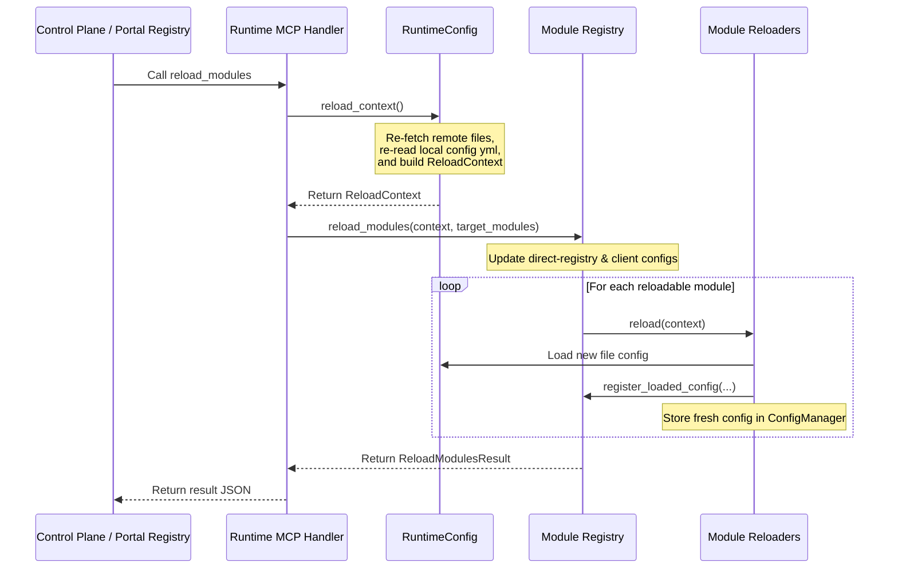

# Module Hot Reload

This document describes the design and implementation of the hot reload mechanism in Light Fabric, explaining how modules reload configuration at runtime without requiring a full process restart.

---

## Overview

In Light Fabric, certain configurations can be updated dynamically at runtime to support continuous delivery and quick configuration tuning (e.g., routing changes, CORS policies, security settings, or service discovery URLs). The system provides a unified **Module Registry** and **Reloadable Modules** architecture that allows the control plane (via MCP tools) to trigger config reloads.

---

## Reload Flow

When the `reload_modules` MCP tool is invoked, the control plane initiates the following sequence:

1. **Build Reload Context**: The runtime constructs a `ReloadContext` containing a fresh `RuntimeConfig` by parsing the updated config files (local or fetched from the config server) and merging dynamic `values.yml` parameters.
2. **Pre-update Built-in Configs**: The core configurations stored inside `ModuleRegistry` (such as `light-client/client` and `light-runtime/direct-registry`) are updated in-memory using the reloaded config.
3. **Dispatch to Module Reloaders**: The registry iterates over the target modules and invokes the corresponding `ReloadableModule::reload` implementation.
4. **Atomic State Swap**: Inside each reloader, the new configuration is parsed, validated, registered in the registry, and swapped atomically using `ConfigManager<T>`.

---

## ConfigManager and Thread Safety

To prevent request latency during reloads, Light Fabric uses a thread-safe `ConfigManager<T>` to manage dynamic configurations. 

`ConfigManager` wraps an `Arc<T>` with a short-lived `RwLock`. Request handlers clone the `Arc` instantly (a simple reference count increment) without blocking, while the reloader replaces the entire `Arc<T>` atomically after the new configuration is successfully parsed and validated.

---

## Core Hot Reload Implementations

### Direct Registry Reload (`light-runtime/direct-registry`)

The direct registry maps service IDs to direct URLs for service discovery. 
* **Reload Process**: The direct URLs are updated in `values.yml` (either locally or on a remote config server). On reload, `ReloadContext` parses the new URLs, and `reload_modules` updates the registered config for `"light-runtime/direct-registry"` in the `ModuleRegistry`.
* **Propagation**: Runtimes such as the `McpRouterRuntime` or the `TokenRuntime` re-read the updated `direct_registry` config from the fresh `RuntimeConfig` when they are reloaded.

### Client Configuration Reload (`light-client/client`)

The client configuration contains TLS settings and OAuth token provider configurations.
* **Reloadable Flag**: The client module is registered with `reloadable: true` at startup.
* **Reload Process**: The `ReloadContext` re-loads `client.yml` from disk, applying new TLS properties or OAuth credentials. The `reload_modules` function updates the registered client configuration (applying proper masks to client secrets and certificates).
* **Reloader**: A registered `ClientReloader` marks the transition success. Dependent modules (like `light-pingora/mcp-router` and `light-pingora/token`) query the new client configuration from the context upon reload.

---

## Reloadable vs. Non-Reloadable Configs

| Module ID | Config File | Type | Reloadable | Description |
| --- | --- | --- | --- | --- |
| `light-runtime/startup` | `startup.yml` | Core | **No** | Core server boot credentials |
| `light-runtime/server` | `server.yml` | Core | **No** | Server host, IP, and listeners |
| `light-runtime/portal-registry` | `portal-registry.yml` | Core | **No** | Connection to portal registry |
| `light-runtime/direct-registry` | `values.yml` | Core | **Yes** | Service discovery direct URL overrides |
| `light-client/client` | `client.yml` | Core | **Yes** | Outbound TLS and OAuth client credentials |
| `light-pingora/handler` | `handler.yml` | Framework | **Yes** | Active handler chains and route mappings |
| `light-pingora/correlation` | `correlation.yml` | Framework | **Yes** | Traceability and MDC logging settings |
| `light-pingora/cors` | `cors.yml` | Framework | **Yes** | CORS origin and header limits |
| `light-pingora/mcp-router` | `mcp-router.yml` | Framework | **Yes** | MCP server configurations and upstream rules |
| `light-pingora/token` | `token.yml` | Framework | **Yes** | OAuth client credentials token handlers |

> [!NOTE]
> Modifying non-reloadable configurations requires a full restart of the gateway process to bind new server listeners or configure registry websocket connections securely.

---

## Verification & Testing

Module hot-reloading can be verified using the following automated test suites:

* **Direct Registry Test**: `reload_modules_updates_direct_registry_config` (defined in `crates/light-runtime/src/module_registry.rs`) asserts that updated direct discovery URLs are correctly reflected in the registry.
* **Client Config Test**: `gateway_client_config_reload` (defined in `apps/light-gateway/src/main.rs`) asserts that updated TLS verification settings in `client.yml` are loaded and reflected in the registry.
