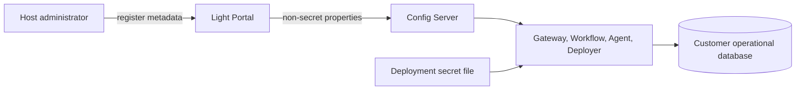

# Tenant Operational Store Registration

Operational storage is customer-owned data-plane infrastructure. The Portal
control plane stores a Host-scoped, non-secret registration that tells runtime
services where their organization has made a database available. The Portal
does not connect to that database and does not create, rotate, stop, or delete
it.

The version-2 contract is scoped to `HOST`; an Environment field is not part
of registration. Runtime instances still have environments, and the Portal
projects the same Host registration to each eligible instance while preserving
that instance's environment as routing metadata.

The registration contains the database engine, DNS name, port, database name,
TLS mode, runtime username, schema generation, credential generation, and a
logical credential reference. It must never contain a password or database
URL. For `MOUNTED_FILE`, the reference is an absolute file path such as
`/run/secrets/operational-database-url`.

The only active lifecycle operations are register, update, deactivate, and
unregister. Version-1 provisioning events remain replayable to rebuild
historical audit state, but live submission is rejected and the historical job
and provider-profile tables are write-guarded.

Local development uses three databases in the existing PostgreSQL container:
`operations`, `operations_networknt`, and `operations_taiji`. Production
customers register databases operated inside their own organizations.
