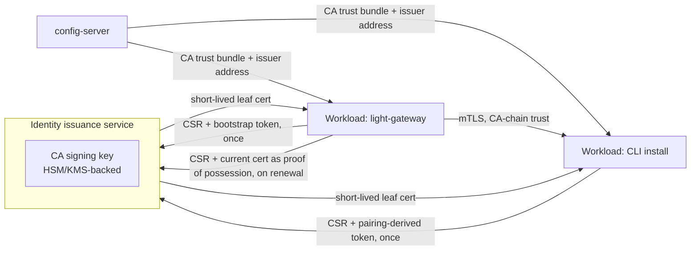

# Workload Identity Issuance

Update 2026-09-22: the Light CLI no longer uses this service. It is open source and downloadable
anywhere, so any credential it could be enrolled with is as public as the download; it is a public
client that signs the user in and calls the Gateway with the user's token alone (see
[Light CLI](light-cli.md)). The issuer remains for workloads deployed in a controlled pipeline
(agents, runners), where the delivery of the credential can be trusted.

Status: design proposal, 2026-09-19. Nothing below is implemented. Today,
per-workload mTLS credentials are produced by hand-run scripts
(`prepare.py`, `prepare-portal-ingress.py` in `portal-config-loc/all-in-lt`)
that generate a fixture CA, mint leaf certificates with multi-year validity,
and require an operator to re-run them and redeploy whenever a credential
expires or a new caller needs to be added. This document proposes replacing
that with an automated, SPIFFE/SPIRE-shaped issuance service. The current
implementation boundary is recorded at the end of this document.

## Why This Is Needed Now, Not Later

Two failures in the same operating session motivated this: an ingress
credential minted with a 1-day validity expired and silently broke a caller
with no alert, and a separate A2 activation appeared inert because a
config-file mount and a compose overlay had drifted out of sync with no
automated check that they matched. Neither failure was a design flaw in
`crates/light-security/src/dual_identity.rs` — the authentication contract
held correctly in both cases, fail-closed as designed. The gap is entirely
operational: nothing renews a credential before it expires, and nothing
mints a new one without a human running a script against a live container.

This is the same problem the [Light CLI](light-cli.md) design already
identified and deferred as "Slice 4: Multi-Install" — exact-leaf pinning in
`AppProfile.peer_sha256` does not scale past a handful of long-lived
services. That deferral was correct for a single-install pilot. It stops
being correct as soon as any caller population grows past what a human can
re-mint by hand, which is already true for the current five-service fixture
and would be untenable at 1000 agents or 1000 CLI installs.

## Decision And Scope

Introduce a dedicated **issuance service** that holds CA signing authority,
issues short-lived leaf certificates to workloads on request, and expects
every workload to renew automatically before expiry using its current,
still-valid certificate as proof of possession. This is the SPIFFE/SPIRE
model (workload API, rotating SVIDs), adopted in shape: purpose-built rather
than an embedded SPIRE server, so VM and Kubernetes deployment are both
handled through this issuer's own bootstrap contract rather than SPIRE's
platform-specific attestation plugins (see [Decisions](#decisions)).

Explicitly **not** config-server's job. Config-server distributes policy —
`RoutePolicy`, `AppProfile` maps, endpoint rules, CA trust bundles — as a
broadcast snapshot every service already pulls at startup. Minting a
private key and signing a certificate is a narrower, per-instance,
authenticated, individually-audited operation with different sensitivity.
Keeping them separate means config-server's blast radius stays what it is
today (wrong policy served) and does not grow to include "wrong key
signed." Config-server's role in this design is limited to distributing the
**CA trust bundle** and the issuer's reachable address — both of which are
genuinely policy, not key material.

Out of scope: a general-purpose PKI product; hardware attestation; issuance
for anything outside this system's own service-to-service and CLI-to-Gateway
boundary; replacing OAuth bearer tokens for the user leg, which this does
not touch.

## Architecture

Each workload:

1. Generates its own key pair locally. The private key never leaves the
   host, matching the existing enrollment precedent in
   `controller-rs`'s runner admission and the CLI design's enrollment
   section.
2. Authenticates to the issuer **once**, at first bootstrap, using whatever
   credential establishes "this install is allowed to exist" for its
   category — an enrollment token for a service, a pairing-derived grant
   for a CLI install (reusing the pairing flow already proposed in
   [Light CLI](light-cli.md#obtaining-the-user-leg-without-a-browser-redirect)).
3. Receives a short-lived leaf certificate (hours, not years) chained to
   the CA, carrying a certificate attribute that binds the leaf to a
   specific install identity — the CA-based peer trust option already
   named as recommended in the CLI design.
4. Renews automatically, well before expiry, by presenting its
   still-valid certificate back to the issuer as proof of possession and
   receiving a new one. No human, no redeploy, no script re-run.

Revocation of one install does not touch any other install's credential.
With short-enough lifetimes, non-renewal is sufficient; a compromised
install can additionally be denied at the next renewal via a revocation
list the issuer checks, scoped to one install ID.

## One Cert Per Instance, Never Shared

At any fleet size — five services today, 1000 agents or 1000 CLI installs
tomorrow — **every instance holds its own unique leaf**, never a cert
shared across instances. Sharing collapses two properties this system
depends on:

- **Revocation granularity.** Pulling one compromised install must not
  require rotating a credential every other install also presents.
- **Audit attribution.** An action's audit record must be traceable to the
  one install that performed it, matching the CLI design's requirement
  that "the audit record carries the install ID alongside the user."

What scales is not the number of trusted leaves but the **shape of the
trust rule**. Today, `AppProfile.peer_sha256` is an explicit, exact-match
list — appropriate for five long-lived services, unworkable for a fleet.
Under this design, the Gateway-side rule changes from "this exact leaf" to
"any certificate chaining to this CA, whose bound attribute matches this
route's expected service/role" — a rule that does not grow with fleet size,
while the underlying leaf population still grows one-per-instance. This is
the CA-based `AppProfile` variant already proposed, not weakened, in the
[Light CLI](light-cli.md#the-peer-pinning-problem) design.

## What Config-Server Continues To Own

- The CA trust bundle (public certificates only — never a signing key).
- The issuer's reachable address, so a workload with a live config
  connection can always find where to renew.
- The `RoutePolicy`/`AppProfile` role-matching rules that consume the
  identity this system issues.

This preserves the existing property that a live config-server snapshot is
the single source of truth for "what does this service currently trust,"
without asking it to also hold or use signing key material.

## Relationship To Existing Manual Tooling

`prepare.py` and `prepare-portal-ingress.py` are not being thrown away
immediately; they are the fixture this design replaces once the issuer
exists, and remain the right tool for a from-scratch local CA bootstrap in
the interim. The distinction to preserve: those scripts mint credentials by
hand-signing with a locally generated fixture CA key and a DB-extracted
Portal signing key; this design's issuer holds one CA consistently and
signs on authenticated request, with rotation as a first-class behavior
rather than an operator-run step.

## Decisions

These were open questions during design and are now settled.

### Build, not adopt SPIRE

Purpose-built, as one Rust crate/service reusing `light-security`'s existing
verification code. Driving reason: this must support both VM deployment
(the current pilot shape) and Kubernetes deployment on the same issuance
contract, and a purpose-built issuer keeps that a matter of how a workload
obtains its bootstrap credential (below), not a dependency on SPIRE's own
Kubernetes-specific attestation plugins and operational model.

### CA key custody

On disk for now, with the interface shaped so the signing operation can be
swapped to AWS KMS or Google Cloud KMS/HSM without changing any workload- or
Gateway-facing contract. Concretely: isolate "sign this CSR with the CA key"
behind one narrow internal call in the issuer, so the only code that changes
when moving to a managed HSM/KMS is that one call's implementation, not the
enrollment flow, the renewal flow, or any consuming service.

### Bootstrap credential: reuse the existing long-lived Portal token, once

Every instance today — gateway, workflow, agent, or otherwise — already
obtains a long-lived token from Portal to authenticate to config-server and
Controller, plus a CA bundle (`bootstrapCaCertPath` in `startup.yml`) used
only to verify config-server's own TLS server certificate. There is no
existing client-identity certificate to preserve; the token is the only
credential actually doing authentication today, which makes it a reasonable
"this install is authorized to exist" fact to reuse.

The refinement: use it for **first issuance only**, not for every renewal.
The issuer accepts the long-lived Portal token exactly once per install to
mint the first short-lived leaf certificate. Every renewal after that
authenticates by proof-of-possession of the previously issued certificate's
private key, not by presenting the token again. This matters because a
bearer token is portable — anyone holding it can replay it from anywhere —
while a private key that must prove possession is not. Reusing the token
repeatedly for renewal would just relocate the CLI's original bearer-token
weakness into this system; reusing it once, to bootstrap a
possession-bound credential, does not.

The CLI does not have a pre-provisioned Portal service token the way a
container workload does, so its bootstrap path stays what
[Light CLI](light-cli.md#obtaining-the-user-leg-without-a-browser-redirect)
already proposed — Portal-initiated pairing — while service workloads
bootstrap from their existing long-lived token. Both terminate at the same
issuer and the same first-issuance behavior.

### Configurable lifetime and renewal lead time, per deployment environment

Made part of the issuer's own configuration, distributed like any other
environment-scoped value (matching the existing `envTag` convention —
`loc`/`dev`/`prod`), for example:

- `portal-config-loc` (pilot, VM): 10-day leaf lifetime, renew 1 day before
  expiry.
- Production: 1-day leaf lifetime, renew 1 hour before expiry.

**The environment is bound into the certificate.** An issuer that serves several environments takes the
environment from the bootstrap token at first issuance and writes it into the certificate's subject
(`O=<envTag>`; the URI SAN is unchanged). Gateway `caTrust` profiles name the expected environment
and match it against this verified subject attribute, in addition to the issuer digest, role, and
service ID. Renewal is refused with
`EnvironmentMismatch` (HTTP 403) unless the request names the environment in the presented certificate,
so a holder of a production certificate cannot renew into the development policy's ten-day lifetime by
asking for it. A certificate with no environment in it (issued before this) cannot be renewed and must
enroll again.

**The issuer digest is verified, not assumed.** `caTrust.issuerSha256` is matched against the certificate
after the leaf in the chain the client sends. The client chooses that order and content, so the Gateway
(the `pingora-core` patch) uses it only when that certificate really signed the leaf: the names match and
the leaf's signature verifies under its key. Otherwise a leaf from one trusted CA could carry a different
trusted CA's certificate to satisfy that CA's profile.

Reconsidered from an initial 1-hour/5-minute proposal: the future production revocation path is
specified separately in [Service Identity and Revocation](../product/light-identity-issuer/service-identity-and-revocation.md),
but is not implemented yet. Until Portal and Config Server distribute that policy, expiry is the
effective revocation bound. A 1-day lifetime bounds a leaked
key's usable window far tighter than today's multi-year certs, at roughly
1/24th the renewal volume of an hourly cycle — a meaningful difference at
1000+ instances. The lead time should be read as "renewal must be complete
by," not "start trying at"; the renewal loop should begin attempting well
before the 1-hour mark, with backoff and retry, so a transient issuer or
network blip has room to resolve before anything actually expires. Tighten
these figures later once the renewal loop has proven reliable at scale,
rather than starting at the tightest setting.

### Sequencing: build the issuer first, CLI is the first consumer

The CLI is a clean slate with no existing credential model to migrate, unlike
Gateway/Workflow/agents, which already have hand-mounted certs from
`prepare.py` in a working (if manual) state. Proving the issuer against a new
consumer first, then migrating the existing A2 fixture credentials to it
afterward, is lower risk than changing the load-bearing service-to-service
path first.

## Open Questions

- **Renewal loop robustness at the production 1-day lifetime.** Retry
  policy, backoff, and alerting when a renewal attempt fails, given the
  smaller margin for error than the pilot's 10-day/1-day figures.
- **Revocation list distribution.** Whether the per-install revocation list
  the issuer checks at renewal is itself distributed through config-server
  (consistent with "config-server owns policy") or held only by the
  issuer.
- **Relationship to the CLI's Slice 4.** Slice 4 becomes "adopt this
  issuer" rather than "build CA-based trust from scratch" — the Light CLI
  plan should be updated to reflect that once this service exists.

## Current Implementation Boundary

Checked 2026-09-19 against the working tree.

| Capability | Current boundary |
| --- | --- |
| Certificate issuance | Manual, via `prepare.py` / `prepare-portal-ingress.py` in `portal-config-loc/all-in-lt`; no automated issuer exists |
| Peer trust | Exact leaf pinning only (`AppProfile.peer_sha256`); no CA-based attribute matching |
| Rotation | None; credential lifetime is fixed at mint time and expiry requires a manual re-run |
| Revocation | Republishing the policy snapshot with the entry removed; no per-install revocation list |
| Config-server's role | Distributes `RoutePolicy`/`AppProfile` snapshots today; does not distribute a CA trust bundle as a distinct artifact |
| Bootstrap/enrollment | `controller-rs` runner admission is the closest existing precedent for issuing a durable per-instance identity bound to an approved peer |

## References

- [Light CLI](light-cli.md)
- [LLM Gateway](llm-gateway.md)
- [User, Application, And Workflow Authorization](user-application-workflow-authorization.md)
- [Controller Registry Client](controller-registry.md)
- [Config Loader](../crate/config-loader.md)
