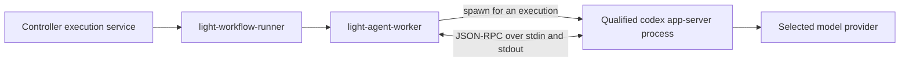

# Codex App Server upgrade strategy

Light Agent Worker runs an independently installed, exactly qualified Codex
executable. Upgrading the interactive CLI does not upgrade the worker. Promote
the executable, worker contract, admission, and any published coding profile as
one compatible release, with the previous release available for rollback.

## Process and ownership



The worker launches `codex app-server`, performs initialization, creates a
thread (or resumes the workflow-selected thread) and turn, consumes events, and
terminates the child after the execution. Process lifetime does not determine
conversation lifetime; see [Workflow Coding Thread Lifecycle](workflow-thread-lifecycle.md).
It does not attach to an interactive CLI session or link Codex into the worker
as a Rust library. The `codex-embedded-v1` prototype is a separate, unqualified
experiment and is not upgraded with the production App Server adapter.

For the personal subscription profile, the runner supplies an owner-only
`CODEX_HOME` and an absolute Codex executable path. Sharing the existing login
directory supplies authentication/configuration and persisted native history.
The worker resumes only its scope-bound workflow threads, never the interactive
conversation used to configure it. The native worker pool permits one concurrent execution.
Enterprise execution uses its separate broker, credentials, and isolation
profile; personal-subscription validation does not qualify enterprise routing.

The standalone `run-codex-app-server-smoke.sh` launches Codex directly. It
proves the native App Server path, not worker transport, runner enrollment, or
Portal dispatch. Those require their own validation layers.

## Release policy

Review upstream stable releases weekly. Expedite qualification for a relevant
security fix, blocking regression, or required model capability. Do not follow
the `latest` npm tag automatically at service startup or upgrade an executable
in place while jobs are running. An upstream release is a candidate until our
qualification passes.

Resolve the stable version from the official npm package and compare it with
the [official Codex changelog](https://learn.chatgpt.com/docs/changelog). Record
the date, package version, target platform, downloaded package provenance,
native binary SHA-256, generated schema SHA-256, and qualification results.
Binary hashes are platform-specific; a Linux x86-64 result does not qualify an
ARM or macOS executable.

Install complete native package contents in a separate version directory,
including the code-mode helper and bundled resources. Preserve the previous
binary, worker, runner, configuration, and admission. Never copy the global
npm launcher and call that the qualified native binary.

## Qualification and promotion

1. **Prepare a candidate without changing the active runner.** Download the
   exact version, verify its package provenance, record the native hash, and
   check `codex --version`.
2. **Generate the candidate's protocol artifacts.** Run
   `codex app-server generate-json-schema --out <directory>/json` and
   `codex app-server generate-ts --out <directory>/typescript`. Compare both
   trees with the previous version. Review changed request, notification,
   approval, usage, error, and terminal-event shapes. OpenAI states that these
   generated artifacts correspond to the exact executable version; see the
   [App Server documentation](https://learn.chatgpt.com/docs/app-server).
3. **Update the reviewed contract.** Keep the binary hash, version, schema,
   qualification evidence, packaging, examples, and tests consistent. Do not
   bypass the checks to make a new executable run.
4. **Qualify the native process.** Test initialization and authentication in
   isolation, then one real personal-subscription turn with the requested
   model. Require the returned model identity to match. Verify that direct
   subscription traffic leaves the local `llm_audit_event_t` count unchanged.
   Keep unrelated gateway traffic quiet during this global-count check.
5. **Qualify the worker integration.** Run the coding-harness gates. Cover
   schema validation, approval mediation, cancellation/deadlines, terminal
   events, usage, patch validation, reviewer isolation, authentication
   separation, worker binary validation, and runner registration/recovery.
   A skipped database test is not live database qualification.
6. **Rebuild and stage the release.** Rebuild affected workers/runners and,
   where coding profiles are enabled, the agent service. Generate admission
   from the exact deployed runner binary and configuration using
   `print-admission`. Publish matching immutable coding-profile contracts
   through the normal Portal workflow when that path is in use.
7. **Drain and activate.** Stop new assignments and let active work finish or
   follow the supported cancellation procedure. Stop the runner before
   switching its binary/configuration. Reload the controller admission and
   restart the runner. Require successful registration, fresh heartbeats,
   readiness, and HTTP 200 on authenticated result polling.
8. **Qualify the actual product path.** Before describing Portal coding as
   qualified, submit a controlled job through the enabled Portal agent and
   observe dispatch, execution, result acknowledgement, and final projection.
   Registration and a direct Codex smoke are narrower evidence.

Run the cumulative local regression gates from `light-fabric`:

```bash
LIGHT_CODEX_SMOKE_EXECUTABLE=/absolute/path/to/candidate/bin/codex \
  ./scripts/run-coding-harness-phase5-gates.sh
```

For a personal GPT-6 Astra qualification from the workspace root:

```bash
LIGHT_CODEX_NATIVE_EXECUTABLE=/absolute/path/to/candidate/bin/codex \
LIGHT_CODEX_SMOKE_MODEL=gpt-6-astra \
  ./portal-config-loc/all-in-lt/light-workflow-runner-personal/run-smoke.sh
```

Model access is an account/provider capability as well as a client capability.
An upgraded CLI cannot grant access to a model. For personal coding, the worker
currently uses native Codex model selection; it does not forward the Portal's
enterprise aliases such as `coding-implementer` as native model names. Check
the effective `CODEX_HOME` model configuration. An explicit smoke-model override
tests a model without rewriting the user's interactive CLI configuration.

## Files that form the current release contract

| Artifact | Purpose |
| --- | --- |
| `crates/coding-agent-runtime/src/lib.rs` | Accepted adapter version, binary, schema, and evidence digests |
| `contracts/codex-app-server/v<version>/` | Generated JSON/TypeScript schemas and provenance |
| `contracts/coding-adapters/codex-app-server-v1-qualification.json` | Qualification metadata whose digest is checked by the worker |
| `apps/light-agent-worker/src/codex_app_server.rs` | Runtime validation and generated-schema tests |
| `scripts/generate-codex-app-server-schema.sh` | Reproducible pinned schema generation |
| `scripts/run-codex-app-server-smoke.sh` | Exact version/hash and live native model qualification |
| `scripts/run-coding-harness-phase1-gates.sh`, `run-coding-harness-phase5-gates.sh` | Schema/evidence checks and cumulative regression gates |
| `apps/light-workflow-runner/docker/Dockerfile` | Exact native distribution shipped with the runner image |
| Controller admission and Portal coding profile | Approved deployed binary/configuration/capability identities |

The runtime currently accepts one hardcoded qualified version. Supporting a
small set of approved versions via a signed or release-owned qualification
manifest is a future improvement. Such a manifest would still require exact
binary hashes and validation evidence; it would not authorize arbitrary
versions or remove the need for compatible admission and Portal contracts.

## Local deployment and rollback

The local deployment keeps private tokens, admission, binaries, and the
Compose overlay in
`portal-config-loc/all-in-lt/light-workflow-runner-personal/.runtime/`, which is
ignored by Git. Its user service is `light-workflow-runner-personal.service`.
Use that directory's `configure-local.py` to regenerate the exact admission
after copying qualified binaries, then `start.sh` to reload the controller and
runner. The runner credential expires after 30 days; renew it using the same
documented setup procedure. Reapplying only the base Compose file can remove
the local runner overlay.

Before activation, save the old `codex`, companion files, `light-agent-worker`,
`light-workflow-runner`, `runner.yml`, `admission.json`, and private
`compose.yml` together in an owner-only rollback directory. Retain the durable
execution journal in place. For rollback, drain/stop the runner, restore the
matching artifact set, reload the controller, and reconnect. Do not restore an
old journal over newer execution evidence or restore only the Codex executable
while leaving new worker digests/admission active. Renew expired credentials
instead of restoring an expired token. Roll back any published coding profile
through its normal versioned publication process.

## Upgrade record: 0.153.2 to 0.153.4

The npm stable version and official changelog were checked on 2026-09-05.
Release `0.153.4` was published on September 4 and fixes Astra's bundled picker
visibility/default selection and async-question guidance. GPT-6 Astra support
was already introduced in `0.153.1`; `0.153.4` improves its integration.
See the [release notes](https://learn.chatgpt.com/docs/changelog).

| Evidence | Candidate value |
| --- | --- |
| Native package | `@openai/codex@0.153.4-linux-x64` |
| Platform | `x86_64-unknown-linux-musl` |
| Native SHA-256 | `56ef98ab4032d317ab26e9b5e5a175650717351edb16ed9cde0cb6d1734d62da` |
| v2 schema SHA-256 | `d3eace08be5dca386bfd1f1e8df650058b4113f1e10870a284d775d75517576a` |
| Schema comparison | All 1,010 generated JSON and TypeScript files are byte-identical to 0.153.2 |
| Requested live model | `gpt-6-astra` |

Verified on 2026-09-05:

- The native personal-subscription smoke completed a real turn with
  `gpt-6-astra`; the returned model matched and the gateway audit-row count did
  not change.
- The cumulative `run-coding-harness-phase5-gates.sh` completed successfully,
  including stages 1 through 4, unit/integration regressions, Clippy, formatting,
  schema/evidence checks, and mdBook. Existing Clippy warnings remain warnings.
- The local release runner and worker were rebuilt and activated. Worker
  capabilities report adapter version `0.153.4` and capability digest
  `sha256:80e4dcb3d624635cb871bcbdccc18641550a0906ac8d438f8e2ab49be167d12d`.
- Controller registration succeeded, runner readiness returned `true`, the
  execution database reported a connected runner, and authenticated agent
  result polling returned HTTP 200.
- The previous runtime artifact set is retained at
  `.runtime/rollback-0.153.2/`; the active complete native distribution is at
  `.runtime/codex-0.153.4/` in the local personal-runner directory.

This evidence qualifies the local native model path and runner connectivity.
No Portal coding profile was published, no end-to-end Portal coding job was
submitted, and no enterprise image or remote deployment was promoted as part of
this local upgrade. The updated Dockerfile pins the new distribution, but a
production image build and enterprise live qualification remain deployment
gates for those environments.

Subsequent enrollment verification found that the sibling Portal publisher
always emitted an empty coding profile. The local `light-portal` source now
supports a validated instance property: module `agent-policy-authoring`,
property `codingProfile`, type `map`, explicitly assigned to the instance's
product version. It publishes the complete map into
`agentPolicy.execution.codingProfile` and binds it into policy digests. See
`light-portal/db-provider/README.md`, "Agent coding-profile publication", for
catalog setup, validation, and the normal publication workflow.

Deploy the updated Portal query/command services and align the account-agent
container with the upgraded worker contract before publishing that profile.
The source fix and Java/Rust digest tests do not constitute a deployed profile
or an end-to-end Portal coding test.
