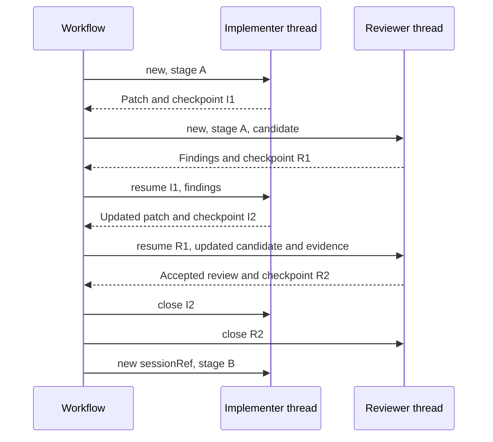

# Workflow-controlled coding threads

For native permission inheritance and `coding.nativeModel`, see
[Personal Codex permissions and models](codex-personal-policy.md).

The workflow chooses conversation boundaries. Keep an implementer thread and a
separate reviewer thread through one stage's implementation/review/remediation
cycle. Close them when the stage is accepted, then allocate new session references
for the next stage. An optional final reviewer can start fresh to reassess the
whole accepted change without earlier review assumptions.

This replaces the requirement to start a fresh harness thread for every job.
Every job still has a new Light turn, execution lease, deadline, and result. The
worker process and Codex App Server process may exit between jobs: native
`thread/resume` restores the persisted Codex conversation in a new process.
No `/clear` command is sent. Within each job, Codex keeps context across its model
and tool calls.

## Implemented scope

The native personal-subscription `codex-app-server-v1` worker supports this
contract. `claude-code-v1` remains an unimplemented adapter; its eventual
implementation must obey the same lifecycle and keep its review conversation
separate from Codex's implementation conversation. This change does not claim
that Claude execution is available.

Enterprise workers reject persisted thread directives: their per-attempt Codex
homes contain ephemeral broker configuration and credentials. Persisted enterprise
thread storage requires its own isolated storage/credential design and qualification.
Existing requests without `coding.thread` retain the one-job ephemeral behavior.

## Job contract

A workflow service-mode Agent job supplies the same typed input as an Agent coding
request: `profile: coding`, `text`, and the complete `coding` object. The existing
workflow expression resolver can populate the thread directive and its checkpoint
from workflow context. Do not place the directive inside the prompt.

Example directive inside `coding`:

```json
{
  "thread": {
    "runnerId": "personal-codex-runner",
    "sessionRef": "019a0000-0000-7000-8000-000000000001",
    "stageId": "implementation-phase-1",
    "mode": "new",
    "closeAfterTurn": false
  }
}
```

This is a fragment, not a complete coding request. The immutable repository,
base revision, role, tools, bounds, and review/remediation input are still required.
Use different UUIDs for the implementer and reviewer. The workflow persists them
before dispatch and carries them through retries; it must not generate a new UUID
on every retry of the same logical job.

| Operation | Required state | Behavior |
| --- | --- | --- |
| `new` | Unused `sessionRef`; omit `expectedCheckpoint` | Create a persistent native thread |
| `resume` | Last successful receipt's `expectedCheckpoint` | Resume that exact native thread |
| `close` | Last successful receipt's `expectedCheckpoint` | Archive the thread and close its checkpoint without a model turn |
| `closeAfterTurn: true` | A `new` or `resume` turn | Attempt to close after its successful validated result |

A successful worker result includes a `codingThread` receipt:

```json
{
  "sessionRef": "019a0000-0000-7000-8000-000000000001",
  "checkpoint": "019a0000-0000-7000-8000-000000000002",
  "state": "READY"
}
```

Set `expectedCheckpoint` to that `checkpoint` on the next operation. A close
returns `state: CLOSED`. Native `threadId` is diagnostic evidence, not the public
resume credential; callers cannot choose an arbitrary existing Codex thread.

### `closeAfterTurn` is an attempt, not a guarantee

`closeAfterTurn` rides on a turn whose real result is the patch or the review. The
worker commits that result to the checkpoint **before** it tries to archive the
thread, and the archive is bounded by whatever execution time remains after
reserving enough to deliver the result. When the lease is nearly spent the close is
skipped outright rather than risking the turn being killed at its deadline with an
undelivered result. If the archive fails, never answers, or is skipped, the turn
still succeeds and returns its implementation or review result, but the receipt
reports the thread as it can be proven to be — still open, with the reason
attached:

```json
{
  "sessionRef": "019a0000-0000-7000-8000-000000000001",
  "checkpoint": "019a0000-0000-7000-8000-000000000002",
  "state": "READY",
  "closeError": "thread/archive did not answer within 10s"
}
```

**A workflow that requires closure must check for `state: CLOSED` rather than
assuming a successful turn closed the thread.** A `READY` receipt with a
`closeError` is a normal outcome: keep the result, and close the still-resumable
thread with an explicit `mode: close` turn using the `checkpoint` just returned.
`state` describes the conversation, never the cleanup — that is why a failed close
does not invent a distinct thread state.

A dedicated `mode: close` turn is the opposite case: archiving is the entire point
of the turn, so a failed or unanswered archive fails the turn, and such a turn only
ever reports `CLOSED` on success.
Implementation results are wrapped by the runner, so the receipt is under the
implementation result's `worker.codingThread`; review and close receipts are
under `codingThread`. The Agent's durable terminal result also wraps the execution
result. Inspect that envelope and map the receipt into the workflow context; do
not confuse a scheduling request ID with a checkpoint.

The workflow-to-Agent bridge now dispatches typed coding jobs from
`agent_job_t` through the same digest-bound execution scheduler used by the
WebSocket coding path. Invalid coding jobs fail explicitly. Ordinary service-mode
Agent jobs retain their existing behavior.

## Scope, ordering, and workspace continuity

Agent supplies the trusted thread scope from persisted Host, service, policy,
data boundary, and workflow process identity. For direct authenticated Agent
coding requests, scope uses the Agent session and its principal instead. The
request cannot supply a foreign workflow scope. Storage additionally binds stage,
role profile, model alias, adapter contract, runner, immutable repository/base,
materialization manifest, tools, and writable roots.

Session jobs pin `runnerId` and require `workflow-coding-threads-v1`. The native
runner's admission and live registration advertise the same feature only when
the configured worker capability digest matches the thread-capable worker.
Upgrading the runner alone does not advertise reuse for an older worker. They must
also carry the exact rebuilt worker capability and binary digests.

Only one operation may hold a session's lock. An old checkpoint, changed scope,
changed role, changed contract/base, duplicate `new`, or a closed session is
rejected before a model turn. Missing native history or an interrupted execution
never silently falls back to a fresh conversation. The workflow explicitly starts
a replacement session from accepted artifacts if recovery is needed.

Native history resides in the owner-only Codex home. Worker checkpoint metadata
and the latest validated implementer patch reside in its private
`light-worker-threads` directory. This directory is not a shared tenant store.
Do not edit or copy checkpoint JSON to manufacture a resume authorization.

The worker reconstructs a fresh repository for every job:

- Implementer: same immutable base plus the previous validated checkpoint patch.
  Remediation findings must refer to that patch's digest.
- Reviewer: same immutable base plus the newly supplied candidate patch. Earlier
  reviewer memory is retained, but the candidate and evidence are refreshed.
  Only separate build scratch is writable; the candidate must remain unchanged.

Untracked caches and arbitrary shell state do not carry forward. Each prompt
identifies the current repository and warns that earlier paths/tool observations
may be stale. A stage or base change uses a new `sessionRef` and new immutable input.
The present implementation is a single-repository checkpoint, not the future
multi-repository WorkspaceSet implementation.

Storage is marked `IN_FLIGHT` immediately before the first native request that can
create or advance the durable thread, and not earlier. Opening a checkpoint locks
and loads it without writing, so a preflight rejection — a repository that will not
stage, a changed binding, remediation findings that do not match the checkpoint's
patch — releases the thread untouched and the workflow may simply retry the same
resume. Only once the native operation is claimed is an interruption
indistinguishable from a lost one. Only successful validation advances the
checkpoint, so an interrupted or uncertain operation requires workflow recovery
rather than an automatic potentially duplicate turn.
Execution-result delivery still uses the runner's existing durable replay/ack path.
A close archives native history; it is not secure deletion or a retention policy.

## Workflow policy



Keep requirements, plans, accepted patches, review findings, and actual test
results in durable artifacts independently of conversations. These are the
recovery source and publication evidence. The reviewer never receives the
implementer's private conversation. Retaining the reviewer's own history helps
track finding closure; policy can add a fresh final review when warranted.

## Upgrade and verification

Rebuild `light-agent`, `light-agent-worker`, and `light-workflow-runner`. Regenerate
the worker template and runner admission from the installed binaries, then
regenerate and publish the coding profile with the new capability/template/image
and qualification digests. Recreate Controller with that admission and restart
the runner. Version-string equality alone does not validate these artifacts.
Close active stages before upgrading: an adapter contract change intentionally
prevents resuming an old checkpoint. Start replacement stages from accepted
artifacts when a clean close was impossible.

Focused local tests:

```bash
cargo test -p coding-agent-runtime -p light-agent-worker -p light-workflow-runner --lib
cargo check -p light-agent
```

The opt-in live gate runs two real coding turns and a close through separate
worker processes. It uses a temporary private copy of the existing native login,
leaving the owner's interactive threads and configuration untouched. It verifies
that a marker supplied only in the first conversation is remembered by the second
and that the first patch survives reconstruction. It consumes native plan usage.

```bash
cargo build -p light-agent-worker
python3 scripts/run-coding-thread-smoke.py \
  --codex /absolute/path/to/qualified/native/codex \
  --worker target/debug/light-agent-worker \
  --codex-home "$HOME/.codex"
```

The gate reports observed usage, including cached input when provided. These
native usage events are not gateway billing receipts. Resumption can reduce
repeated exploration, but cost/cache improvements need measurement rather than
an assumption that a persisted thread guarantees a cache hit.

## Verification record (September 5, 2026)

The live native gate passed new, resume, and close through separate worker
processes. The same native thread ID was returned on both model turns; the
second turn reproduced the first turn's conversation-only marker and preserved
its patch. Both turns reported cached input. This is a continuity qualification,
not a controlled benchmark of cache savings.

The disposable PostgreSQL test exercised workflow job creation, fair activation,
selection in `RUNNING`, native coding scheduling, runner pinning, trusted workflow
scope, duplicate-dispatch rejection, and guarded failure handling. It used the
checked-in Agent migration, not the application database. Unit tests cover
checkpoint concurrency, stale state, interrupted execution, scope/contract
changes, close behavior, protocol shapes, and typed workflow input. The affected
Rust tests and both documentation builds passed. Production deployment and a real
multi-stage Portal workflow run are separate rollout checks; the live worker
smoke does not claim to qualify an unimplemented Claude adapter.
