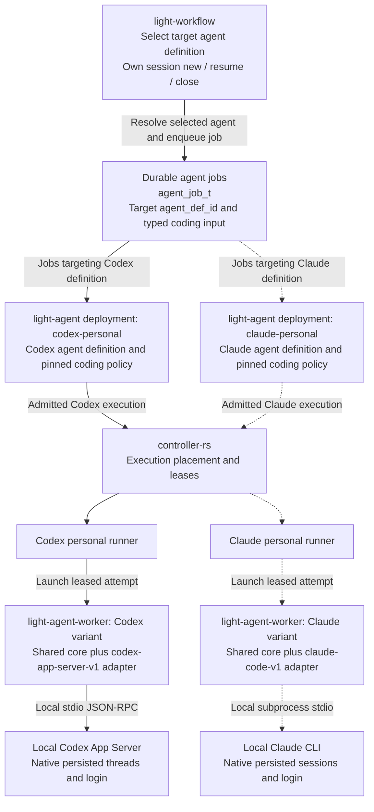

# Claude Personal Worker

Status: Phases 0, 1, 2, and 3 implemented September 12, 2026 for the pinned
Linux x86_64 local candidate. Phase 2 includes Agent admission, dedicated runner
selection, fenced worker events, canonical artifacts, independent review, and
workflow-controlled sessions. The opt-in worker is locally technically qualified;
production/distribution eligibility remains open. Phase 3 supplies repeatable local
configuration and published-Agent-to-runner verification in both service layouts. See the [Phase 2 record](#phase-2-integration-record) for the exact
implemented boundary. Other sections also describe later target capabilities.

This specializes [Coding Harness Integration](coding-harness-integration.md)
for a user operating their own local Claude subscription. The concrete use case
is implementing or independently reviewing a coding task with the native Claude
Code harness alongside the tested Codex personal worker.

## Recommendation

Build `claude-code-v1` as a separately qualified adapter in the existing Rust
`light-agent-worker`. Initially launch one official Claude CLI process per
attempt, consume bounded JSON Lines, and retain the existing Light lease,
workspace, cancellation, and canonical-artifact boundaries.

An App Server equivalent is unnecessary for this first milestone. Anthropic
provides Python and TypeScript Agent SDKs and explicitly recommends a CLI
subprocess for other languages. There is no Rust SDK in the documented SDK
language set. This is a supported integration surface to investigate, rather
than a reason to reverse-engineer a private server protocol.
[Agent SDK overview](https://code.claude.com/docs/en/agent-sdk/overview).

The recommended first release supports workflow-controlled multi-turn sessions
with a policy-selected constrained or trusted-personal automation profile. Each job remains a
bounded turn in its own process. Session reuse is required for qualification;
interactive approvals and automatic recovery of uncertain turns are not advertised. If Portal-mediated approvals
are required for the initial use case, qualify the SDK bridge described below
before enabling that profile; do not emulate approvals by parsing terminal text.

## Current Repository Boundary

The current production worker is explicitly Codex-specific:

- `apps/light-agent-worker/src/lib.rs` advertises Codex capabilities and uses
  `codex_app_server.rs`, `coding_session.rs`, and `workspace.rs`.
- `crates/coding-agent-runtime/src/lib.rs` pins the Codex binary/protocol and
  defines adapter qualification, authentication, roles, and artifact contracts.
- `contracts/coding-adapters/codex-app-server-v1-qualification.json` records
  evidence across 13 qualification dimensions.
- `crates/model-provider/src/claude_code.rs` already invokes Claude CLI as a
  model provider. It buffers output and uses `--dangerously-skip-permissions`
  in its agent path. It is not the leased coding-worker integration and must
  not be reused as the worker's launch or permission policy.

The existing `ClaudeStreamJson` compatibility identifier does not establish a
qualified adapter. A new launch contract and evidence record are required.
Keep adapter ID, role profile, authentication profile, and logical model alias
separate, as in the parent design.

## Integration Options

| Option | Benefit | Cost or limit | Decision |
| --- | --- | --- | --- |
| Rust launches `claude -p` and parses JSON Lines | Small dependency footprint; clear process boundary | Narrower lifecycle and approval integration | First prototype and bounded-turn candidate |
| Rust launches a pinned Python Agent SDK bridge | Typed SDK messages, permission callbacks, interruption and session APIs | Additional interpreter, SDK, and bridge qualification | Preferred escalation path for interactive features |
| TypeScript Agent SDK bridge | Similar programmatic control | Adds Node/runtime packaging | Alternative if deployment ownership favors TypeScript |
| Rust implements SDK-internal bidirectional messages | No interpreter | Assumes responsibility for an internal protocol | Reject unless upstream publishes a suitable supported contract |
| PTY automation of interactive Claude | Looks like local terminal usage | Fragile prompts, escape sequences, approval ambiguity | Reject |
| Direct Anthropic API calls using native login credentials | None within this architecture | Bypasses native-client and credential boundaries | Reject |

The Agent SDK is distinct from the Anthropic API client SDK: the latter would
require Light to implement the coding loop and does not turn a subscription into
API credits. The SDK bridge remains a local child of the worker, never a shared
network service. [SDK comparison](https://code.claude.com/docs/en/agent-sdk/overview).

## Architecture And Ownership

The diagram shows two configured deployments of the same `light-agent`
application. Codex is production-integrated; Claude has an opt-in locally qualified adapter and dedicated worker. **The workflow never
calls `light-agent-worker` directly.** It selects an agent definition, and that
agent's configured coding policy selects the worker and adapter.



### How the workflow selects Codex or Claude

Use two logical agent definitions, illustratively named `codex-personal` and
`claude-personal`, with different agent definition IDs and separately pinned
coding policies. The workflow's agent-call target resolves through the agent
catalog to the selected definition. In the existing service-mode path,
`light-workflow` writes that target into `agent_job_t.agent_def_id`, together with
the typed coding input and workflow correlation. The matching `light-agent`
deployment reconciles the job, authorizes the turn, and submits its execution to
the controller/runner path. The runner starts the worker variant fixed by that
agent's policy. A target name alone is not authority: catalog, policy, ownership,
and execution admission still apply.

For example, the implementation task targets the Codex definition and receives
an implementation result plus checkpoint. The review task targets the Claude
definition with the candidate patch and its own session reference. Follow-up
review tasks keep targeting that same Claude definition with `mode: resume` and
the expected checkpoint. The workflow receives durable results through the agent
job path; it does not address either native CLI or worker process.

| Layer | Concrete local arrangement |
| --- | --- |
| Application code | One `light-agent` application/binary, reused by both deployments |
| Logical agents | Two definitions: Codex personal and Claude personal |
| Agent service processes | Two configured deployments, initially one process each |
| Coding policy | One pinned adapter/worker contract per deployment |
| Personal runners | Separate configured Codex and Claude targets, each single-concurrency |
| Worker processes | Launched per admitted attempt; each contains the common core and its selected adapter |
| Native conversations | Separate persistent sessions per workflow stage and role; process exit does not close them |

This corrects the earlier statement that one current process could host both
coding policies. `apps/light-agent/src/main.rs` loads
`agentPolicy.execution.codingProfile` at startup through
`coding_profile_from_policy`; the current design must not assume a per-job
multi-profile dispatcher. Hosting both definitions in one process would require
an explicit future change to policy loading, job dispatch, isolation, and
qualification. It is not required to implement the Claude worker. Two
deployments may run on the same machine with distinct service configuration;
they do not require two implementations of `light-agent`.

Both workers reuse the trusted worker core, but the diagram represents separate
execution paths, not a single worker running both adapters. Agent admission owns
policy; controller/runner owns placement and leases; worker core owns runtime
validation and artifact proposals; adapters translate native protocols. Results
return through runner and agent into the durable workflow job. Claude's path
becomes selectable only after implementation and qualification.

A new worker or CLI process may be launched for every turn while the same native
conversation is resumed. Implementer and reviewer sessions remain separate, and
neither adapter can resume the other vendor's history. Both use the common
`coding.thread` lifecycle; the workflow closes a session explicitly rather than
interpreting process exit as conversation closure.

The worker launches only the server-selected binary in the admitted working
directory. The prompt cannot set a binary, environment, provider, credentials,
permission mode, MCP server, or writable root. The controller still owns leases;
Claude session identifiers never replace Light identity or fencing.

Use a dedicated runner bound to one Portal host and user, with
`maximumConcurrency: 1` and `local-single-user-native-v1`. Codex and Claude must
also share an exclusive workspace lease when targeting the same task; separate
vendor accounts do not make concurrent writes safe. Shared task workspaces obey
[Shared Task Workspaces](shared-task-workspaces.md).

This retains the parent design's weaker trusted-local-user security model.
A same-user shell can potentially access that user's native credentials. CLI
permission rules and post-run diff validation do not establish OS isolation.
Require proven filesystem/process controls for each advertised role; where they
cannot be established, reject the role. Hostile repositories require a stronger
separately qualified sandbox and authentication arrangement.

## Subscription Authentication And Eligibility

The intended setup is a user installing the official CLI and logging in through
Anthropic's native flow outside Portal. Light launches the CLI in that dedicated
user context. Light does not receive, copy, export, broker, or persist OAuth
credentials, and does not implement a Claude login button.

There is a material distinction between technical feasibility and permission to
ship this integration:

- Anthropic's support article has a June 15 update stating that proposed billing
  changes are paused and SDK, `claude -p`, and third-party app usage still draw
  from subscription limits. The older credit announcement below that update is
  explicitly superseded. [Current support update](https://support.claude.com/en/articles/15036540-use-the-claude-agent-sdk-with-your-claude-plan).
- Its compliance page still directs product developers to API authentication and
  restricts offering Claude login or routing subscription credentials on users'
  behalf. [Authentication and credential use](https://code.claude.com/docs/en/legal-and-compliance).

These pages do not conclusively authorize this particular Portal integration.
Keep personal deployment conditional on recorded eligibility for the intended
user-owned local use and current plan terms; resolve the discrepancy with
Anthropic before distributing it as a supported subscription integration.
This does not block designing or testing the adapter with synthetic fixtures.
An SDK bridge does not change the eligibility question.

At startup, qualify a documented native authentication-status check for the exact
CLI release, parse only the minimum authentication class, and discard account
identifiers. Reject API-key/cloud-provider mode, ambiguous status, or missing
login before workspace mutation. Do not inspect credential-file contents as an
alternative status API. Native reauthentication is a user action outside the
attempt; report an actionable `authentication-required` result.

Construct an allowlisted environment and reject incompatible inherited settings,
including API keys, OAuth-token overrides, custom API base URLs, API-key helpers,
and Bedrock/Vertex/Foundry selection. Audit native settings as well as environment
precedence. Do not silently fall back to API billing, another account, Codex, or
`llm-gateway`. The workflow may request a native model through the proposed typed
model-selection field below. If omitted on a new session, use the configured
agent default. Do not send Light role aliases such as `coding-reviewer` as literal
Claude model names.

Subscription usage is advisory telemetry. It is neither an authoritative invoice
nor proof of remaining quota. Exhaustion yields a bounded retryable outcome for
the workflow, without a tight retry loop or an automatic API purchase.

## Workflow-selected Native Model

Yes: the target design permits the workflow to choose a Claude model for a coding
job, independently of its choice of agent definition and implement/review role.
The worker maps the admitted choice to the CLI's documented `--model` option,
which accepts native aliases or full model IDs.
[CLI model selection](https://code.claude.com/docs/en/cli-reference).

Implemented fragment inside the typed `coding` input:

```json
{
  "nativeModel": "opus"
}
```

A workflow may populate this field with an expression. Agent admission checks it
against its configured allowed native models and account eligibility, resolves
any configured mapping, and binds the effective choice into the immutable turn
spec. The worker then launches Claude with `--model <admitted-model>`. Unknown or
unavailable choices fail explicitly; no silent model or paid-provider fallback.

Precedence: on `new`, explicit workflow choice overrides the agent default;
on `resume`, an omitted choice preserves the session's admitted model. Initially
require an explicit resume choice to match that model. To change models, the
workflow closes the session and starts a new one with the requested choice.
In-session switching can be a later qualified capability; it must never happen
implicitly because an installation's default changed. Record requested and
observed effective model in turn evidence, and detect native alias drift when
exact reproducibility is required.

`nativeModel` stays separate from `CodingTurnSpec.modelAlias`, which still
identifies the immutable role profile. Agent admission validates the typed public
`coding.nativeModel` field and projects it into the runtime envelope alongside
the server-owned `claudePolicy`. The worker binds the resolved native model into
its checkpoint. Do not replace `coding-reviewer` with `opus` or put the selection
only in the prompt.

The same design can later support Codex's native model selection, but this note
does not claim the current personal Codex worker accepts such an override.

## Launch And Configuration Contract

The documented headless surface supports `-p`, `--output-format stream-json`,
`--verbose`, and partial-message streaming. It also supports stdin prompts and
reports a terminal result. Critically, `--bare` does not read subscription OAuth
credentials or the keychain; it cannot be the personal worker's isolation switch.
[Programmatic CLI usage](https://code.claude.com/docs/en/headless).

Illustrative process shape, not a qualified production command:

```text
<absolute-pinned-claude-executable>
  -p
  --output-format stream-json
  --verbose
  --include-partial-messages
  --permission-mode dontAsk
```

Rust writes the bounded prompt to stdin, closes input for the one-shot profile,
and drains stdout and stderr concurrently. It uses `tokio::process::Command`
with explicit arguments, never a shell command assembled from prompt text.
A one-shot process is not a one-shot conversation: persistent jobs add the
explicit session selection described below and retain native session storage.
This example illustrates the constrained profile. The actual launch uses the
permission source and mode selected by policy; native inheritance omits the
`--permission-mode dontAsk` override shown here.

The CLI reference documents `--safe-mode` with authentication retained,
`--restricted`, `--setting-sources`, `--settings`, and `--strict-mcp-config`.
Settings overrides are not a guarantee that omitted settings disappear, and
managed policy can still apply. [CLI reference](https://code.claude.com/docs/en/cli-reference).

For `permissionSource: agent-policy`, Phase 0 should first test `--safe-mode`
plus a trusted explicit policy with the native login intact. Qualify all relevant flag combinations rather than assuming
individual flags compose. For that Light-managed configuration mode, the required
outcome is:

- No automatic project/user hooks, plugins, commands, agents, remote sessions,
  MCP servers, or memory can execute or widen authority before admission.
- Approved repository instructions and centralized skills are supplied as
  reviewed context, without automatically activating their executable helpers.
- Managed configuration is inventoried and digest-bound or rejected when it
  introduces unapproved execution. Initialization telemetry is useful evidence,
  but is too late to prevent startup hooks.
- The native authentication store remains available only in the documented
  local-user context; changing the configuration directory must not be assumed
  to preserve authentication across platforms.

For `permissionSource: claude-cli`, normal native configuration discovery is
intentional, as described below; the preceding customization-suppression rules
do not apply. Qualify each source mode separately. If the pinned CLI cannot
satisfy the selected mode and native login, that mode fails qualification. Investigate the SDK configuration controls or
a stronger runner boundary. Permission bypass cannot substitute for configuration
containment or runner enforcement, even when explicitly enabled by policy.
Pin the installed artifact and version, detect updates before every launch, and
reject drift until requalification. Do not choose a rolling `latest` release.

## Permissions And Interactive Features

### Choose the permission source in agent policy

Support two explicit sources. For a dedicated trusted personal coding machine,
recommend `claude-cli`: reuse the installation the owner already maintains.
Choose `agent-policy` when centralized tool rules and reproducibility are needed.
This is a deployment choice, not a claim about measured user preferences.

| Policy source | Permission/configuration authority | Worker behavior |
| --- | --- | --- |
| `agent-policy` | Light supplies the admitted native tool and permission settings | Materialize the trusted configuration and suppress unapproved ambient customization |
| `claude-cli` | The owner delegates native tool decisions to the installed Claude configuration | Use installed settings and admitted native customization within the qualified filesystem namespace |

Implemented fields inside `agentPolicy.execution.codingProfile.claudePolicy`:

```json
{
  "permissionSource": "claude-cli",
  "permissionMode": "inherit",
  "defaultModel": "sonnet",
  "models": { "sonnet": "claude-sonnet-5" },
  "tools": [],
  "allowedTools": []
}
```

The published agent policy is delivered through the normal trusted configuration
path, validated by Agent admission, and bound into the worker execution contract.
The prompt or an arbitrary job field cannot change this delegation. Do not
require users to duplicate native allow/deny rules in Light. In native mode,
Light validates the selected source/profile rather than pretending it has a
complete independently enumerated list of Claude tools.

`permissionMode: inherit` means omit permission-mode/tool override flags and let
Claude resolve its native rules. Do not add `--safe-mode`, `--bare`, restrictive
setting-source flags, or an empty MCP configuration that would defeat the chosen
behavior. Process framing, session selection, and explicitly admitted model
selection still use their own flags. Claude's documented settings precedence
continues to apply; user settings are not the only source, and managed policy may
constrain the installation.
[Native settings and precedence](https://code.claude.com/docs/en/settings).

For a machine explicitly dedicated to unattended automation, the owner may use:

```json
{
  "permissionSource": "claude-cli",
  "permissionMode": "bypassPermissions",
  "defaultModel": "sonnet",
  "models": { "sonnet": "claude-sonnet-5" },
  "tools": [],
  "allowedTools": []
}
```

This retains native customization while explicitly requesting Claude's permission
bypass mode at launch. There is no need to approve each ordinary coding tool in
Light. If the installation already achieves the desired behavior, `inherit` is
sufficient. Inheritance alone does not mean allow-all, and unattended execution
does not imply consent. Never silently change `inherit` into bypass when a tool
is denied. A native managed restriction or external service authorization still
applies; fail clearly if the requested mode is unavailable.

With `interactionMode: unattended`, use the pinned CLI's qualified no-prompt
behavior and return recorded denials or a needs-input outcome when work cannot
proceed. Do not emulate human input by writing `y`, leave a process waiting
indefinitely, or override a denial. Headless behavior can differ from the terminal;
qualify it explicitly. A future `interactive` mode requires a structured Light
interaction bridge before it can be selected.
[Headless execution](https://code.claude.com/docs/en/headless).

Native mode deliberately trusts configuration discovered in the admitted working
directory, including repository-provided executable hooks. Bind the dedicated
OS user, runner, and workspace to that delegation before launch. A staged checkout
may not contain the original checkout's ignored local settings or resolve its
relative paths identically: qualify the runner's workspace projection so native
configuration behaves as promised. Do not silently import arbitrary files from
other repositories or copy credential stores into workspaces.

Reuse current native configuration on each new invocation without requiring a
new agent policy publication for every local rule edit. Record source, requested
mode, and a secret-free configuration revision/fingerprint where observable;
do not log raw settings or credentials. Native mode intentionally permits owner
configuration drift, so it does not promise reproducible tool policy. Keep the
permission-source and override choice fixed within a Light session. Qualify
native live-reload behavior and log observable changes; a resident-process mode
must not claim it freezes configuration if Claude reloads it. Light-managed mode
retains its stricter configuration binding.

This delegation covers native tool decisions, not Light identity, session
ownership, leases, deadlines, concurrency, result validation, or the role's
external filesystem boundaries. A read-only review stays externally read-only;
if that role conflicts with the selected installation, reject the incompatible
profile rather than silently remove the review guarantee. Publication authority
is configured separately as below. Dedicated-machine mode makes no claim of
protecting the owner's credentials from same-user code.

Implementation must replace the current fixed-tool-set assumptions with a typed
source-aware policy contract across admission, worker capabilities, launch, and
checkpoints. Add tests for both source modes, inherited native denies, inherited
bypass, explicit bypass, managed restrictions, configuration discovery in staged
workspaces, local edits between turns, prompt-injected overrides, cancellation,
and unattended needs-input outcomes. These are requirements for the Claude
worker, not a claim that current binaries accept the example fields.

### Tool authority and execution boundaries

The Light-managed profile uses an explicit tool surface; the native profile
delegates that surface to the installed CLI. Both retain the outer execution
boundaries admitted by Light. An auto-approval list alone is not the complete tool
surface or a filesystem boundary. Read-only reviews need an OS-enforced
read-only candidate tree and separately writable scratch; allowing Bash can
otherwise restore writes even if Edit is disabled.

The personal worker must be able to perform real development: read/search code,
edit files, execute builds and tests, install dependencies, fetch documentation,
and use approved MCP tools and subagents. These are supported design goals, not
blanket prohibitions. Enable them through an explicit execution profile and
qualify their actual tool surface, network access, credentials, and cleanup.
Background tasks may run within the active lease and must stop at cancellation
or turn completion; they do not become independent durable Light workflows.

Permit `bypassPermissions` / `--dangerously-skip-permissions` in an explicitly
configured trusted-personal automation profile. This preauthorizes native CLI
actions for that profile; it does not grant new Light permissions. A constrained
profile may instead use `dontAsk` and tool allow rules. Choose the launch mode
from trusted policy: either an explicit override or deliberate inheritance of
native settings. Prompt text cannot select either. Record the effective
mode in execution evidence. Under bypass, native permission prompts and approval
callbacks are not an enforcement boundary: the runner and external tool services
must enforce the admitted scope. Same-user credential isolation remains weak.
A read-only reviewer still requires an externally read-only candidate tree.

GitHub writes, push, deployment, and publication are permitted workflow actions.
The default remains the existing fixed-action path after artifact acceptance.
If a workflow explicitly delegates these operations to the native worker, define
a separate publication-capable profile with scoped credentials, exact targets,
approval/artifact binding, and audit receipts. That is an extension to the parent
harness publication contract, not implicit authority for every coding turn.
Until that extension is implemented, the workflow performs them through fixed
actions; the coding agent can still implement, test, and propose the result.

For the initial adapter, advertise `supports_approvals: false`. A denied tool may
allow the model to continue, but the worker must preserve that denial and reject
a claimed completion when required work was not performed. A task needing
broader authority returns to Light admission as a new bounded attempt.

For interactive approval support, prototype a Python SDK bridge using the
published permission callback. Its local Light-owned bridge protocol would carry
start, permission request/decision, event, interrupt, and terminal outcome, each
bound to attempt identity and sequence. The Rust core retains the authority:

1. Validate tool name and normalized arguments against the lease.
2. Bind approval to the exact request digest, tool-use ID, workspace, policy,
   user, attempt, and expiry; request only a permissible narrowing of authority.
3. Wait within the lease deadline; deny on disconnect, cancellation, revocation,
   timeout, duplicate response, or argument mismatch.
4. Forward the decision only to the originating live callback.

Callbacks can be bypassed by already permitted operations; qualify the complete
permission evaluation path, not just callback happy paths. CLI MCP permission
handling is another candidate only if the pinned public contract proves the
same semantics. Neither path is a first-release capability by assumption.

## Event And Completion Contract

Implement a Claude-specific parser, not a renamed Codex JSON-RPC parser. Proposed
normalization follows this table; capture exact vendor schemas in Phase 0.

| Native observation | Light interpretation |
| --- | --- |
| Initialization/session metadata | Bind native session to this attempt; validate observed configuration |
| Text delta | Bounded progress, never proof of success |
| Tool-use/tool-result content | Sanitized execution evidence with native correlation IDs |
| Permission denial | Recorded limitation; no implicit grant |
| Usage and final result | Advisory usage plus candidate terminal outcome |
| Nonzero exit, malformed stream, missing result | Failed or indeterminate attempt |

Enforce byte limits before parsing, bounded nesting and total output, stderr
limits, and backpressure deadlines. Keep the existing 1 MiB runtime-event and
128 KiB inline-patch ceilings. Partial deltas and full assistant messages can
represent the same content: choose one presentation stream and avoid duplicate
text or usage aggregation. Whitelist fields before emitting events; raw verbose
frames, tool output, settings, and native transcripts can contain secrets.

Pin mandatory event envelopes and terminal semantics. Unknown security-relevant
or lifecycle messages fail closed; additive diagnostic fields may be ignored
under an explicit parser policy. Require one terminal result, acceptable native
status, child-process cleanup, and successful artifact validation before Light
reports success. EOF or exit code zero alone cannot satisfy completion.

The runner computes the diff against the immutable base, validates protected
paths, symlinks, Git metadata, size limits, and workspace identity, and emits the
existing artifact schema. Model-generated diffs are proposals. Review findings
must pass the existing structured schema and reference the accepted candidate;
prose claiming that review passed is insufficient.

## Cancellation, Recovery, And Sessions

Use an adapter state machine:

```text
admitted -> launching -> running -> validating -> completed
                 \          \           \
                  ----------> stopping -> failed/cancelled/indeterminate
```

Cancellation, deadline expiry, runner disconnect, or lease loss fences new work
immediately. Attempt graceful interruption only through a qualified signal or
SDK call, then terminate the whole process group/cgroup within a fixed grace
period and escalate to forced termination. Drain bounded output and verify no
child or background tool survives. Do not depend exclusively on CLI cleanup.
Artifacts from cancelled or uncertain attempts are quarantined, not published.

Do not retry an uncertain native turn in place. Repository edits or external
side effects may already have occurred. Preserve attempt evidence and let the
workflow authorize a fresh reconstruction; process restart is not exactly-once
execution. Local cancellation does not revoke the user's subscription login.

## Workflow-controlled Session Continuity

Session support is required in the initial Claude adapter, matching
[Workflow Coding Thread Lifecycle](../light-agent-worker/workflow-thread-lifecycle.md).
The existing native Codex implementation already uses `coding.thread`, private
checkpoints, and workflow-controlled `new`, `resume`, and `close`. Claude must
implement that same public contract rather than introduce a different lifecycle.
A successful job ends a process/turn, not the workflow's conversation.

Claude documents two continuation strategies: `--continue` chooses the latest
conversation in the working directory, while `--resume` selects a conversation
by ID or name. `--name` supplies a display label; `--session-id` accepts a UUID.
Persistence must remain enabled: reject `--no-session-persistence` and equivalent
environment overrides. [CLI reference](https://code.claude.com/docs/en/cli-reference).

Use explicit UUID identity for the worker. Names may be optional diagnostic
labels, never authorization or lookup keys. Reject ambient `--continue`,
name-based resume, caller-supplied transcript paths, and `--fork-session` in the
normal resume path. A local interactive invocation must not redirect the next
workflow turn to a different conversation.

Illustrative Rust argument construction (the supervisor must still apply the
qualified binary, environment, workspace, tool policy, streaming limits, and
cancellation controls):

```rust
// The worker allocates and privately records this UUID for the workflow session.
// These are separate invocations, potentially in separate worker processes.
let first_turn_args = [
    "-p", "Review the new main.rs changes",
    "--session-id", native_session_id.as_str(),
    "--output-format", "stream-json", "--verbose",
    "--permission-mode", "dontAsk",
];
let next_turn_args = [
    "-p", "Focus on memory safety of the thread split",
    "--resume", native_session_id.as_str(),
    "--output-format", "stream-json", "--verbose",
    "--permission-mode", "dontAsk",
];
```

The launch probe must verify that the returned `session_id` matches the reserved
UUID. If a qualified release instead requires capturing a generated ID, persist
that returned ID before issuing a successful checkpoint. Either strategy uses
only the private stored ID for subsequent resume. `--yes` is not a documented
general print-mode tool-approval flag; do not use it in this contract.

Claude restores its persisted context on resume, so Light supplies only the new
instruction and current authoritative inputs, not the complete conversation.
The documented headless examples explicitly demonstrate this across invocations.
Native compaction can summarize older history; persistence does not promise
unlimited verbatim recall, zero input-token usage, or a prompt-cache hit.
[Headless continuation](https://code.claude.com/docs/en/headless).

### Public lifecycle and private checkpoint

Reuse the existing typed directive, for example:

```json
{
  "thread": {
    "runnerId": "personal-claude-runner",
    "sessionRef": "019a0000-0000-7000-8000-000000000001",
    "stageId": "implementation-phase-1",
    "mode": "new",
    "closeAfterTurn": false
  }
}
```

This is a fragment inside `coding`, not a complete request. The workflow persists
`sessionRef` before dispatch. For `resume` or `close`, it supplies the last
successful receipt's `checkpoint` as `expectedCheckpoint`.

| Workflow operation | Claude adapter behavior |
| --- | --- |
| `new` | Require unused `sessionRef`; allocate native UUID; create persisted conversation and return validated checkpoint |
| `resume` | Lock and validate expected checkpoint; launch `--resume <stored-native-UUID>`; commit next checkpoint only after result validation |
| `close` | Without a model call, durably mark the Light session closed and prohibit further worker resume |
| `closeAfterTurn: true` | Commit validated result first, then attempt closure; return actual `READY` or `CLOSED` state |

A result uses the existing `codingThread` receipt with `sessionRef`, `checkpoint`,
and `state`. Preserve the existing runner envelope locations. A native session ID
is not a public resume credential. Advertise `supports_session_reuse: true` and
`workflow-coding-threads-v1` only after the complete Claude suite passes; until
then the adapter remains unqualified, rather than shipping without this feature.

The private record binds trusted workflow scope, host/user, runner, stage, role,
adapter contract, model policy, immutable repository/base, materialization
manifest, writable roots, and allowed tools. Candidate patch digests may advance
within the same reviewer stage and are validated per turn; they must not force a
new conversation. Keep native transcript storage private, outside disposable
attempt directories, on the pinned runner. Do not copy OAuth credentials to
implement history persistence or copy transcripts into prompt/artifact storage.

Native history must remain available across CLI and worker restarts. Reapply
trusted launch policy every time; prior conversation permissions cannot widen
the next lease. Pin the working-directory strategy and test reconstruction into
new attempt paths. If the CLI cannot resume safely after path changes, provide a
stable runner-managed path for that session or fail qualification. Missing
history, runner loss, version changes, and incompatible bindings require an
explicit workflow recovery decision, never an automatic new session.

Lock one operation per session and validate `expectedCheckpoint` before launch.
Preflight failures leave the last checkpoint intact. Durably mark `IN_FLIGHT`
immediately before starting a CLI that can advance history. Only validated
success returns to `READY` with a new checkpoint; cancellation or an uncertain
crash after that point blocks ordinary resume. Use the existing durable result
replay/ack path to recover delivered results without repeating a model turn.

Claude closure is a Light admission tombstone, not an assumed vendor archive API.
No running process is needed between turns, and no logout or prompt such as
"forget this session" is sent. Native transcripts may remain subject to retention;
`CLOSED` prevents use through the worker, not manual use by the local account
owner. If a vendor archive becomes required, qualify it separately. As with
Codex, `closeAfterTurn` must preserve a successful result if closure fails and
return `READY` plus `closeError`; the workflow checks for `CLOSED` and can submit
an explicit close. A failed dedicated close must not report success.

### Multi-turn review and workspace refresh

The workflow starts distinct implementer and reviewer sessions at stage entry,
resumes each during remediation rounds, and closes both at stage acceptance.
The next stage gets new references. A fresh final review is an explicit workflow
choice. Fresh reviewer context means independent from the implementer and other
stages, not discarded between the reviewer's own turns.

Every reviewer turn receives a reconstructed read-only tree containing the exact
current candidate, requirements, finding ledger, and test evidence. Retained
history helps track findings, but prior observations are not evidence that the
new candidate passed. Inform Claude which candidate and paths changed. Carry
forward the implementer's latest accepted patch for implementation turns; do not
assume arbitrary shell processes or untracked state persist with conversation.

For example: review kickoff -> memory-safety follow-up -> implementer remediation
in its separate session -> reviewer resume against the updated candidate -> close.
A request to "fix the linting errors" belongs in the implementer session under
this role policy; resuming a reviewer does not grant write access.


## Persistent Process Option: Structured Input, Not a PTY

The process-per-turn design preserves conversation already. Keeping one CLI
alive is a separate latency optimization worth prototyping, not a prerequisite
for multi-turn context. Claude documents `--input-format stream-json` alongside
streaming output. This is the candidate transport for multiple inputs over one
process; `-p` does not inherently require spawning a new process for every input.
[CLI reference](https://code.claude.com/docs/en/cli-reference).

Proposed launch shape for a qualification probe:

```text
<absolute-pinned-claude-executable>
  -p --input-format stream-json --output-format stream-json --verbose
  --permission-mode dontAsk
```

Keep stdin open and write one qualified user-message envelope per admitted Light
turn. Capture the exact input schema and terminal-event behavior from the pinned
release's documented interfaces and fixtures before implementing the writer.
Do not guess that arbitrary text, `y`, or SDK-private control messages are valid
input. Qualification must demonstrate two prompts and two distinct completed
turns without EOF between them. A JSON input flag alone does not establish full
SDK control-protocol compatibility.

Use an explicit execution-mode contract:

| Mode | Conversation | Process lifetime | Initial status |
| --- | --- | --- | --- |
| Resume per attempt | Persisted native session | One leased attempt | Required baseline |
| Resident session | Same persisted native session | Multiple admitted turns | Optional measured optimization |

A resident process needs a runner-owned session host, not an untracked child left
behind when `light-agent-worker` exits. This adds a deployment component/lifetime
beyond the initial diagram. The host owns one worker/CLI pair per active native
session and attaches each admitted job through an authenticated local channel.
It never dispatches a queued prompt merely because the preceding turn ended.

Required invariants before promoting resident mode:

- Workflow `new`, `resume`, and `close` remain the sole conversation boundary
  controls. Each turn gets a fresh lease, identity, checkpoint check, deadline,
  budget, and permission decision. Keep only one turn in flight per session.
- Between turns the process has no authority to run tools or mutate a workspace.
  Prove a quiescence boundary, including background tasks, hooks, and subprocesses.
  If that cannot be enforced, terminate after each turn and retain baseline mode.
- Runner concurrency counts resident resources. Initially admit at most one
  resident process on a single-concurrency personal runner; evict an idle process
  before placing another session there. Eviction ends a process, not a workflow
  session, and is permitted only after a validated checkpoint.
- Reconstruct the exact next candidate and scratch state before admitting the
  next prompt. Qualify stable paths and stale file/tool-cache behavior; process
  memory must not cause review of the previous candidate. A session host cannot
  bypass the existing fresh-workspace contract for convenience.
- After the result and artifact validation, atomically commit the checkpoint and
  mark the host idle. Bound stdout/stderr draining even while waiting for a client.
  Never stop draining a child merely because an approval is pending.
- Explicit close stops the resident process tree and closes the Light checkpoint.
  Disconnect/revocation during an active turn cancels and fences it. An uncertain
  crash requires workflow recovery; do not replay the prompt on a replacement
  process. Clean idle eviction can resume the saved native session later.
- Idle timeout, resource pressure, and shutdown may evict clean idle processes.
  They cannot silently allocate new conversations. Persisted transcripts remain
  the recovery mechanism; an in-memory process registry is not durable state.

Benchmark startup latency, first-token latency, memory, candidate-refresh
correctness, and process cleanup against resume-per-attempt. Promote resident
mode only when savings justify the runner/session-host complexity. No SDK is
needed merely to prototype public JSON input; use an SDK bridge only if required
controls are unavailable through qualified public CLI interfaces.

## Questions, Permissions, And Corrections To Wrapper Examples

Distinguish three events: normal assistant text asking for clarification, a
structured user-question interaction, and permission to execute a particular
tool. A follow-up user message can answer conversational text on the next turn.
It cannot safely stand in for a permission decision on a blocked tool invocation.
A qualified interaction channel must retain exact tool arguments, request ID,
owner, lease, expiry, and one-time decision binding.

For explicit human questions, integrate a published structured interaction
surface into Light's interaction records, or return a bounded needs-input result
and let the workflow submit the answer on a later turn. Do not claim that
`--input-format stream-json` alone supports permission callbacks or
`AskUserQuestion` responses. Until qualified, those features remain unavailable.

The supplied wrapper examples contain several claims we should not adopt:

- Permission bypass is not mandatory in headless mode. The documented `dontAsk`
  mode denies actions that would prompt; an SDK permission host or the CLI's MCP
  permission tool can provide a structured approval path. A PTY and regex matching
  of terminal prompts are not a dependable substitute.
  [Headless permissions](https://code.claude.com/docs/en/headless).
- Automatically writing `y` removes the approval boundary. Turning that text into
  a synthetic function call does not restore argument binding, authorization,
  replay protection, or reliable CLI control.
- A request for permission is not a client-side function invocation. Approval
  authorizes the harness to execute a tool; an ordinary function result reports
  work the client executed. Generic clients must not confuse those operations.
- The quoted monthly-credit claim is superseded by Anthropic's June 15 pause.
  Do not hard-code that pool or a claimed universal concurrency threshold. Our
  serial admission is an isolation/resource policy, not a vendor limit assertion.
  [Subscription update](https://support.claude.com/en/articles/15036540-use-the-claude-agent-sdk-with-your-claude-plan).
- The JSON examples use guessed fields: documented headless output uses
  `session_id` and `result`. A `chat.completion` object does not implement the
  Responses API or Anthropic Messages API. Capture and validate real schemas.
- The Rust PTY sketch is not a compilable async implementation: a blocking
  `std::io::Read` object does not implement Tokio `AsyncRead`; holding a standard
  mutex guard across an await can block progress, and discarding the child handle
  loses lifecycle control. Prefer native Tokio subprocess pipes and bounded tasks.

## CLI-backed Model Providers In llm-gateway

Deferred follow-up notes: [Codex CLI Provider](../llm-gateway/codex-cli-provider.md)
and [Claude Code CLI Provider](../llm-gateway/claude-code-cli-provider.md). The
Claude personal coding worker remains the implementation priority.

A text-only compatibility adapter is technically plausible for both Claude and
Codex, but it is a separate proposal from the coding worker. Do not present it as
a transparent replacement for model APIs or enable it as part of this design.
The current [LLM Gateway API](../light-gateway/llm-gateway-api.md) says the gateway
returns client-side tool calls rather than executing them and excludes CLI
credential caches. It also mentions possible owner-scoped native connectors;
that allowance and the explicit CLI exclusion need a separate architectural
decision before adding these providers.

Repository inventory does not establish an existing compliant route:

- `crates/model-provider/src/claude_code.rs` already provides a CLI wrapper, but
  flattens conversation roles into text, runs with permission bypass in agent
  mode, buffers output, and does not preserve client tool-call semantics. It is
  not a qualified Responses/Messages provider.
- `crates/model-provider/src/codex.rs` is an HTTP implementation targeting a Codex
  backend endpoint, not a Codex CLI subprocess provider. Do not confuse its name
  with the qualified App Server worker or reuse subscription-token handling to
  implement a native CLI connector.

For a Codex connector, prefer the documented App Server lifecycle over a PTY or
repeated terminal-output parsing. It exposes harness threads, turns, events, and
approvals, not a drop-in public Responses model endpoint.
[Codex App Server](https://developers.openai.com/codex/app-server).
Native ChatGPT login and API-key authentication are distinct modes; native
integration documentation alone does not establish permission for a shared
subscription-backed inference proxy.
[Codex authentication](https://developers.openai.com/codex/auth).

If pursued, use two explicit experimental provider types (illustrative names
`claude-cli-personal` and `codex-cli-personal`) behind an owner-only local connector.
Keep the gateway free of native credential stores: it forwards an authenticated,
owner-bound request to the local supervised connector, which starts the official
harness. Never pool these routes across users, forward subscription tokens, or
silently fall back to paid API routes. Review vendor eligibility separately for
each connector; Anthropic's third-party subscription restrictions remain relevant
even if the token never leaves the host.
[Anthropic credential rules](https://code.claude.com/docs/en/legal-and-compliance).

Start with a declared text-generation subset, only after proving all of these:

| Concern | Required contract |
| --- | --- |
| Tools and side effects | No repository access, shell, MCP, hooks, plugins, or other native tool execution; enforce outside prompts. Reject client tool requests until a faithful implementation exists. |
| Roles and instructions | Preserve supported instruction/message hierarchy; reject unsupported combinations rather than concatenate arbitrary roles into one prompt. |
| Model selection | Governed alias maps to an entitled native model; reject unknown aliases. Claude `--model` supports model selection, but model substitution must be explicit. |
| State | Stateless Messages requests must not gain hidden prior history. Responses continuation needs owner-bound response-to-native-session mapping, branch semantics, retention, and replay rules; reject `previous_response_id` until qualified. |
| Output | Generate unique response/message IDs per request, distinct from native session IDs; implement the actual requested envelope, terminal statuses, and errors. |
| Streaming | Map native events into the selected API's ordering, content-block/item IDs, deltas, completion, usage, and cancellation; do not wrap arbitrary JSON Lines as SSE. |
| Unsupported features | Reject embeddings, images, reasoning controls, structured output, tools, storage, or other fields unless individually qualified; never silently drop them. |
| Quota and billing | Advisory native usage, bounded queue/backoff, explicit rate-limit outcomes; no invented invoice amounts or guaranteed subscription headroom. |
| Operations | Pinned binaries, owner-scoped capacity, deadlines, full process-tree cleanup, disconnect handling, output bounds, and sanitized audit evidence. |

For an agent that requires standard function calling, text-only support will not
satisfy the requirement. Either use ordinary API-backed model providers or design
and qualify a real external-tool bridge. Returning a fabricated permission tool
call or custom HTTP 403 `requires_action` is not standard Responses/Messages
compatibility. A workflow-native coding action is the appropriate interface when
the harness itself owns repository tools and needs Light approvals.

Recommendation: implement and qualify the Claude coding worker first; evaluate
resident-process mode as a measured optimization. Treat owner-only CLI model
connectors as a separate feasibility effort with explicit API-subset tests and
vendor eligibility, not as a shortcut to generic full-featured model routing.

## Implementation Plan And Qualification

Phases 0 through 3 have implementation records below. Phases 4 and 5 remain
optional proposals.

| Phase | Deliverable | Exit evidence |
| --- | --- | --- |
| 0: Native feasibility | Pin CLI artifact/platform; record flags, events, auth/config behavior, persistence, and eligibility | Native login and exact-ID resume across processes work without unwanted startup execution |
| 1: Deterministic adapter | `claude_code.rs` in the worker, bounded parser/process supervisor, private session checkpoints, Claude capability and launch contract | Synthetic new/resume/close, stale checkpoint, malformed-output, cancellation, and policy-selected permission-mode tests pass |
| 2: Coding integration | Role selection, canonical patches, independent review, native-auth classification | Real multi-turn edit/test/review across separate worker processes; refreshed candidate, closure, cross-owner and profile-confusion checks pass |
| 3: Local distribution | Dedicated personal runner configuration and setup documentation in both local distributions | Portal-to-runner smoke on `portal-config-loc/all-in-lt` and `light-portal-install`; no gateway model traffic |
| 4: Optional interaction | Qualified SDK bridge or public CLI permission channel | Approval replay/expiry/cancel races pass before interactive capability enablement |
| 5: Optional resident process | Runner-owned session host and structured multi-input CLI probe | Cross-turn leases, candidate refresh, idle eviction, crash recovery, cleanup, and latency comparison pass |

Reuse the existing qualification framework without declaring Claude qualified by
copying the Codex evidence. Add a Claude manifest under
`contracts/coding-adapters/`, proposed gate
`scripts/run-claude-personal-gates.sh`, and explicit live-smoke opt-in. Validate
all 13 dimensions: protocol lifecycle, approval mediation, streaming, usage,
cancellation, resumability, canonical patch, review isolation, authentication,
workspace isolation, panic containment, dependencies, and licensing. For an
unsupported feature, evidence must prove safe rejection and truthful capability
advertisement; confirm that promotion policy accepts that constrained profile.

Required negative cases include:

- Wrong user/host, concurrent workspace access, stale lease, capability or binary
  digest mismatch, expired login, API credentials, and gateway injection.
- Repository startup hooks, user plugins, managed-policy surprises, hidden MCP
  configuration, unauthorized permission-mode overrides, and attempts to mutate protected
  files or reviewer input through Bash.
- Truncated/oversized JSON, duplicate terminal results, output flood, stderr
  secrets, missing usage, denial followed by a success claim, and exit without a
  terminal result.
- Cancellation during startup, tool execution, output backpressure, and artifact
  collection; orphan processes and post-cancellation writes.
- Implementer transcript leakage into review, malformed findings, native session
  collision, name ambiguity, ambient latest-session selection, stale checkpoints,
  concurrent resume, duplicate new, resume after close, and cross-user/stage resume.
- A conversation-only marker supplied in turn one is recalled in turn two through
  separate worker/CLI processes without replaying history; a third review turn
  evaluates an updated candidate while preserving prior findings. Verify native
  ID continuity, persistence under qualified configuration flags, missing-history
  failure, explicit close without a model call, and unchanged reviewer authority.

Live tests must report the pinned version and actual native authentication
class without personal account details. Record quota skips as unqualified live
cases, not passing tests. Verify absence of model traffic through `llm-gateway`
and absence of native credentials in Light events/artifacts. Do not claim this
proves same-user credential isolation.

## Phase 0 Verification Record

Implemented September 12, 2026:

- `prototypes/claude-code-v1/phase0.py`: bounded native subprocess probe using only
  Python's standard library; no SDK or production Rust dependency.
- `scripts/run-claude-personal-phase0-gates.sh`: offline failure tests and explicit
  opt-in native smoke. An omitted live run prints NOT RUN, never a live pass.
- `contracts/claude-code/v2.1.269/phase0.json`: exact binary/platform pin, required
  public flags, limits, tested model mapping, and unresolved distribution decision.
- `contracts/claude-code/v2.1.269/phase0-live-evidence.json`: sanitized live evidence.
  The neighboring fixtures contain explicitly labeled synthetic parser input.

Live execution passed four turns on Linux x86_64 with Claude Code 2.1.269,
SHA-256 `25e44883f54419569a3d739f38cbbdaebe83b09895da0f343e1b003710a4775b`.
Authentication status was first-party native `claude.ai`; only the normalized
`personal-subscription` class is recorded. Credentials were not copied or logged.
Both `agent-policy` and `claude-cli` modes completed new/resume across separate
processes, preserving an exact UUID and recalling a random conversation marker
not repeated in the second prompt. Every turn requested `sonnet` and observed
`claude-sonnet-5`, overriding a different disposable-project model default.

A harmless project SessionStart hook was suppressed by `--safe-mode` and ran on
each native-mode invocation. Native mode inherited the project's `dontAsk`
permission mode without a permission-mode flag. Managed mode used explicit
`dontAsk`, an empty tool surface, and observed no loaded MCP servers or plugins.
This proves the tested configuration combination, not suppression of every
possible managed hook or behavior of every installed customization.

The implementation includes bounded frame/output/stderr handling and process-group
termination. Offline tests exercise malformed/duplicate/error output, identity
mismatch, wrong authentication, conflicting environment, binary mismatch,
output floods, and a child holding a pipe past the deadline. Phase 0 does not yet
qualify production runner isolation, native editing, permission bypass, tool
denials during execution, workflow model admission, checkpoints/close, or resident
processes. Those remain later-phase work. Eligibility for supported distribution
is explicitly unresolved, so technical feasibility does not promote the adapter.

Run from the repository root:

```bash
./scripts/run-claude-personal-phase0-gates.sh

LIGHT_RUN_CLAUDE_PERSONAL_SMOKE=1 \
LIGHT_CLAUDE_EXECUTABLE=/absolute/path/to/claude \
LIGHT_CLAUDE_NATIVE_MODEL=sonnet \
LIGHT_CLAUDE_PHASE0_REPORT=/tmp/claude-phase0-report.json \
./scripts/run-claude-personal-phase0-gates.sh
```

The live command consumes native subscription usage and leaves its probe
conversations in the owner's native history. It does not change user settings or
remove existing sessions. Exact binary drift fails before a model turn.

## Phase 1 Implementation Record

The candidate Rust adapter is implemented in
`apps/light-agent-worker/src/claude_code.rs` behind `claude-prototype` (also built
in unit tests). The default worker dispatch is unchanged, and even a build with
the candidate feature advertises only the existing Codex capabilities. The
Phase 5 optional-adapter guard permits this isolated candidate module and tests
that it does not become a production selection.

Implemented candidate contracts and lifecycle:

- Strict `ClaudeTurn`/`LaunchPolicy` types with distinct native model, permission
  source/mode, available tools, and pre-approved tool rules. Runner paths and
  trusted scope are supplied separately by the future admission integration.
- Exact binary/version and native-subscription preflight; direct argv launch,
  controlled environment, native inheritance or explicit managed configuration.
- Bounded JSON Lines and normalized progress/tool metadata, sanitized advisory
  usage, terminal validation, stdout/stderr bounds, deadline, cancellation,
  event backpressure failure, and process-group cleanup.
- Shared private checkpoint locking and atomic writes for new/resume/close,
  model continuity, policy/scope binding, stale checkpoint rejection, and
  uncertain-operation fencing. Close is a Light tombstone, not vendor deletion.
- A native result is a proposal. Only trusted artifact acceptance commits its
  checkpoint; unaccepted or failed work remains `IN_FLIGHT`. Permission-denied
  work cannot be accepted as success. Phase 2 supplies canonical validation.

The launch contract is pinned in
`contracts/claude-code/v2.1.269/phase1-launch.json` and contributes to checkpoint
identity. Run `scripts/run-claude-personal-phase1-gates.sh` for offline Phase 0
checks, Rust adapter/shared-runtime regressions, candidate/default build checks,
production capability isolation, and the documentation build. Synthetic process
fixtures do not consume subscription usage. The existing live Phase 0 opt-in is
available separately through the composed gate.

Phase 1 did not enable public workflow dispatch. Phase 2 adds the integration
below; the Phase 1 protocol fixture remains useful as a smaller regression gate.

## Phase 2 Integration Record

A Claude coding Agent uses the existing `light-agent` executable with a Claude
coding profile. The workflow selects that Agent definition; it does not call a
worker directly. Agent admission validates the pinned `claude-code-v1` contract,
personal authentication, explicit thread directive, server-owned `claudePolicy`,
and optional `coding.nativeModel`, then schedules the normal runner execution.
Each Agent process has one configured coding adapter. Deploy separate Codex and
Claude Agent definitions/processes when both are needed, with separate worker
pools. Both implement and review roles can use the same Claude pool.

The dedicated `light-claude-worker` executable is built with the historical
`claude-prototype` feature. It advertises only `coding.claude-code-v1`; the default
`light-agent-worker` continues to advertise only Codex. Configure the Claude
runner with `claudeHome`, `claudeExecutable`, the dedicated worker executable,
and its exact capability digest. Claude configuration cannot share a Codex or
enterprise-broker pool. The actual runner validates admission before spawning,
journals lease-fenced progress/artifact/terminal events, and verifies terminal
authentication and artifact evidence. Client input cannot override Claude policy.

The pinned contract is `contracts/claude-code/v2.1.269/phase2-launch.json` and its
technical qualification descriptor is `phase2-qualification.json`. The explicit
`LocalQualified` status requires the 12 technical dimensions and exact binary,
launch, capability, and evidence digests. It does not satisfy the existing
13-dimension production `Qualified` promotion gate: subscription integration and
distribution eligibility remain unresolved. Local admission is deliberately
limited to this exact contract, not a generic qualification bypass.

The coding implementation:

- Copies and hashes the immutable repository bundle before Git consumes it
  (128 MiB bound), creates a fresh checkout for every turn, and keeps Git metadata
  outside CLI-writable roots. Current manifests must have no packages or
  instructions; unsupported materialization is rejected.
- Restores only the accepted canonical implementation patch on resume. Remediation
  binds its prior artifact digest. Review uses a separate conversation and the
  newly admitted candidate. Structured review output must match the existing
  review schema, review ID, and artifact digest.
- Uses a required Linux bubblewrap namespace with a sparse filesystem. The
  reviewer sees its candidate and Git metadata read-only, its own native state,
  and scratch space. Other user repositories, implementation transcripts, and
  Light checkpoints are not mounted. Implementers receive only their admitted
  writable roots. System `/usr` and `/etc` are read-only; networking is available.
  This is not isolation against an unsandboxed process running as the same user.
- Keeps accepted Light checkpoints in owner-only
  `.light-claude-checkpoints-<native-home-path-sha256>` and native conversation
  state in separate owner-only `.light-claude-native-<scope-session-role-hash>`
  sibling directories. Native credentials are mounted read-only from the owner's
  existing installation, never copied into checkpoints or reports.
- Supports `agent-policy` tool rules and `claude-cli` configuration delegation,
  including explicit `bypassPermissions`. Native mode projects installed settings,
  hooks, plugins, skills, commands, agents, and the user config file read-only at
  their original paths. External customization dependencies outside the namespace
  need separate qualification. Provider/API credential overrides are rejected.
  The current native-auth profile requires file-backed login; keychain-only login
  and credential refresh requiring writes are not qualified. Refresh login outside
  the worker when necessary; there is no paid-provider fallback.
- Preserves workflow-owned new/resume/close semantics and accepted-checkpoint
  fencing. Failed, cancelled, denied, malformed, or unvalidated work cannot advance
  acceptance. Cancellation kills namespace descendants. Close records a tombstone
  without pretending a fresh native authentication occurred.
- Reports native authentication as `native-claude-store`; usage is advisory.
  It never manufactures test-command exit evidence from model prose.

Run the deterministic integration gate:

```bash
./scripts/run-claude-personal-phase2-gates.sh
```

Run the opt-in native proof through the real worker-process runner:

```bash
python3 scripts/run-claude-coding-smoke.py \
  --claude /absolute/path/to/pinned/claude \
  --native-home /absolute/path/to/existing/.claude \
  --worker target/debug/light-claude-worker \
  --runner target/debug/examples/claude-dispatch \
  --permission-source claude-cli \
  --report /tmp/claude-phase2-live.json
```

The driver exercises implement-new, review-new, implement-resume,
review-resume-close, and implement-close. It checks unpredictable conversation
markers in both resumed sessions, reconstructs the final accepted patch, and runs
an independent fixed Python assertion. Reports omit prompts, credentials, native
IDs, and transcripts. Failed attempts retain uncertain state rather than silently
retrying an accepted turn.

The deterministic gate passed 152 Rust tests and 10 Python tests. Five existing
tests were skipped: four require a PostgreSQL test database and one is an unrelated
workspace namespace test. Builds, capability isolation, formatting, and mdBook
also passed. Sanitized native runner evidence is recorded in
`contracts/claude-code/v2.1.269/phase2-live-evidence.json`.

This completes local Phase 2 integration. The runner proof uses an authenticated
local lease fixture and the real runner/worker transport; it does not claim a
live Portal/controller deployment. Phase 3 below adds published Agent deployment
and enrolled Controller dispatch. Production distribution eligibility remains an
independent open gate.

## Phase 3 Local Distribution Record

Both local distributions now contain `light-agent-claude-personal` and the same
host-native setup helper. `portal-config-loc/all-in-lt/docker-compose.yml` includes
the Claude service directly, on loopback port 8090. The installer keeps it under
an automatically selected profile after enrollment. Native runner health is on
port 9445; native login and private conversation files remain on the host.

The Portal publisher now validates the exact Claude local contract and
`claudePolicy`, preserving Codex's production qualification checks. Publish the
profile through `agent-policy-authoring / codingProfile`; the runtime snapshot is
still publisher-owned. The workflow selects the Claude Agent definition, then
passes typed `coding.nativeModel` and explicit thread directives to that Agent.
Shared workspace support for both native adapters is described in
[Shared native coding sessions](shared-native-coding-sessions.md). It uses explicit
workspace bindings and task IDs; prompts do not discover arbitrary host paths.

`light-fabric/scripts/build-claude-personal-local.sh` builds the dedicated worker,
host runner, static Agent, and local Rust Agent image. Build the Java publishers
through their normal build/release pipeline after rebuilding their `light-portal`
dependency. Use a clean Maven package for shaded publisher jars so stale dependency
classes cannot survive inside a reused fat jar. Select those images through
`PORTAL_HYBRID_COMMAND_IMAGE` and `PORTAL_HYBRID_QUERY_IMAGE`. The normal Agent Dockerfile now includes
the pinned contract resources needed by the shared Rust crate.

`setup.py` validates supplied service/runner identities, checks the native CLI
pin and bubblewrap availability, installs content-addressed binaries, and writes
an owner-only runtime directory and enabled systemd user unit. It preserves
existing journals and conversation state. Native credentials are not copied.
The service JWT is bound separately into the non-root Agent container; its parent
directory is owner-only. Expiring local issuer credentials must be renewed.

Normal `portal-config-loc/scripts/deploy-local.sh lt` regenerates a merged
Controller admission file from the installed Codex and Claude units, deduplicates
shared origins, rejects conflicting runner identities before replacing admission,
restarts both user services to load their installed configurations, and checks both
personal Agent containers. The checked-in
Compose selections include the local Claude Agent image and use the standard
Java publisher image settings; there are no Claude-specific Java image overrides. The installer
includes its tracked controller overlay and Claude profile after setup and checks
image capabilities before starting enrolled services.

Run `scripts/run-claude-personal-phase3-gates.sh` for configuration parity,
admission merge regressions, Java profile validation, source-pin parity, shell
checks, and mdBook. The live opt-in is `scripts/run-claude-deployment-smoke.py`;
install its pinned dependencies from `scripts/claude-personal-test-requirements.txt`.
See each distribution's `light-workflow-runner-claude-personal/README.md` for build,
enrollment, publication, normal restart, and smoke commands.

The deployment smoke submits public Agent WebSocket coding requests, observes
Controller scheduling and durable fenced receipts, resumes separate implementer
and reviewer sessions, explicitly closes both, and independently tests the final
canonical patch. It checks the local gateway audit count before and after;
subscription model traffic must not add audit rows. Reports omit native session
IDs, credentials, and transcripts.

The two distribution service layouts were qualified against the same local
Portal/Controller and host-native enrollment. The installer test replaces only
the Claude Agent service using the installer's checked-in mounts and environment;
it is not a claim of a clean-room installer/database bootstrap. The final state is
restored to `portal-config-loc/all-in-lt` using its normal deployment command.
Sanitized evidence is under `contracts/claude-code/v2.1.269/phase3-*-evidence.json`.

## Decisions To Close Before Implementation

The initial scope is Linux, trusted single-user execution, workflow-controlled
new/resume/close sessions, workflow-selected native models with an agent default,
and policy-selected constrained or trusted automation without interactive approval.
Phase 0 pins a technically feasible CLI/configuration candidate. Before production
promotion, complete deployment qualification and the eligibility determination for
distribution. Until then, retain explicit local qualification. Session continuity is mandatory and does not itself require an
SDK bridge. Revisit the bridge if interactive approvals or other required
capabilities exceed the qualified public CLI surface.

This gives Claude a small independent adapter boundary while preserving the
existing Codex worker and Light's durable orchestration. It does not introduce a
second worker policy engine or treat personal subscriptions as pooled providers.


## Final Review Follow-up (Phases 0–3)

Phases 4 and 5 are deferred by owner decision. The final review identified three
Phase 0–3 defects: ignored build output entered canonical patches, installer
startup did not replace active old runners, and container health was reported as
successful deployment without verifying host-runner readiness.

Canonical collection now honors ignore rules for new files while retaining
tracked changes and independent protected-path checks. A regression compiles
Python and writes a 2 MiB ignored build output, then validates only the source
patch. Both distributions share a tested runner lifecycle helper: preflight all
configured runners before restarting any, restart after full stack startup, and
wait for healthy Controller connectivity with matching executable/configuration
and backend compatibility. Missing configured units and stale/expired credentials
fail explicitly. Entirely unenrolled optional runners are not required.

Operator guides describe renewal, pin upgrades, bounded restart drain, aggregate
storage monitoring and conservative retention. No native transcripts or credentials
are printed. CLOSED checkpoint pruning does not imply native transcript deletion;
automatic native-state garbage collection remains unqualified. Empty native
validation evidence still requires independent fixed build/test actions. The
expanded native smoke uses a fixed unittest suite and a different candidate on
reviewer resume, while checking that generated output does not enter the artifact.

Remaining qualification boundaries are explicit: full workflow-engine service-mode
execution/restart, clean installer/database bootstrap, representative project
build environments, release artifact publication and production eligibility.
They must not be inferred from the local Agent WebSocket smoke or synthetic
lifecycle tests. These are rollout prerequisites, not reasons to implement
interactive approvals or a resident native process.


The final review follow-up checked the deployed Workflow store under the exact
`workflow_ops, operational_meta` search path used by `light-workflow/src/main.rs`.
`agent_definition_t`, `agent_policy_snapshot_t`, and `agent_job_t` are unresolved
there; the latter two exist in `agent_ops`, while the authoring catalog exists in
the Config Server database. `TaskExecutor::execute_agent_call` and
`reconcile_agent_job` still use unqualified catalog/job queries. A full service-mode
workflow test is blocked by that shared-store integration, rather than a missing
Claude session feature. Do not bypass the store boundary by granting the Workflow
runtime broad access to Agent tables or switching it back to Config Server.
Implement and qualify an explicit projection/job-bridge contract separately.

Read-only reproduction on the local stack:

```bash
docker exec postgres psql -U postgres -d operations -Atc "BEGIN READ ONLY; SET LOCAL ROLE operations_workflow_runtime; SET LOCAL search_path TO workflow_ops, operational_meta; SELECT name,to_regclass(name) FROM unnest(ARRAY['agent_definition_t','agent_policy_snapshot_t','agent_job_t','wf_definition_t']) name; ROLLBACK;"
```

The first three names returned null in this qualification; `wf_definition_t`
resolved. This is not a successful workflow-engine execution test.

## Shared workspace extension

Claude and Codex can use the same registered task worktrees with separate native
conversations. See [Shared native coding sessions](shared-native-coding-sessions.md)
for permissions, workflow handoff, Chat controls, publication and verification.
This extension does not require the deferred resident-process or interactive-approval phases.
