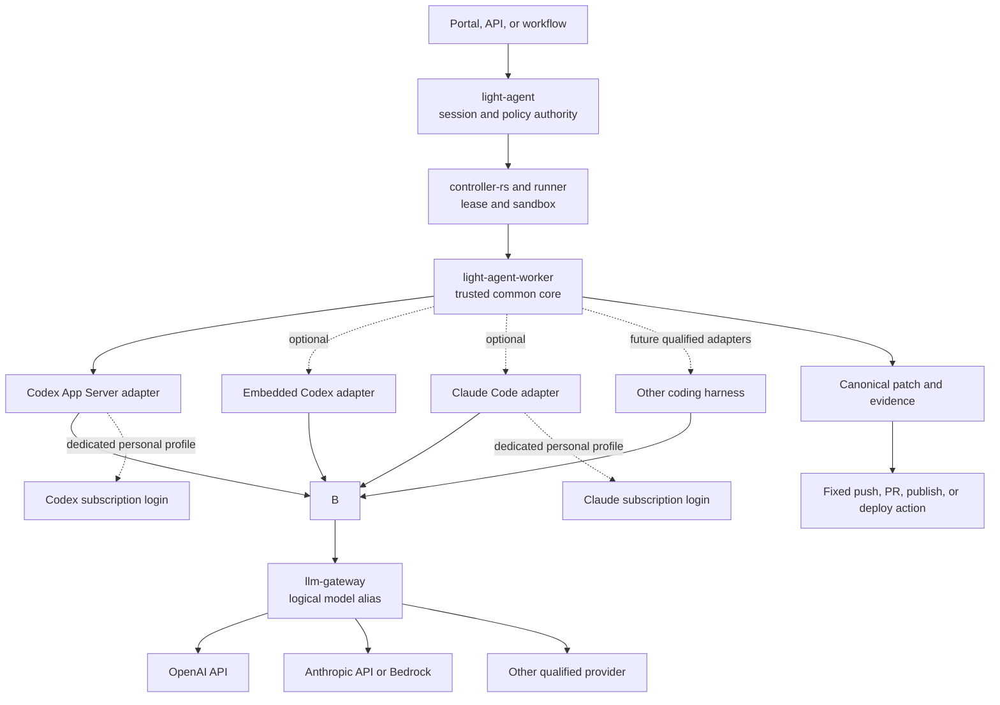
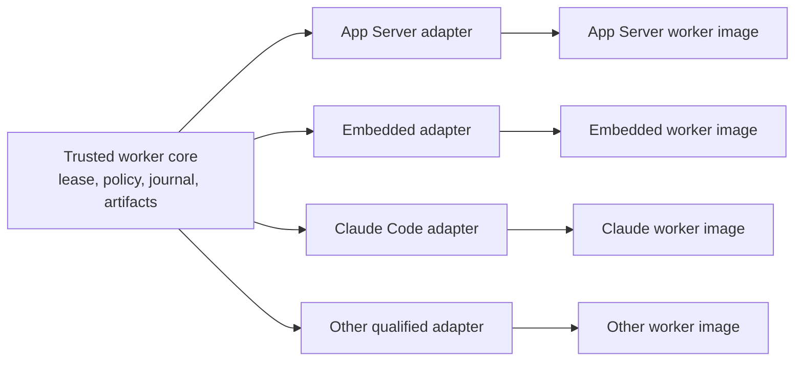
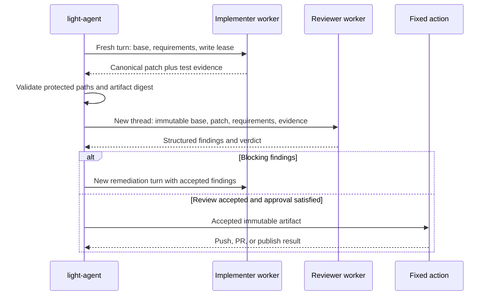

# Coding Harness Integration

Status: proposed target design. The implementation inventory in this document
was verified against the repository on September 4, 2026. Vendor authentication,
subscription, and protocol rules must be rechecked before each qualified release.

This design specializes the coding-agent portion of
[Light-Agent Execution](../../design/light-agent-execution.md). It defines how
`light-agent` can use Codex and, when justified, Claude Code without making an
external coding harness the enterprise policy authority.

The durable requirement, design, implementation-plan, review, multi-repository,
and GitHub issue lifecycle built on these workers is defined in
[Development Workflow Orchestration](development-workflow-orchestration.md).

## Decision

Use `light-agent` as the durable enterprise agent authority and run each
workspace-aware coding loop through `light-agent-worker` in a runner-managed
sandbox.

The first Codex integration candidate is a pinned Codex App Server process over
local standard input/output. It provides a typed process and failure boundary
that is natural for the Rust worker to drive directly; no Python adapter is
required. Because the App Server protocol is currently experimental, this is a
qualification decision rather than a claim of production support.

Maintain one trusted worker core and allow separately built adapter variants:

- `codex-app-server-v1`: starts a pinned Codex App Server and translates its
  JSON-RPC messages into the Light agent runtime protocol;
- `codex-embedded-v1`: optionally links pinned Codex Rust crates directly after
  their library boundary, licensing, upgrade cost, and failure isolation have
  passed qualification;
- `claude-code-v1`: an optional later adapter for workloads that require Claude
  Code behavior or independent harness diversity;
- other versioned native-harness adapters, such as a future Grok-oriented
  coding worker, when their protocol, isolation, authentication, licensing,
  and release compatibility pass the same qualification contract.

Remove Pi from the supported target architecture. Preserve its existing
scheduling, sandbox, immutable-input, and canonical-patch tests only as a
migration baseline until Codex passes the replacement gate; then delete the Pi
runtime, profile, image, template, and Node/npm dependency rather than carrying
Pi as an optional adapter.

Do not call the Rust-linked option the "Codex SDK" in contracts. The public
Codex SDKs are currently documented for TypeScript and Python. Direct Rust
linkage is an embedded integration against pinned crates and may depend on APIs
that are not maintained as a stable external SDK.

Use logical model aliases such as `coding-implementer` and `coding-reviewer`.
The same Codex worker variant may use different gateway-backed models for
implementation and review. A Claude worker is needed only for Claude Code
harness semantics or deliberate harness diversity, not merely to use an
Anthropic model as a reviewer.

Terminology is deliberately distinct: an adapter ID selects a harness
integration, a role execution profile selects workspace/tool authority, an
authentication profile selects `personal-subscription` or `enterprise-api`,
and a logical model alias is resolved independently by the configured model
route. None of these identifiers may be reused as another kind.

## Goals

- Reuse capable coding harnesses without duplicating their model/tool loop.
- Keep session, policy, approval, quota, audit, and artifact authority in Light.
- Support provider and model diversity through `llm-gateway` where the selected
  harness protocol is compatible.
- Isolate repository mutation, shell execution, local MCP, and coding-process
  credentials in a bounded runner sandbox, subject to the explicitly weaker
  credential-isolation claim in [Local Native Isolation Profile](#local-native-isolation-profile).
- Support a fresh, read-only review turn after an implementation turn.
- Permit personal subscription use only in a dedicated user context that the
  vendor permits, while keeping pooled enterprise execution API-backed.

## Non-Goals

- Treating Codex, Claude Code, or another harness as an ordinary model provider.
- Launching a coding CLI from the long-lived `light-agent` service.
- Sending personal subscription credentials through `llm-gateway`.
- Letting a prompt select a binary, adapter, provider, credentials, or approval
  mode.
- Using a reviewer model in the same thread as proof of independent review.
- Replacing durable workflow branching, retries, timers, or approvals with a
  coding harness.

## Authority And Trust Boundaries

| Component | Authority |
| --- | --- |
| `light-agent` | Agent/session policy, turn admission, model alias, budgets, approvals, durable result, and review requirements |
| `light-workflow` | Durable business process, branching, retry, wait, and workflow approval |
| `controller-rs` and runner | Placement, reservation, lease, sandbox lifecycle, resource enforcement, and cleanup |
| `light-agent-worker` core | Lease validation, materialization, adapter launch, event normalization, cancellation, and artifact proposal |
| Runtime adapter | One bounded model/tool loop; it may narrow but never widen the lease |
| `llm-gateway` | Workload authentication, logical-to-physical model routing, provider credentials, rate/cost policy, and protocol mediation |
| Skills | Approved instructions and supporting resources; never execution authority |
| Fixed action | Push, pull-request creation, signing, publishing, and deployment over an accepted immutable artifact |

`light-gateway` and `llm-gateway` are distinct logical roles. `light-gateway`
is the Portal/API ingress and policy-enforcement edge; `llm-gateway` is the
model-routing, provider-credential, and usage-accounting subsystem. A deployment
may package both roles in one process, but their authorities are not
interchangeable.

The effective coding authority is an intersection:

```text
caller grants
  intersect immutable agent and execution profile
  intersect runner lease and sandbox policy
  intersect approved skill and tool manifests
  intersect adapter compatibility record
  intersect current approval, quota, and revocation state
```

An adapter capability announcement can remove a capability. It cannot add one
that is absent from this intersection.

For enterprise calls, workload authentication also carries a verified end-user
identity and a distinct actor identity. The user is the attribution and default
billing subject; the workflow, agent, or worker is the workload actor. The
gateway validates both and never treats a pooled service credential as the
user.

## Architecture



The subscription edges and the gateway edge are mutually exclusive for a
given model call. A subscription credential is consumed only by its native
vendor harness in a dedicated user context. `llm-gateway` accepts workload/API
credentials and never acts as a subscription proxy.

## Worker Packaging

Multiple adapter variants are reasonable, but they should not become separate
independent security implementations.



The common core owns:

- `agent-runtime-protocol` framing, identity, fencing, and sequence validation;
- immutable execution-spec and capability-digest verification;
- approved context and skill materialization;
- writable-root, protected-path, network, resource, and deadline enforcement;
- broker attachment without exposing reusable provider credentials;
- process-tree cancellation and bounded output;
- canonical diff calculation, artifact limits, and cleanup evidence.

Each adapter owns only launch, protocol translation, feature negotiation, and
adapter-specific error normalization. Images pin the adapter implementation and
version. Server-owned compatibility policy binds adapter ID, image digest,
capability digest, and allowed execution profiles. A request or prompt cannot
override that selection.

### Local Native Isolation Profile

The enterprise API profile retains the full runner isolation boundary and does
not expose a user's native credential store. The personal-subscription profile
is deliberately weaker because the vendor harness must discover credentials in
its dedicated local user context.

The local runner still enforces the lease, admitted repository and writable
roots, protected paths, tool and approval policy, network policy, resource and
deadline limits, process-tree termination, bounded artifacts, and scratch
cleanup. It also starts a fresh harness context for independent review. It may,
however, use a same-user host process or container with narrowly mounted native
configuration and credential-store paths instead of the enterprise MicroVM.
Those paths are readable only by the harness process and are never materialized
in the repository or general tool workspace.

This profile protects repository integrity and bounds process lifetime; it does
not claim that untrusted repository code is isolated from credentials owned by
the same operating-system user. Subscription-backed execution is therefore for
a trusted single-user local environment. Repositories requiring hostile-code
isolation must use the enterprise API profile or a separately qualified
host-mediated credential design.

### Legacy `pi-rpc-v1` Retirement Baseline

Pi is more than an enum or mock fixture in the current repository. The
`light-agent` coding-profile path constructs a closed `CodingTurnSpec` and
schedules `coding.pi-rpc-v1` with a MicroVM boundary, deny-all egress, an
immutable Git bundle, and the fixed `/usr/local/bin/light-pi-rpc-adapter`
executable. The Cube backend recognizes that executable, validates the staged
input and command shape, and independently validates the returned canonical
patch.

The dedicated adapter pins `@earendil-works/pi-coding-agent` `0.80.6` by both
reported version and executable digest. It materializes the admitted Git
revision, starts `pi --mode rpc --no-session` with a cleared environment,
requires correlated prompt acceptance and `agent_settled`, bounds JSONL and
stderr, rejects interactive extension authority, maps only `fs.read` and
`fs.write` to Pi's `read`, `write`, and `edit` tools, and exports a validated
patch. Its Cube Dockerfile installs the pinned Pi package.

This is a real but incomplete adapter slice:

- Cube launches `light-pi-rpc-adapter` directly as the command; the real Pi
  process is not hosted by `light-agent-worker` through
  `agent-runtime-protocol`.
- `light-agent-worker` still implements a deterministic coding fixture even
  though its capability document advertises `coding.pi-rpc-v1`.
- The repository creates `/opt/light-pi/config` but does not ship the required
  broker-aware Pi model definition. A deployment must supply and qualify it.
- The admitted Pi tools do not include shell, build, or test execution.
- `--no-session` prevents session reuse, and checkpoint/resume is not wired.
- Interactive approval fails closed instead of round-tripping through Light.
- Client-selected skill packages are deliberately rejected.
- Unit and backend conformance tests exist, but the checked live Cube tests are
  ignored without external test configuration and do not prove a live Pi model
  call.

Retain these fixtures during Codex development because this is the only
concrete external RPC coding harness currently wired from `light-agent` through
Cube to a canonical patch. Treat its security checks and failure cases as the
replacement baseline. Do not spend work moving Pi behind the shared worker
core: after Codex passes the replacement gate, remove the Pi-specific policy,
scheduler path, adapter, image, template, capability advertisement, dependency,
and published profile.

### `codex-app-server-v1`

Run one pinned App Server process inside the leased sandbox and communicate over
local stdio using JSON-RPC 2.0 JSON Lines. Generate protocol schemas from the
same pinned Codex version used in the image and compile or validate the Rust
types in CI.

Prefer local stdio to a shared remote App Server:

- the OS process is a clear lifetime, cancellation, and resource boundary;
- credentials and repository access stay scoped to one sandbox;
- a server crash is isolated from `light-agent` and other tenants;
- version skew can be rejected using the image and schema digests;
- no independently exposed WebSocket control surface is required.

The adapter maps App Server thread, turn, item, approval, usage, and error
notifications into ordered Light runtime events. Light remains authoritative:
an App Server notification is evidence, not a durable Light state transition.

The App Server protocol is documented as experimental. Production enablement
therefore requires an exact-version conformance suite and a fail-closed upgrade
process. Do not advertise compatibility with an untested Codex release.

### `codex-embedded-v1`

An embedded Rust variant can remove the child-process and JSON-RPC translation
overhead. It does not need Python, but it creates a tighter coupling to Codex's
crate graph and runtime assumptions.

Qualify it independently for:

- stable or acceptably pinned Rust APIs and compatible licensing;
- Tokio/runtime, tracing, TLS, filesystem, and dependency compatibility;
- panic containment and cancellation behavior;
- equivalent approvals, tool events, usage, patches, and resumability;
- binary size, build time, security updates, and release cadence;
- absence of ambient credential or configuration discovery.

Do not fall back silently between embedded and App Server modes. They are
distinct adapter IDs with distinct capability and image digests.

### Public SDK Wrappers

The documented TypeScript and Python Codex SDKs are useful for applications in
those languages, but a Rust `light-agent-worker` does not need a Python bridge.
Driving App Server directly preserves the same explicit protocol boundary
without adding another language runtime. A wrapper should be introduced only
if it supplies a tested semantic layer that is expensive to reproduce and its
operational cost is justified.

## Model Routing Through `llm-gateway`

In the enterprise API profile, the trusted worker launcher obtains an
attempt-scoped credential through a command-backed helper before it starts
Codex. This is Light launcher policy, not repository configuration:

```yaml
credential:
  source: command
  command: /usr/local/bin/light-llm-token
  audience: llm-gateway
  exportForChildAs: LIGHT_LLM_ATTEMPT_TOKEN
```

The launcher then configures Codex with a custom Responses provider that
exposes only a logical model alias:

```toml
model = "coding-implementer"
model_provider = "light_gateway"

[model_providers.light_gateway]
name = "Light LLM Gateway"
base_url = "https://llm-gateway.example/v1"
wire_api = "responses"
env_key = "LIGHT_LLM_ATTEMPT_TOKEN"
```

If the pinned Codex version later supports a directly configured credential
helper, use that form and remove the launcher export. The `env_key` form is a
compatibility fallback: it names a short-lived token present only in the Codex
process environment, not a reusable gateway bearer token in the worker's
ambient or tool-subprocess environment. The worker must not place a reusable
gateway token or provider key in the repository, inherited shell environment,
process arguments, logs, or artifacts. Provider configuration is trusted
image/user configuration; repository-local `.codex/config.toml` cannot define
or replace the enterprise provider.

The adapter must remove the attempt token from every shell, tool, MCP, and
repository-command environment created by the harness. Qualification must
prove that this filtering survives both normal tool execution and error logs.

The helper obtains a short-lived, `llm-gateway`-audience delegation token bound
to the verified end user, workload actor, host, workflow, agent session/turn,
logical model route, policy, and budget. It does not copy the original portal
JWT into the harness. `llm-gateway` alone holds provider API keys and returns a
trusted usage receipt so `light-agent` can reconcile its turn budget with the
gateway's per-user token and cost ledger.

`llm-gateway` resolves `coding-implementer` or `coding-reviewer` to an eligible
physical provider/model deployment. This permits a Codex harness to use a
qualified OpenAI, Anthropic, Bedrock, xAI, or other backend without teaching
`light-agent` physical model names or credentials.

Protocol compatibility is a release gate, not an assumption. For every
harness/provider route, test:

- buffered and streaming Responses ordering;
- function/tool call identifiers, arguments, and results;
- reasoning continuation and encrypted/opaque reasoning fields when used;
- usage and cost accounting;
- context limits, truncation, cancellation, timeouts, and rate limits;
- refusal, safety, retryable, terminal, and malformed upstream errors;
- provider fallback only before observable output, unless a documented
  continuation contract pins the deployment.

If an Anthropic-backed deployment cannot faithfully implement the Responses
features required by the pinned Codex harness, that deployment is ineligible
for the alias. Model availability alone is not compatibility.

## Implementation And Independent Review

A separate Claude worker is not required merely to review with a different
model. The first design uses the same qualified Codex App Server worker variant
with two immutable role execution profiles:

| Role execution profile | Logical model alias | Workspace | Purpose |
| --- | --- | --- | --- |
| `coding-implement-v1` | `coding-implementer` | Bounded write access | Diagnose, edit, and run allowed verification |
| `coding-review-v1` | `coding-reviewer` | Read-only repository plus writable ephemeral build scratch | Review the accepted patch and evidence |

The gateway may route the reviewer alias to a different model family, including
an Anthropic model when the Responses compatibility gate passes. The exact
physical name is gateway configuration, not an agent contract.



The reviewer must receive:

- a new Light turn and a new harness thread;
- a clean read-only reconstruction of the immutable base plus candidate patch;
- a writable ephemeral scratch/build directory, with language build outputs
  and caches redirected there and excluded from canonical patch calculation;
- requirements, relevant policies, and actual test evidence;
- no implementer chain-of-thought, hidden scratch state, writable repository
  tree, or repository mutation tools;
- a structured result with severity, file/location, evidence, remediation, and
  verdict.

The semantic reviewer may consume the implementer's immutable test evidence
and may reproduce an allowed build or test when its outputs fit in scratch. It
is not the authoritative independent test executor. The fixed pre-publication
gate in the development workflow re-executes required checks in a clean test/CI
environment before publication.

Using a different model provides model diversity, not harness diversity. Add a
`claude-code-v1` worker when Claude Code-specific repository behavior, tool
semantics, or a genuinely independent harness implementation is a requirement.
For high-risk changes, policy may require both a different model family and a
different worker image.

### Review Assurance Policy

Model diversity, harness diversity, and human approval address different
failure modes:

| Control | What changes | Primary purpose | What it does not prove |
| --- | --- | --- | --- |
| Model diversity | `coding-reviewer` resolves to a different model family in a fresh thread | Reduce correlated reasoning and interpretation errors | Independence from the coding harness, tools, or protocol adapter |
| Harness diversity | Review runs through a separately qualified adapter and worker image | Detect harness-specific prompting, tool, patch, sandbox, or protocol behavior | Authorization to accept business risk or perform an irreversible action |
| Human approval | An authorized person accepts a precisely digested artifact or action | Confirm intent, accountability, residual risk, timing, and business authority | Technical correctness without model review, tests, and fixed gates |

The default policy uses a fresh review turn and may require model diversity
without deploying another harness. Security/authentication changes, destructive
data or schema migrations, signing/release controls, and broad multi-repository
contract changes should require a different model family plus human approval.
Harness diversity is an additional high-assurance control when the risk includes
the primary harness itself or policy demands an independently implemented tool
loop. Irreversible production, publication, signing, credential, or data effects
always remain fixed actions behind human approval, regardless of model or
harness diversity.

This is a policy matrix, not a claim that every environment must deploy every
adapter. If no independent harness is qualified, a policy requiring harness
diversity must pause rather than silently downgrade to model diversity.

## Session Workspace Isolation

Use one runner-owned `WorkspaceSet` per mutable coding session. A workspace set
is a directory/volume namespace and immutable manifest bound to tenant, end
user, agent session, work package, repository base revisions, and lease. It may
contain many repositories, so a cross-repository feature still presents one
coherent workspace to the harness:

```text
/workspaces/<workspace-set-id>/
  manifest.json
  repos/
    light-fabric/
    portal-view/
    light-portal-doc/
  scratch/
  evidence/
```

Repositories are materialized lazily from the approved work-package manifest;
a session does not need to copy dozens of unrelated repositories. Adding a
repository requires a new admitted manifest version. The runner serializes
mutating turns for the workspace set, and no second user or agent session may
attach to it with write authority. A reviewer receives a different read-only
reconstruction and scratch directory, never the implementer's workspace set.

Git worktrees can reduce checkout time and disk use for one repository, but
they are not the isolation boundary. Linked worktrees share repository-level
state including most refs and, by default, configuration; Git also documents
incomplete multiple-worktree support for submodules. A collection of per-repo
worktrees under a session directory can be a local optimization, but only when
the runner owns their creation, uses detached revisions or session-unique
branches, enables worktree-specific configuration where needed, and brokers all
shared-metadata operations.

For pooled or multi-user enterprise execution, prefer a separate clone/Git
metadata directory for every repository in each workspace set, inside the
session sandbox or volume. A read-only content-addressed object cache may be
shared for efficiency; indexes, refs, configuration, hooks, credentials,
working files, build outputs, and scratch must not be shared writable state.
The sandbox remains the security boundary around the complete workspace set.

For a trusted single-user local profile, runner-managed per-repository
worktrees are acceptable as a storage optimization, but separate workspace-set
roots, exclusive leases, and process isolation still apply. This prevents two
sessions from editing the same paths while retaining the weaker same-user
security claim described earlier.

On completion or cancellation, the runner either destroys the workspace set or
checkpoints its manifest, canonical patches, and evidence under retention
policy. Resume creates or revalidates an exclusive lease and every base digest;
it never reconnects a different user to an ambient existing directory.

## Authentication And Subscription Profiles

The authentication profile is a separate immutable input to each role
execution profile.

| Profile | Intended placement | Codex | Claude | Gateway |
| --- | --- | --- | --- | --- |
| `personal-subscription` | Local Portal via `portal-config-loc/all-in-lt` or `light-portal-install` | Native harness discovers its existing local Codex login; Light passes no vendor credential | Native harness discovers its existing local Claude Code login; Light passes no vendor credential | Not used for model calls |
| `enterprise-api` | Pooled or dedicated enterprise runner | Attempt-scoped Light credential to custom Responses provider | Attempt-scoped Light credential to qualified Anthropic facade, if enabled | Required |

The local profile has two equivalent distributions:
`portal-config-loc/all-in-lt` for source-oriented platform development and
`light-portal-install` for packaged local use. They expose the same Portal,
workflow, agent, Worklist, Chat, approval, and optional CLI contracts.

Light components pass work, artifact, correlation, and platform-identity data,
but do not pass an OAuth token, API key, or copied subscription credential to a
native harness. The Codex or Claude Code process loads its own prior login from
its normal local credential store. Light may query authentication status and
ask the user to log in through the native client, but it does not manage that
login. The local Portal JWT and service delegation tokens are a separate
identity plane used for API authorization, human-task assignment, approval,
and audit; they are not model-provider credentials.

Because local subscription calls bypass `llm-gateway`, Light has no normalized,
trusted per-user token or cost ledger for that profile. Local enforcement is
limited to round, turn/model-call, wall-clock, and process/resource limits;
provider-reported usage may be retained as advisory evidence but cannot drive a
cost-exhaustion transition. Enterprise API execution additionally enforces
gateway token and cost reservations from signed usage receipts.

### Codex

Codex App Server supports API-key authentication and ChatGPT browser/device
login. OpenAI also documents Codex access tokens for trusted unattended local
automation in eligible Business and Enterprise workspaces.

Therefore the local Codex process may use the user's eligible subscription
identity directly, subject to the current OpenAI plan and controls. For this
local-native profile, Light does not mint, copy, pass, or store a Codex vendor
credential. The native process owns credential discovery and use.

Once Codex is configured to call `llm-gateway` as a custom provider, that path
uses Light workload credentials and API/cloud billing. A ChatGPT subscription
cannot be forwarded through the gateway to pay for arbitrary upstream model
calls.

### Claude

Anthropic currently permits paid Claude users to authenticate the official
Claude Code client, and documents long-lived Claude Code OAuth tokens for
scripts, CI, and the Agent SDK. Anthropic separately states that Claude
subscriptions and the Claude API are distinct products, and directs developers
building third-party tools for others to the API or supported cloud providers.
It also prohibits misrepresenting a client or routing third-party traffic
against subscription limits.

Consequently:

- a Codex worker cannot reuse Claude subscription OAuth to call an Anthropic
  model;
- an Anthropic reviewer behind `llm-gateway` requires Anthropic API, Bedrock, or
  another supported workload credential;
- a dedicated `claude-code-v1` worker may use a subscription only through the
  official Claude Code/Agent SDK path and under the then-current plan terms;
- in the local-native profile, Claude Code discovers its existing local
  login itself; Light does not pass or store that login;
- personal Claude credentials must never become a shared enterprise provider.

Anthropic's subscription-backed Agent SDK and non-interactive usage has its own
credit and policy rules. Treat those rules as time-varying release inputs, not
as a permanent platform entitlement.

## Skills, Tools, And Workflows

Skills guide the harness; they do not authorize it. At turn admission,
`light-agent` resolves approved skill package versions and the runner
materializes only their verified contents. The worker intersects any tools a
skill mentions with the immutable execution profile, lease allowlist, adapter
manifest, and live availability.

Tool placement remains explicit:

- remote enterprise API/MCP calls execute through `light-gateway`;
- shell, filesystem, browser, and local MCP calls execute inside the leased
  sandbox through their bound dispatcher;
- push, PR creation, signing, publish, and deploy execute as fixed actions over
  an accepted artifact.

Durable multi-step work remains a `light-workflow` responsibility. A coding
harness may request a typed workflow handoff, but it does not own workflow
state, retries, timers, or approval transitions.

## Approval, Cancellation, And Recovery

- Permission-bypass or blanket auto-approval flags are prohibited.
- An adapter approval request is normalized and checked against Light policy.
- Waiting for human approval ends executable authority unless a separately
  bounded checkpoint hold is allowed.
- Cancellation terminates the complete process tree. Enterprise execution also
  revokes the broker grant before cleanup. Local subscription execution has no
  broker grant to revoke, so cancellation invalidates the Light lease and stops
  further calls without claiming to revoke the user's vendor login.
- Runtime events are sequence-checked and journaled; duplicates are idempotent.
- A worker crash, protocol gap, digest mismatch, expired lease, or ambiguous
  side effect produces `unknown` or failure for reconciliation, never assumed
  success.
- Resume requires the same principal, repository base, policy, adapter/image,
  capability digest, model route constraints, and unexpired sandbox session.

## Current Implementation Inventory

The following distinction prevents this target design from being read as a
shipping claim.

### Present In The Repository

- `agent-runtime-protocol` defines versioned worker commands/events, runtime
  identity and fencing, capability digests, broker grants, bounded frames, and
  a coding-patch event.
- `coding-agent-runtime` defines a `CodingTurnSpec`, patch validation, and
  adapter identifiers including `PiRpc`, `CodexJsonl`, and
  `ClaudeStreamJson`.
- `light-agent` has a concrete Pi coding dispatch path that validates the
  published profile and immutable repository input, then schedules
  `coding.pi-rpc-v1` as a fixed Cube command.
- `light-pi-rpc-adapter` launches pinned Pi `0.80.6` in structured RPC mode and
  produces a bounded canonical patch. The Cube backend validates the fixed
  executable, immutable Git bundle, adapter identity, and patch again.
- `light-agent-worker` separately implements the normalized runtime protocol
  with a deterministic mock and coding fixture; it does not host the real Pi
  adapter yet, despite advertising the Pi action.
- `light-agent` has an immutable `codingProfile` projection point.
- `llm-gateway` implements the `/v1/responses` client surface, and its product
  design documents Codex custom-provider configuration and logical aliases.
- `llm-gateway` accepts a principal context and audits a principal digest,
  charged cost, and usage completeness with per-principal admission controls.

### Not Yet Implemented Or Qualified

- A runtime-neutral coding-profile schema and scheduler; the current production
  types and method names are Pi-specific.
- Pi retirement after its replacement fixtures are captured and Codex passes
  the migration gate.
- A Codex App Server JSON-RPC adapter and generated schema pipeline.
- An embedded Codex Rust adapter.
- A production Claude Code worker adapter.
- The implementer/reviewer orchestration and structured review contract.
- Subscription credential placement and rotation for dedicated workers.
- End-to-end Codex-to-`llm-gateway` compatibility across every proposed
  physical provider.
- End-to-end binding of a worker model call to the initiating end user rather
  than only the pooled `light-agent` service token.
- Durable normalized per-user token accounting, budget-window reservation,
  signed usage receipts, and reauthorization for workflows that outlive the
  initiating JWT. Existing gateway audit persistence records cost and usage
  completeness but not normalized token counts.

The existing `CodexJsonl` enum value validates a generic structured CLI launch;
it is not the App Server integration described here. Conversely, Pi is a real
direct Cube adapter, not merely the deterministic worker fixture.

## Delivery Plan

### Phase 0: Freeze The Contract

Give the currently shipped `CodingAdapter` values an explicit migration
disposition:

| Current enum value | Target disposition |
| --- | --- |
| `PiRpc` | Map explicitly to legacy `pi-rpc-v1` only during migration; remove the enum value and every runtime/profile artifact after Codex passes the replacement gate. |
| `CodexJsonl` | Keep only as a deprecated generic CLI compatibility identifier during migration. It must not alias `codex-app-server-v1`; remove it after callers migrate unless it receives its own qualified adapter contract. |
| `ClaudeStreamJson` | Keep only as a deprecated, non-production compatibility identifier. Remove it unless a separately versioned `claude-code-v1` contract and qualification suite are delivered. |

- Capture the existing Pi scheduling, sandbox, digest, RPC, and canonical-patch
  behavior as the initial cross-adapter conformance suite.
- Replace Pi-specific coding-policy and scheduling names with a runtime-neutral
  adapter selection bound to immutable adapter, image, capability, and template
  digests. Admit `pi-rpc-v1` only as a temporary legacy selection.
- Extend the runtime capability document for approvals, streaming, session
  reuse, thread/turn identity, usage, and adapter protocol version.
- Define adapter compatibility and image-digest records in the immutable coding
  profile.
- Define structured implementation artifacts and review findings.
- Add negative fixtures for unknown fields, oversized frames, wrong fencing,
  sequence gaps, expired grants, and permission-bypass options.

Exit gate: protocol and policy fixtures pass without starting a vendor harness,
and the generic contract captures every Pi behavior required for Codex
replacement without making Pi part of the target adapter set.

### Phase 1: Codex App Server Worker

- Build `codex-app-server-v1` on the shared worker core.
- Pin the Codex binary and generate JSON/TypeScript schemas from that exact
  release; use the JSON schema to validate Rust protocol types.
- Implement initialization, authentication status, thread/turn lifecycle,
  streaming items, approvals, cancellation, usage, errors, and shutdown.
- Qualify local stdio only; do not expose a shared App Server socket.
- Run the Pi baseline and Codex cases through the same worker-contract test
  matrix; adapter-specific protocol details may differ, but lease, artifact,
  cancellation, and authority outcomes must match.
- After that matrix and migration gate pass, remove the Pi scheduling path,
  adapter, image, template, capability advertisement, enum value, profile, and
  Node/npm dependency.

Exit gate: one sandboxed Codex turn can inspect, edit, test, emit a bounded
canonical patch, cancel cleanly, and fail closed on version/schema mismatch;
the legacy Pi product/runtime artifacts listed above are removed.

### Phase 2: Enterprise Gateway Routing

- Treat Development Workflow Orchestration Phase 1 as the prerequisite and
  single delivery owner for audience-bound delegation, reservations, normalized
  usage storage, reconciliation, and signed receipts in `llm-gateway`.
- Add trusted custom-provider configuration and an attempt-scoped credential
  helper.
- Qualify Codex against `/v1/responses` for every eligible logical alias.
- Integrate the worker with that gateway contract and verify receipt binding to
  the exact user, actor, workflow, session, turn, route, and attempt.
- Prove provider and gateway credentials are absent from workspace, child shell,
  process arguments, logs, runtime events, and artifacts.

Exit gate: the pinned Codex worker completes buffered, streaming, tool-use,
cancellation, usage, and error scenarios through `llm-gateway` without learning
a physical provider or credential, and every call is charged to the verified
billing subject with its distinct workload actor and correlation IDs.

### Phase 3: Implement And Review

- Add immutable `coding-implement-v1` and `coding-review-v1` role execution
  profiles, routed through the `coding-implementer` and `coding-reviewer`
  logical model aliases.
- Reconstruct review input from the accepted base and patch in a fresh read-only
  repository tree and thread, with only an ephemeral build scratch directory
  writable and excluded from the canonical patch.
- Enforce structured findings and remediation loops.

Exit gate: tests prove the reviewer cannot mutate the candidate workspace and
cannot observe implementer-private thread state, while a blocking finding
prevents the fixed publish action.

### Phase 4: Authentication Profiles

- For the local Portal profile, launch the native harness in its dedicated user
  context under the documented local native isolation profile, check only
  authentication status, and never add a Light-managed vendor-credential store
  or token pass-through.
- Run the same harness and interaction qualification through both
  `portal-config-loc/all-in-lt` and `light-portal-install`.
- For the enterprise profile, add workload token issuance, rotation, and
  revocation through the trusted credential broker.
- Keep subscription routes physically and logically separate from pooled
  `enterprise-api` workers.
- Record authentication class, never secret material, in audit evidence.

Exit gate: cross-user, cross-tenant, gateway-proxy, and expired/revoked
credential tests fail closed.

### Phase 5: Optional Adapters

- Prototype and benchmark `codex-embedded-v1` against App Server behavior.
- Add `claude-code-v1` only for a named harness-diversity or native-client use
  case.
- Permit other native coding harnesses, such as a future Grok-oriented worker,
  only through a new versioned adapter and the full qualification matrix.
- Qualify each adapter independently; never infer parity from model parity.

## Acceptance Criteria

- `light-agent` selects a pinned adapter and logical model alias from immutable
  policy; prompt input cannot change either.
- The existing Pi profile remains runnable only during migration; after Codex
  passes its replacement gate, no Pi runtime, profile, template, capability,
  enum, image, or Node/npm dependency remains in the supported product.
- The long-lived service never starts a coding harness or receives its reusable
  provider/subscription credential.
- App Server runs locally inside one leased sandbox and communicates over
  bounded structured messages.
- The local native sandbox retains lease, root/path, network, resource,
  cancellation, and artifact controls while explicitly making the weaker
  same-user credential-isolation claim documented above.
- A model call uses exactly one authentication path: native vendor subscription
  or Light workload/API credentials through `llm-gateway`.
- In the local Portal profile, Light passes no OAuth token, API key, or
  subscription credential to the native harness; the harness uses its existing
  local login while Portal identity separately protects API and approval
  operations.
- An enterprise model call uses a short-lived delegated token that binds the
  initiating end user and workload actor; the original portal JWT is not stored
  in the worker or harness.
- `llm-gateway` keeps provider API keys, enforces the per-user or cost-center
  budget, and records normalized token usage and charged cost for every
  provider attempt.
- The implementer emits a canonical patch relative to an immutable base; the
  trusted runner enforces protected paths and artifact limits.
- Review runs in a new thread over a clean read-only repository reconstruction,
  uses only excluded ephemeral build scratch, and emits schema-valid findings.
- Model diversity can be enabled without deploying a second harness; harness
  diversity requires a separately qualified adapter/image.
- Cancellation kills the process tree and produces cleanup evidence within the
  lease deadline; enterprise execution also revokes model access, while local
  execution invalidates the lease without claiming to revoke the native login.
- Unsupported protocol features, unqualified provider routes, unknown adapter
  versions, and stale capability digests fail before repository mutation.
- Fixed high-value actions accept only the approved immutable artifact and
  never the live coding workspace.
- Every mutable coding session has an exclusively leased workspace set; no two
  users or sessions share writable repository, Git metadata, build, or scratch
  state.

## Settled Decisions And Residual Risks

- App Server is the primary integration. Light pins its protocol and binary,
  upgrades them with each admitted Codex release, and blocks rollout until the
  versioned conformance suite passes; protocol churn is accepted release work.
- Embedded Codex crate linkage, if delivered, follows the same upstream-release
  cadence. Light will not fork Codex crates; an upstream incompatibility blocks
  that adapter upgrade or causes the embedded adapter to be withdrawn.
- Pi is a migration-only baseline and will be removed after Codex replacement
  qualification, including its Node/npm dependency and published profile.
- `llm-gateway` will preserve Responses semantics where possible. A provider or
  model that cannot faithfully support required reasoning, tool, streaming,
  usage, or cancellation behavior is marked ineligible for coding-worker
  aliases rather than receiving a lossy transformation.
- Subscription terms, entitlements, and quotas remain release inputs. Light may
  change authentication behavior or disable an affected route when terms
  change, and the adapter contract remains open to other qualified coding
  workers.
- Review assurance follows the policy matrix above: model diversity, harness
  diversity, and human approval are independent controls selected by risk.
- Session reuse is allowed only inside one exclusively leased workspace set.
  Cross-user or cross-session writable sharing is prohibited; fresh reviewer
  workspaces remain the default independent-review boundary.

## References

Internal:

- [Light-Agent](../light-agent.md)
- [Light-Agent Execution](../../design/light-agent-execution.md)
- [Development Workflow Orchestration](development-workflow-orchestration.md)
- [Centralized Agent Skills](../../design/centralized-agent-skills.md)
- [LLM Gateway API](../light-gateway/llm-gateway-api.md)

Vendor documentation, verified September 4, 2026:

- [OpenAI Codex App Server](https://developers.openai.com/codex/app-server)
- [OpenAI Codex SDK](https://developers.openai.com/codex/sdk)
- [OpenAI Codex configuration reference](https://developers.openai.com/codex/config-reference)
- [OpenAI Codex authentication](https://developers.openai.com/codex/auth)
- [OpenAI Codex access tokens](https://developers.openai.com/codex/enterprise/access-tokens)
- [OpenAI Codex code review](https://developers.openai.com/codex/code-review)
- [Anthropic Claude Code authentication](https://code.claude.com/docs/en/iam)
- [Anthropic third-party subscription guidance](https://support.claude.com/en/articles/13189465-log-in-to-your-claude-account)
- [Anthropic subscription and API billing separation](https://support.claude.com/en/articles/9876003-i-have-a-paid-claude-subscription-pro-max-team-or-enterprise-plans-why-do-i-have-to-pay-separately-to-use-the-claude-api-and-console)

Workspace isolation reference:

- [Git worktree documentation](https://git-scm.com/docs/git-worktree)
