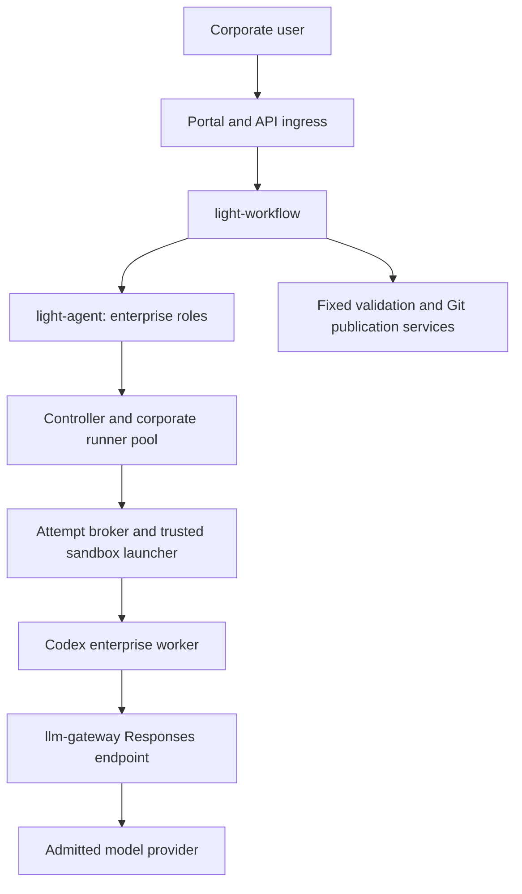

# Enterprise Development Workflow Orchestration

Status: proposed corporate deployment design, separated September 13, 2026.
The coding-harness gateway/broker contracts provide a foundation; this document
does not claim complete enterprise workflow, token-service, accounting, or
deployment qualification.

This document covers `codex-enterprise` workers inside a corporate network,
using `llm-gateway` for model access. Developer-owned Codex/Claude subscriptions
and local VM workflows are covered by
[Personal Development Workflow Orchestration](development-workflow-orchestration.md).

## Decision And Shared Lifecycle

Use `light-workflow` for durable feature stages, review closure, budgets,
scheduling, approvals, and GitHub coordination. Use `light-agent` as the
authorized Agent/session service, and runner-managed `light-agent-worker`
instances for repository work. The trusted launcher configures the Codex harness
with an admitted custom Responses provider pointing to `llm-gateway`.

`codex-enterprise` describes this execution configuration. Actual Agent
definitions, model aliases, runner pools, policies, and credentials must be
published and admitted; the name alone does not prove a deployment is ready.

Reuse the personal document's versioned business contracts:

- existing-issue or requirement-dialogue intake and an immutable requirement;
- design review and optional exact-digest human sign-off;
- optional plan and phase-by-phase implementation/review;
- durable feature ownership and [atomic stage handoffs](development-workflow-orchestration.md#enforced-stage-handoffs), even for separately started workflows;
- [diffable candidate snapshots](development-workflow-orchestration.md#diffable-candidate-snapshots) and retained before/after evidence for resumed reviews;
- workflow-owned finding IDs and reviewer-verified closure;
- initial full final reviews, resumed fix verification, and explicit coverage
  escalation instead of restarting all reviewers on every edit;
- fixed document revision publication, implementation commit/push/PR actions,
  per-repository recovery receipts, and explicit completion targets.

The personal document's filesystem backend and one-feature-per-VM reservation
are deployment choices for its pilot. Enterprise deployment qualifies its own
artifact backend and pool admission/release policy, preserving durable snapshot
export, verified recovery, and confirmed fencing before capacity is reused.

Author, phase reviewer, primary final reviewer, and independent final reviewer
are separate logical roles. They may use separately configured
`codex-enterprise` executions with different admitted model routes; they never
share implementer-private conversations. The enterprise design does not require
`claude-personal` or a personal login. A second model/harness route is eligible
only after the enterprise protocol and isolation gates pass. Independent roles
remain required even if the selected models share a vendor.

The same lifecycle can run as top-level stages connected by accepted artifacts.
A parent/child coordinator is an optional later runtime feature, not a reason
to fork the business state machine. Profile changes preserve common transitions
and artifacts while adding enterprise authorization and budget gates. Switching
profile mid-stage requires new admitted execution/session bindings; it cannot
reuse a personal conversation as an enterprise session.

## Architecture And Authority

| Component | Authority |
| --- | --- |
| Corporate identity/authorization service | Verify human identity, workload delegation, revocable grants, and approver scope |
| `light-workflow` | Common lifecycle, feature-ready queue/fairness, review ledger, aggregate budgets, approvals, and publication intents |
| `light-agent` | Immutable Agent policies, turn admission, durable jobs/results, and role/model selection |
| Controller/runner | Pool admission, capacity, placement, leases, cancellation, and sandbox lifecycle |
| Attempt broker/launcher | Bind a single execution to allowed routes and short-lived credentials |
| `llm-gateway` | Authenticate model requests, resolve logical aliases, protect provider keys, enforce limits, and issue usage evidence |
| Fixed test/publication services | Validate exact candidate contents and execute authorized external effects |
| Artifact/audit stores | Retain immutable work packages, review coverage, usage/publication receipts, and decisions |

`light-gateway` is the Portal/API ingress and policy edge; `llm-gateway` owns
model routing and provider access. They are different authorities even if a
deployment packages them together. Neither a model nor a repository config
selects the acting identity, billing subject, provider credential, or publication
target.

## Corporate Network And Worker Isolation

Run pooled or dedicated workers in admitted per-attempt sandboxes. Corporate
placement alone is not isolation. Pin the worker binary, capability digest,
launcher/profile digest, repository inputs, model route, and allowed tools.
The enterprise pool requires its qualified sandbox-launch contract and model
egress restricted to the configured `llm-gateway`; direct vendor fallback is
not an implicit recovery path.

Use the qualified repository materialization contract. A pooled execution must
not inherit another user's writable checkout, Git administration, build scratch,
credential store, or model transcript. Review reads the exact candidate through
an isolated read-only materialization with explicitly excluded build scratch.
The current personal shared-workspace configuration rejects an enterprise broker
and sandbox launcher, so its local `workspaceConfig` cannot simply be enabled
on an enterprise pool. A managed enterprise workspace path needs its own
admission and qualification.

Keep reusable provider/Git credentials in trusted services. The Codex process
may receive only its admitted short-lived attempt credential through the
qualified broker/launcher path; shell/tool/MCP children must not inherit it.
Do not mount personal Codex/Claude login stores or route subscription credentials
through `llm-gateway`.

Corporate Git hosting, registries, package mirrors, test services, and artifact
storage follow explicitly admitted endpoints. The existing local workspace
GitHub helper recognizes github.com clone sources; support for a corporate
GitHub Enterprise host requires validated host/repository handling and its own
qualification, not an assumption that local `gh` setup already covers it.

## Model Routing Through llm-gateway

The trusted launcher configures Codex's custom Responses provider. The harness
sees logical aliases such as `coding-implementer` and `coding-reviewer`;
`llm-gateway` resolves them to eligible provider deployments. A requested model
or repository-local config cannot replace the provider, endpoint, credential
source, or route policy.

Use the attempt broker contract in
[Coding Harness Integration](coding-harness-integration.md#model-routing-through-llm-gateway).
Bindings cover Host/user, workload actor, workflow/stage, Agent session/turn,
execution attempt, model route, authorization and billing policy. Credentials
have an audience, generation, expiry, and revocation state. The broker validates
and re-reads the current envelope when serving the attempt.

Qualify each admitted route for the pinned Codex/Responses contract: buffered
and streaming output, tool calls/results, completion ordering, cancellation,
errors, and usage. A provider being reachable is not evidence that its model
or protocol transformation can operate the coding harness. Ineligible routes
fail admission; no fallback to personal billing is allowed.

Native session continuity still follows the common new/resume/close contract.
A model, policy, sandbox, or scope change that invalidates a binding requires
explicit replacement from accepted artifacts. An uncertain execution is fenced,
not retried under another provider or identity.

## Identity, Delegation, And Reauthorization

Use the shared [User, Application, And Workflow Authorization](../../design/user-application-workflow-authorization.md)
contract as the issue #374 prerequisite. Preserve the verified initiating human
and the immediate calling workload separately. Forward valid user credentials
where the issuer permits; unattended execution obtains fresh issuer-backed
credentials under a revocable grant, with the caller's app token in
`X-Scope-Token`.

The enterprise authorization envelope additionally binds the following evidence;
execution/accounting fields need not be embedded in the user identity token:

- issuer, audience, token ID, issue/expiry times, and tenant/`hostId`;
- verified human subject and acting workload/principal;
- feature/run, stage, Agent/session/turn, and action/attempt correlation;
- policy, data-boundary, route, and caller-claims digests;
- server-selected `billingSubject` and `budgetPolicyId`.

Store verified identity metadata, grant references, and digests with workflow
state, not reusable bearer tokens. A revocable continuation grant authorizes
fresh credentials when the original user JWT expires. Expiry/revocation enters
`REAUTHORIZATION_REQUIRED` and stops new model/tool spending until authorized.
Possessing a workflow ID or an old session checkpoint is insufficient authority.

Workflow Admin and Chat starts must produce equivalent verified attribution.
A service acting for a user records both actors; it does not replace every user
with the Agent service account. Scheduled continuations retain the originating
grant or an explicitly authorized service budget and actor.

## Usage, Reservations, And Cost Attribution

`llm-gateway` is the target authority for normalized provider usage and cost.
Before dispatch, reserve the allowed request budget under the verified user or
cost center. Reconcile input/output/cached/reasoning tokens when supplied by the
provider, charged cost, route/deployment, request/attempt identity, and receipt
completeness. Do not treat missing usage as zero or accept model-reported usage
as accounting evidence.

The durable ledger and signed receipts bind usage to the same user, actor,
workflow, session, turn, route, and attempt used for admission. Retries and
fallbacks retain distinct provider-attempt records while preventing duplicate
charges for replay of a completed attempt. Incomplete evidence follows a stated
conservative reservation or reconciliation policy.

Agent and workflow budgets may be narrower than gateway limits, but reconcile
against trusted receipts rather than overriding them. A denied enterprise
reservation enters `BUDGET_EXHAUSTED`; a later authorization may resume work.
This is an enterprise-only state. Personal subscription runs retain bounded
turn/round/time limits and do not synthesize a trusted token/cost ledger.

Receipt validation in a worker contract is not a production ledger service.
Token exchange, durable reservation/usage storage, receipt persistence/emission,
and long-running reauthorization must be separately demonstrated in deployment.

## Scheduling, Approvals, And External Effects

`light-workflow` owns fairness among its feature-ready turns, using the same
persisted queue ownership as the personal design. Agent jobs carry admitted
execution/results; Controller and runner enforce actual pool capacity. Add
tenant/user admission limits and deadlines without creating a competing
feature-fairness queue in each downstream service. Gateway request limits
remain a separate model-resource constraint.

Enterprise authorization may require design, security, publication, merge,
signing, or deployment decisions. Bind each decision to the exact action intent,
candidate/review-coverage digest, allowed response, approver scope, expiry, and
idempotency identity. Honor existing applicable grants; normal progress comments
do not create a new approval requirement at every turn.

Worklist owns workflow human-task assignment, claim/release, expiry, and
completion. If Chat renders the same task, it submits to the same authoritative
record. An Agent must not invent a second approval or advance a task from a
natural-language “yes.” Separate direct-agent interactions retain their own
Agent authority and dedicated decision record.

Fixed publication services use scoped enterprise Git credentials and the common
commit/push/PR receipt contract. They validate current review coverage, including
accepted delta transitions, before committing the exact approved files. Candidate
drift, unexpected remote refs, or incomplete multi-repository delivery blocks
completion. Keep document revisions and supersession explicit; the initial
immutable revision-task strategy needs no force push.

## Current Boundary And Qualification Gaps

The coding-harness documentation records implemented gateway/attempt-binding,
role-isolation, cancellation, and broker contracts. Source locations include
`apps/light-workflow-runner/src/broker.rs`, `worker_process.rs`,
`configuration.rs`, and the coding runtime. These are integration foundations,
not proof that every corporate service named here is deployed.

Before enabling an enterprise feature workflow, verify:

- Workflow-to-Agent catalog/job visibility and complete durable turn/result
  propagation in the actual operational database topology;
- publication of enterprise Agent definitions, qualified model routes, runner
  pools, delegated identity bindings, and protected network endpoints;
- real token exchange, revocation, continuation grants, and normalized usage
  ledger/receipt services, not only contract fixtures;
- clean enterprise repository materialization and isolation across users and
  concurrent attempts;
- common stage/finding/review-coverage/comment/publication contracts, including
  uncertain execution and partial external-effect recovery;
- corporate Git host and artifact/test infrastructure compatibility.

The broader shared Portal UI/CLI and distribution work described below is rollout
work. Its presence here does not make it a prerequisite for the personal pilot.

## Enterprise Delivery Plan

### Phase E0: Reuse And Freeze The Business Contracts

Adopt the common standalone-stage inputs/results, finding IDs, review coverage,
budgets, and fixed publication contracts. Publish separate author/reviewer roles
and their admitted enterprise model routes.

Exit gate: identical requirement/phase/finding fixtures produce the same common
lifecycle decisions in personal and enterprise profiles; only documented
authorization/accounting gates differ.

### Phase E1: Identity And Usage Services

Implement/qualify token exchange, continuation grants, enterprise reservations,
normalized usage storage, signed receipt persistence/emission, and reauthorization.
This phase owns those services for the coding-harness enterprise integration.

Exit gate: verified end-user/workload attribution survives start, retry, restart,
and grant renewal. Cross-user/tenant, expired/revoked grant, quota denial,
duplicate attempt, and incomplete-usage cases enforce the intended outcome
without exposing reusable credentials.

### Phase E2: Corporate Runner And Gateway Qualification

Admit the enterprise sandbox, broker, restricted model egress, repository inputs,
and corporate Git/test/artifact endpoints. Qualify each model route against the
pinned coding-harness protocol and actual accounting services.

Exit gate: buffered/streaming/tool/cancellation/error runs produce bound receipts;
parallel attempts cannot see each other's files, credentials, or conversations.
Missing isolation or an unqualified route fails admission.

### Phase E3: Feature Delivery And Operational Recovery

Run the shared design/plan/phase/final lifecycle with enterprise approvals,
fixed commit/push/PR services, and the selected completion target.

Exit gate: real model calls and Git effects complete with correct user/cost
attribution. Worker/service restarts, revoked grants, pool contention, and partial
publication reconcile without duplicated edits/effects or lost usage evidence.

## Shared Portal Rollout Extensions

The removed broad UI/CLI and installer requirements remain follow-up work,
separate from either profile's first functional loop:

- Workflow Admin supplies authoring, start/status, pause/resume, and cancellation.
- Worklist supplies durable human-task ownership and schema-bound decisions.
- Future Chat cards may render structured choices and authoritative task links;
  they do not change decision ownership.
- A future thin CLI uses those same public APIs and decision contracts rather
  than database access or an independent approval mechanism.
- `portal-config-loc/all-in-lt` and `light-portal-install` should eventually
  pass the same personal-profile lifecycle/API conformance suite. Packaging
  differences must not alter review or publication semantics.
- Corporate deployments qualify their own identity, gateway, approval, and
  operational topology in addition to the common lifecycle suite.

These extensions need separate rollout acceptance and do not imply that Chat
cards, a CLI, or both local installers must be built to run `feature-design`.

## References

- [Personal Development Workflow Orchestration](development-workflow-orchestration.md)
- [Coding Harness Integration](coding-harness-integration.md)
- [Light-Agent Execution](../../design/light-agent-execution.md)
- [Workflow Coding Thread Lifecycle](../light-agent-worker/workflow-thread-lifecycle.md)
- [Agent LLM Dual-Token Authorization](llm-dual-token-authorization.md)
- [LLM Gateway API](../light-gateway/llm-gateway-api.md)
