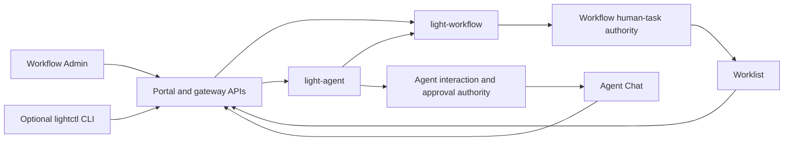
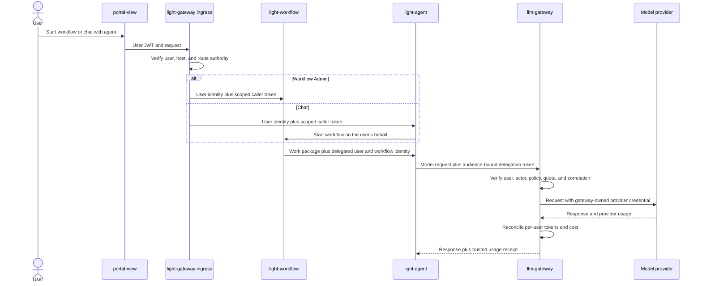
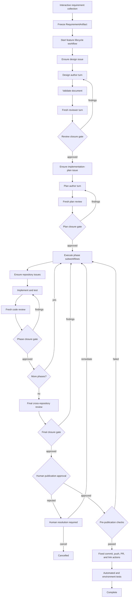

# Development Workflow Orchestration

Status: proposed target design. The implementation inventory in this document
was verified against the repository on September 4, 2026.

This document defines a durable software-development lifecycle that uses
`light-agent` for interactive and specialist reasoning, `light-agent-worker`
for repository-aware coding, and `light-workflow` for process ownership. The
worker, harness, model-routing, and authentication details are defined in
[Coding Harness Integration](coding-harness-integration.md).

## Decision

Use a hybrid architecture:

- `light-agent` owns interactive requirement collection and each bounded
  author, implementer, or reviewer turn;
- `light-workflow` becomes the lifecycle authority after requirements are
  frozen and owns stages, loops, retries, waits, budgets, approvals, GitHub
  coordination, and completion;
- agent workers produce proposed documents, plans, patches, findings, and test
  evidence;
- trusted fixed actions create issues, append comments, accept patches, commit,
  push, create pull requests, publish, sign, or deploy.

Do not implement the complete multi-day lifecycle as one long-running agent
session. The user may start, inspect, pause, resume, or cancel the workflow
through an interactive `light-agent`, but the workflow record remains the
source of truth.

Use logically distinct agent roles. They may share a compatible physical
`light-agent` service or worker pool, but they have separate immutable
definitions, permissions, model aliases, budgets, and fresh execution
contexts. Use separate deployments when credentials, tenant boundaries,
network zones, or subscription identities cannot safely share a pool.

## Goals

- Preserve the current requirement, design, plan, implementation, review, and
  finalization practice as a repeatable enterprise process.
- Record every externally visible author and reviewer response against the
  appropriate GitHub issue without making GitHub the only state store.
- Support independent review and repeated remediation without context leakage.
- Coordinate phase-by-phase changes across multiple repositories.
- Survive service restarts, timeouts, duplicate delivery, provider failures,
  and human pauses without losing or duplicating work.
- Keep common lifecycle and artifact transitions identical across personal-
  subscription and enterprise-API execution profiles, while treating
  enterprise-only token/cost gates as profile-specific policy transitions.
- Enforce explicit completion criteria rather than allowing one model to
  declare the complete feature finished.

## Non-Goals

- Persisting hidden model reasoning or chain-of-thought in GitHub.
- Giving an agent reusable GitHub, provider, signing, or deployment
  credentials.
- Treating issue comments as authoritative workflow state.
- Reusing the implementer's mutable conversation as the reviewer's context.
- Allowing an agent to commit, push, publish, or deploy through arbitrary shell
  commands.
- Assuming every logical agent requires a dedicated service deployment.
- Replacing repository tests, CI, human approval, or release qualification with
  model review.

## Ownership

| Component | Authority |
| --- | --- |
| Interactive `light-agent` | Requirement dialogue, clarification, workflow start/status requests, and human-facing explanations |
| `light-workflow` | Feature state machine, stage/round counters, dependencies, retries, deadlines, budgets, review closure, and human gates |
| Specialist `light-agent` | One bounded requirement, design, planning, implementation, remediation, or review job |
| `light-agent-worker` | Sandboxed repository inspection, edits, verification, and proposed immutable artifacts |
| `llm-gateway` | Enterprise workload authentication, logical model routing, provider credentials, limits, and accounting |
| Artifact store | Immutable requirements, documents, plans, patches, findings, logs, and test evidence |
| GitHub actions | Idempotent issue, comment, link, branch, and pull-request effects |
| Test executor / CI | Clean-room execution of declared test gates and immutable result evidence; no authority to waive or publish |
| Fixed publication action | Commit, push, PR, signing, publishing, and deployment over an approved artifact |

`light-agent` never advances a workflow task. `light-workflow` never launches a
coding harness directly or mutates an agent session. Handoffs use typed jobs
with correlation, policy, artifact, deadline, idempotency, and budget bindings.

## Local Portal Distributions And Interaction Surfaces

Local orchestration is one product profile delivered in two forms:

| Distribution | Intended user | Packaging difference |
| --- | --- | --- |
| `portal-config-loc/all-in-lt` | Platform and service developers | Source-oriented Compose stack with independently launched `portal-view` for UI development |
| `light-portal-install` | Most local users | Packaged installation of the Portal UI and local orchestration services |

They use the same workflow, agent, gateway, identity, Worklist, Chat, approval,
artifact, and audit contracts. A workflow definition or agent interaction must
not behave differently because of the installer. A shared conformance suite
qualifies both distributions against the same API and user-visible scenarios.

Portal is the primary human interface. A terminal CLI is an optional thin
client over the same APIs, not a second orchestration implementation.

| Surface | Responsibility | Human interaction |
| --- | --- | --- |
| Workflow Admin | Define, validate, test, start, inspect, pause, resume, and cancel workflows | Administrative lifecycle operations |
| Worklist | Durable workflow-assigned tasks | Claim, release, approve, reject, choose, comment, or submit schema-bound data |
| Agent Chat | Direct conversation, requirement collection, workflow start, and status | Inline structured choices and agent-owned approvals |
| CLI | Local development, headless operation, scripting, and diagnostics | The same starts, status, Chat, Worklist, and decision APIs |



Workflow human tasks are durable and assignable. The Worklist owns their
assignment, claim, expiry, completion, and audit state. Chat may render an
inline copy or deep link, but it is only a rendering surface: the browser sends
the human decision directly to the Worklist completion API for the same task
and `taskAsstId`. `light-agent` does not advance the task or create a second
approval record.

A direct agent may request `approval`, `confirm`, `choice`, `multiChoice`,
`text`, or schema-bound `object` input in Chat. Conversational text such as
"yes" or "go ahead" is not authorization for a side effect. A security-relevant
decision is a structured `HumanInteractionRequest` bound to an immutable
`interactionId`, source type and ID, session, turn, exact action and input
digests, policy digest, allowed responses, approver scope, expiry, and
idempotency key. Clicking a button invokes a dedicated decision API; approval
creates a fresh action attempt rather than resuming an old attempt.

If a direct-agent interaction becomes long-running, assignable, transferable,
or dependent on multiple human steps, the agent starts a workflow. Chat then
shows workflow status and the authoritative Worklist task.

The optional CLI uses the same `HumanInteractionRequest` and decision APIs. A
future `lightctl` may expose agent Chat, workflow start/status/watch, and
Worklist list/claim/respond commands, including machine-readable output. It
must not read orchestration tables directly or invent separate approval
semantics.

## Enterprise Identity, Delegation, And Cost Attribution

A workflow started from Workflow Admin or Chat is attributable to the verified
human throughout its lifetime. The design uses two related credentials instead
of copying one broad bearer token into every process:

1. the ingress `Authorization` JWT proves the initiating user to the first
   trusted service;
2. each downstream hop uses a short-lived, audience-bound delegation token
   that identifies both the end user and the acting workload.

This preserves the user's intent while preventing a reusable portal JWT from
being stored in workflow state, agent transcripts, worker environments, GitHub
comments, or artifacts. A synchronous endpoint may validate the user JWT and a
service scope token together, but long-running work stores only verified
identity metadata, the authorization-grant reference, claim and policy
digests, and expiry. It mints a fresh delegated token for each later hop.



The delegated token is signed by a trusted token-exchange or credential-broker
service and contains the minimum required claims:

- issuer, audience, token ID, issued-at, expiry, and tenant or `hostId`;
- `endUserSubject` for the initiating human and `principalSubject` for the
  authenticated caller;
- an actor claim identifying `light-workflow`, `light-agent`, or the leased
  worker acting on the user's behalf;
- feature, workflow instance, task, agent definition, session, turn, and action
  attempt identifiers when applicable;
- policy, data-boundary, model-route, and caller-claims digests;
- `billingSubject` and `budgetPolicyId` selected by trusted policy.

The model and prompt cannot select or change the billing subject. For a
user-started run it defaults to the end user, while an enterprise may bind it
to a project or cost center. Scheduled or system continuations identify their
service actor separately and retain the original authorized initiator or an
explicit service budget.

`llm-gateway` is the authority for actual provider usage. It owns provider API
keys, resolves logical aliases, reserves the maximum allowed request cost
before dispatch, enforces per-user concurrency and rolling budget windows, and
reconciles the reservation from provider-reported usage. Its durable usage
ledger records normalized input, output, cached-input, and reasoning tokens
when supplied, charged cost, usage completeness, model alias, physical
deployment, logical request, provider attempt, and the digested billing
subject. Incomplete usage follows a configured conservative charge or blocks
further requests pending reconciliation; it is never silently treated as zero.

`light-agent` and `light-workflow` may enforce narrower turn or feature
budgets, but they reconcile those budgets from the gateway's signed usage
receipt. They do not override the gateway's per-user or tenant limits and do
not trust model- or caller-supplied usage counts.

Long-running workflows can outlive the original user JWT. Continuation then
requires a live, revocable authorization grant from which short-lived tokens
can be minted. If the grant expires or is revoked, the workflow pauses in
`REAUTHORIZATION_REQUIRED`; possession of an old workflow ID is insufficient
to continue spending.

## Logical Agent Roles

| Role | Role execution profile | Logical model alias | Workspace authority | Output |
| --- | --- | --- | --- | --- |
| Requirement analyst | `requirements-dialog-v1` | `requirements-analyst` | None; optional policy-approved read-only discovery job | `RequirementArtifact` |
| Design author | `design-author-v1` | `coding-implementer` | Design-document paths only | Document patch and validation evidence |
| Design reviewer | `design-review-v1` | `coding-reviewer` | Read-only reconstruction plus excluded build scratch | `ReviewResult` |
| Plan author | `plan-author-v1` | `coding-implementer` | Implementation-plan paths only | Plan patch and phase manifest |
| Plan reviewer | `plan-review-v1` | `coding-reviewer` | Read-only reconstruction plus excluded build scratch | `ReviewResult` |
| Phase implementer | `coding-implement-v1` | `coding-implementer` | Approved repository roots | Repository change set and test evidence |
| Phase reviewer | `coding-review-v1` | `coding-reviewer` | Read-only reconstruction plus excluded build scratch | `ReviewResult` |
| Final reviewer | `final-review-v1` | `coding-reviewer` | Read-only multi-repository reconstruction plus excluded build scratch | Cross-repository verdict |
| Publisher | Fixed action, not a model profile | None | Accepted artifacts only | Commits, pushes, PRs, and issue links |

The gateway resolves logical aliases to physical models. A different reviewer
model provides model diversity without requiring a different harness. A
separately qualified `claude-code-v1` worker provides harness diversity and is
a policy escalation for named high-risk change classes, not a prerequisite for
ordinary review.

The requirement analyst is a plain `light-agent` model turn and never starts a
coding CLI or receives a repository workspace. In enterprise execution its
alias resolves through `llm-gateway`. Repository identification or evidence
collection, when needed, is a separate policy-approved read-only discovery job
whose result becomes an intake artifact.

## End-To-End Lifecycle



## Feature State Machine

`light-workflow` persists one current feature state plus the active stage,
round, artifact digests, and finding ledger after requirements are frozen.
Mutable requirement dialogue remains `light-agent` session state. Stage
completion events are idempotent and may advance only from the expected state
and version.

| State | Meaning | Normal transition |
| --- | --- | --- |
| `REQUIREMENTS_FROZEN` | Initial workflow state; an immutable requirement version is accepted | Start -> `DESIGN_ACTIVE` |
| `DESIGN_ACTIVE` | Design authoring or remediation is running | Validated artifact -> `DESIGN_REVIEW` |
| `DESIGN_REVIEW` | Fresh review and closure evaluation | Findings -> `DESIGN_ACTIVE`; accepted -> `PLAN_ACTIVE` |
| `PLAN_ACTIVE` | Implementation-plan authoring or remediation is running | Validated plan -> `PLAN_REVIEW` |
| `PLAN_REVIEW` | Fresh plan review and closure evaluation | Findings -> `PLAN_ACTIVE`; accepted -> `PHASE_ACTIVE` |
| `PHASE_ACTIVE` | A declared implementation phase is executing | Evidence complete -> `PHASE_REVIEW` |
| `PHASE_REVIEW` | Fresh phase review and closure evaluation | Findings -> `PHASE_ACTIVE`; accepted -> next phase or `FINAL_REVIEW` |
| `FINAL_REVIEW` | Complete multi-repository manifest is reviewed | Findings -> responsible `PHASE_ACTIVE`; accepted -> `PUBLICATION_PENDING` |
| `PUBLICATION_PENDING` | Required human approval and fixed pre-publication gates run | Approval rejected -> `HUMAN_RESOLUTION_REQUIRED`; check failed -> responsible `PHASE_ACTIVE`; published -> `POST_PUBLICATION_VALIDATION` |
| `POST_PUBLICATION_VALIDATION` | Required post-publication CI/test gates run | Passed -> `COMPLETED`; failed -> `POST_PUBLICATION_FAILED` |
| `REPLAN_REQUIRED` | A newer requirement or impact invalidated accepted downstream artifacts | Authorized impact decision -> the earliest affected active state |
| `HUMAN_RESOLUTION_REQUIRED` | Round, disagreement, waiver, or ambiguity policy needs a person | Decision -> prior active/review state or `CANCELLED` |
| `REAUTHORIZATION_REQUIRED` | The durable authorization grant cannot fund or authorize more work | Renewed grant -> prior state; rejection -> `CANCELLED` |
| `BUDGET_EXHAUSTED` | An enterprise token/cost reservation was denied | New budget authorization -> prior state; rejection -> `CANCELLED` |
| `POST_PUBLICATION_FAILED` | Published output failed a required downstream gate | Remediation -> affected phase; accepted residual risk -> `COMPLETED` |
| `COMPLETED` | Terminal success | None |
| `CANCELLED` | Terminal user or policy cancellation | None |
| `FAILED` | Terminal unrecoverable or retry-exhausted failure | None |

A requirement change after freeze creates a new `RequirementArtifact`, enters
`REPLAN_REQUIRED`, records an impact decision, and invalidates every accepted
artifact derived from the superseded digest. The decision resumes at the
earliest affected state; it is never folded silently into the current round.
`BUDGET_EXHAUSTED` is available only when the enterprise gateway supplies a
trusted reservation decision. Local subscription runs use the common bounded-
execution limits and cannot enter that state from untrusted usage estimates.

A failed required pre-publication gate blocks publication and returns the
feature to the responsible `PHASE_ACTIVE` state with immutable failure
evidence. Rejecting publication approval enters `HUMAN_RESOLUTION_REQUIRED`,
where the authorized decision either routes remediation or cancels the run. A
required post-publication failure enters `POST_PUBLICATION_FAILED`, opens or
updates remediation, and blocks dependent feature/release workflows until
remediation passes or an authorized residual-risk decision is recorded. It
does not erase already published history.

### 1. Interactive Requirement Collection

The user works with the requirement analyst until scope is sufficiently clear.
This remains conversational because questions and priorities are still
changing.

Before starting the durable lifecycle, the agent proposes a
`RequirementArtifact` containing:

- feature ID, title, business objective, and stakeholders;
- functional and non-functional requirements;
- acceptance criteria and explicit non-goals;
- affected products and likely repositories when supported by user-supplied or
  read-only discovery evidence, otherwise explicitly `unknown`;
- security, data-boundary, compatibility, migration, and operational concerns;
- unresolved questions and human decisions;
- source references and evidence supplied by the user or a separately
  authorized read-only discovery job;
- artifact version and content digest.

The user confirms the artifact or a policy-defined intake gate accepts it. That
immutable version becomes the root input to the workflow. Later requirement
changes create a new version and an explicit impact/replan transition.

### 2. Design Cycle

The workflow selects a design repository from a policy-configured set (for
example, `light-portal-doc` or `light-fabric`) and ensures one design issue
using an idempotency key derived from feature ID, repository, and design
version.

The author receives the frozen requirements, issue reference, repository base,
allowed documentation paths, documentation conventions, and validation gates.
It returns a proposed patch and evidence such as `mdbook build`.

The reviewer receives a new turn and clean read-only reconstruction containing
only the immutable requirements, base, current document/patch, applicable
standards, earlier finding ledger, and validation evidence. The workflow posts
the bounded author response and reviewer response to the design issue.

Blocking findings produce another author turn followed by another fresh review.
The design closes only through the review closure contract below.

### 3. Implementation-Plan Cycle

After design approval, the workflow ensures a separate issue in the
`implementation` repository. The plan author converts the approved design into:

- ordered phases and dependency edges;
- owning and affected repositories for each phase;
- exact contracts, schemas, configuration, and migration work;
- security and compatibility requirements;
- phase-specific tests and numeric exit gates;
- rollback, rollout, and qualification steps;
- unresolved decisions that block implementation.

The plan uses the same author/reviewer/remediation loop. A plan cannot close
while it has an unowned repository, an untestable exit criterion, or a blocking
review finding.

### 4. Phase Implementation

Each approved phase runs as a child workflow. Before editing, it freezes a
`PhaseWorkPackage` and ensures an issue in every repository the phase may
change. One repository is selected as the phase's main repository; its issue
indexes the phase responses and links all child issues.

Each mutable agent session receives one exclusively leased multi-repository
`WorkspaceSet` as defined by Coding Harness Integration. No second user or
session shares its writable checkouts, Git metadata, build outputs, or scratch.
Repositories are materialized lazily from the approved work-package manifest;
the session cannot discover and add ambient sibling repositories on its own.

For each repository, the implementer receives:

- repository identity and immutable base revision;
- issue and parent-issue references;
- approved design and plan artifact digests;
- phase scope, allowed paths, protected paths, and dependency constraints;
- active findings and applicable acceptance gates;
- workspace, tool, network, credential, time, token, and cost policy.

The worker emits a canonical patch, changed-path list, commands run, test
results, and bounded logs or artifact references. The reviewer receives a new
read-only repository reconstruction plus a writable ephemeral build scratch
excluded from the canonical patch, and cannot use the implementer's mutable
workspace or private model context. The reviewer primarily evaluates immutable
implementer evidence and may reproduce allowed checks in scratch; the
independent test/CI authority re-executes required pre-publication gates in a
clean environment.

The phase closes only when all repository work packages pass review and tests,
cross-repository contracts are consistent, and any required human gate is
satisfied.

### 5. Final Review

After all phases close, the workflow creates a complete immutable manifest of
repositories, base revisions, accepted patches or commits, issue references,
finding ledgers, and test evidence. The final reviewer assesses the complete
feature rather than reviewing only the last phase.

A final finding is routed to the smallest responsible phase/repository child
workflow. After remediation, the final review restarts in a new reviewer turn
over a newly digested manifest.

### 6. Publication And Testing

After final model review and any required human approval, trusted fixed actions:

1. apply the accepted patch to a clean verified base;
2. rerun required pre-publication checks;
3. create commits with issue references;
4. push or create pull requests using scoped credentials;
5. link repository issues and PRs to the implementation issue;
6. link the implementation issue to the design issue;
7. record immutable result identifiers and URLs.

Broader automated, integration, environment, performance, and release tests may
continue as workflow stages. A failed post-publication gate opens or updates a
tracked remediation item; it does not rewrite earlier evidence.

## Review Closure Contract

Models report evidence; the workflow evaluates completion.

Each reviewer returns schema-bound output:

```json
{
  "reviewId": "019...",
  "artifactDigest": "sha256:...",
  "verdict": "changes-required",
  "findings": [
    {
      "findingId": "DESIGN-003",
      "severity": "high",
      "repository": "networknt/light-fabric",
      "location": "docs/src/product/light-agent/example.md",
      "summary": "Cancellation ownership is undefined",
      "evidence": "The failure transition has no durable owner.",
      "requiredResolution": "Define owner, deadline, and terminal state."
    }
  ],
  "validationGaps": []
}
```

An author or implementer returns a structured remediation result mapping every
accepted finding ID to changed artifacts and verification evidence. It may
dispute a finding with evidence, but cannot mark it waived.

The workflow closes a review stage only when:

1. the current reviewer verdict is `approved`;
2. no blocking finding remains open;
3. every earlier finding is resolved or explicitly waived by an authorized
   human with a reason;
4. all required validation gates pass against the reviewed artifact digest;
5. repository bases and policy digests have not changed incompatibly;
6. round, deadline, and turn limits have not been exceeded, plus token/cost
   limits when the authentication profile supplies trusted gateway accounting;
7. any risk-based human approval is recorded.

Configure a maximum review-round count. Exhaustion moves the stage to
`HUMAN_RESOLUTION_REQUIRED`; it never converts automatically to approval.

## Context Transfer

Pass typed work packages, not an ever-growing transcript.

Every agent job receives the minimum required subset of:

- `RequirementArtifact` reference and digest;
- design or plan artifact reference and digest;
- repository name, base revision, and candidate patch digest;
- issue hierarchy and current stage/round identifiers;
- active and historical finding ledger;
- test and validation evidence;
- initiating user, principal, actor, billing-subject, and authorization-grant
  references, with claim digests rather than reusable bearer tokens;
- immutable policy, tool, model-route, and budget bindings.

The implementer may receive accepted reviewer findings. The reviewer must not
receive hidden reasoning, scratchpad state, ambient credentials, or the
implementer's mutable harness thread. Conversation history is not an artifact
contract.

## GitHub Issue And Comment Contract

GitHub is the collaborative history and navigation surface. The workflow and
artifact store remain authoritative because comments can be edited, deleted,
reordered, rate-limited, or temporarily unavailable.

Use typed, idempotent actions such as:

- `github.issue.ensure-v1`;
- `github.comment.append-v1`;
- `github.issue.link-v1`;
- `github.pull-request.create-v1`;
- `git.commit.accepted-artifact-v1`;
- `git.push-approved-ref-v1`.

The model may propose inputs, but a trusted action validates repository,
organization, issue, ref, artifact digest, caller authority, and approval. The
action receives a short-lived credential scoped to the exact effect.

Every issue comment part is bound to an idempotency key such as:

```text
feature-id : stage-id : round : role : response-digest : part-index
```

The rendered comment includes a machine marker so retry can find the existing
comment instead of duplicating it:

```html
<!-- light-run:feature-123:design-review:2:design-reviewer:sha256-abc123:0 -->
```

The response digest is calculated from the immutable stored response artifact.
An append retry replays that artifact and therefore uses the same key. Asking a
model to generate another response creates a new round and artifact rather than
retrying the append. `part-index` is zero for an unsplit comment and a stable,
zero-based index for deterministic splits. The `role` segment is the logical
workflow role, such as `design-reviewer`, not an execution-profile or model-
alias identifier.

A response comment should identify:

- feature, workflow, stage, round, agent role, and logical model alias;
- issue, repository, base revision, and reviewed artifact digest;
- the agent's final bounded response;
- finding IDs introduced, resolved, disputed, or human-waived;
- validation commands, results, and artifact links;
- the next workflow transition.

"All model responses" means final externally visible responses and structured
results. Hidden chain-of-thought is neither requested nor stored. Before
publication, content passes secret scanning, redaction, data-boundary, size,
and repository-visibility policy. Oversized responses are stored as immutable
artifacts with a bounded GitHub summary and link, or split deterministically
when policy explicitly permits full issue publication.

## Issue Hierarchy

```text
featureId
  designIssue
    design author/review comments
  implementationIssue
    plan author/review comments
    phase 0 main issue
      repository child issues
    phase 1 main issue
      repository child issues
    ...
    final review comments
    publication and test results
```

Each relation is stored internally and mirrored by reciprocal GitHub links.
The workflow must validate that a configured main issue belongs either to one
of the phase repositories or to the policy-approved implementation tracking
repository declared in the manifest; a prompt cannot redirect publication to
another repository.

## Multi-Repository Work Package

```yaml
schemaVersion: 1
featureId: feature-123
phaseId: phase-3
trackingRepository: networknt/implementation
mainIssue: networknt/implementation#123
designArtifactDigest: sha256:...
planArtifactDigest: sha256:...
repositories:
  - repository: networknt/light-fabric
    issue: networknt/light-fabric#456
    baseRevision: 0123456789abcdef0123456789abcdef01234567
    patchDigest: sha256:...
    validationEvidenceDigest: sha256:...
  - repository: lightapi/portal-view
    issue: lightapi/portal-view#789
    baseRevision: 89abcdef0123456789abcdef0123456789abcdef
    patchDigest: sha256:...
    validationEvidenceDigest: sha256:...
```

Repository status and diffs are inspected independently. A clean result in one
repository cannot close another repository's work package, and an environment-
skipped integration test is recorded as unqualified rather than passed.

## Authentication Profiles

The workflow definition and artifact contracts are identical across execution
environments. Authentication and placement are immutable profile inputs.

| Concern | Local Portal with native subscription | Enterprise API |
| --- | --- | --- |
| Distribution | `portal-config-loc/all-in-lt` or `light-portal-install` | Managed enterprise deployment |
| Worker placement | User's local machine | Pooled or dedicated enterprise workers |
| Portal identity | Local Portal user JWT, or an explicit loopback-only local principal normalized to the same identity contract | Enterprise user JWT and delegated workload identity |
| Codex | Native harness uses its existing local login; Light passes no vendor credential | Attempt-scoped Light credential to a custom Responses provider |
| Claude | Native harness uses its existing local login; Light passes no vendor credential | Anthropic API, Bedrock, or another qualified route |
| Model routing | Direct native vendor harness | Logical aliases through `llm-gateway` |
| Credential owner | Native harness and its local credential store | Enterprise secret/workload identity system |
| Gateway | Not a subscription proxy | Required for governed provider routing |
| User attribution | Verified local Portal principal for API, Worklist, and approval activity | End-user plus workload actor in delegated token |
| Usage authority | Native vendor account; no normalized trusted Light token/cost ledger | `llm-gateway` per-user token and cost ledger |
| Enforced Light budgets | Round, turn/model-call, wall-clock, process, and resource limits | Local limits plus gateway token and cost reservations |

The local profile separates two credential classes. Codex or Claude Code
resolves its own existing subscription login from its native local credential
store; Light does not read, persist, broker, refresh, or inject that vendor
credential. Portal identity is different: Workflow Admin, Chat, Worklist, and
approval calls still identify the human actor so assignment, authorization,
and audit semantics match the enterprise product.

Browser access normally uses the local Portal login and JWT. A strictly
loopback or Unix-socket CLI may use an explicitly configured operating-system
user mapping, but the gateway normalizes it into the same verified principal
contract and never permits an anonymous approval. Shared or remotely reachable
CLI access uses normal Portal authentication and delegation. Personal vendor
credentials never become shared enterprise provider credentials.

The profiles share business artifacts and all lifecycle transitions that do not
depend on gateway accounting. A local run may retain native-harness usage as
advisory evidence, but Light does not use it to enforce cost or normalized-token
budgets and does not enter `BUDGET_EXHAUSTED` from that signal. Enterprise runs
may enter that state from a signed gateway reservation or receipt. Cross-profile
conformance therefore excludes token/cost-exhaustion transitions while testing
the same round, turn, wall-clock, cancellation, review, and publication rules.

## Failure, Retry, And Recovery

- Every external action has a stable idempotency key and persisted request and
  result digest.
- Provider, agent, GitHub, and test retries are bounded and classified by
  recoverability; visible output is never silently replaced by another model.
- A missing GitHub comment does not lose the agent response. The workflow
  retries publication from the immutable response artifact.
- An existing GitHub comment with the same marker is treated as the completed
  result of a replayed append action.
- Repository-base movement pauses the affected work package for rebase and
  re-review; it does not apply a stale patch.
- Cancellation terminates worker process trees, revokes active tool and
  enterprise model grants, and preserves already committed evidence. A local
  subscription run has no model broker grant to revoke; invalidating its Light
  lease and killing the native harness prevent further calls without revoking
  the user's vendor login.
- A model timeout or malformed response fails the current attempt, not the
  whole feature, unless retry policy is exhausted.
- Workflow restart performs indexed catch-up over pending agent jobs, external
  actions, approvals, tests, and issue-publication results.
- An expired or revoked user authorization grant pauses new model and tool
  spending for reauthorization; a cached JWT is never used to bypass expiry.
- In the enterprise profile, gateway reservations and provider attempts are
  idempotently reconciled so a retry is auditable and neither loses usage nor
  double-charges one attempt.
- Cyclic agent/workflow delegation and unbounded review loops are rejected.

## Current Implementation Inventory

### Present In The Repository

- `light-workflow` supports durable workflow tasks including `ask`, `assert`,
  `switch`, loops, waits, HTTP/MCP calls, and native schema-bound agent calls.
- `AgentCallMode::Service` is represented in `workflow-core`.
- Service-mode execution creates a durable `agent_job_t` row with workflow and
  task correlation, idempotency, input/output schema, policy and data-boundary
  digests, deadline, token/cost budgets, delegation depth, and isolated memory.
- `light-agent` reconciles matching pending jobs into bankless agent sessions
  and turns, handles cancellation and expiry, and mirrors terminal turn state
  back to the job.
- The coding runtime, pinned Codex App Server worker, immutable implement/review
  role profiles, worker protocol, Cube backend, structured review and
  remediation validation, fixed publication closure gate, and `llm-gateway`
  Responses surface provide the coding-loop foundation.
- Workflow invocation already verifies a user bearer and a gateway scope token,
  checks caller and end-user identity headers against the verified JWT, and
  preserves invocation identity for downstream work.
- Agent delegation claims already carry caller, end-user, actor, workflow,
  session, turn, action, policy, and budget bindings with short expiry.
- `llm-gateway` already admits a principal context, applies per-principal
  concurrency control, and audits a principal digest, charged cost, and usage
  completeness.
- `portal-view` already provides a workflow Worklist and Human Task surface
  with inbox summaries, user/role assignments, claim/release, completion,
  comments, and approval, confirmation, choice, multi-choice, text, and object
  response modes.
- The canonical `portal-config-loc/all-in-lt` stack contains the local workflow,
  gateway, controller, configuration, and agent services; its development UI
  is currently launched from the `portal-view` source checkout.

### Not Yet Implemented Or End-To-End Qualified

- Complete unattended service-agent job execution from workflow input through
  a coding worker to schema-validated workflow output. Persistence and
  reconciliation exist, but this full path is not yet demonstrated by the
  checked implementation.
- A production Claude Code worker adapter.
- The feature-level work-package, durable finding-ledger,
  repository-manifest, and response-publication contracts defined here. The
  repository-level `CodingReviewResult` and immutable remediation handoff are
  implemented by the coding harness.
- First-class fixed GitHub issue, comment, link, branch, and pull-request
  actions. The repository contains GitHub webhook and authentication support,
  but not this outbound SDLC action set.
- Durable author/reviewer remediation loops and final cross-repository review.
- A complete local-native-subscription and enterprise-API qualification matrix.
- End-to-end propagation of the verified end user into every agent model call;
  the checked agent gateway client currently authenticates with its service
  token, while the gateway derives its principal from the authenticated token.
- A durable normalized per-user token ledger, cost-window reservations,
  billing-subject policy, trusted usage receipts, and long-running delegated
  authorization refresh or reauthorization flow. Current LLM audit events are
  cost-oriented and do not persist normalized token counts.
- A shared structured human-interaction protocol for workflow and direct-agent
  sources. Current Agent Chat transports text, session, execution-accepted, and
  error messages but does not render or submit typed interaction requests.
- Direct-agent decision APIs and Chat cards bound to the existing durable agent
  approval state, plus an optional thin CLI over the same contracts.
- Cross-distribution conformance proving that `portal-config-loc/all-in-lt` and
  `light-portal-install` expose identical local orchestration behavior.

The existing
[Native Agent Call](../light-workflow/native-agent-call.md) page still describes
service-agent invocation as future work even though service-mode model and
persistence pieces now exist. That page must be reconciled with implementation
as part of delivery; neither the prose nor the partial persistence path alone
is evidence of end-to-end readiness.

## Delivery Plan

### Phase 0: Contracts And Ledger

- Define `FeatureRun`, `RequirementArtifact`, `StageRun`, `AgentWorkPackage`,
  `ReviewResult`, `ReviewFinding`, `RemediationResult`, `RepositoryChangeSet`,
  `ValidationEvidence`, and `PublicationResult` schemas.
- Define stable stage, round, finding, artifact, repository, and external-action
  identities.
- Define the complete feature-state and transition contract above, including
  terminal, replan, reauthorization, budget, human-resolution, and post-
  publication failure behavior.
- Define `HumanInteractionRequest` and `HumanInteractionDecision` with workflow
  task and agent turn source bindings, typed response modes, exact digests,
  approver scope, expiry, and idempotency.
- Implement review closure, maximum-round, budget, waiver, and stale-artifact
  rules with deterministic fixtures.

Exit gate: replaying the same author/reviewer results produces the same ledger
and exactly one transition.

### Phase 1: Enterprise Identity And Usage Accounting

- Define the initiating-user, workload-actor, authorization-grant,
  billing-subject, quota-policy, and correlation claims shared by portal,
  workflow, agent, worker, and LLM gateway.
- Add audience-bound token exchange for synchronous and resumed work without
  persisting the original user JWT.
- Add per-user token and cost reservation, provider-attempt reconciliation,
  normalized usage storage, and signed usage receipts in `llm-gateway`.
- Bind each agent model request to its verified end user, actor, workflow,
  session, turn, and budget rather than attributing pooled traffic only to the
  agent service identity.

Exit gate: Workflow Admin and Chat starts produce the same end-user attribution;
cross-user, cross-tenant, expired-grant, replay, quota, and incomplete-usage
tests fail closed, while provider API keys remain confined to `llm-gateway`.

### Phase 2: GitHub Fixed Actions

- Implement ensure-issue, append-comment, link-issue, create-PR, and approved-ref
  actions with short-lived scoped credentials.
- Add idempotency-marker lookup, redaction, size limits, rate-limit retry,
  reconciliation, and immutable audit evidence.

Exit gate: lost responses and retries cannot duplicate an issue or comment, and
credentials/secrets are absent from inputs, logs, comments, and artifacts.

### Phase 3: Service-Agent Completion

- Complete and qualify `call: agent` service-mode execution, cancellation,
  timeout, output-schema validation, and workflow reconciliation.
- Route coding roles through runner-managed `light-agent-worker` adapters.
- Extend Agent Chat and its server protocol with structured interaction cards
  and dedicated decision APIs; never infer side-effect approval from free text.
- Allow Chat to render a workflow task only as a view of the authoritative
  Worklist record and completion API.
- Update `native-agent-call.md` to distinguish verified native and service
  behavior.

Exit gate: a restarted workflow and restarted agent complete exactly one
schema-valid specialist job without duplicated model or GitHub effects.

### Phase 4: Design And Plan Workflows

- Implement requirement freeze, design issue, design review, remediation,
  implementation issue, plan review, replan, and human-resolution states.
- Route ordinary reviews through the gateway-resolved `coding-reviewer` alias;
  require a separately qualified harness only for policy-named high-risk work.
- Add documentation and implementation-plan validation profiles.

Exit gate: a seeded blocking finding prevents closure, its remediation is
traceable to a new artifact digest, and a fresh approving review advances the
workflow.

### Phase 5: Repository Phase Workflows

- Add repository issue fan-out, clean-base materialization, implementation,
  tests, independent review, remediation, and phase aggregation.
- Add exclusively leased multi-repository workspace sets with lazy repository
  materialization and separate reviewer reconstruction.
- Detect base movement and cross-repository contract inconsistency.

Exit gate: no phase closes until every declared repository work package and
cross-repository gate is accepted.

### Phase 6: Final Review And Publication

- Add immutable final manifests, cross-repository review, human publication
  approval, fixed commit/push/PR actions, reciprocal issue links, and automated
  post-publication tests.
- Integrate a distinct test/CI executor and enforce the pre-publication block
  and `POST_PUBLICATION_FAILED` transition defined by the state machine.

Exit gate: only the approved manifest is published, every resulting commit/PR
is linked, and replay performs no duplicate external effect.

### Phase 7: Authentication Profiles

- Qualify both `portal-config-loc/all-in-lt` and `light-portal-install` as the
  same local Portal profile, including Workflow Admin, Worklist, Agent Chat,
  platform identity, and native Codex/Claude login discovery.
- Qualify enterprise gateway-backed workers with delegated user/workload
  identity against the same workflow fixtures.
- Prove that switching authentication profile changes no common lifecycle
  transition or artifact schema. Test gateway token/cost-exhaustion transitions
  only in the enterprise matrix and prove local runs cannot synthesize them.

Exit gate: cross-user, cross-tenant, expired/revoked credential, subscription-
proxy, and enterprise-secret-exposure tests fail closed.

## Acceptance Criteria

- A user can collect requirements interactively, approve a frozen artifact,
  and start or resume the durable lifecycle through `light-agent`.
- `portal-config-loc/all-in-lt` and `light-portal-install` pass the same local
  orchestration conformance suite and expose the same APIs and user behavior.
- A local native harness uses its own existing Codex or Claude login without
  Light passing vendor credentials; Portal and service identity remain
  available for API authorization, assignment, approval, and audit.
- Workflow human tasks appear in the assigned Worklist and support claim,
  release, typed response, comment, expiry, and exactly-once completion.
- Direct-agent Chat renders structured choices and approvals, but free text
  cannot authorize a side effect. Any workflow task rendered in Chat completes
  the same authoritative Worklist record.
- An optional CLI, when delivered, consumes the same APIs and interaction
  contracts and cannot bypass identity, assignment, digest, or approval rules.
- Starts from Workflow Admin and Chat preserve one verified initiating-user
  identity across workflow, agent, worker, LLM usage, artifacts, and audit
  records while recording each acting workload separately.
- The original portal JWT, provider API keys, and reusable gateway credentials
  never enter durable workflow state, agent transcripts, worker workspaces,
  GitHub comments, logs, or artifacts.
- `llm-gateway` enforces the selected per-user or cost-center budget before
  provider dispatch and durably reconciles normalized token counts and cost for
  every enterprise attempt, including retry, fallback, and incomplete-usage
  cases. Local subscription runs enforce only the documented non-cost limits
  and produce no normalized Light usage ledger.
- A workflow that outlives the user's grant pauses for reauthorization rather
  than continuing with an expired token or an unattributed service identity.
- One design issue and one implementation-plan issue are created despite
  retries or service restarts.
- Every author and reviewer final response is durably stored and published to
  the correct issue exactly once, subject to redaction and size policy.
- Every review runs in a fresh context over the exact artifact digest it names.
- A stage cannot close with an open blocking finding, failed required gate,
  stale base, missing repository issue, or absent required approval.
- Review-loop exhaustion pauses for human resolution rather than approving or
  looping forever.
- Every implementation phase creates or resolves the declared repository work
  packages and records actual test evidence.
- Every mutable agent session receives a separate workspace set; concurrent
  users or sessions never share writable repository or Git state.
- The final reviewer sees the complete multi-repository manifest and all active
  cross-repository findings.
- Commit, push, PR, publish, sign, and deploy operations accept only approved
  immutable artifacts through fixed actions.
- GitHub remains reconstructable from internal records, while deletion or
  editing of a comment cannot corrupt workflow state.
- The same common-transition conformance workflow passes under personal-
  subscription and enterprise-API profiles; enterprise-only token/cost gates
  are covered by a separate profile-specific matrix.

## References

- [Coding Harness Integration](coding-harness-integration.md)
- [Light-Agent Execution](../../design/light-agent-execution.md)
- [Native Agent Call](../light-workflow/native-agent-call.md)
- [Centralized Agent Skills](../../design/centralized-agent-skills.md)
- [LLM Gateway API](../light-gateway/llm-gateway-api.md)
