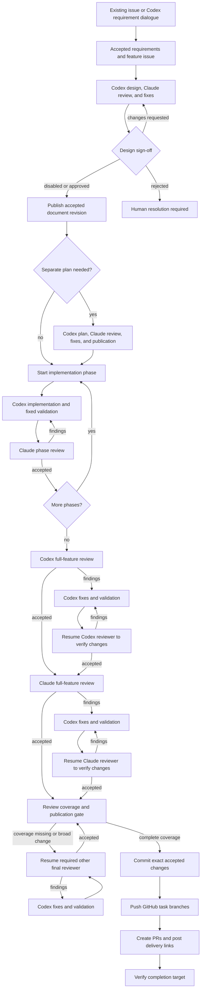
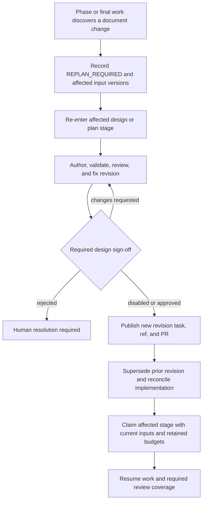

# Personal Development Workflow Orchestration

Status: proposed personal workflow design, revised September 13, 2026 after
design review. Codex/Claude workers and the source boundaries listed below exist;
the complete workflow pilot is not yet end-to-end qualified.

This document covers a developer using `codex-personal` and `claude-personal`
with their own subscriptions on a local machine or dedicated VM. The separate
[Enterprise Development Workflow Orchestration](development-workflow-orchestration-enterprise.md)
design covers `codex-enterprise` inside a corporate network with `llm-gateway`.

## Decision And Scope

Use Codex for requirements, design, optional planning, implementation, and fixes.
Use Claude to review the design, plan, and every completed implementation phase.
After all phases pass, run a Codex final review and then a Claude final review.
Start each final reviewer fresh once; resume its own conversation for subsequent
fix verification. Fixed workflow actions publish documents, manage GitHub
comments, and commit/push accepted implementation changes.

[User, Application, And Workflow Authorization](../../design/user-application-workflow-authorization.md)
is the shared issue #374 prerequisite for implementation. Qualify user/app
identity, unattended renewal, revocation, and action authorization before
orchestration Phase 1; personal subscriptions do not authorize Portal/API access.

The pilot uses independently started top-level stage workflows connected by
accepted artifact references. A parent coordinator and durable child workflows
come later. The personal pilot does not depend on enterprise sandboxing,
billing ledgers, new Chat interaction cards, a CLI, or installer conformance.
Existing Workflow Admin and Worklist surfaces are sufficient for stage starts
and required human decisions.

The first pilot admits one active feature per VM. Shared-runner concurrency and
coordinated routing across multiple VMs are Phase 4 qualifications; the capacity
design below is not a claim that the first pilot supports them.

Keep these business contracts compatible with the enterprise profile: accepted
requirements, optional planning, phase review, finding identity, review coverage,
publication receipts, and completion criteria. Changing execution profile does
not waive a lifecycle gate; enterprise authorization/accounting add profile gates.

## Ownership

| Component | Responsibility |
| --- | --- |
| Developer and Codex requirement session | Agree scope, acceptance criteria, and unresolved decisions |
| `light-workflow` stage executor and store | Persist `FeatureRun`, atomically claim/start stages, and own feature-slot admission/release, finding ledger, review closure, budgets, artifact handoffs, human gates, and publication intents |
| `light-workflow` dispatch scheduler | Own the durable ready-work queue and fairness between feature runs |
| `light-agent` | Admit the selected Agent/turn, persist `agent_job_t` execution/results, and dispatch through Controller |
| Controller and personal runner | Enforce live capacity, leases, routing, cancellation, and worker isolation |
| Codex/Claude worker | Execute one bounded author, implementer, or read-only reviewer turn |
| Workspace manager and fixed test executor | Own task files/checkpoints, diffable candidate snapshots, locks, fixed commands, and validation receipts |
| Fixed Git/GitHub actions | Commit, push, create PRs, publish summaries, and reconcile retries |
| `light-workflow` artifact service and store | Export manager-provided snapshot bytes into durable storage; retain immutable requirements, documents, results, snapshot contents/diffs, findings, and validation evidence |

The Agent never advances a workflow stage based on conversational text.
The workflow selects an admitted Agent and sends typed jobs; it does not launch
the native CLI directly. GitHub and native conversations are not workflow state.

## Workflow Composition

| Top-level workflow | Pilot responsibility | Output |
| --- | --- | --- |
| `feature-intake` | Normalize an existing issue or agreed Codex requirement draft | Feature issue and accepted requirement version |
| `feature-design` | Codex authoring, validation, Claude review/fixes, optional human sign-off, document publication | Accepted design, commit permalink, and PR reference |
| `feature-plan` | Optional detailed plan with the same review/publication loop | Accepted plan and phase manifest |
| `feature-implement` | Implement and review one selected phase | Accepted phase checkpoint and evidence |
| `feature-finalize` | Full-feature reviews, bounded remediation, commit/push/PR delivery | Evidence for the selected completion target |

For the pilot, an operator starts the next top-level stage with the preceding
stage's accepted output. Start `feature-implement` once for each declared phase,
in dependency order. Each phase performs its own review/fix loop. No stage
starts an untracked background workflow, and a stage's acceptance does not
declare the whole feature complete.

Persist a `FeatureRun` record across these stage instances. Inputs include the
feature/run and issue identity, stage/phase ID, expected previous accepted
version, applicable artifact digests, workspace/task and repository bases,
Agent/runner bindings, deadlines, and remaining budgets. Only one stage owns
mutable task execution at a time. Starting a successor atomically claims the
expected accepted predecessor/version; duplicate starts return the same instance.
A deliberate replan or reopened phase gets a new stage execution identity and
retains the same feature ledger and consumed budgets.

A stage returns an immutable `StageResult` containing its input/output digests,
acceptance status, findings, validation and publication receipts, and native/file
checkpoints and diffable snapshot references where applicable. The next stage
validates this result instead of trusting an issue comment or copying an entire
conversation.

The pilot still needs bounded stage-local iteration and reliable Agent job
completion. It can materialize a finite set of review-round task slots; a new
logical turn uses a distinct durable task/job identity, while a retry keeps its
identity. The current service-call idempotency key includes process/task IDs,
so reusing one completed task ID is not a new remediation turn.

Later, `feature-delivery` can automate these handoffs and use `implement-phase`
children. That extension must add durable child start/wait/result/cancel,
definition/input pinning, parent budget accounting, and restart recovery.
`run.workflow` is modeled but currently rejected by the executor; it is not a
prerequisite for the standalone design pilot.

### Enforced Stage Handoffs

Phase 1 implements a `FeatureRun` store in the `light-workflow` operational
database and a built-in claim-and-start API. This is required even while an
operator selects and starts each top-level stage. Persist the current feature
version, accepted artifact/phase versions, active stage owner, consumed budgets,
immutable `StageResult` references, and stage-claim receipts.

The start transaction locks the feature record and first checks for an existing
claim to replay. For a new claim it validates the expected accepted predecessor
and all current input versions, and checks that the selected stage is an allowed
successor with no conflicting owner. It atomically records the
claim, workflow instance/process and initial task, pinned inputs/definition, and
new stage owner. Reuse the transaction boundary of `invocation.rs`'s
`accept_invocation`; its existing invocation idempotency does not implement the
feature-version/ownership check. A claim followed by a separate unprotected
workflow start is insufficient.

Give each logical transition a store-owned identity, including the feature,
predecessor version, and selected stage/phase. A unique claim and normalized
request digest make concurrent identical starts return the same instance,
even with different transport request IDs. Changed inputs for an existing claim
conflict; an unclaimed stale predecessor cannot start. Retrying an older completed
claim returns its historical receipt and never launches a new stage. A new
replan/reopen transition must be explicitly recorded by the state machine.

Workflow Admin stage starts use this API. Dispatch and fixed effects require the
claim bound to their process; a generic workflow start cannot bypass it. Stage
acceptance verifies durable output/snapshot receipts and current input bindings,
then atomically records the result and releases ownership for the next stage.
Document supersession/replan invalidates affected input bindings in this store.
Unknown worker execution keeps ownership fenced until reconciled. Restart after
a committed start but lost response recovers the recorded instance; rollback
leaves neither a claim nor a runnable process. Feature budgets survive handoffs.

## End-To-End Lifecycle

The stage-to-stage edges are operator handoffs in the pilot. Review loops run
inside their stage. All loops are bounded. Scope expansion, stale inputs, or
missing review coverage route to the appropriate additional review or replan
before publication, as specified below.

The coverage gate selects every required reviewer of each saved delta, including
the original reviewer again if an escalated review causes a further broad fix.
The other-reviewer edge resumes an existing final conversation; it does not
restart the initial full reviews. Document revisions discovered during phase or
final work follow the revision loop below before that work can resume.

## Requirement Intake

Support both entry paths:

1. **Existing issue:** a fixed read action loads the selected issue and relevant
   requirement comments. Preserve source IDs and a content snapshot. Codex
   identifies material gaps; unresolved scope decisions block acceptance.
2. **New requirement:** the developer works with `codex-personal`, which drafts
   the title, body, and `RequirementArtifact`. After agreement, a fixed action
   creates the issue and persists its repository, number, and URL.

The artifact records scope, non-goals, acceptance criteria, affected repositories
(or explicitly unknown ownership), compatibility/migration concerns, source
references, unresolved decisions, and a version/digest. Intake also selects a
completion target: `pr-ready`, `merged`, or `deployed`, with its required checks.

Use one feature issue by default; add linked repository or deferred-work issues
only when separately owned tracking is needed. Issue creation is idempotent by
feature and tracking purpose, not document revision. Existing issue content is
requirement data, not authority to change worker permissions or run arbitrary
commands. Changes after freeze create a new version and an explicit impact/replan
decision; they are not silently folded into the current implementation.

## Design And Optional Plan

Choose one canonical design path, normally in `light-portal-doc/src/design`
or `light-fabric/docs/src`. Codex authors against the accepted requirements.
Fixed validation runs document/navigation checks; Claude reviews the current
artifact and finding ledger. Codex fixes, validation reruns as needed, and the
same Claude reviewer verifies changes until the closure contract passes.

A per-run `requireDesignSignoff` setting defaults to `false`. When enabled,
Claude's acceptance creates a Worklist decision for the exact design digest
before publication and implementation. Record the human's approval, rejection,
or requested changes. A new design digest requires a new sign-off when the
setting is enabled. Requested changes return to design authoring/review;
rejection enters `HUMAN_RESOLUTION_REQUIRED` until an explicit revise or cancel
decision. Routine review rounds do not add other human gates.

Decide once after design acceptance whether a separate plan is necessary.
Cross-repository work, migrations, contract changes, and several dependent
phases usually benefit from one. Codex saves it in the implementation repository;
Claude reviews and verifies fixes using the same stage contract. A small feature
can use one phase derived directly from the accepted design. A sufficiently
detailed design can supply several phases without a duplicate plan.

The accepted phase manifest defines scope, owning repositories, dependencies,
validation commands, and exit criteria. Implementation consumes it; it never
starts by generating a second plan.

## Document Publication And Revision

The pilot uses **a separate immutable publication task and branch for each
accepted document revision**, with a PR targeting that repository's `develop`
branch. This works with the existing absent-or-identical-ref push rule and does
not depend on implementing updates to an already-published ref.

For example, a feature may publish design v1 and v2 through distinct tasks/refs
derived from `featureRunId + documentId + revision`. The actual ref uses the
manager's task-branch naming convention; the revision identity is durable and
is not regenerated on retry.

For each accepted design or plan revision:

1. Freeze the accepted files, including any navigation changes, with validation
   and review evidence and optional design sign-off.
2. A fixed action creates a dedicated publication task on a recorded base,
   materializes only that accepted document file set, verifies it, and commits it.
3. Push its unique task ref and create a document PR. Persist the commit SHA,
   ref, PR number/URL, and file permalink. The feature issue links to the commit,
   not just a local path or moving branch.
4. Retain the revision ref/commit for the feature's artifact-retention period.
   Record acceptance and supersession in the ledger/status comment. Publishing
   a document does not automatically merge its PR or close its feature issue.

Later implementation discoveries use the same path: propose a new document
version, assess its effect on requirements/plans/accepted phases, run the
applicable author/reviewer/sign-off cycle, then publish a **new revision task,
ref, and PR**. No old commit, review record, or permalink is rewritten.
If an old revision already merged, base the replacement on the current recorded
integration revision; if it has not merged, the new snapshot must contain the
complete desired document state. Mark the old unmerged PR as superseded in the
feature ledger; closing it is a fixed action under the run's configured grant.

The latest accepted document revision is authoritative for subsequent stages.
Canonical design/plan paths are delivered by their document PRs; implementation
PRs must not carry competing edits to those paths. If implementation edits one,
route the new contents through document acceptance/publication and reconcile
the implementation candidate before final review. Declare the latest document
PRs in the final delivery manifest. A `pr-ready` target may leave them open;
`merged`/`deployed` require their integration as declared by the feature.
Base changes caused by merging documents receive the same impact/validation
treatment as other integration changes.

This revision-publication path and its receipts are pilot work, not a claim
that the current manager already automates document snapshots or supersession.
Reusing distinct manager tasks avoids its existing one-push/one-PR-per-task
receipt conflict without weakening that constraint.

Record the revision request and reconcile any active worker before handing off
the stage owner. Resume the earliest invalidated phase or final stage selected
by the impact decision; publication of a new document alone does not restore
invalidated implementation acceptance.

## Diffable Candidate Snapshots

The current `checkpoint::capture` in `crates/task-workspace/src/checkpoint.rs`
records file hashes/modes, HEAD, and index/status hashes. It retains no prior
file contents. `workspace.checkpointDigest` detects change; it cannot supply
historical review content or a diff after later edits overwrite those files.

Phase 1 adds manager-owned `CandidateSnapshot` receipts. Capture the initial
stage baseline, every candidate submitted for review, and every resulting fix
candidate before another edit can overwrite it. Accepted phase checkpoints
retain their snapshot references. This applies to design/plan fix rounds as
well as implementation and final review; saving accepted phases alone is too
late to verify intermediate fixes.

Under the task's exclusive lock, the manager writes a Git tree from a temporary
private index containing the checkpoint's complete admitted file set. Preserve
exact bytes, executable modes, additions, and deletions, including non-ignored
untracked files; do not apply content-changing Git filters. Keep the current
checkpoint restrictions on symlinks and submodules. An unsupported or out-of-scope
change blocks acceptance instead of silently disappearing from the diff.
Verify the captured bytes against the checkpoint manifest and recheck the
workspace before completing the receipt. Drift produces no accepted snapshot.

Pin each per-repository tree in a unique manager-only local ref, such as
`refs/light-workflow/<featureRunId>/snapshots/<snapshotId>`, without changing HEAD,
the task branch, or the real index. These are local tree snapshots, not feature
commits; fixed push actions never include the private refs. The receipt binds
the feature/stage/task, repository bases, file checkpoint digest, per-repository
tree IDs, and content-manifest digest. Native conversation checkpoints remain
separate. `light-workflow` exports the contents and manifest supplied by a fixed
manager read into the immutable artifact store before a review or stage result
can depend on them, so recovery does not depend on a surviving local Git object
database. The storage and transfer requirements are defined below.

The manager derives each complete delta from the saved before/after trees;
`light-workflow` persists its artifact/digest with both snapshot references.
Retain binary contents and mode/deletion evidence as well as the textual diff;
reviewer tools must be
able to read either saved version. This is a fixed read operation, not native
shell access or a model-authored patch. Workflow impact routing consumes this
evidence. Missing snapshots, failed reconstruction, or digest mismatch block
review/publication rather than falling back to an implementer summary.

Retain all baseline and transition snapshots referenced by `StageResult` or
`ReviewCoverage` for the feature's evidence-retention period. Garbage collection
cannot prune referenced trees/content. Final commit verification compares the
delivered file contents with the accepted snapshot; these snapshots do not move
implementation commit/push ahead of final closure.

### Personal Artifact Storage And Export

The personal pilot uses a **filesystem-backed durable artifact store owned by
`light-workflow`**. Phase 1 must add this backend to `DurableArtifactStore`;
the current constructor supports only S3 and returns `None` without a bucket.
The existing `workflow.fixedActions.artifactRoot` directory does not enable that
store or its publication/recovery contract.

Proposed settings are `workflow.artifact.backend: filesystem` and
`workflow.artifact.filesystemRoot: /var/lib/light-workflow/evidence`, alongside
the existing artifact prefix/retention settings. These keys are new Phase 1
work, not currently accepted configuration. Add the template and published
workflow properties, and mount a dedicated persistent volume at this root in
`portal-config-loc/all-in-lt` and the personal stack in `light-portal-install`.
Only the Workflow service mounts this volume; it is separate from runner task
worktrees, fixed-action scratch, and the container's writable layer.

The workspace manager produces a snapshot package and its manifest through a
fixed authenticated read operation. `light-workflow` retrieves bounded chunks
bound to the feature/task/snapshot identity, checks lengths and digests, and
publishes the contents through its artifact service. Implement and qualify this
transfer path in Phase 1; a local runner pathname is not a transferable artifact.
The runner and native agents receive neither store credentials nor write access
to the artifact volume. Review/recovery reads use fixed authorized operations
against the stored artifact identity and digest.

The filesystem backend preserves content-addressed, tenant-scoped references
and the existing stage/metadata/promote/verified-binding contract. Use durable
temporary writes and atomic promotion, verify any existing destination on retry,
and recover interrupted promotion before binding a receipt. Clean abandoned
staging files and apply retention without deleting referenced evidence. A
receipt is usable only after the complete package is durably stored and verified.
Feature admission checks that the configured store is available and writable;
a disabled store, full volume, or failed export blocks dependent review/stage
acceptance without replaying the author turn.

Qualification must recreate the Workflow container and recover after removing
the runner's snapshot refs/object cache. The persistent artifact volume and
Workflow database must survive that exercise. Recovery from loss of the volume
itself requires a backup of both evidence and metadata; this personal backend
does not provide automatic replication or VM failover. The enterprise profile
selects its own qualified store while preserving the same evidence contracts.

## Phase Implementation And Review

Run each phase before its dependent successor. **Codex starts a fresh implementer
conversation for every phase.** This is intentional: each `feature-implement`
run consumes the accepted requirements/design/plan, phase manifest, prior phase
results and snapshots, finding ledger, and validation evidence. It does not
depend on the phase-1 conversation surviving into phase 2. Resume the same
implementer and reviewer conversations within that phase's fix loop.

1. Codex implements the declared scope and returns a summary. The manager
   captures the candidate checkpoint/snapshot, and fixed validation operations
   run the phase's required checks. A check that changes deliverable files
   requires a new snapshot and validation bound to that candidate.
2. Claude reviews the manager-derived delta from the previous accepted phase
   snapshot (the recorded implementation baseline for phase 1), with
   access to the accumulated candidate, requirements, design/plan, ledger, and
   actual test evidence.
3. Codex addresses findings and returns a mapping from canonical finding IDs to
   changes and evidence. Rerun affected checks and resume Claude to verify the
   updated candidate.
4. When closure passes, record the accepted checkpoint/snapshot and next-stage
   inputs. Publish the concise round summary and update feature status.

**Claude reviews every completed phase.** Do not wait until all implementation
and Codex final review are finished before involving Claude. Judge each phase
against its declared exit criteria; deliberately scheduled later-phase work is
not a current-phase omission. It cannot excuse a failed current-phase check.

Acceptance requires all declared repository checks and cross-repository contracts.
An environment-skipped required test is unqualified, not passed. Phase acceptance
records a checkpoint; implementation commit/push happens after final closure.
Shared-workspace native tools provide file operations: tests/commands run through
fixed manager/test operations, not unsupported native shell access.

## Final Review And Fix Verification

Create a complete immutable candidate manifest covering original repository
bases, accumulated changes, accepted requirements/design/plan versions, phase
results, and validation evidence. Final review checks full-feature behavior,
integration, migrations, documentation, and requirements coverage.

1. Start a fresh **Codex final-review conversation**, separate from its
   implementer. Review the whole candidate once. Codex implementation turns fix
   its findings; the same Codex reviewer resumes with the before/after snapshot
   references/digests, manager-derived complete diff, finding IDs, and validation
   evidence until accepted.
2. Start a fresh **Claude final-review conversation** over the resulting whole
   candidate. Codex implementation turns address its findings. Resume that
   Claude reviewer to verify the changed content and close the cited findings.
3. Routine final fixes remain inside `feature-finalize`. Run affected phase and
   integration checks, but do not automatically reopen a phase workflow or
   repeat a separate Claude phase review for a fix Claude is already verifying.
4. Evaluate the review coverage contract below before commit/push.

Each resumed reviewer focuses on the delta and finding closure while retaining
access to the whole current candidate. It may report a new evidenced regression;
“delta review” does not mean ignoring an effect outside the changed lines.

Reinvoke the other final reviewer when a change crosses the recorded scope of
the active fix, affects multiple phases or cross-repository contracts, changes
requirements/design/acceptance criteria, alters security/authorization,
migrations or public APIs, or cannot be shown to preserve earlier coverage.
The workflow owns this routing decision using declared phase/path/contract
mapping, saved snapshot deltas, required-check results, and the active reviewer's
scope assessment. Codex's fix summary alone cannot declare its own change harmless.
Uncertain impact requires the broader review. Reuse the other reviewer's session
when its binding remains valid; a new session is for changed binding, missing
history, explicit recovery, or a deliberately restarted design scope.

The publication gate consumes a `ReviewCoverage` record:

- retain original full-review verdicts and their exact candidate digests;
- record each subsequent candidate transition, its before/after snapshot
  references and full delta artifact/digest, canonical finding closures, impact
  decision, checks, and reviewing role;
- explicitly carry forward coverage only for unchanged/unaffected scope;
- require an unbroken accepted transition chain to the current manifest and no
  open actionable findings without an authorized disposition.

For example, Codex accepts A; Claude fully reviews A and finds F; Codex fixes F
to produce B; Claude resumes and accepts A-to-B with the required tests and a
confirmed local scope. Publication may accept B using that recorded coverage
chain. It must not relabel Codex's original verdict as a review of B. A broad
A-to-B change also requires resumed Codex review before closure.

The chain itself is a proposed higher-level contract. Existing fixed publication
validators must be explicitly integrated and qualified to consume it; never
reuse an old verdict with a forged current digest to bypass an existing
exact-candidate check.

Keep the first final reviews sequential. The current workspace manager takes
an exclusive task lock even for read-only review. Parallel final reviews would
require independently frozen read-only copies or qualified shared-reader access,
plus findings reconciliation; that optimization is outside the pilot.

## Finding Identity And Closure

`light-workflow` owns canonical finding IDs. The reviewer owns the semantic
assessment of whether an observation is new, an existing finding, or a regression
of a previously closed finding. Do not rely on model-generated `DESIGN-003`
labels or automatic fuzzy text matching for identity.

Allocate the review ID before dispatch and bind it to one logical review turn;
retries keep that ID. Canonical finding IDs remain unique for the feature run
across stage instances and reopened phases. The model cannot choose a new review
identity to evade an existing result or finding mapping.

Every reviewer receives the active ledger and a compact closed-finding history
with access to full records. Its schema separates:

- `existingFindingId`: a reference to a canonical ID supplied in that ledger,
  with disposition/evidence such as still-open, verified-resolved, or reopened;
- `newFindings`: turn-local IDs, repository/location, severity, concrete failure,
  evidence, and required resolution;
- proposed `duplicateOf` references with an explanation when two observations
  describe the same failure.

The workflow validates scope, referenced IDs, and required fields. It assigns a
canonical ID once for each admitted new item and persists the mapping keyed by
`featureRunId + reviewId + localFindingId`; replay returns the same mapping.
A validated duplicate relation preserves the old canonical ID and an alias/audit
record rather than deleting history. A cross-feature ID, conflicting disposition,
or ambiguous duplicate claim cannot silently close a finding: return it to the
reviewer for clarification, then use human resolution if disagreement persists.

Codex remediation references canonical IDs and records changed paths/evidence.
It may dispute a finding with evidence but cannot waive or self-close it.
The reviewing role verifies fixes; an authorized human records waivers/deferrals
with reasons and tracking references. A reviewer must explicitly cite a closed
ID to reopen the same failure with new evidence.

Stage closure requires a schema-valid accepted verdict/coverage, no unresolved
actionable finding without an authorized disposition, required checks passing
on the relevant candidate, valid input/policy/base bindings, and any required
sign-off. Keep advisory suggestions separate. Empty native text, transport success,
or malformed structured output never means “no findings.”

Use three remediation rounds after the initial review as the default, plus
configurable turn and wall-clock limits. Count validation-fix and output-repair
turns against those limits. Budgets count dispatched logical work, not the number
of unique findings: rewording or duplicating a finding cannot reset a budget.
Final remediation consumption survives reopened phases, new stage instances, and
reviewer replacement. Deterministic non-progress indicators include repeated
still-open canonical IDs with no accepted resolution; semantic disputes remain
explicit decisions. Exhaustion or unresolved disagreement enters
`HUMAN_RESOLUTION_REQUIRED`, never automatic approval.

## Conversations, Tasks, And Recovery

Codex and Claude for a feature use the same `workspaceId` and task ID, with
different `thread.sessionRef` values. The workflow controls `new`, `resume`,
and `close`. Persist the native `codingThread.checkpoint` independently of
the file `workspace.checkpointDigest`; neither authorizes the other.

Keep role conversations through their stage's fix loop. Close them on stage
completion and verify the close receipt; `closeAfterTurn` alone is not proof of
closure. The next top-level stage, including the next implementation phase,
uses new conversation identities and consumes accepted artifacts and snapshots.
A review has read-only access to the exact expected candidate and saved delta
versions, and must reread changed files on resume.

A task has one workflow-stage owner and one active manager turn. Stale checkpoints
or changed runner/policy/task bindings are rejected. Missing history requires
explicit replacement from accepted artifacts. Uncertain native execution stays
fenced until reconciliation; changing a request ID, stage, or VM is not permission
to replay edits. Completed execution with invalid output needs a bounded
output-repair/recovery step against saved state, not a blind rerun.

## GitHub Actions And Comment Volume

Codex/Claude write content; fixed workflow actions own GitHub effects. Reuse the
workspace manager's `gh` delivery boundary. Pass structured arguments and body
files/stdin; do not interpolate model text into shell source. The current
`run.shell` path disables network and credentials, and shared-workspace workers
do not receive arbitrary host `gh` access.

Persist immutable author/reviewer/remediation results before publication. Default
to **one status comment per feature run, edited in place**, plus **one short
comment per completed review round**. The status points to the current stage,
candidate, open finding IDs, latest design/plan PRs, delivery state, and full
artifacts. A round comment summarizes implementation or fixes, validation,
review disposition, and links to full results. Limit its prose, for example to
200 words plus links; large finding sets stay in the artifact store.

This preserves each response in durable artifacts and represents it in the issue
without pasting full responses repeatedly. Update status after completed author,
review, and remediation events; append the compact round comment when the round
is complete. Design acceptance and final delivery also publish explicit links.
The developer can choose a more verbose comment policy per run.

The workflow owns serialized GitHub action intents and their remote IDs:

- status identity: `featureRunId + status`, with monotonically increasing version;
- round identity: `featureRunId + stageExecutionId + round`, bound to its immutable
  summary digest;
- document/delivery identity: feature, artifact/revision, repository, and action.

Edits target the stored comment ID, never “edit my last comment.” Serialize
updates so an older retry cannot overwrite newer status. Record intended body
digest/version and reconcile uncertain results by fetching the known ID or
enumerating matching markers. Markers aid recovery; they do not replace an atomic
local effect claim. A failed comment retries the saved content without another
model turn. Required publications must complete before the corresponding stage
or feature is declared delivered. GitHub deletion/editing cannot change the
internal acceptance ledger.

## Commit, Push, PRs, And Completion

After final review coverage and required checks pass, fixed actions:

1. Freeze and verify the accepted manifest, authorized repositories/bases/refs,
   review coverage chain, and required publication authority. Unexpected changes
   return to review; a model's completion text is not publication authority.
2. Run declared pre-publication checks. Any deliverable modification from checks
   or hooks creates a new candidate transition requiring review.
3. Commit exactly the accepted files in each changed repository, including
   intended new files/deletions. Verify the tree and record SHA/parent; no-change
   repositories are explicit. Exclude unrelated changes, caches, and credentials.
4. Push each recorded SHA to its unique GitHub task branch and verify the remote
   ref. The normal integration target is a PR to `develop`; no direct feature
   push to `develop` or `master`.
5. Create the required PRs and verify head SHAs/target branches. Include the
   latest accepted document PRs in the delivery manifest. Update the feature
   issue with per-repository commit, branch, PR, and validation links.
6. Complete the declared CI/integration gates. `pr-ready` requires the intended
   PRs and checks; `merged`/`deployed` also require their authorized integration
   and runtime verification. Opening a PR alone does not close the feature issue.

Record per-repository commit/push/PR/comment receipts. Multi-repository delivery
is not atomic: retain successful effects and reconcile only incomplete actions.
A lost push response requires checking the remote SHA, not rerunning Codex or
creating another commit. Do not overwrite a conflicting remote ref.

For the pilot, a revised published implementation candidate uses a new immutable
publication task/ref/version, just as documents do; record which prior PRs it
supersedes and require current review coverage. Transparent advancement of an
already-published task ref can be added later with reviewed ref-update handling.
It is not required to publish design v2 or to recover a post-publication fix.

## Concurrent Instances And VM Placement

The Phase 4 target allows independent features to remain active concurrently;
their phases remain sequential. Each feature gets separate worktrees, branch
names, conversations, findings, and budgets even when it changes the same
repositories.

The current personal workspace runner requires `maximumConcurrency: 1`.
With one Codex runner and one Claude runner, Codex can implement feature B while
Claude reviews feature A. **`light-workflow` owns fairness**: its dispatch
scheduler persists ready turn intents and chooses eligible feature runs in
round-robin order per required runner, FIFO within a run, with bounded admission.
Persist queue order and the last-served run so restart cannot favor one feature.

`agent_job_t` is the downstream execution/result record, not a second feature
fairness queue. Controller and runner remain authoritative for actual capacity.
The workflow releases its dispatch reservation only after a terminal/reconciled
execution receipt; a confirmed pre-execution capacity rejection returns work to
the ready queue. A lost admission response requires reconciliation before release.
Waiting for capacity or human input consumes no remediation round, while the
configured overall deadline still applies. Fairness is among workflow-owned
turns; unrelated interactive traffic still competes for real runner capacity.

A second VM can host another independently enrolled Codex/Claude Agent set and
private workspace store. Both agents on one VM share that VM's store; matching
workspace names across VMs do not share files. Pin runs to their admitted
Agent/runner/store bindings. Moving an uncertain run is explicit recovery after
fencing, never copying live native state. Separate installed control stacks must
avoid assigning the same issue to competing owners.

Use globally distinct task refs, explicit inter-feature dependencies, and
separate test resources (or serialized access to shared resources). Local locks
cannot coordinate remote merges across VMs. Recheck target-base movement and
revalidate/review affected changes before integration. Another VM provides
execution capacity; it does not remove integration or upstream account limits.

The first pilot enforces one active feature per VM through a `light-workflow`
admission reservation retained across stage handoffs and uncertain execution.
Another separately operated VM can host its own pilot and Agent set, but shared
scheduling, coordinated multi-VM routing, and automatic failover are not qualified
by that arrangement.
They remain later milestones, not reasons to postpone the standalone design loop.

### Pilot VM Slot Release

`light-workflow` persists the reservation's VM/runner binding, feature owner,
generation, acquisition time, and release status. Workflow Admin shows the
holder with its issue, stage/state, waiting reason, outstanding execution, and
available resume/cancel actions. `READY_FOR_NEXT_STAGE` and
`HUMAN_RESOLUTION_REQUIRED` retain the slot until the operator resumes or cancels
the feature; they cannot hide an indefinite reservation from the operator.

On feature `COMPLETED`, `CANCELLED`, or `FAILED`, release the slot idempotently
once all admitted turns/fixed effects have terminal or confirmed fencing
receipts. Record the release against the same owner/generation in the feature
store. Completing an individual stage does not release it. A timeout, missing
heartbeat, or terminal stage/process label alone is insufficient proof that the
VM is safe to reuse.

Provide an authorized **Cancel and release VM** action for a stalled feature,
bound to its expected feature version and reservation generation. It blocks new
dispatch and successor claims, cancels queued work, requests cancellation of
active work, and fences outstanding worker/effect generations. Wait for
Controller/runner/manager confirmation that old execution cannot continue, and
reconcile already-issued external effects before completing cancellation and
releasing the slot. Clearing a database owner field alone is not fencing.
If confirmation is unavailable, show
`VM_RELEASE_PENDING` and the unresolved execution; the VM remains unavailable
until an authorized stop/reconciliation supplies the missing evidence.

Persist the action intent and release receipt so a lost response can be retried
without freeing a newer owner's reservation. Late old-generation dispatches,
results, and publication actions cannot reacquire the slot or advance the
cancelled feature. Retain its artifacts, findings, budgets, and publication
receipts; any later explicit reopen must reacquire a slot and stage claim.

## State And Evidence

| State or substate | Required transition evidence |
| --- | --- |
| `REQUIREMENTS_FROZEN` / `ISSUE_PENDING` | Accepted requirement version and persisted issue reference |
| `DESIGN_ACTIVE` / `PLAN_ACTIVE` / `PHASE_ACTIVE` | Candidate, validation, review, and bounded remediation receipts |
| `DESIGN_SIGNOFF_PENDING` | Exact-digest human decision when enabled |
| `DOCUMENT_PUBLICATION_PENDING` | Accepted revision task, commit, ref, PR, and permalink receipts |
| `READY_FOR_NEXT_STAGE` | Durable accepted `StageResult` and snapshots; successor claim/start transaction validates the current feature/input versions |
| `FINAL_REVIEW` | Primary/independent reviewer substate, finding ledger, and current review coverage chain |
| `COMMIT_PENDING` / `PUSH_PENDING` / `PR_PENDING` | Verified per-repository publication receipts |
| `POST_PUBLICATION_VALIDATION` | Required completion-target checks |
| `REPLAN_REQUIRED` | Revised inputs, affected-scope decision, and explicit acceptance invalidation |
| `HUMAN_RESOLUTION_REQUIRED` | Dispute, exhausted budget, sign-off rejection, or ambiguous recovery decision |
| `REAUTHORIZATION_REQUIRED` | Renewed applicable Portal/action grant |
| `VM_RELEASE_PENDING` | Cancellation/release intent and outstanding stop/fencing receipts; reservation remains held |
| `COMPLETED` / `CANCELLED` / `FAILED` | Terminal feature result; a successful stage alone is not `COMPLETED` |

The workflow and artifact store retain feature versions/owners and claim receipts,
input versions, snapshot contents/deltas, finding mappings, review coverage,
tests, budgets, sessions, VM reservation/release receipts, queue state, and
external receipts. Restart resumes this state. Post-publication failures retain
the published history and require a tracked remediation/version; they do not
rewrite old acceptance or reset the feature budget.

## Current Implementation Boundary

Source checked September 13, 2026; the recorded live prerequisite below is from
September 12 and has not been rechecked against the running database here.
Stack statements describe checked-in configuration, not a live config-server query.

| Capability | Current boundary |
| --- | --- |
| Personal Codex/Claude turns | Shared task inspect/implement/read-only review and native session control exist; see the shared-session qualification record |
| Workflow Agent jobs | Service calls persist `agent_job_t` and Agent dispatch handles typed workspace jobs; complete local workflow invocation remains to qualify |
| Cross-database bridge | `contracts/claude-code/v2.1.269/review-fixes-workflow-prerequisites.json` records missing Agent catalog/job relations for the Workflow operational role |
| Shell | `command_template.rs` and runner admission forbid network/credentials for `run.shell` |
| GitHub delivery | `crates/task-workspace/src/delivery.rs` supplies issue/PR actions and absent-or-identical-ref push; workflow comments and revision-task publication need integration |
| Locking/capacity | `tool_session.rs` locks the task for readers and writers; personal workspace configuration enforces one execution per runner |
| Historical file contents | `checkpoint.rs` captures hashes/modes and HEAD/index/status evidence, not diffable contents; retained candidate trees, artifacts, and delta reads are Phase 1 work |
| Artifact storage/export | `artifact_store.rs` supports S3 only and disables the store when no bucket is set; `workflow.yml` defaults `workflow.artifact.s3Bucket` to empty. Checked-in local/installer stacks do not provision S3. The personal filesystem backend, persistent volume, published settings, and Workflow-owned fixed export/read path are Phase 1 prerequisites |
| Stage claims | `invocation.rs::accept_invocation` transactionally persists an idempotent invocation/process/initial task; `FeatureRun` persistence, predecessor validation, and atomic stage claims are Phase 1 work |
| Pilot VM slots | Feature reservations, Workflow Admin holder/release controls, and fenced terminal/cancellation release are Phase 1 work; runner concurrency limits alone do not implement them |
| Child workflows | `executor.rs` rejects `run.workflow`; parent/child orchestration is deferred |
| Feature contracts | Finding ledger, review coverage, standalone handoffs, fair dispatch, and stage loops are proposed orchestration work |

## Delivery Plan And Acceptance Gates

### Phase 0: Contracts And Deterministic Review Rules

Define `FeatureRun`, stage-claim identity/version rules, `StageResult`,
`CandidateSnapshot`/delta receipts, finding/remediation schemas, review coverage,
budgets, VM reservation/release receipts, document/publication revisions, and
comment intent identities.

Exit gate: fixtures prove that replay preserves canonical finding IDs; reworded
findings citing an existing ID retain identity; invalid/ambiguous duplicate
references cannot close a finding; disputed findings require reviewer/human
disposition; and reopened phases/new instances retain consumed budgets.
Also prove a local final fix can close with resumed review and current coverage,
while a broad change or missing transition cannot publish. Test optional design
sign-off and stale sign-off rejection. Define fixtures for duplicate/stale
handoffs and missing snapshot evidence; Phase 1 must enforce these contracts in
the stores and start path. These gates require no model calls.

### Phase 1: Standalone Stage Execution And Fixed Actions

Prerequisite: the shared [authorization foundation](../../design/user-application-workflow-authorization.md#implementation-order-and-exit-gates)
has passed its selected-stack qualification gates.

Resolve/live-qualify the Workflow-to-Agent operational catalog/job bridge and
exact workflow Agent bindings. Each separate workflow Agent instance needs its
own service ID in `codingProfile.workspaceBindings[].agents` and the matching
runner-local `RunnerWorkspaceConfig.bindings[].agents`. Publish and install the
same complete binding, including its authorization/membership revisions,
subjects, intents, runner, host, and environment: the runner compares the full
binding for equality. Grant the workflow instance explicitly; do not reuse the
interactive Agent's identity or weaken that comparison. Implement:

- the durable `FeatureRun`/`StageResult` store and atomic claim-and-start API,
  including version/owner checks, dispatch enforcement, and acceptance/replan
  transitions; wire operator starts to this API;
- manager-owned candidate trees, private retention refs, immutable content
  artifacts, and fixed delta/version reads tied to checkpoint receipts;
- the personal filesystem artifact backend, persistent volume and published
  settings in `portal-config-loc/all-in-lt` and `light-portal-install`, readiness
  checks, and Workflow-owned export/recovery through fixed manager reads;
- bounded stage-local round slots, schema validation, native/file checkpoints,
  cancellation, and restart recovery;
- fixed tests, issue creation, status/round comments, and immutable document
  publication tasks/PRs;
- one active feature per pilot VM, Workflow Admin holder visibility, terminal
  release, and authorized cancel/release with confirmed execution fencing.

Do not implement `run.workflow` for this gate. Exit gates:

- Each workflow Agent service ID succeeds with matching published and runner-local
  workspace bindings. Missing IDs on either side, mismatched binding revisions,
  and an unauthorized interactive Agent identity are rejected before a native
  turn starts. Qualify the separate instances using their actual service IDs.
- A top-level design stage performs Codex authoring, fixed validation, Claude
  review, and a resumed fix round using a manager-derived before/after delta.
  After later edits and a restart, the earlier contents still reconstruct
  exactly, including new/deleted/binary files and executable modes. Exercise
  artifact recovery without the local snapshot refs. Missing/corrupt evidence
  blocks review/acceptance; the real index, HEAD, and task branch stay unchanged.
- Each personal stack variant publishes and restores evidence with its configured
  filesystem store after Workflow container recreation and removal of the local
  snapshot refs/object cache. Test disabled/unwritable/full storage, interrupted
  export and promotion, and retry without duplicate artifacts or another author turn.
  The runner receives no artifact-store credentials or writable store mount.
- Transactional store/start tests prove simultaneous identical successor starts
  return one instance; changed inputs conflict; stale/superseded inputs and
  unclaimed dispatch cannot run; commit followed by a lost response replays the
  same instance; rollback leaves no orphan claim or runnable process. Acceptance
  enables the next valid stage and preserves feature budgets and recovery fences.
- Completing a feature frees its VM slot. Cancelling a stalled feature in
  `READY_FOR_NEXT_STAGE` or `HUMAN_RESOLUTION_REQUIRED` frees the slot for another
  feature. An uncertain turn keeps release pending until confirmed fencing;
  afterwards a new feature can claim the slot. A replayed release or late old
  execution cannot free the new reservation or publish old results.
- Restart or lost result delivery repeats neither an uncertain model turn nor
  a GitHub effect. Durable handoffs are enforced, not left to operator discipline.

### Phase 2: Personal Design Pilot

Exercise both intake paths and operator handoff to standalone `feature-design`.
Publish accepted design v1, then revise it through the same review/sign-off
contract and publish v2 on a new task/ref/PR with an updated issue link.

Exit gate: both immutable permalinks remain valid, the ledger selects v2, no
existing remote ref is overwritten, and the Phase 1 claim API rejects a new
next-stage start with stale v1 inputs.
Status edits cannot regress on retry; round comments stay concise and link to
all stored author/reviewer/remediation results. This is the first complete pilot.

### Phase 3: Optional Plan, Phase Work, And Final Delivery

Add the optional plan and repeat standalone implementation by phase. Implement
initial full final reviews plus resumed fix verification, explicit review
escalation, commit/push/PR delivery, and completion checks.

Exit gate: implementation phase 2 cannot start before phase 1 passes and starts
with a fresh Codex conversation reconstructed from accepted artifacts/snapshots;
the no-plan path creates no duplicate plan; a Claude final finding is fixed and
verified without unconditionally restarting both reviews; a broad fix invokes
the other reviewer.
A multi-repository partial push failure reconciles receipts without duplicate
commits/PRs. Latest document revisions and code PRs agree on delivered content.

### Phase 4: Shared Capacity, VMs, And Optional Parent Coordinator

Qualify workflow-owned fairness and two independently enrolled VM agent sets.
Then add `feature-delivery` and durable child orchestration if automated
composition is needed, preserving the standalone contracts.

Exit gate: two features retain isolated results and refs; capacity waiting and
restart preserve fairness; cancellation affects only its feature. Parent/child
start, result, cancellation, and recovery are qualified separately and do not
change review closure or budget semantics.

## References

- [Enterprise Development Workflow Orchestration](development-workflow-orchestration-enterprise.md)
- [Shared Native Coding Sessions](shared-native-coding-sessions.md)
- [Shared Task Workspaces](shared-task-workspaces.md)
- [Chat And Workflow Integration](shared-task-workspaces-chat-workflow.md)
- [Workflow Coding Thread Lifecycle](../light-agent-worker/workflow-thread-lifecycle.md)
- [Coding Harness Integration](coding-harness-integration.md)
