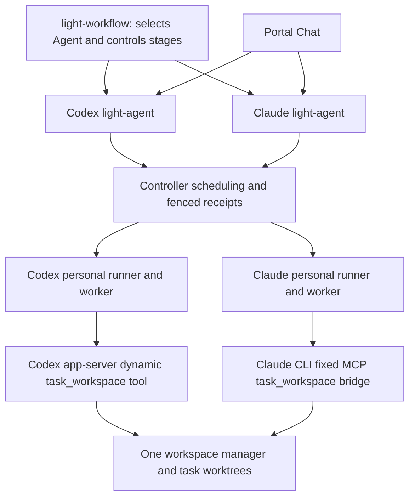

# Shared native coding sessions

Codex personal and Claude personal use one host-owned workspace store. Each has
its own Agent deployment, runner enrollment, native login, and conversation state.
The workspace registration grants both Agent service IDs. Each runner has its own
owner-only `RunnerWorkspaceConfig` pointing to the **same store**, and its own
published `codingProfile.workspaceBindings` selecting that runner. Matching
workspace names on different stores do not share files.



The manager holds the task lock across a native turn. Implementation tools may
edit files with digest preconditions. Review and inspection tools cannot edit.
The CLI namespace contains private native state and the fixed tool transport;
it does not contain the workspace store or task checkouts. A completed tool
session persists the exact returned checkpoint for subsequent review admission.
This is a content checkpoint, not an approval or publication authorization.

Claude uses its pinned CLI and native subscription login, with a fixed stdio MCP
bridge over a private Unix socket. Only `task_workspace` is exposed. The native
CLI's `--tools ""`, `--strict-mcp-config`, and explicit MCP configuration keep
repository operations within the manager's authority. See the official
[CLI reference](https://code.claude.com/docs/en/cli-usage). Workspace bindings grant
this managed tool surface; bundle-mode inheritance of installed native tools,
hooks and MCP servers does not extend to shared tasks. This matches the Codex
shared-workspace boundary. Native permissions cannot override a reviewer’s
read-only manager session. Tests, commands, freeze/approval, Git operations and
publication remain separate fixed manager/workflow operations.

## Task and conversation identities

`workspaceId` + `task.taskId` identify shared files. A `thread.sessionRef`
identifies one private native conversation belonging to one Agent, runner, task,
intent and stage. Implementer and reviewer use different conversation IDs; they
never share native transcripts. Both adapters support:

- `thread.mode: new`: caller chooses a fresh UUID and stage ID.
- `thread.mode: resume`: caller supplies the previous conversation checkpoint.
- `thread.mode: close`, or `closeAfterTurn: true`: caller ends reuse explicitly.
- `nativeModel`: optional native selection; Claude validates its published model
  map. Keep the model selection consistent when resuming a Codex workspace turn.

The native UUID checkpoint (`codingThread.checkpoint`) is different from the
file checkpoint (`workspace.checkpointDigest`, a SHA-256 digest). Neither replaces
the other. Changed policy, role, task or membership invalidates native reuse.
Uncertain turns stay fenced; a new request ID does not authorize automatic replay.
Legacy Chat requests without `thread` execute one fresh conversation and close it.
Workflow workspace jobs require explicit thread control.

## Implementation and review sequence

1. Select either Agent. Send `intent: implement` and a new task/conversation.
2. Retain the returned task ID, workspace checkpoint and implementation
   conversation checkpoint.
3. Select the other Agent for review. Send the **same task ID**, `intent: review`,
   the exact workspace checkpoint, and a **new review conversation**.
4. For remediation, resume the implementation conversation against the current
   workspace checkpoint. Retain the resulting new checkpoint.
5. Resume the reviewer with that new workspace checkpoint. The reviewer must
   reread the current task; native history is not evidence of current contents.
6. Close both conversations when the caller finishes the review loop.

Review requires an existing task and expected workspace checkpoint. A stale
checkpoint is rejected before native execution. Read-only review does not itself
produce trusted acceptance evidence for commit, push or deployment. Existing
freeze/approval/delivery contracts continue to own those transitions.

Chat exposes task selection, expected workspace checkpoint, new/resume/close,
close-after-turn and native model. Successful results carry both checkpoints;
Chat selects the existing task and resumed conversation for the next turn.
Changing intent starts a separate conversation. To return to another conversation,
use the ID and checkpoint displayed with its prior result. Reconnecting or
switching Agents does not implicitly transfer conversation authority.

## Workflow request shape

The Agent's existing durable job dispatcher accepts the same typed input:

```json
{
  "profile": "coding",
  "clientMessageId": "review-turn-2",
  "text": "Review the updated implementation.",
  "workspace": {
    "schemaVersion": 1,
    "requestId": "review-turn-2",
    "workspaceId": "personal",
    "expectedMembershipRevision": "sha256:<published membership digest>",
    "task": {"kind": "existing", "taskId": "<implementation task ID>"},
    "intent": "review",
    "expectedCheckpointDigest": "sha256:<implementation checkpoint>",
    "instruction": "Review the updated implementation.",
    "thread": {
      "runnerId": "personal-claude-runner",
      "sessionRef": "<review conversation UUID>",
      "stageId": "review",
      "mode": "resume",
      "expectedCheckpoint": "<previous review conversation checkpoint UUID>",
      "closeAfterTurn": false
    },
    "nativeModel": "sonnet"
  }
}
```

Place this payload in a service-mode agent call's `with.input`; select the Agent
with `with.agent`. The dispatcher derives the workspace subject
`workflow-agent:<agent-definition-UUID>` from immutable server authority. Grant
that exact subject and Agent service ID in both the published and runner-local
binding for workflow use. A human Chat grant alone does not grant workflow use.
The browser or model cannot provide a host path, binding, store, or subject.

The local Workflow service's existing cross-database Agent job/catalog bridge is
still an integration prerequisite: the `workflow_ops` search path does not expose
the required Agent job and catalog tables. This change adds workspace handling on
the Agent side; it does not claim that service-mode Workflow invocation already
works across those separate deployed databases. See the recorded prerequisite in
`contracts/claude-code/v2.1.269/review-fixes-workflow-prerequisites.json`.

## Deployment and repeatable checks

Build updated workers, runner, Agent, Portal policy publishers and Portal UI.
Enable `workspaceConfig` on the Claude runner using the setup helper's
`--workspace-config` option; subsequent setup preserves that configuration.
Use the same store/registration as Codex and publish each generated profile through
`agent-policy-authoring.codingProfile`, then publish a new immutable Agent snapshot.
Do not edit a compiled snapshot. The existing normal `deploy-local.sh lt` restart
regenerates admission and verifies installed runner identities.

Run Rust workspace/worker tests, Java `ClaudeCodingProfileTest`, and the Portal
workspace/Chat tests. `scripts/run-shared-coding-smoke.py` exercises Codex implement
→ Claude review → both edit/review resumes → conversational follow-ups → both closes on a disposable task with an
independent file-content assertion. `scripts/run-claude-workspace-smoke.py` checks
Claude edits across three disposable repositories. These consume native
subscriptions and exercise the real workers, not the Workflow engine or browser.

For a deployed read-only check, install `scripts/claude-personal-test-requirements.txt`
in a virtual environment and run:

```sh
python scripts/run-shared-workspace-deployment-smoke.py \
  --token-file /private/path/owner.jwt --workspace personal \
  --task existing-task-id --report /tmp/shared-workspace-deployment.json
```

The credential must identify an owner granted access to both Agents. The script
uses an existing task, opens and closes one conversation per adapter, and checks
both returned the same file checkpoint. Run on a quiet task; concurrent owner
edits invalidate the comparison. URLs are configurable. It does not submit an
implementation turn or execute a Workflow process.

The 2026-09-12 qualification passed the six-turn native implementation/review loop,
both deployed read-only turns through Agent/Controller/runner, both namespace
isolation tests, and a normal `deploy-local.sh lt` restart. Sanitized receipts are
in `contracts/claude-code/v2.1.269/shared-workspace-qualification.json`.

## Completion, sandbox and retained state

A confirmed successful native turn may be conversational: it need not call a
workspace tool or return nonempty text. Empty output gets a neutral completion
message; public text is UTF-8-truncated at 64 KiB. These presentation decisions
must not leave a completed conversation IN_FLIGHT. Protocol/transport errors,
missing terminal results, cancellation and uncertain native execution still fail
closed and require explicit recovery rather than automatic replay.

Codex uses native read-only sandboxing (including native tool network denial),
while task_workspace writes remain authorized by the external workspace manager.
The outer namespace exposes no checkout/store. Fixed native configuration and
credentials are mounted read-only; only private native session state persists.
Claude prepares its fixed MCP bridge, socket and credential mounts before opening
a writable workspace tool session.

Successful legacy requests without explicit thread control delete their native
home after recording the CLOSED receipt. Explicit conversations and failed or
uncertain standalone histories are retained. `personal-runner-lifecycle.py storage`
reports shared workspace native directory count, bytes and checkpoint state counts
for either adapter without printing transcripts. Both runners report the same
store-wide totals; do not add those totals together. Automated deletion of retained
explicit/uncertain homes is not implemented. Operators must reconcile records and
drain runners before cleanup; age alone is not authority to delete uncertain state.

Conversation locks use an explicit-unlock guard on every exit path, including
rejected opens and closed-record pruning. Acquisition tolerates a 100 ms inherited
file-descriptor window and still rejects a live owner. Codex acquires the workspace
tool session before marking the conversation IN_FLIGHT or issuing thread/start or
thread/resume. Task contention therefore leaves the existing conversation checkpoint
available for retry after the competing task turn ends.
