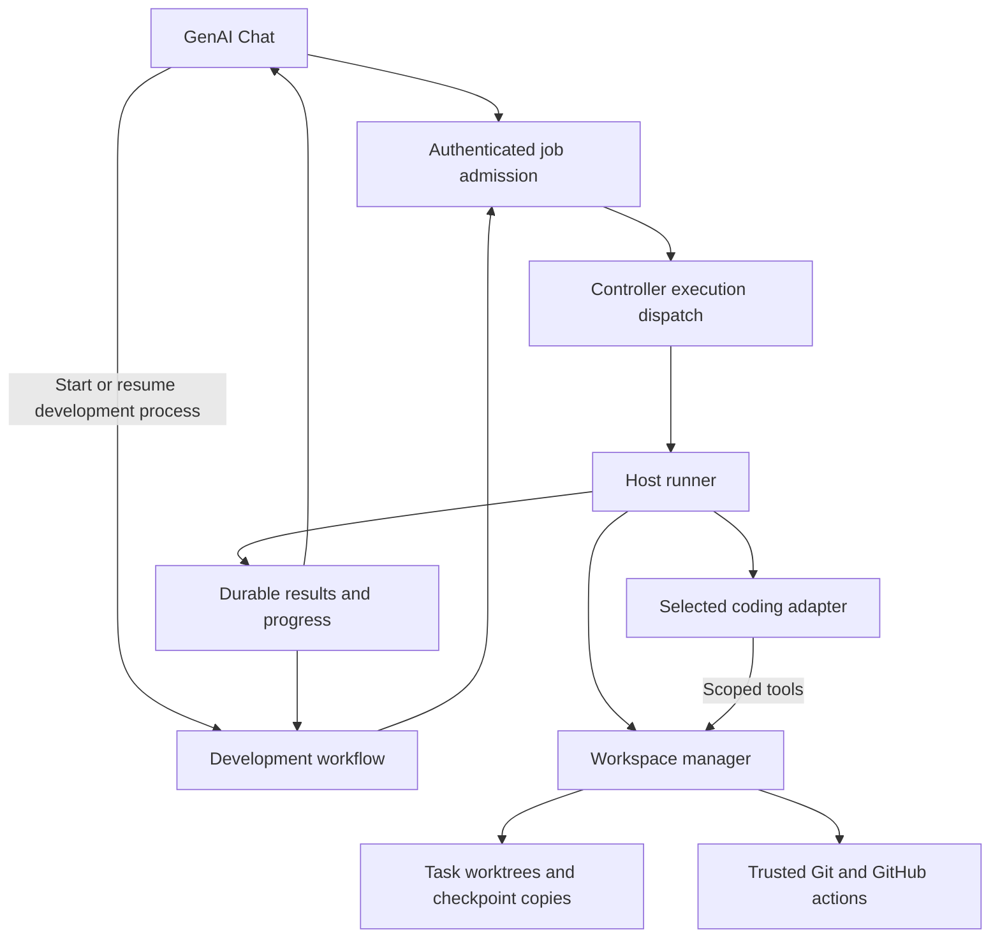

# Shared Task Workspaces: Chat and Workflow Integration

Status: shared Codex/Claude worker and Chat extension, September 12, 2026.
See [Shared native coding sessions](shared-native-coding-sessions.md) for the
current session contract and deployment prerequisites. Higher-level development
workflow orchestration below remains a design; its cross-database job bridge is
not yet qualified in the local stack.

This document extends [Shared Task Workspaces](shared-task-workspaces.md) and
[Development Workflow Orchestration](development-workflow-orchestration.md).

## Implemented standalone Chat path

- Portal publishes `codingProfile.workspaceBindings` with Host, environment,
  runner, membership revision, authorization revision, human subjects, agents
  and allowed intents. Java/Rust fixtures verify signed serialization.
- An authenticated coding Chat session advertises only its allowed workspaces.
  The browser sends a workspace ID, new/existing task selection, intent,
  instruction and optional expected checkpoint. Host paths and authority are
  not accepted from the browser.
- The Agent schedules through the existing durable execution outbox and
  Controller transport, pinned to the bound personal runner. The runner checks
  its private workspace configuration and the local registration again.
- Native Codex and Claude use isolated per-conversation native state with only
  their corresponding personal login. Host repositories, configuration, plugins and unrelated MCP
  servers are not mounted. Its only workspace tool is a scoped file facade:
  repository listing, paginated file listing, reads and digest-conditional edits.
- A task lock spans the model turn. Unfinished writers are fenced. A durable
  execution receipt prevents an uncertain model turn from being automatically
  replayed; completed retries return their saved result. The job lock covers setup,
  but uncertainty is persisted only immediately before `turn/start`. Setup and
  authentication failures remain retryable. Existing tasks reopen from their
  pinned local revisions; only new tasks fetch integration branches.
- Chat displays the final explanation, task ID and checkpoint, and selects that
  existing task for follow-up. Result notifications are deduplicated.

The adapters support **inspect**, **implement**, and read-only **review** on
personal native runners. Review is tied to an exact workspace checkpoint. Running
commands/tests, indexing, trusted approval, and GitHub delivery remain separate
manager operations. Enterprise workspace adapters and workflow stages
require separate qualification. Registering an MCP server alone does not enable
Chat: publish a matching binding and deploy the workspace-enabled runner.

The native adapter has passed live read and edit tests across three disposable
repositories, including verification of the edited file and durable checkpoint.
The browser-to-Controller-to-runner gate passed on September 11 against the local
`personal` workspace and existing `workspace-smoke-1` task (128 repositories).
Chat returned both README titles, then completed a digest-conditional file edit
and returned a new checkpoint. The file was verified in the task worktree, with
the task ready and the original checkout untouched. The deployment record is in
`portal-config-loc/all-in-lt/light-workflow-runner-personal/workspace-chat.md`.
First-time provisioning of all 128 repositories from Chat remains unqualified;
use an existing task for this milestone. Workflow orchestration remains next.

## Decision and user experience

Support both interactive Chat jobs and durable development workflows through one
workspace execution contract. Chat is a user interface, not the owner of a worker
process or write lease. The runner resolves registered workspace IDs to host paths;
no browser or model supplies a filesystem path as authorization.

An agent grant covers every repository in the workspace. Repository names in a
prompt or task plan express intent, not additional access controls. Task branches
belong to a task, not to a particular agent. Codex and Claude use the same task
identity to inspect the same staged, unstaged, and untracked changes.

The normal interaction in `/app/genai/chat` is:

1. Connect to an agent. Retain its published turn policy: a coding-only agent
   remains coding-only, including for code-understanding questions.
2. For coding turns, choose **Repository bundle** or **Workspace**, provided the
   selected agent and runner advertise support. Existing bundle behavior remains.
3. Select a registered workspace such as `personal`. Select an existing task or
   choose **New task** with a short description. Display its repository count,
   integration branch policy, and provisioning readiness.
4. Choose **Inspect code**, **Implement**, or **Implement and review**. These are
   job intents, separate from Chat/coding turn types and provider routing.
5. Submit the instruction. The backend creates a stable task identity and starts
   provisioning automatically when needed. Show progress and allow reconnection.
6. Show task stage, current execution, checkpoint, findings, and delivery links.
   A later conversation or another authorized agent can resume the same task.

Workspace mode hides bundle URI/hash/size inputs. Neither changing the selected
agent nor refreshing the browser silently creates a replacement task. A new-task
choice remains available when context preselects an existing task. Agents without
workspace support show the reason that this mode is unavailable.

## Existing implementation and proposed responsibilities

| Component | Current responsibility | Integration work |
| --- | --- | --- |
| `portal-view/src/pages/genai/Chat.tsx` | Agent session and coding input UI | Workspace/task selection, job intent, progress and approval views |
| `light-agent` | Session, turn authorization and coding dispatch | Admit versioned workspace inputs; retain published turn policy |
| Portal publisher/config server | Published agent configuration | Workspace catalog/grants, runner binding and revision publication |
| `light-workflow` | Durable workflow execution | Development stages, waits, retries, budgets and user decisions |
| Controller and runner | Authenticated execution dispatch | Workspace-aware job admission, host routing, fencing and reconciliation |
| `crates/task-workspace` / `apps/light-workspace` | Local tasks, locks, file tools, checkpoints, indexing and GitHub receipts | Runner-owned scoped tool facade and registration adoption |
| Coding adapters | Bounded provider-specific execution | Scoped workspace tools and inspection/implementation/review qualification |

No browser-to-host HTTP wrapper is added around the current owner-local MCP
process. Reuse the authenticated execution transport. The host runner launches
or embeds the workspace manager locally; any future network service needs a
separate authenticated protocol and is outside this first deployment.



## Durable job and workflow ownership

Interactive inspection and implementation are bounded jobs with durable execution
records. They do not require a full development workflow. A workflow owns the
multi-stage lifecycle once **Implement and review** is selected or a workflow is
started directly. Both paths use the same task manager and admission rules.

A task has at most one active workflow owner. While owned, independent Chat
mutations become commands to that workflow (pause, revise instruction, resume),
not a second execution path that races its stages. Read-only status is always
subject to access checks. Independent inspection may run only against a stable
checkpoint; requests during active writes wait or report that the task is busy.

The workflow record owns stage and delivery intent. The workspace journal owns
actual local files, execution generation and checkpoint state. Neither can invent
progress for the other: a workflow records a completed stage only after consuming
a matching durable runner receipt. Reconciliation compares both after restart.

## Proposed request and capability contracts

Extend the versioned coding envelope with a discriminated repository input. Keep
the existing bundle schema intact. Illustrative workspace input:

```json
{
  "schemaVersion": 2,
  "requestId": "opaque-idempotency-key",
  "intent": "inspect",
  "repositoryInput": {
    "kind": "taskWorkspace",
    "workspaceId": "personal",
    "taskId": "opaque-task-id",
    "expectedMembershipRevision": "opaque-revision",
    "expectedCheckpointDigest": null
  },
  "instruction": "Explain how the config server publishes agent policy"
}
```

These field names are proposals. Final schemas require cross-language fixtures
and version negotiation before publication. New-task creation is a separate
admission operation: allocate the task ID once, persist it against the request ID,
then enqueue provisioning. Do not let a retry allocate a different branch name.

The server derives Host, user, agent, environment, runner binding, operation grants,
policy digest, deadline and execution identity from authenticated context and
published policy. Runner-issued execution generations are never accepted as
client-created fencing evidence. Checkpoint and membership expectations supplied
by the client are concurrency preconditions, not authorization.

Capabilities must distinguish supported input modes and intents. Admission takes
the intersection of agent policy, workspace grants, runner capabilities and adapter
qualification. Capability advertisement alone never grants an operation. An old
runtime rejects the new input kind before execution rather than treating it as a
bundle or silently switching to an LLM gateway path.

The workspace catalog exposes display names, repository summaries, readiness and
permitted actions to authorized users. It does not expose host credentials or
unnecessary absolute paths. A human user's permission and the selected agent's
grant must both authorize the workspace; possession of an agent ID is insufficient.

## Registration, publication and preflight

Use config-server publication for the workspace identity, Host/environment,
repository catalog, operation/agent grants, runner binding, and revision. Keep the
physical store path, provider executables and credential handles in host-owned
runner configuration. Do not put private keys or GitHub tokens in Chat inputs,
event payloads, or model context.

Adopt an existing local registration only after comparing its canonical catalog
and grants with the published revision. The initial integration must support the
existing private store without deleting worktrees or rewriting task evidence.
Local immutable registrations are not silently made mutable by adding a publisher.

Separate repository membership revision from authorization revision in the new
contract. Tasks pin membership. Current grants are rechecked on every dispatch and
tool operation; revocation denies new access and fences affected active executions.
Changes to membership require explicit migration and new review evidence. The
current local digest covers more than repository membership, so schema migration
must be explicit and legacy tasks must retain their original digest semantics.

Before declaring a workspace ready:

- Verify remote access and the integration branch of each repository; report each
  missing branch, archived/unwritable remote, or credential failure by repository.
- Fetch the required integration ref before checking its commit in an existing
  managed bare clone. A newly created remote branch must repair stale local refs.
- Validate store ownership, space, Git identity for delivery, required tools and
  configured indexers. Index readiness is separate from basic file-tool readiness.
- Record per-repository provisioning progress. Resume completed clones on retry;
  inspect interrupted clones and repair only the task's own stale registrations.

Do not create missing remote branches automatically during a coding turn.
That is an explicit administrative action. Error messages include safe repository
identity, operation and branch, while excluding credential-bearing URLs and raw
Git stderr. Large-workspace provisioning is asynchronous, with a durable operation
ID, rather than a browser request held open until all repositories finish.

## Runner and adapter enforcement

The runner owns the task lease and process lifecycle. The adapter receives a
short-lived tool binding scoped to task, execution, role, generation and policy
revision. Tool calls validate that binding and task state. Do not expose the
current unrestricted local `call`/`serve` identity selection to a model.

| Intent | Allowed task access | Required outcome |
| --- | --- | --- |
| Inspect | Stable read-only checkpoint; no approval authority | Answer plus checkpoint identity and referenced files |
| Implement | Exclusive write access on a writable task | Recorded changes and test results; explicit freeze for handoff |
| Review | Read-only frozen checkpoint; independent reviewer | Structured findings and disposition tied to exact digest |
| Deliver | Trusted fixed actions, separately authorized | Per-repository effect receipts and reconciliation state |

The local runtime currently supports read-only execution only in Frozen/Approved
states. Add an inspection snapshot/lease contract rather than disguising inspection
as implementation or recording an approval for a code-understanding question.
An inspection snapshot must not reopen a committed task or invalidate approval
when unchanged. Its branch/content/index identity must be recorded.

Native adapters must not also receive unrestricted host shell or file access to
the task store. Prompts saying “use MCP only” are not enforcement. Qualify a
restricted tool set or an OS boundary that confines native file access and keeps
Git administration and host credentials inaccessible. If an adapter cannot meet
that boundary, do not advertise workspace mutation/review support for it.

Model network access belongs to the adapter's narrowly authorized provider path.
Workspace commands remain offline by default. Dependency downloads require a
separate policy-controlled mechanism. Review tests needing writes run in disposable
checkpoint copies with separate outputs; source review worktrees remain read-only.
These writable test copies are new work, not a current local-runtime capability.

## Development workflow

The first template implements the following sequence with explicit stage receipts:

```text
Admit request -> provision/resume task -> implement -> freeze checkpoint
  -> optional checkpoint indexing/tests -> independent review
  -> if changes requested: remediate -> implement -> freeze -> review
  -> delivery authorization -> commit -> push -> open related PRs to develop
  -> PR-open outcome
```

Inputs identify workspace/task, requirement or issue references, implementer and
reviewer agent deployments, budgets, retry limits and delivery policy. An issue
reference includes repository and issue number. All role agents need workspace
grants. Enforce a different non-contributing reviewer; do not trust a display name
or reuse hidden implementer context as the reviewer's context.

Handoff includes requirements, accepted plan, checkpoint, changed-file summary,
test evidence and earlier findings. Agent completion text cannot approve a task.
Any change after freeze invalidates approval and requires another review. Bound
remediation rounds and total cost/time; exhausting a budget pauses for a decision.

Delivery follows the published approval policy. A human approval, when required,
shows the checkpoint, per-repository change/commit plan, destination branches and
intended GitHub effects. Bind the decision to that exact intent and digest. A retry
with identical evidence does not demand another approval; changed evidence does.

Multi-repository delivery is not atomic. Persist each commit/push/PR receipt and
show partial completion. Reconcile uncertain writes before retrying; never force
push or duplicate a GitHub resource to hide partial failure. Stop on conflicting
remote refs and require explicit remediation and renewed review. PRs target
`develop`; integration testing, merge and release promotion to `master` are separate
workflow stages/extensions, not automatic consequences of opening PRs.

## Progress, cancellation and recovery

Return accepted operation IDs promptly. Persist progress with monotonic sequence
numbers and task/execution correlation; stream it through the existing session
transport. On reconnect, retrieve a snapshot and events after the last sequence.
Browser disconnect does not cancel work or release a write lease.

Duplicate submission with the same request ID returns the same task/execution.
Reusing that ID with different input is a conflict. Stage retries carry stable
idempotency keys and expected checkpoint/generation. Task state changes use
compare-and-swap semantics; concurrent Chat sessions cannot both acquire a writer.

Cancellation requests termination, waits for process-tree fencing, records the
last durable state, and retains files. A timed-out writer remains interrupted
until fencing is confirmed. Do not expose operator recovery as a model tool.
Read-only recovery preserves approval only after recapturing and matching the
checkpoint. Lease expiration alone is not proof that an old process cannot write.

Recovery must work while the workflow, controller or runner restarts independently.
If the host is offline, show pending/unavailable state rather than scheduling the
same mutable task on an unrelated host. Cleanup requires no active execution and
an explicit retention decision that accounts for dirty files and unpushed commits.

## Local deployment

For Steve's setup, source discovery uses `/home/steve/workspace`; the persistent
store is `/home/steve/.local/share/light-workspace`. Run the personal execution
runner and its workspace manager on that host as the authorized store owner.
Do not mount the entire host home into the Portal agent containers.

`portal-config-loc/all-in-lt` should supply host-runner preparation/startup scripts,
private runtime configuration templates, workspace publication/adoption checks,
and a deployment smoke test. Compose continues to host Portal, controller,
workflow and agent services; configure their authenticated runner connectivity
using the established runner transport. A standalone stdio container exposed on
a new port is not the integration. Mirror supported installation assets in
`light-portal-install` after the local path is qualified.

No global runner enablement without admission, execution bindings/database and
credentials. Configuration examples must identify which values come from config
server and which are host secrets. Preserve bootstrap-only agent configuration.

## Implementation phases and acceptance gates

| Phase | Deliverable | Required evidence |
| --- | --- | --- |
| 1. Contracts and registration | Versioned inputs/capabilities, published workspace grants, existing-store adoption and branch preflight | Java/Rust/TS fixtures agree; old runtimes reject unsupported modes; grants/Host mismatches rejected; existing local tasks preserved |
| 2. Runner integration | Async provisioning, scoped tools, job records, inspection snapshots, enforced adapter access | Three repositories, two concurrent tasks, same-task writer conflict; native bypass attempts rejected; cancellation/restart fencing |
| 3. Chat | Workspace/task selectors, inspect/implement jobs, progress and reconnect | Browser creates/resumes a task without CLI or bundle; duplicate send creates one task; coding-only inspection stays on coding adapter; bundle and Tech Support regression tests |
| 4. Workflow handoff | Durable implement/freeze/review/remediate stages, budgets and approvals | Codex edits and Claude sees exact uncommitted changes; self-review/stale approval rejected; restart each stage; bounded remediation loop |
| 5. Delivery and deployment | Trusted effects, partial delivery reconciliation, local startup assets and tutorial | Local-remote/mock GitHub gates plus explicitly authorized live qualification; no duplicate PR; fresh deployment and restart pass end to end |

Track implementation across `light-fabric`, `light-portal`, `portal-view`,
`portal-config-loc`, `light-portal-install`, `light-portal-doc`, and
`light-portal-test`. Backend/API contracts precede UI wiring; deployment examples
must use a qualified binary and compatible published revisions. A phase is not
complete merely because a local CLI test passes.

The completion gate is a browser-driven task on the local deployment: create or
resume `personal`, implement across multiple repositories, independently review
the shared changes, approve delivery under policy, and open PRs to `develop`.
Repeat via a directly started workflow and prove both entry points produce the
same authorization, checkpoint and effect receipts. Document any remaining
adapter, indexing, dependency-build or release limitations explicitly.
