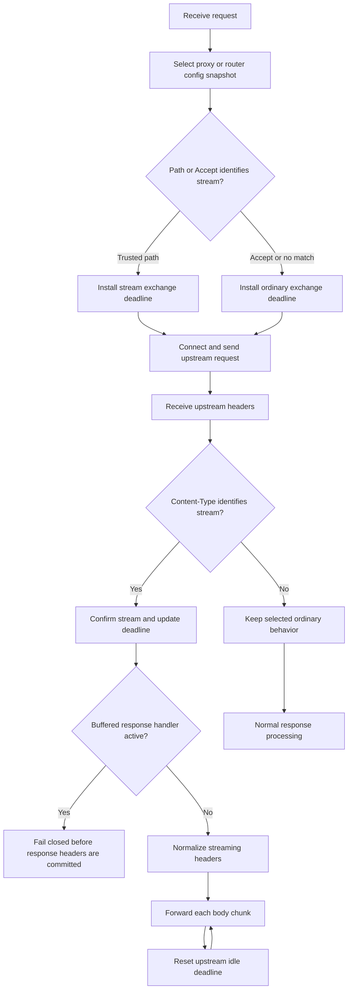

# SSE Passthrough Parity

## Status

- **Decision state:** Accepted; Phases 0 through 3 implemented
- **Owner:** Light Gateway maintainers
- **Created:** 2026-09-03
- **Reference:** [networknt/light-4j#2761](https://github.com/networknt/light-4j/issues/2761)

## Purpose

The Java `light-4j` proxy and router support long-lived Server-Sent Events
(SSE) responses without applying the ordinary whole-request timeout. They can
identify an expected stream from the request `Accept` header or request path,
confirm a stream from the upstream `Content-Type`, protect upstream streaming
headers, and optionally close a stream after an idle period.

Before this implementation, `light-fabric/apps/light-gateway` forwarded
ordinary Pingora response body chunks as they arrived. It also had dedicated
streaming implementations for LLM and MCP traffic, but did not implement the
generic proxy and router configuration or lifecycle behavior introduced by
`light-4j` issue 2761.

This design closes that parity gap for ordinary `proxy` and `router` handler
chains. It does not replace the specialized LLM, MCP, A2A, or WebSocket
streaming implementations.

## Baseline State

The pre-parity baseline had four materially different behaviors:

| Area | Current behavior |
|------|------------------|
| Ordinary proxy/router response | Pingora forwards each response body chunk without assembling the complete body. |
| `ProxyConfig` and `RouterConfig` | They have `maxRequestTime`; the router also has `pathPrefixMaxRequestTime`. Neither value is currently enforced by the gateway request lifecycle. |
| Generic SSE recognition | There is no request `Accept`, request path, or upstream `Content-Type` classification. |
| Specialized streams | LLM and MCP use explicit streaming writers and their own policies. Model-provider sidecar and WebSocket paths also apply specialized timeout controls. |

Ordinary chunk forwarding means a simple upstream SSE response can appear to
work today. That is not equivalent to the Java feature:

- there is no streaming-specific whole-exchange timeout;
- there is no configurable idle timeout between upstream bytes;
- upstream streaming headers are not protected from gateway header mutation;
- there is no response-side promotion when only the upstream response reveals
  that the exchange is a stream; and
- response-body transformations can buffer the stream until end-of-stream.

The last case is particularly important. Detokenization and access-control
response filtering currently collect the complete response before emitting a
transformed body. An unbounded SSE response cannot safely enter either path.

## Goals

- Provide the same six operator-facing streaming properties in both
  `proxy.yml` and `router.yml`.
- Preserve incremental forwarding for generic SSE responses over upstream and
  downstream HTTP/1.1 and HTTP/2 combinations.
- Select the streaming timeout before upstream response headers arrive for an
  operator-configured stream path. Treat a client `Accept` match as provisional
  until the upstream response confirms streaming.
- Promote an ordinary request to streaming behavior when the upstream
  `Content-Type` identifies a stream.
- Enforce an optional idle timeout that resets whenever upstream response bytes
  arrive.
- Keep timeout and stream state isolated to one exchange and one immutable
  configuration snapshot.
- Make incompatible response-body handlers fail closed instead of silently
  buffering an unbounded response or bypassing policy.
- Preserve existing deployments when the new properties are absent.

## Non-Goals

- Do not merge generic SSE with the LLM, MCP, A2A, or WebSocket protocol
  implementations.
- Do not parse, reframe, validate, or synthesize SSE events in the generic
  proxy path. Event data remains opaque bytes.
- Do not add SSE replay, `Last-Event-ID` storage, event persistence, or delivery
  guarantees.
- Do not make `X-Accel-Buffering` mandatory. That header is an optional
  deployment concern, not part of the Java parity contract.
- Do not allow streaming classification to bypass authentication,
  authorization, admission control, rate limiting, request validation, or
  audit requirements.
- Do not apply configuration reloads retroactively to an exchange that is
  already streaming.

## Decision

Add one shared generic streaming policy to `light-pingora` and embed it in both
`ProxyConfig` and `RouterConfig`. The selected route copies the effective
policy into `GatewayRequestContext`; later configuration reloads therefore
affect new requests only.

Classify the exchange in two stages:

1. **Expected stream:** before proxying, match the request path or `Accept`
   header. A path match selects `streamMaxRequestTime` immediately; an `Accept`
   match retains the ordinary deadline until confirmed so an untrusted client
   cannot disable it.
2. **Confirmed stream:** after receiving upstream headers, match
   `Content-Type`. Protect streaming headers, cancel or replace the ordinary
   exchange deadline, and enable the stream idle timeout.

The response body remains on Pingora's normal chunked forwarding path. The
gateway must not introduce a second buffering or event-decoding layer.



## Configuration Contract

The Rust names and defaults must match the Java configuration so the same
Config Server properties can be projected into either runtime.

| Property | Rust type | Default | Meaning |
|----------|-----------|---------|---------|
| `streamResponseContentTypes` | list of strings | `["text/event-stream"]` | Upstream response media types that confirm streaming behavior. |
| `streamRequestAcceptTypes` | list of strings | `["text/event-stream"]` | Request `Accept` media types that select streaming behavior before upstream headers. |
| `streamPathPrefixes` | list of strings | `[]` | Request path prefixes that select streaming behavior before upstream headers. |
| `streamMaxRequestTime` | unsigned milliseconds | `0` | Maximum whole-exchange duration for a stream; zero disables the whole-exchange deadline. |
| `streamIdleTimeout` | unsigned milliseconds | `0` | Maximum silence between upstream response bytes; zero disables the idle deadline. |
| `streamResponseHeaderOverwrite` | list of header names | `Content-Type`, `Cache-Control`, `Connection`, `Transfer-Encoding`, `Content-Encoding`, `Content-Length` | Headers for which the upstream streaming response must remain authoritative. |

Example proxy configuration:

```yaml
maxRequestTime: ${proxy.maxRequestTime:0}
streamResponseContentTypes: ${proxy.streamResponseContentTypes:["text/event-stream"]}
streamRequestAcceptTypes: ${proxy.streamRequestAcceptTypes:["text/event-stream"]}
streamPathPrefixes: ${proxy.streamPathPrefixes:}
streamMaxRequestTime: ${proxy.streamMaxRequestTime:0}
streamIdleTimeout: ${proxy.streamIdleTimeout:0}
streamResponseHeaderOverwrite: ${proxy.streamResponseHeaderOverwrite:["Content-Type","Cache-Control","Connection","Transfer-Encoding","Content-Encoding","Content-Length"]}
```

The router uses the same field names under the `router` property namespace.

An absent property uses the documented default. An explicitly empty media-type
or header list disables that matching or protection category. Empty path
prefixes are ignored. Timeout values are non-negative; zero has the disabling
meaning shown above.

### Media-Type Matching

Matching must follow the Java behavior:

- compare case-insensitively;
- split comma-separated header values;
- ignore media-type parameters such as `charset=utf-8` and `q=1.0`;
- trim surrounding whitespace; and
- require equality after normalization rather than substring matching.

For example, all of the following identify the default SSE media type:

```text
Accept: text/event-stream
Accept: application/json, text/event-stream
Accept: TEXT/EVENT-STREAM; q=1.0
Content-Type: text/event-stream; charset=utf-8
```

Path matching uses the request path already used by routing, excludes the
query string, and follows the Java `startsWith` prefix semantics. Empty
configured prefixes never match.

## Per-Exchange State

Add a small immutable policy value in `frameworks/light-pingora`, shared by the
proxy and router configuration models. After route selection, store the
following request-local state in `GatewayRequestContext`:

```text
streamPolicySnapshot
streamExpected
streamConfirmed
exchangeDeadline
streamIdleTimeout
lastUpstreamProgress
responseHeadersCommitted
```

The exact Rust representation is an implementation detail, but it must meet
these invariants:

- no request mutates `ProxyConfig`, `RouterConfig`, a route snapshot, or a
  gateway-global timeout;
- retry attempts share one absolute whole-exchange deadline;
- an upstream response can promote the exchange from ordinary to streaming;
- once response headers or body bytes are committed downstream, the exchange
  is never retried; and
- configuration reload cannot change the limits of an active exchange.

## Timeout Semantics

### Whole-Exchange Deadline

`maxRequestTime` and `pathPrefixMaxRequestTime` are whole-exchange deadlines,
not socket-idle deadlines. The implementation must first make the existing
ordinary timeout fields effective, then select the stream deadline as follows:

```text
if a configured request path identifies a stream:
    effective deadline = streamMaxRequestTime
else if Accept identifies a possible stream:
    effective deadline = ordinary timeout until Content-Type confirms streaming
else if router pathPrefixMaxRequestTime has a matching prefix:
    effective deadline = matched prefix value
else:
    effective deadline = maxRequestTime
```

If more than one timeout prefix matches, the longest prefix wins. This makes
the most specific route policy authoritative and avoids depending on map
iteration order.

Zero disables the selected deadline. An ordinary request or provisional
`Accept` match can later be confirmed as streaming by the upstream
`Content-Type`; at that point the ordinary deadline is cancelled and replaced
by the remaining `streamMaxRequestTime` policy. With the default value of zero,
it is cancelled. A provisional match receiving a non-streaming response clears
its streaming classification and retains the ordinary deadline.

The deadline must cover connection acquisition, connection establishment,
request upload, response-header wait, every retry, response streaming, and
downstream body completion. It must be based on the request start time, not
reset for each retry or response chunk. Terminal logging, audit persistence,
replay-reservation release, and connection cleanup run outside the deadline so
expiry cannot cancel correctness-critical bookkeeping.

Pingora's `PeerOptions.read_timeout` is a per-I/O progress timeout and cannot
implement this whole-exchange contract by itself. Add a cancellable
whole-exchange deadline at the patched `pingora-proxy` request driver boundary,
with a default-disabled trait hook so other `ProxyHttp` implementations retain
their current behavior. `GatewayProxy` supplies and updates the request-local
deadline after route selection and response classification.

Before downstream headers are committed, expiry returns HTTP 504. After
headers are committed, the gateway closes the stream and records the timeout;
it cannot replace an in-progress SSE response with a new HTTP error document.

### Stream Idle Deadline

When `streamIdleTimeout` is positive, apply it as the upstream read timeout
after the response is confirmed as streaming. Each successful upstream body
read resets that timeout naturally. The timer covers silence between response
chunks; the whole-exchange deadline remains responsible for the request and
response-header phases.

Do not use `PeerOptions.idle_timeout` for this purpose. In Pingora that option
controls how long a released connection remains in the connection pool; it is
not the timeout between bytes of an active response.

Apply the idle policy to subsequent reads immediately after response
classification. The Pingora driver needs a request-local update hook because
the peer was constructed before the response headers arrived.

On idle expiry, close the upstream and downstream exchange, mark the upstream
connection non-reusable, emit a distinct stream-idle outcome, and do not retry
after any response has been committed.

## Response Headers And Framing

The Java handler removes selected outbound headers before copying the upstream
streaming headers. Pingora already represents the upstream response as the
response being sent downstream, so blindly deleting the configured headers
would remove valid upstream `Content-Type` and `Cache-Control` values.

Implement equivalent outcome-based semantics:

1. capture the configured authoritative upstream header values when the
   response is confirmed as streaming;
2. apply normal gateway response-header handlers;
3. restore the upstream values for headers in
   `streamResponseHeaderOverwrite`; and
4. normalize hop-by-hop framing for the downstream HTTP version.

For a streaming response:

- remove `Content-Length` unless the response has already ended with a known,
  complete body;
- never forward contradictory `Content-Length` and `Transfer-Encoding`;
- let Pingora generate HTTP/1.1 chunked framing when the body length is
  unknown;
- do not emit `Transfer-Encoding` on HTTP/2;
- preserve the upstream `Content-Type`, including parameters;
- preserve upstream `Cache-Control` and `Content-Encoding` unless a documented
  security policy rejects that encoding; and
- strip or regenerate hop-by-hop `Connection` semantics for the downstream
  protocol.

Header protection does not bypass mandatory correlation, CORS, rate-limit, or
security headers when those headers are outside the configured overwrite set.
Configuration validation must reject invalid header names.

## Handler Compatibility

Streaming classification changes transport behavior only. All request-side
security handlers still run before upstream selection.

Response handlers fall into two groups:

| Handler behavior | Streaming rule |
|------------------|----------------|
| Header-only, accounting, byte counting, logging, and metrics | Continue incrementally. |
| Complete-body transformation or inspection | Incompatible unless redesigned around an explicitly bounded streaming algorithm. |

The current detokenization and access-control response filters are
complete-body handlers. The gateway must fail closed when either is active for
an expected or confirmed stream:

- if an operator-configured path identifies streaming, reject it before opening
  the upstream exchange;
- treat an `Accept`-only match as provisional and reject only if the upstream
  response confirms streaming;
- if only the upstream response reveals streaming, reject before committing
  upstream response headers downstream; and
- never disable a configured security filter merely to permit streaming.

The implementation must allocate a stable gateway error code for this
configuration/runtime incompatibility before release. The response should use
HTTP 502 when an unexpected upstream streaming response conflicts with the
configured handler chain. A deployment-time validator should also report
known path-based conflicts so operators can correct them before traffic
arrives.

Phase 2 assigns `ERR13027` to this incompatibility. Known path-prefix
conflicts are reported during gateway construction/config validation, while
request-only and response-only classifications remain protected by the
runtime fail-closed checks.

## Cache, Retry, And Connection Rules

- Generic SSE responses are not cached.
- An expected stream disables response caching before contacting upstream.
- A response-side stream confirmation disables any cache admission that has
  not already committed. Cache lookup must not serve a previously buffered
  object as a live SSE stream.
- Connection and pre-header retries remain allowed only while the request is
  replay-safe and the whole-exchange deadline has time remaining.
- No retry is allowed after downstream response headers or any body bytes have
  been written.
- An idle-timeout or malformed-framing connection is not returned to the
  upstream pool.
- Graceful shutdown follows the existing gateway drain policy. Active streams
  may continue only within the configured shutdown drain deadline.

## Observability

Add bounded dimensions rather than raw paths or media-type values:

```text
gateway_stream_kind = none | generic_sse | llm | mcp | a2a | websocket
gateway_stream_classification = request_accept | path_prefix | response_content_type
gateway_stream_outcome = completed | client_disconnect | upstream_error | exchange_timeout | idle_timeout | incompatible_handler | shutdown
```

Record counters for confirmed classifications and outcomes, plus stream
duration and bytes in each direction. An `Accept` preference followed by an
ordinary response is not a stream metric. Reuse the existing bounded endpoint
identity for the endpoint dimension. Logs should include the correlation ID,
endpoint, selected timeout values, classification source, per-exchange and
cumulative byte/duration totals, and outcome without logging SSE event payloads.

The access log must be emitted once, when the stream closes, rather than once
per event. A long-lived stream must not retain unbounded per-event telemetry in
memory.

## Implementation Scope

### `frameworks/light-pingora`

- Add the shared streaming policy and media-type/path matching helpers.
- Extend `ProxyConfig` and `RouterConfig` with the six parity properties and
  Java-compatible defaults.
- Add focused configuration, normalization, and matching tests.
- Expose the selected policy through `ProxyRoute` and `RouterRoute` without
  mutable global state.

### `apps/light-gateway`

- Add request-local streaming classification and deadline state to
  `GatewayRequestContext`.
- Classify expected streams after the effective proxy/router route is selected.
- Apply the selected timeout policy in `upstream_peer` and the request driver.
- Confirm streams in `response_filter` before response headers are committed.
- Protect upstream streaming headers and normalize framing.
- Keep `response_body_filter` incremental and update stream progress without
  copying or parsing event frames.
- Reject incompatible complete-body response handlers.
- Add bounded metrics and terminal outcome logging.

### Patched `pingora-proxy`

- Add a default-disabled, request-local whole-exchange deadline hook.
- Permit response classification to cancel or replace the active deadline.
- Permit response classification to update the active upstream read timeout.
- Ensure deadline expiry cancels both directions and prevents unsafe retry or
  connection reuse.

The Pingora patch should be kept narrow, covered by framework-level tests, and
structured for a possible upstream contribution. Generic SSE policy remains in
`light-pingora` and `light-gateway`; the patch provides transport lifecycle
primitives only.

### Configuration And Documentation

- Add all six properties to the shipped `proxy.yml` and `router.yml` files.
- Publish the fields through the same runtime/configuration registration path
  as the existing proxy and router fields.
- Document units, defaults, zero-value behavior, media-type matching, and
  handler incompatibilities.
- Verify old configuration files deserialize to the compatibility defaults.

## Delivery Plan

### Phase 0: Configuration And Classification

**Status:** Complete (2026-09-03)

- Introduce the shared policy and six config properties.
- Add deterministic request and response classification helpers.
- Snapshot the selected policy into each request context.
- Prove old configurations retain their existing behavior.

Exit gate: configuration and matching unit tests pass, including missing,
empty, mixed-case, parameterized, comma-separated, and invalid inputs.

### Phase 1: Deadlines And Isolation

**Status:** Complete (2026-09-03)

- Make existing `maxRequestTime` and `pathPrefixMaxRequestTime` effective.
- Add the generic request-driver deadline primitive.
- Select `streamMaxRequestTime` immediately for operator-declared stream paths;
  keep the ordinary deadline for provisional `Accept` matches until the
  upstream confirms a streaming response.
- Support response-side cancellation or replacement of the ordinary deadline.

Exit gate: concurrent requests with different route timeouts prove that no
request mutates shared timeout state; retry attempts consume one absolute
deadline.

### Phase 2: Streaming Response Safety

**Status:** Complete (2026-09-03)

- Apply the upstream read-idle timeout.
- Implement response-header authority and protocol-correct framing.
- Disable cache admission and post-commit retries.
- Reject incompatible response-body handlers.
- Add stream outcome metrics and logs.

Exit gate: live Pingora tests observe the first event before the upstream
finishes, observe multiple separated events without coalescing the whole body,
and prove idle closure, header behavior, and fail-closed handler interaction.

### Phase 3: Protocol Matrix And Rollout

**Status:** Complete (2026-09-03)

- Exercise HTTP/1.1 and HTTP/2 on both sides of the gateway.
- Test direct proxy and service-router selection.
- Run soak and graceful-shutdown exercises with long-lived connections.
- Roll out first with the compatibility defaults and explicit stream path
  prefixes only where required.

Exit gate: the qualification matrix passes with bounded memory, stable file
descriptor counts, no cross-request timeout interference, and no retry after
response commitment.

Run the repeatable release gate from the repository root:

```bash
./scripts/run-sse-passthrough-phase3-gates.sh
```

The gate exercises all four downstream/upstream HTTP/1.1 and HTTP/2
combinations through a live Pingora listener, plus service-router selection.
It also runs 32 concurrent two-second responses with 100 ms heartbeats and
requires post-soak file descriptor growth of at most four and resident-memory
growth of at most 64 MiB. The same operational test proves that a response is
not retried after its headers and first event are committed, that shutdown
waits for an active stream to drain within the configured 500 ms graceful
period, and that a stream exceeding a 100 ms drain deadline is forcibly closed
and reported as a shutdown termination. Resource qualification is Linux-only
because it reads process metrics from `/proc`.

Phase 3 also makes `http2Enabled` effective for proxy and router upstreams.
When enabled, each selected upstream peer advertises HTTP/2 with HTTP/1.1
fallback through ALPN. The choice is captured in request context, so a config
reload or a concurrent request cannot change the protocol policy of an active
exchange.

## Verification Matrix

| Test | Required evidence |
|------|-------------------|
| Incremental passthrough | Client receives event 1 while the upstream connection remains open before event 2. |
| Accept detection | Default, mixed-case, parameterized, comma-separated, and multiple header values classify correctly. |
| Path detection | Configured prefixes select stream policy; empty or unrelated prefixes do not. |
| Response promotion | An ordinary request receiving `text/event-stream` cancels or replaces its ordinary deadline before streaming. |
| Ordinary timeout | Non-streaming requests still enforce `maxRequestTime` and longest matching `pathPrefixMaxRequestTime`. |
| Timeout isolation | Concurrent requests retain independent deadlines and config snapshots. |
| Idle timeout | Each chunk resets the idle timer; silence closes the stream; zero disables the timer. |
| Framing | No conflicting length/transfer headers across HTTP/1.1 and HTTP/2 combinations; HTTP/1.0 uses close-delimited framing without chunk markers. |
| Header authority | Configured upstream stream headers survive normal gateway header mutation. |
| Handler conflict | Detokenization and response filtering reject expected and response-discovered streams without bypass. |
| Retry boundary | Pre-header replay-safe failure may retry; post-commit failure never retries. |
| Cache boundary | Expected and confirmed SSE responses are not admitted to or served from cache. |
| Disconnect | Client disconnect cancels upstream work and releases permits and connections. |
| Reload | A config reload affects new requests and leaves an active stream on its captured policy. |
| Shutdown | Active streams drain only within the configured graceful-shutdown deadline. |

## Compatibility And Rollout

The new fields are additive. Their Java-compatible defaults classify
`text/event-stream`, disable the stream whole-exchange and idle deadlines, and
protect the standard stream headers. For Rust rollout compatibility,
`maxRequestTime` defaults to zero so the newly effective ordinary
whole-exchange deadline is opt-in; an explicitly configured nonzero value and
`pathPrefixMaxRequestTime` remain enforced.

That correction can expose upstream calls that currently exceed configured
timeouts. Before enabling enforcement in production:

1. inventory configured proxy/router timeout values;
2. compare them with observed non-stream request duration percentiles;
3. add required path-specific exceptions;
4. identify SSE endpoints by path where clients do not send an `Accept`
   header; and
5. canary with timeout and stream outcome metrics enabled.

Use the following rollout sequence for each gateway deployment:

1. leave the additive compatibility defaults unchanged;
2. add `streamPathPrefixes` only for SSE routes whose clients omit
   `Accept: text/event-stream`;
3. run `run-sse-passthrough-phase3-gates.sh` against the release revision;
4. canary one instance and confirm stream completion, timeout, disconnect, and
   upstream-error outcomes while watching RSS and open-file trends;
5. expand the canary only after ordinary-request timeout rates remain at the
   pre-rollout baseline; and
6. enable upstream `http2Enabled` independently for proxy and router pools
   after their targets are confirmed to negotiate HTTP/2 correctly.

Rollback consists of reverting to the previous gateway image. Setting both
stream timeouts to zero disables the new stream timers but does not disable
classification, header correctness, cache safety, or handler-conflict checks.

## Acceptance Criteria

The parity issue is complete when:

- proxy and router expose all six properties with Java-compatible defaults;
- request `Accept`, request path, and response `Content-Type` classification
  pass the verification matrix;
- ordinary and streaming whole-exchange timeouts are enforced without shared
  state mutation;
- the stream idle timeout is based on active upstream read progress;
- SSE bytes reach the client incrementally with protocol-correct framing;
- response-body security transforms fail closed for unbounded streams;
- caching, retry, reload, disconnect, and shutdown boundaries are qualified;
- the dedicated LLM, MCP, A2A, and WebSocket tests remain green; and
- the Java and Rust configuration examples can use the same six field names
  and zero-value semantics.
