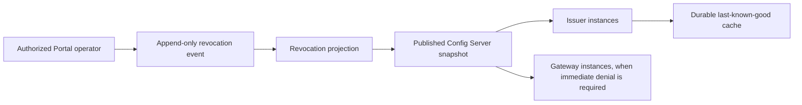

# Service Identity, mTLS, And Deferred Revocation

Status: design decision; revocation implementation deferred until production need.

This document defines the intended role of `light-identity-issuer` for controlled,
long-running service workloads. It also records when Light Fabric should combine
mutual TLS (mTLS), an application token, and a user access token.

The Light CLI is deliberately outside this workload-certificate model. It is a
public client that may be installed on intermittently connected machines, so it
uses ordinary server-authenticated TLS and the signed-in user's access token when
calling the Gateway. It does not receive or present a client certificate.

## Decisions

1. Portal and Config Server are the future authority for workload-certificate
   revocation policy.
2. Revocation distribution is not implemented yet. The current in-memory
   revocation list is not a production revocation mechanism.
3. An expired workload certificate cannot renew. Controlled services must renew
   before expiry, using the issuer-provided `renewAt` deadline.
4. Official environments should use mTLS on sensitive service-to-service hops
   where both endpoints are controlled by Light Fabric.
5. A user-delegated service-to-service call should normally carry all three
   independently verified proofs:
   - mTLS identifies the connecting workload instance and protects the hop;
   - the app token identifies and authorizes the immediate calling application;
   - the user access token identifies the user whose authority is being delegated.
6. A service-only operation carries mTLS and an app token, but must not invent a
   user identity when no user is involved.
7. Browser and public CLI ingress uses server TLS and a user token. It does not
   require mTLS or a distributable application secret.

## Why The Three Proofs Are Not Redundant

Each proof answers a different question:

| Proof | Question answered | Typical enforcement |
|---|---|---|
| mTLS certificate | Which deployed workload instance opened this connection? | CA chain, validity, environment, role, service ID, and optionally install ID |
| App token | Which immediate application is calling, and what application operations may it perform? | Signature, issuer, audience, expiry, `token_use=app`, `sid`, scopes, and route policy |
| User access token | Which user authorized the operation, and what may that user access? | Signature, issuer, audience, expiry, host/tenant, subject, roles, and resource ACL |

For a delegated request, authorization is the intersection of these identities.
A valid user is not permission for an arbitrary service to act as that user. A
valid application is not permission to act for an arbitrary user. A trusted
certificate is not permission to call every route.

The receiver must bind the transport identity to the app identity. Accepting any
certificate signed by the platform CA is insufficient. At minimum:

- the certificate SAN role must match the route's expected role;
- the certificate SAN service ID must equal the app token `sid`;
- the certificate environment must match the receiving environment;
- the certificate must be valid and chained to the environment's approved CA;
- the app and user tokens must independently satisfy their route contracts.

Where stronger instance binding is required, the app token can additionally
carry a certificate confirmation claim or install ID. That is a later hardening
step; service-ID binding is the required baseline.

## Recommended Connection Profiles

| Connection | Transport and credentials | Reason |
|---|---|---|
| Browser to Gateway | Server TLS + user token | Browsers are public clients and cannot protect a platform client key |
| Light CLI to Gateway | Server TLS + user token | The CLI is public and intermittently connected; no client certificate |
| Gateway to internal API/MCP service for a user | mTLS + Gateway app token + user token | Authenticate the hop, immediate caller, and delegated user |
| Workflow or Agent to Gateway for a user | mTLS + workload app token + user token; action reference where required | Prevent a copied bearer token from changing workload origin |
| Service maintenance or control operation with no user | mTLS + app token | Do not manufacture a user leg |
| Health check carrying no authority | Network-restricted endpoint; server TLS where it crosses a host boundary | Keep privileged credentials off non-privileged probes |
| External third-party provider | Provider-approved TLS and authentication profile | Platform mTLS is not assumed to be supported externally |

This is a policy recommendation, not a requirement that every loopback call or
every sidecar connection terminate its own mTLS session. A service mesh or local
authenticated proxy may terminate mTLS, but the downstream service may trust the
forwarded peer identity only over an authenticated internal channel that strips
client-supplied identity headers.

## Security Benefit Of mTLS

mTLS materially improves the service-to-service threat model when it is bound to
the app identity.

### What it adds

- **Bearer-token replay resistance.** A stolen app token alone is insufficient
  from a machine that does not hold an accepted workload private key.
- **Workload provenance.** The receiver authenticates the process or instance at
  the other end of the TLS connection, not merely a claim in an HTTP header.
- **Defense in depth.** A mistake in token routing, logging, or storage does not
  automatically become service impersonation.
- **Per-install attribution.** Unique leaves can identify which instance made a
  connection, improving incident response and audit evidence.
- **Narrower network trust.** Network reachability alone does not make a caller a
  trusted internal service.
- **Independent credential rotation.** App-token signing keys and workload CAs
  can rotate on different schedules and respond to different compromises.

### What it does not add

- It does not protect a fully compromised workload host that can use the private
  key and tokens while they are available.
- It does not correct excessive app scopes, user permissions, or route-policy
  mistakes.
- It does not make a forwarded user bearer resource-specific. Every receiver
  must still validate the user token and its own ACL.
- It does not help when the receiver accepts a certificate for service A with an
  app token for service B. Explicit peer/app binding remains mandatory.
- It does not preserve end-to-end identity through an unauthenticated TLS
  terminator or proxy.
- It does not eliminate revocation and renewal operations. Poor certificate
  lifecycle management can create availability failures.

## Costs And Risks Of mTLS

- A CA and issuing service become security-critical infrastructure.
- Every workload needs secure private-key generation, storage, rotation, and
  destruction.
- Renewal must complete before expiry; clock skew, issuer outages, and failed
  reloads must be observable and rehearsed.
- Load balancers, sidecars, and service meshes must preserve authenticated peer
  identity without trusting spoofable inbound headers.
- Separate environments need separate trust boundaries. Prefer a distinct CA per
  environment; if a CA is shared, the receiver must enforce the certificate's
  environment attribute explicitly.
- Debugging is more involved because failures can occur during the TLS handshake
  before application logs or HTTP error responses exist.
- CA compromise has a large blast radius and requires CA rotation plus trust
  migration.
- Certificate issuance and renewal add operational load, although connection
  pooling keeps per-request TLS cost modest.

These costs are justified for controlled services that already have managed
deployment, secret storage, monitoring, and continuous runtime. They are not
justified for public clients such as Light CLI.

## Security Without mTLS

A no-mTLS service profile uses server-authenticated TLS plus app and user tokens.
It is simpler and can still be secure when all of the following hold:

- app tokens are short-lived, audience-restricted, and narrowly scoped;
- every receiver validates the immediate app identity and user identity;
- tokens are never placed in URLs or logs;
- credential-bearing redirects are disabled;
- network policy restricts service ingress;
- token rotation and revocation are reliable;
- sensitive services do not accept caller identity from unauthenticated headers.

The principal residual risk is bearer replay: anyone who steals a valid app token
can use it from another reachable machine until it expires or is revoked. Network
policy reduces that exposure but does not cryptographically bind the token to a
workload. Proof-of-possession tokens can reduce the gap, but they introduce a key
and lifecycle problem similar to mTLS.

For low-risk internal APIs, a short-lived app token over server TLS may be an
acceptable operational trade-off. For Gateway, Workflow, Agent, Knowledge, and
other services that forward user authority or perform privileged operations,
mTLS plus app-token binding is the recommended official-environment profile.

## Deferred Revocation Authority

Revocation policy will be owned by Portal and distributed by Config Server when
production requires it. Portal provides the authorization, approval, audit, and
event history. Config Server distributes the resulting immutable policy snapshot.
Neither service receives or uses the CA private key; certificate signing remains
the sole responsibility of `light-identity-issuer`.

The intended future flow is:

### Policy identity

A revocation entry should be scoped by at least:

- environment;
- issuing CA identity or generation;
- certificate install ID;
- revocation timestamp;
- non-secret reason/category;
- actor and policy revision in the Portal audit record.

The effective key is `(environment, CA generation, install ID)`, not just a
service ID. Revoking one failed instance must not revoke every healthy instance
of the same service.

### Renewal lineage and supersession

Revocation policy and renewal lineage solve different problems. Even before an install is
revoked, a copied still-valid certificate and key must not be able to fork an unlimited renewal
chain after the legitimate workload has rotated. A production issuer therefore also needs a
durable, atomic current-certificate record keyed by `(environment, CA generation, install ID)`.

Successful renewal must compare-and-swap the presented certificate serial or fingerprint to the
new certificate. Once that succeeds, every later attempt using the predecessor is refused even if
the predecessor has not expired. The state must be shared consistently by every issuer replica and
survive restart; an in-memory nonce cache is not sufficient. A race is intentionally first-writer
wins and must emit enough audit evidence for an operator to recover the displaced legitimate
workload by revoking the install and enrolling a new install ID.

This lineage store is deferred with the production revocation work. Until both exist, the issuer is
appropriate for development and qualification, not as the final production credential authority.

### Monotonic behavior

Revocation is not an ordinary replaceable configuration value. Once accepted,
an older snapshot must not silently remove it. The implementation must:

- reject malformed, empty-by-accident, or revision-regressing updates;
- atomically apply validated updates;
- preserve accepted revocations in a durable last-known-good cache;
- load that cache before serving issuance or renewal after restart;
- avoid casual un-revocation; recovery should normally enroll a new install ID.

If deliberate un-revocation is ever supported, it requires a separate audited
operation rather than snapshot rollback.

### Availability behavior

If Config Server is temporarily unavailable, the issuer continues enforcing its
durable last-known-good revocations. It must never replace them with an empty
list. Production policy should define a maximum snapshot age; after that limit,
the issuer should fail closed for renewal because it cannot prove it has current
revocation information.

Issuer-only enforcement prevents a revoked installation from renewing. Its
already-issued certificate remains usable until expiry. If production requires
immediate denial, Gateway and other mTLS receivers must consume the same policy
and reject the install ID during connection admission.

## Deferred Implementation Boundary

No revocation distribution, Portal command, projection, Config Server property,
Gateway enforcement, or local cache is authorized by this document. Those pieces
are intentionally deferred.

Before implementation, define and approve:

1. the Portal command/event schema and required operator roles;
2. the immutable projection and Config Server property contract;
3. revision and rollback rules;
4. issuer cache format, locking, atomic replacement, and maximum staleness;
5. whether issuer-only expiry-bounded enforcement is sufficient or Gateway must
   enforce install revocation immediately;
6. CA and environment separation;
7. metrics, alerts, audit evidence, and disaster-recovery exercises.

## Qualification Requirements For A Future Rollout

- A revoked install cannot renew on any issuer replica.
- Restarting an issuer cannot forget a revocation.
- Config Server outage retains the last-known-good list.
- Empty, malformed, stale, and revision-regressing snapshots fail closed.
- Snapshot rollback cannot resurrect a revoked install.
- An expired certificate cannot renew.
- A certificate for one service or environment cannot be combined with another
  service's app token or admitted in another environment.
- CA rotation supports an overlap period without weakening service/app binding.
- When immediate Gateway enforcement is enabled, an already-issued revoked leaf
  is denied on a new connection.

## Recommendation

Use mTLS together with app tokens for privileged communication between managed,
long-running Light Fabric services. Add the user token only when a service is
acting on behalf of a user. Keep public clients on ordinary server TLS and user
authentication.

This layered model is more secure than bearer tokens alone because compromise of
one credential class is insufficient for service impersonation. The benefit is
real only when certificate identity is bound to the app token, environments are
isolated, certificates renew before expiry, and the operational lifecycle is
treated as production infrastructure rather than static files copied at deploy
time.
