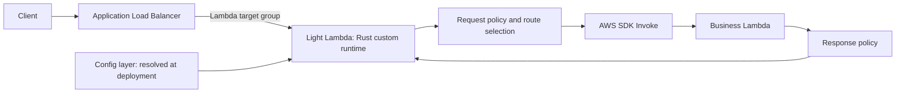

# Light Lambda and portable serverless policy runtime

Status: proposed design; no Rust implementation or cloud qualification is implied.
Date: 2026-10-09.

## Recommendation

Build `apps/light-lambda` as the first serverless application in Light Fabric. Start with the existing **gateway Lambda invoking a business Lambda** topology, preserve its observable contract, and reuse existing Rust security, client, and configuration components. Keep AWS event conversion and invocation separate from policy evaluation. Add other platforms through explicit adapters after the AWS implementation passes parity and operational qualification.

The broader product is a portable serverless policy runtime. “All serverless frameworks” is a direction, not a promise that one native sidecar can run everywhere. Platforms differ in process support, invocation protocols, lifecycle, and networking. Publish a tested capability matrix for each adapter.

Three direct answers:

- **Add Java tests before porting:** yes, targeted characterization and boundary tests, plus language-neutral fixtures consumed by Java and Rust. Match behavior and security invariants, not test counts or Java internals.
- **Run Lambda locally in a container:** yes, for packaging and Runtime API integration. Use AWS Runtime Interface Emulator (RIE) or SAM where appropriate, with fake dependencies. These are local emulation tests, not live AWS proof.
- **Run real AWS tests:** yes, before claiming production readiness. IAM, VPC access, freeze/thaw, scaling, deadlines, architecture compatibility, and platform integration need actual AWS qualification. A container-image deployment is optional; a custom-runtime ZIP is sufficient for the first release.

## Current implementation and evidence

Source inspection used these clean checkout revisions. Tests were inventoried, not executed for this design.

| Repository | Revision | Relevant evidence |
| --- | --- | --- |
| `light-lambda-native` | `99cb7d3e61a4e370aba140be11aa43379a3a4d7e` | `LambdaApp`, `LightLambdaExchange`, `Handler`, chain executors, middleware, `pom.xml`, native ZIP packaging |
| `light-aws-lambda` | `dbda1936df47b76fc4130b5b7fa8a353765d5faf` | `custom-runtime/.../Runtime.java`, Runtime API endpoint validation, schema validation modules |
| `http-client` | `3a439a13bcd6472188a483dd8f9b74aa5695dc3c` | Java dependency boundary; no complete Java-to-Rust client parity audit performed |
| `light-fabric` | `0aa6f8fe45a0f7648a7e0811ac2b52bfb8ba8dc3` | `apps/light-gateway`, `frameworks/light-pingora`, `crates/light-runtime`, `config-loader`, `light-client`, `light-security`, `portal-registry` |
| `controller-rs` | `605b88e2184833d9c9bd30feff73296be95d0611` | Microservice registration/session routes and runtime state; no serverless polling protocol established by this inspection |

Java source paths below are relative to `light-lambda-native/src/main/java/com/networknt/aws/lambda/`:

- `app/LambdaApp.java` accepts `APIGatewayProxyRequestEvent`, selects a chain, executes it, and returns `APIGatewayProxyResponseEvent`. Optional request/response base64 encoding is part of the compatibility surface.
- `app/LambdaStreamApp.java` is a second entry point (`RequestStreamHandler`). It parses a v1 event and, when parsing fails, runs the default chain over the raw stream body. It also logs the full raw request at debug level. **Deferred:** the first release supports only REST proxy v1 events through the `LambdaApp` contract; the stream handler stays a visible `deferred` ledger row, and its body logging is not carried forward.
- `handler/middleware/proxy/LambdaProxyMiddleware.java` maps `path@method` to a function, normalizes method case, supports path templates, and invokes AWS Lambda through `LambdaAsyncClient`. The forwarded payload is the finalized request event. This is a separate gateway function, not an external extension attached to the business function.
- `handler/middleware/limit/RateLimiter.java` keeps counters in process-local maps. Existing rate limiting must not be described as a fleet-wide quota.
- `src/main/resources/config/handler.yml` (relative to repository root) defines request, proxy, response, and admin chains. The default request chain includes metrics, limit, traceability, correlation, CORS, headers, transformations, audit, token, router, specification, security, sanitizer, and validator.
- `pom.xml` depends on `light-aws-lambda` runtime/validation modules, `http-client`, light-4j configuration modules, and AWS SDK clients. Replacing these means preserving selected contracts, not translating each dependency.

The current test tree contains **29 `*Test.java` files and 95 literal `@Test` annotations**. These are source counts, not executed test results or a coverage percentage. Existing tests cover exchange/chain behavior, route resolution, several security paths, headers, CORS, transformations, validation, metrics, audit, limits, and admin handlers. The native packaging Python tests are separately invoked and are not currently part of Maven/CI according to the README.

GitNexus navigation returned no execution processes for the initial queries; symbol context also identifies interface-dispatch limits. Direct source inspection therefore anchors this proposal; graph results are not proof of complete behavioral coverage.

## Product boundaries and deployment modes

### 1. AWS gateway function: first release



The owner confirms that existing Java customer deployments already use an Application Load Balancer (ALB) with the gateway function registered as a Lambda target. Rust retains that ingress topology; this migration does not replace API Gateway. The ALB provides TLS termination and listener rules; authentication, authorization, rate limiting, validation, and routing to business functions are the gateway's job.

The first release supports the **ALB Lambda target event** and its response format. ALB converts HTTP requests into JSON and invokes Lambda. In `light-aws-lambda/custom-runtime/.../Runtime.java`, `getInvocation` reads that JSON from the Runtime API and deserializes it into `APIGatewayProxyRequestEvent` with unknown-property failures disabled. Shared fields map directly; the Java class name does not establish API Gateway ingress. The repository's private API Gateway SAM template is sample deployment material, not evidence of the customer topology.

A local synthetic probe using the existing shaded Java JAR confirmed that single-value ALB headers populate `getHeaders()`, multi-value headers populate only `getMultiValueHeaders()`, `requestContext.elb` is discarded, API Gateway identity metadata is not synthesized, and encoded query values remain encoded. This is local deserialization evidence, not a full middleware test or AWS qualification. `JwtVerifyMiddleware` reads the single-value header map and verifies the bearer token according to configuration; no general multi-value-to-single-value request normalization was found in the inspected source. The deployed target group's header mode and the exact customer artifact/configuration remain to be recorded.

Characterize raw ALB events through the existing Java deserializer and configured chain, capturing the business invocation payload and final response. Use synthetic raw envelopes at L0/L2 and sanitized real ALB captures at L3. Differences the Rust adapter must handle:

- **Multi-value headers** are a target group setting. When enabled, requests carry `multiValueHeaders`/`multiValueQueryStringParameters` and the response must use `multiValueHeaders`; when disabled, duplicate headers and query keys collapse to the last value. The proposed Rust contract requires multi-value mode so repeated headers, `Set-Cookie`, and repeated query values are preserved, and rejects single-value requests. This is a deliberate migration requirement, not proven Java parity. Inventory the existing Java target-group setting; preserve it on the Java rollback target and use a separate multi-value target group for Rust. Do not infer the deployed mode solely from the source.
- **Query strings are not decoded by ALB.** Java deserialization also preserves encoded values. Rust proposes decoding once for policy evaluation. Characterize the complete Java chain and forwarded payload before approving the Rust forwarding contract, including `%2F`, `%252F`, `%2B`, literal `+`, and encoded keys. A changed value seen by the business function is an intentional change, not equivalent behavior; retain raw values alongside normalized values.
- **Response shape.** Return `statusCode`, `statusDescription`, `isBase64Encoded`, and headers in the ALB form; verify the minimum accepted response at L2/L3.
- **Health checks.** Lambda target health checks are off by default. If enabled, each one invokes the gateway, so answer the health-check event locally without dispatching to a business function.
- **Invoke permission.** Grant `lambda:InvokeFunction` to `elasticloadbalancing.amazonaws.com` scoped by `SourceArn` to the target group.

**Business-function event contract.** Existing business functions receive the serialized `APIGatewayProxyRequestEvent` produced from ALB JSON and modified by Java middleware. This is a v1-shaped payload, not proof that API Gateway populated its metadata. Rust proposes the **fullest v1-shaped event it can honestly populate**, then maps the business response back to ALB. Additional metadata and normalization must be characterized and approved in the ledger; unchanged business-function behavior is an acceptance gate, not an assumption:

- **From the request:** `httpMethod`, `path`, `headers`/`multiValueHeaders`, `queryStringParameters`/`multiValueQueryStringParameters` (decoded once), `body`, `isBase64Encoded`.
- **From routing:** `resource` and `requestContext.resourcePath` (the matched route template), and `pathParameters` from the template or the OpenAPI spec, as `OpenApiMiddleware` does today.
- **From the gateway:** `requestContext.requestId` (the gateway's request ID, also used for correlation), `requestContext.httpMethod`/`path`, `requestTime`/`requestTimeEpoch`, and `requestContext.identity.sourceIp` from the ALB-appended (rightmost) `X-Forwarded-For` entry. Earlier entries are client-controlled and never used as identity.
- **`requestContext.stage`:** a configured value per deployment (in `values.yml`), since there is no API Gateway stage.
- **`requestContext.authorizer`:** the Rust gateway fills this with the verified principal: `principalId` and the verified token claims in the shape an API Gateway authorizer context uses. It is built only from successful verification, never copied from request input, and absent when the route does not authenticate.
- **Fields with no ALB equivalent** (for example `apiId`, `domainName`, `accountId`) are set from configuration or left null; each is a ledger row with its chosen value.

HTTP API v2, Function URL, WebSocket events, streaming responses, and non-HTTP triggers are later capabilities with their own adapters; never silently interpret one event family as another.

The gateway uses its AWS execution role to invoke allowlisted business function ARNs/aliases. The allowlist must exclude the gateway's own function ARN and aliases so a misconfigured route cannot loop. Callers must not be able to supply arbitrary function names or endpoint overrides. Restrict business-function IAM/resource policies and entry points so users cannot bypass the gateway. Network proximity or a header saying “verified” is not proof of authorization.

This mode preserves business runtimes and deployments, but costs a second invocation, an extra network hop, and potentially two cold starts. Measure the complete path before deciding whether a colocated model is worth its complexity.

Platform limits shape this topology and belong in the MVP contract:

- **Payload size.** ALB limits request bodies to 1 MB and the complete response JSON to 1 MB. Check final serialized response bytes after response handlers, including headers, JSON escaping and base64 expansion. An oversized response becomes a bounded minimal error without re-running the response chain. These limits are separate from the 6 MB synchronous Invoke payload limit.
- **Ingress timeout.** The ALB idle timeout (60 s by default) can be shorter than the function timeout. Set one absolute deadline at invocation entry from the smaller of the Lambda deadline and entry time plus configured ingress timeout, subtracting the response reserve once. All policy waits and dispatch share its remaining budget. Local cancellation cannot stop a business Lambda already invoked. Verify the ALB's exact timeout behavior for Lambda targets at L3.
- **Concurrency.** The gateway holds its own concurrency slot while the business Lambda runs, so one request consumes two slots from the account limit. Plan reserved concurrency for both functions and define how a throttle is reported to callers (for example 429 versus 502).
- **Network reachability.** A VPC-attached gateway needs NAT or VPC endpoints to reach Lambda Invoke and the JWKS endpoint.

### 2. Container serverless ingress/egress

Where a platform supports multiple containers or processes, use the existing `apps/light-gateway` HTTP profile as the starting point. Make it the platform ingress target and keep the business listener private. Route outbound calls explicitly through the proxy if outbound policy is required; inbound protection does not imply transparent egress interception.

Do not create a second HTTP gateway implementation just to give it a serverless name. Reuse shared policy improvements across `light-gateway` and `light-lambda`, and qualify each platform's startup ordering, readiness, termination, request concurrency, and CPU-allocation rules.

### 3. AWS colocated runtime/extension: later, optional

An AWS external extension receives lifecycle notifications and may provide local services or telemetry. It does **not** automatically intercept and authorize function invocations. A policy-enforcing colocated mode needs a runtime wrapper/custom runtime or a cooperating application adapter that places policy evaluation before business execution. Define runtime compatibility, process supervision, failure behavior, and bypass prevention before implementing it.

Lambda container images package a function execution environment; they do not provide a Kubernetes-style sidecar deployment model. Choose this mode only after benchmarking the gateway-function approach and establishing a concrete language/runtime requirement.

### Platform roadmap

| Platform family | Candidate deployment | Required qualification |
| --- | --- | --- |
| AWS Lambda behind ALB | Rust gateway function with Runtime API and AWS SDK Invoke | First target: ALB multi-value event in, REST proxy v1 event to business functions, ZIP, one architecture initially |
| AWS HTTP API / Function URL | Same binary, explicit v2 adapter | Only if a deployment needs that ingress; cookies, raw query/path, base64, authorization and response mapping |
| Knative / OpenFaaS / container-based serverless | Existing HTTP gateway where supported | Private upstream, ingress ownership, concurrency, shutdown and scale-to-zero |
| Cloud Run / Azure container offerings | HTTP gateway or supported colocated deployment | Verify specific product and deployment mode; do not assume universal sidecar support |
| Managed function runtimes | External gateway or supported wrapper/extension | Provider-specific trigger and lifecycle contract |
| Edge isolates / restricted WASM environments | Possible reduced policy library or remote gateway | Native processes and the full Tokio/AWS stack cannot be assumed; separate feasibility work |

SQS, Kafka, EventBridge, and similar triggers require separate message contracts, retry/acknowledgment and partial-batch semantics. They are not HTTP events with a different envelope and are excluded from the first release.

## Rust architecture

Keep `apps/light-lambda` thin. Introduce only abstractions demonstrated by the AWS adapter and shared gateway policy needs. Names below are proposed, not existing crates.

```text
apps/light-lambda/                 bootstrap, dependency wiring, packaging
frameworks/light-lambda/           AWS event codec, invocation metadata, Runtime API integration
crates/serverless-core/            invocation envelope, dispatch contract, pipeline orchestration
crates/serverless-aws/             SDK Invoke backend, AWS error mapping and credentials
tests/serverless-conformance/      shared fixture schema, runners, result comparison
```

Use the maintained Rust Lambda runtime/events libraries and AWS Rust SDK where they meet the contract; pin compatible versions through the workspace. Avoid reimplementing the Runtime API, signing, or credential refresh without a demonstrated need. Keep AWS SDK dependencies out of the policy core. Feature-gate optional integrations when that measurably reduces artifact size and startup cost.

### Reuse and extraction

| Existing component | Intended use | Boundary to verify |
| --- | --- | --- |
| `config-loader` | Typed configuration, embedded/local sources, substitution and decryption | Preserve precedence; files use highest-priority selection while values merge |
| `light-runtime` | Config Server fetch contract (used at deployment time by the layer builder), module metadata | Current startup assumes service lifecycle/listeners and a Config Server fetch; the Lambda path loads the layer at Init instead, without a dummy HTTP server |
| `light-client` | Outbound HTTP/TLS and OAuth support | It is not an AWS Invoke client or a guaranteed full replacement for Java `http-client` |
| `light-security` | Existing token verification and principal/rejection models | It already depends on runtime/client types; measure dependency size and preserve accepted identity boundaries |
| `light-pingora` modules | Source of existing handler/config semantics | Handler registration and execution are tied to Pingora's service lifecycle; they are not a drop-in Lambda pipeline |
| `light-rule` | Supported policy/transformation logic | Java class-name plugins cannot be loaded into Rust; explicit replacements required |

The existing [handler-chain design](../../design/handler-chain.md) deliberately started with Pingora and deferred a transport-neutral framework. This proposal supplies a concrete second transport, but does not authorize a broad gateway rewrite. Extract small policy operations only when needed, prove unchanged gateway behavior with focused tests, and keep HTTP I/O in its adapter. A future common policy crate is justified by actual reuse, not by moving every handler at once.

### Invocation and policy contract

The normalized invocation carries:

- method, raw path/query, parsed query multimap, headers as a multimap, and body bytes;
- event family/version and retained provider metadata needed for lossless backend forwarding;
- request ID, trusted source metadata, absolute deadline, and cancellation signal;
- immutable configuration snapshot reference and a separately stored verified principal;
- route/backend decision and telemetry context, isolated from caller-supplied headers.

Preserve the original AWS envelope alongside normalized fields. Specify which transformed fields are written back when invoking the business function. Decode base64 exactly once; re-encode according to the response adapter. Preserve repeated query values, `Set-Cookie`, null/empty bodies, and meaningful header values. Never use a generic JSON round trip to claim byte-for-byte parity for binary bodies.

Compile configured chains into an immutable execution plan with stable handler IDs. Validate unknown handlers, cycles, incompatible options, unsupported plugins, and ordering requirements before activation. Keep compatibility mappings for selected Java names in a migration tool, not reflection in the Rust runtime.

The execution contract is request policy → one backend dispatch or local response → applicable response policy → finalization. Authentication/validation failures cause **zero backend invocations**. Error responses still receive required CORS, correlation, audit, and metrics treatment. Finalization runs once, including on cancellation and backend failure. Separate provider runtime failures from valid HTTP error responses: a policy denial is a proxy response, not a Runtime API invocation error.

Preserve configured order when compatible, but reject unsafe combinations. For example, identity-based limits require verified identity before quota evaluation; a coarse source/instance limit can precede authentication. Sanitization and transformations must have an explicit relationship to validation and route selection so a validated request cannot later become a different unvalidated request.

Use asynchronous I/O, bounded body sizes and queues, and per-invocation state. Do not port Java worker pools mechanically. Single-invocation Lambda execution is not permission to use global mutable request state: HTTP adapters and future platform modes may be concurrent.

### Backend dispatch and failures

First support synchronous AWS `RequestResponse` invocation against configured aliases. Handle SDK transport failures, throttling, access denial, missing targets, timeouts, the AWS `FunctionError` indicator, and malformed business proxy responses separately. An HTTP-successful SDK invocation is not necessarily a successful function execution.

Derive every operation budget from the smaller of remaining invocation time and the ingress timeout, reserving time for response encoding and Runtime API reporting. Bound SDK retries explicitly. Do not automatically repeat a potentially completed business operation after an ambiguous timeout; exactly-once delivery cannot be promised. Non-idempotent operations require an application idempotency contract before retry can be enabled. Cancellation stops local work but cannot guarantee that an already invoked business Lambda stops.

Add generic HTTP dispatch only when a concrete platform needs it; reuse the gateway's destination validation and client policy rather than allowing arbitrary request-controlled URLs.

## Portal Config Server and controller-rs

Portal manages desired configuration and Config Server resolves it; controller-rs is not used by the AWS gateway function (see below). No direct database reads or projection writes from the gateway. Neither Config Server nor controller-rs is on the request path.

### Configuration delivered as a Lambda layer

Configuration is resolved at deployment time and packaged as a Lambda layer, not fetched on cold start. Each function version pins one layer version, so configuration is immutable for the life of an execution environment.

1. **Resolve.** At deployment, the pipeline fetches the resolved configuration through the existing runtime contract: `/config-server/configs` with `host`, `serviceId`, and `envTag`, plus certificate/file endpoints where needed. Preserve content-type handling and metadata such as `x-light-config-host-id`, snapshot ID and content digest.
2. **Validate and package.** Validate the complete effective configuration and compile the route/policy plan before publishing the layer. Record the snapshot ID and digest inside the layer. A digest detects mismatches; it is not proof of publisher identity. Optionally require Lambda code signing so the function accepts only signed layers.
3. **Deploy.** Layers are immutable. A deployment publishes a new layer version, updates the function's layer list, publishes a function version and moves the alias. Every environment on the new version cold-starts with the new configuration; existing environments drain on the old version. No environment ever mixes two configurations.
4. **Load.** At Init the runtime reads the layer from `/opt`, validates it again, compiles the plan and publishes one immutable snapshot. An invalid or missing layer fails initialization; never start with defaults or with authentication disabled.

Consequences:

- **Rollback** restores code and configuration together, because a version or alias pins both the binary and the layer version.
- **No in-process reload.** There is no refresh checkpoint, notification-driven reload, or off-path swap. Configuration changes propagate at deployment speed; document that bound as the configuration revocation bound.
- **Cold start has no control-plane dependency.** A Config Server outage blocks new deployments, not invocations.
- **Secrets.** Anyone permitted to read the layer can download it. Keep secrets encrypted (`config-loader` decryption with KMS) or as Secrets Manager/SSM references resolved at Init; never plaintext in the layer.
- **Runtime-changing material is outside the layer.** JWKS keys and token caches still change while an environment is warm, so the key-validity and policy-age rules below still apply to them.

Preserve `config-loader` precedence rather than inventing another deep-merge scheme. Restrict loaded file paths to the layer and permitted runtime directories. Secrets stay out of logs, service-info responses, test fixtures, and durable evidence.

**Who deploys configuration: the existing customer pipeline.** Current Java deployments already work this way. A customized pipeline deploys the function with the `light-lambda-native` binary and, in the same run, builds and deploys the config layer. The pipeline authenticates to Config Server as a function user and fetches `values.yml` and all other configuration files. The Rust gateway keeps this pipeline model, with explicit code, configuration and target-group compatibility validation for migration. This keeps customer AWS credentials out of the Light control plane: the pipeline already holds `lambda:PublishLayerVersion`, `lambda:UpdateFunctionConfiguration`, `lambda:PublishVersion` and `lambda:UpdateAlias` in the customer account. (This pipeline is customer/deployment tooling, not in `light-lambda-native`; it is recorded here from the current operating practice.)

Requirements on the pipeline and runtime:

- **Same layer layout for Java and Rust.** The Rust bootstrap reads the layer through `config-loader` by setting `light-runtime`'s `with_external_config_dir` builder to the layer mount path under `/opt`. A shared directory layout does not guarantee that the same files and settings work unchanged in both runtimes. Pin compatible code and layer versions for each gateway, and preserve its ALB target-group settings during canary and rollback. Any Java-only file in the layer is a ledger row.
- **Function-user credential.** The Config Server function user is a pipeline secret with read-only scope for its host/service/environment. It never enters the layer or the function's environment.
- **Validate before publishing.** The pipeline runs the Rust validator (or the gateway binary in a check-only mode) against the fetched files before publishing the layer, so an invalid configuration fails the pipeline, not a cold start.
- **Deployment record.** The pipeline reports the deployed alias, function version, layer version and config digest back to Portal, so portal-view can show deployed versus desired configuration without the gateway's help.
- **No runtime configuration push.** There is no persistent connection between the gateway and controller-rs, so the control plane never pushes configuration to a running function. Every configuration change is a pipeline deployment.

Runtime-fetched key material follows these defaults (decision 5):

- **JWKS.** The layer's `values.yml` carries only the JWKS URL; keys are downloaded at runtime. Cache downloaded keys for the life of the execution environment, and refetch only when a token presents an unknown `kid`. This matches Java's lazy rotation (`JwtVerifier`, "rotate keys when the first token is received with the new kid") and the existing Rust `light-security` cache-then-refresh path. Two additions:
  - **Rate-limit unknown-`kid` refetches** (for example at most once per 30 s per JWKS URL, with concurrent misses sharing one fetch). Without this, tokens with random `kid` values make every request download the JWKS, adding latency and load on the issuer. The current Rust `refresh_jwks_for_services` has no such throttle; add it in `light-security` so `light-gateway` benefits too. A token whose `kid` is still unknown after a refetch, or during the cooldown, is rejected with 401.
  - **Removed keys stay trusted while an environment is warm.** Caching forever means a key the issuer withdraws remains accepted until that environment is recycled. For an emergency key revocation, redeploy (move the alias), which starts fresh environments with empty caches.
- **Tokens.** Always enforce `exp`/`nbf` with at most 60 s clock skew. Production policy rejects `ignoreExpiry` and mock-token settings.
- **Configuration revocation.** Configuration changes take effect when the pipeline moves the alias; the bound is the pipeline's run time. Environments on the previous version stop receiving traffic after the alias move.
- Continuous immediate revocation cannot be guaranteed while the platform suspends the runtime.

### No controller integration for the AWS gateway function

The AWS gateway function does not register or check in with controller-rs. Each capability a controller connection could provide is either inapplicable or already covered:

| Possible benefit | Why it does not apply |
| --- | --- |
| Service discovery | Clients reach the gateway through the ALB. Nothing discovers a Lambda execution environment through the controller, and execution environments cannot be addressed directly. |
| Configuration push | Ruled out: every configuration change is a pipeline deployment (see above). |
| Runtime commands | The controller cannot reach a Lambda function inbound, so there is nothing to command. |
| Deployment visibility | The pipeline's deployment record (alias, function version, layer version, config digest) already shows what is deployed. Configuration cannot change inside a running version, so a check-in would only repeat that record. |
| Health and liveness | Lambda owns lifecycle. CloudWatch already reports invocations, errors, throttles and concurrency. Frozen environments that stop checking in would look like failures when they are not. |

Dropping it also removes cost and risk: no controller credential in the function, no new serverless lease capability in controller-rs, no billed post-response time, no network path from the function to the controller, and no way for a check-in failure to affect the runtime. The gateway's only runtime dependencies are the config layer, the JWKS endpoint and the business functions.

**If a concrete need appears later:** `lambda_runtime` 1.4.0 can run work after the response is posted and before the next invocation is requested. `Runtime::layer` wraps outside `RuntimeApiClientService`, which posts the response, so a Tower layer can await the inner service and then act (a source reading, not an executed test). Any such layer must catch every error, because `run_with_incoming` propagates service errors with `?` and would end the runtime. Persistent controller sessions remain unsuitable for frozen runtimes; a time-bounded lease would be required.

## Security and operational semantics

- Preserve authentication/authorization differences among JWT, SWT, API key, Basic and LDAP. Mark each supported, deliberately changed, or deferred. A configured but unsupported mechanism is a startup error, never silently bypassed.
- Treat caller identity, gateway workload identity, and AWS execution role as separate. Strip or overwrite untrusted identity forwarding headers and bind trusted metadata to the verified request and selected backend.
- Allow only configured destinations for business invocations, token/key lookups, and control traffic; verify TLS identity. Production policy must reject mock-token and relaxed-verification settings.
- Scope caches by tenant, issuer, audience/provider and relevant policy revision. Respect token expiry and key rotation across thaw; prevent cross-request identity leakage.
- Retain explicit `instance` rate-limit semantics for Java-compatible local counters. Fleet-wide quotas require a shared backend with atomic decisions, latency budgeting, and an explicit outage policy. DynamoDB cache support alone does not establish distributed rate-limit correctness.
- Emit bounded, redacted structured logs/metrics with cold-start status, adapter version, policy revision, route, outcomes and timing. Never log bearer tokens, secrets, raw request bodies or backend log tails by default.
- Flush essential telemetry within the invocation budget. A custom runtime receives `SIGTERM` at shutdown only if at least one extension is registered, so a shutdown flush requires an internal extension; otherwise assume none. In-memory buffering cannot guarantee delivery after termination. Where audit durability is mandatory, require a durable acknowledgment before success under a separately specified failure policy.
- Apply artifact provenance, locked dependencies, architecture checks, executable bootstrap permissions and clean-environment TLS tests to ZIP/image releases. Select a supported Lambda OS/runtime baseline at implementation time and pin the tested build environment.

## Test parity and qualification plan

### Characterize behavior before translating it

Create a feature ledger with one row per observable behavior/configuration option, Java source/test evidence, expected result, Rust evidence, and status: `equivalent`, `intentional-change`, or `deferred`. There must be no unexplained differences for a customer's enabled feature set. Full replacement requires disposition of the whole ledger; a limited first release must state its supported subset. The first parity target covers **every handler** in the Java implementation (`handler.yml` chains plus all middleware packages), not only the default request chain; each needs characterization tests before its Rust port (decision 1).

Add the highest-value missing cases in Java and `light-aws-lambda`, using fake clients, clocks, IDs, Config Server endpoints, OAuth/JWKS providers, and backend invokers. Prioritize these contracts:

| Area | Cases required before Rust parity can be accepted |
| --- | --- |
| Whole invocation | `LambdaApp` → configured chain → captured backend call → final response; short circuit and exactly-once finalization |
| Event fidelity | Repeated/mixed-case headers, query multiplicity, encoded/raw path, null/empty/binary body, base64 flags, cookies and UTF-8 |
| Routing | Literal/template precedence, method normalization, unknown route, invalid mapping, path rewrite and target allowlist |
| Security | Valid/expired/not-yet-valid tokens, wrong issuer/audience/algorithm/key, missing scopes, key rotation, malformed authorization, scheme mismatch, Basic/LDAP rejection paths, zero dispatch on denial |
| Request/response policy | CORS preflight and denial responses, header removals, transformations, sanitizer/validator order, correlation and error bodies |
| AWS dispatch | Captured finalized payload, `FunctionError`, throttling, missing/denied function, malformed response, timeout, retry count and ambiguous completion |
| Runtime protocol | Next-invocation, request ID handling, deadline propagation, init/invocation errors, response posting and transport failure |
| Config/control | Layer load at Init, invalid/missing layer fails init, digest mismatch, encrypted-secret resolution, tenant mismatch |
| Warm state and limits | Repeated invocations, no identity leakage, expiry after fake time advance, local quota semantics, bounded caches, cancellation |
| Packaging | ZIP and config-layer contents/permissions, architecture/ABI, read-only root, writable temporary storage, TLS trust, absent layer, Init within the 10 s limit |

Do not bless an unsafe Java behavior just because Rust can reproduce it. Record a deliberate change with compatibility impact and a dedicated regression case. For example, malformed routing configuration may be skipped by the Java implementation; rejecting it at Rust startup is an explicit migration decision. Do not silently tighten behavior and call the result identical.

### Shared fixtures and differential runner

Store versioned, synthetic fixtures under proposed `tests/serverless-conformance/fixtures/v1/`. Each case includes a stable case ID, event family, raw event, effective configuration, clock/ID inputs, stub responses, expected response, expected backend calls, and required side effects. Pin the fixture schema/digest and Java revision in each run.

Provide a small Java CLI/test runner and Rust runner that consume the same fixtures and emit the same JSON result schema. First run each against independent expected assertions, then compare their outputs. Normalize only declared nondeterminism (for example injected timestamps); never normalize away status codes, body bytes, authorization decisions, header multiplicity, route targets, call counts, or credential leakage. Fail the comparator on an unexpected difference. Fixture updates require explaining the changed contract.

Use Java JVM tests for fast iteration and run a selected end-to-end subset against the actual GraalVM binary. Native initialization, reflection, TLS, and serialization can differ from JVM behavior. Existing tests stay in their repositories; shared fixture versions coordinate the cross-repository gate. Adding mocks/tests is a subsequent work package, not performed by this design document.

### Test levels and what they prove

| Level | Environment | Evidence and limits |
| --- | --- | --- |
| L0 | Java/Rust unit and fixture tests, no cloud calls | Policy behavior and differential parity; not provider lifecycle proof |
| L1 | Real Rust process + fake Runtime API, config layer directory, JWKS and Invoke endpoint | Protocol, deadlines, error handling and Init failure under controlled faults |
| L2 | ZIP/bootstrap or image in Lambda-compatible container using RIE/SAM | Packaging and local invocation integration; not real IAM, scaling, VPC, or freeze/thaw proof |
| L3 | Ephemeral AWS test stack | Real ingress → gateway → business Lambda, IAM bypass prevention, networking, logs, failures and platform behavior |
| L4 | Opt-in customer canary | Real deployment compatibility, cost and reliability against explicit rollback thresholds |

LocalStack can optionally support selected AWS-service integration cases, especially DynamoDB, but it is not required for the main parity harness and does not replace L3. A controllable fake Runtime API is more useful than a full emulator for deterministic error injection. Stopping/resuming a local process tests recovery logic, not Lambda's exact freeze/thaw lifecycle.

L3 uses infrastructure-as-code, an isolated account/environment, least-privilege roles, budget/concurrency limits, tagged resources and automatic cleanup. Test gateway and business failures, denied direct invocation, cold and warm requests, a layer push with alias move and rollback, invocations during a control-plane outage, credential and key rotation, private networking, oversized payloads, ingress timeout below function timeout, gateway throttling under burst. Freeze/thaw observations must identify actual environment reuse; provisioned concurrency/SnapStart and other lifecycle variants require separate qualification if supported. Test x86_64 and arm64 only when claiming both.

CI should run L0/L1 for relevant changes and L2 for release artifacts. L3 is an explicitly enabled, credentialed release qualification workflow, with scheduled runs only if later authorized. Preserve JUnit/results, fixture digest, source SHAs, toolchain, runtime/architecture, artifact digest, exact commands/exit codes and cloud stack identifiers. Never label mocked, emulated or local results as live evidence.

### Performance and cost acceptance

Compare Java native and Rust behind ALB using identical payloads, policy, function architecture/memory, region, business function, concurrency and warm/cold methodology. Record each target group's header mode and any intentional semantic differences; do not change the Java baseline to satisfy the Rust contract. Report gateway metrics and end-to-end latency separately, without labeling this an API Gateway-to-ALB ingress change. Record artifact size, init duration, gateway-only and total p50/p95/p99 latency, memory high-water mark, billed duration, errors, control-plane calls/connections and telemetry overhead. Report sample counts and variance. Include burst scale-out and large/binary payloads.

Set numeric release budgets from the measured baseline in Phase 0; do not promise an arbitrary speedup from using Rust. A smaller gateway process may not dominate total latency or the cost of double invocation.

## Phased delivery and acceptance gates

Each phase is a separate implementation scope. This document creates no application code, cloud resources, publication or deployment.

| Phase | Work | Exit gate |
| --- | --- | --- |
| 0 — Contract inventory | Enabled-feature ledger; Java characterization; versioned fixtures; baseline measurements; config-layer layout inventory from the existing pipeline; `lambda_runtime` post-response support check | Approved MVP contract, security invariants, intentional differences and numeric budgets |
| 1 — AWS vertical slice | Thin app, runtime/event adapter, mocked dispatch, bounded bootstrap and one immutable snapshot | L0/L1 pass; denied requests cannot dispatch; ALB event to business v1 event and back preserves header/query multiplicity, body bytes and cookies |
| 2 — Policy and control parity | Reuse/extract policies incrementally; config layer build and load, caches, feature validation | All MVP ledger rows accounted for; comparator passes; relevant existing gateway tests pass; layer build from a real local Config Server separately recorded |
| 3 — Packaging and AWS | Reproducible ZIP first; selected architecture; L2 and isolated L3 qualification | Runtime/IAM/network/failure evidence, performance budgets met and cleanup verified |
| 4 — Migration | Customer config translation report, opt-in canary and rollback runbook | Enabled customer features supported; no unexplained parity differences; rollback rehearsed |
| 5 — Portability | HTTP/container profile qualification, then one additional provider adapter | Same core fixtures plus provider-specific contract/lifecycle tests; published support matrix |

Do not migrate all gateway middleware or implement every provider in Phase 1. Deferred SWT/LDAP, custom Java transformers, DynamoDB cache semantics, metrics sinks or admin operations must remain visible in the ledger. Deployments requiring them stay on Java until supported or explicitly migrated.

## Migration and rollback

Produce a configuration conversion report covering files, handler aliases, defaults, ordering, route mappings, error/status contracts, credentials and unsupported extensions. Validate the translated configuration before deployment. Preserve immutable Java artifacts and configuration snapshots alongside the new Rust artifacts.

Use weighted forwarding on the existing ALB to separate Java and Rust Lambda target groups as the default canary approach. Keep Java on its existing function alias, layer and header mode; configure the Rust target group for multi-value events. Qualify listener rules, permissions, health checks and any stickiness before activation. A shared-target-group alias strategy is an alternative only after both runtimes pass the same target-group contract; it cannot independently preserve different header modes. Returning the listener weights to Java stops new Rust selections subject to stickiness and in-flight work; record the measured rollback bound. Separate API Gateway ingress or weighted DNS is not required by this migration. Rollback must restore compatible code **and** configuration, not just a binary. Avoid incompatible configuration schema changes during mixed-version operation.

Use offline replay or synthetic/idempotent requests for differential traffic tests. Do not send a real business mutation to both Java and Rust backends to compare responses. Shadow policy evaluation can omit dispatch and record only redacted decisions.

Rollback triggers include authorization divergence, response corruption, backend duplicates, stale-policy violations, or agreed latency/error/cost thresholds. Keep Java until the selected customer scope has passed its canary window and rollback exercise.

## Decisions to settle in Phase 0

Settled:

1. **Parity target:** every Java handler is characterized and tested before porting; none is silently dropped.
2. **Packaging:** the first release ships as a custom-runtime ZIP (the `bootstrap` binary in a .zip, as the Java native build does today), not a container image, on one architecture, behind ALB with synchronous Invoke.
2a. **Business-function events:** pass the fullest v1 event the gateway can populate, including `requestContext.stage` from configuration and `requestContext.authorizer` from the verified principal.
3. **Configuration push:** none at runtime. Configuration changes go through the existing pipeline only.
4. **Controller integration:** none for the AWS gateway function; the reasons are under "No controller integration". `lambda_runtime` supports post-response work if a concrete need appears later.
5. **Key caching, revocation and audit:** JWKS downloaded from the URL in `values.yml` and cached for the environment's life, refetched only on an unknown `kid` with a refetch rate limit; 60 s token skew; configuration and emergency key revocation at pipeline (alias move) speed. Audit stays best-effort structured logs to stdout/CloudWatch, matching Java's `Audit` logger; no durable acknowledgment before success in the first release.
6. **Limits and platforms:** per-instance rate limits are sufficient for now. AWS Lambda is the first and only platform until it is qualified.


The ALB topology is confirmed by the owner. Before parity or canary approval, record the deployed Java header mode and characterize raw-event mapping, query/path normalization and business metadata. The Rust multi-value requirement and enriched event fields are explicit migration contracts whose differences must be approved in the ledger.

These decisions do not prevent preparing Java fixtures or the AWS protocol harness.

## References

- [Handler chain](../../design/handler-chain.md), [Client configuration](../../design/client-configuration.md), [Embedded configuration](../../design/embedded-config-templates.md).
- [Controller registry](../../design/controller-registry.md), [Service discovery](../../design/service-discovery.md), [Unified security](../../design/unified-security.md).
- AWS documentation to recheck during implementation: [Runtime API](https://docs.aws.amazon.com/lambda/latest/dg/runtimes-api.html), [Extensions API](https://docs.aws.amazon.com/lambda/latest/dg/runtimes-extensions-api.html), [Execution environment lifecycle](https://docs.aws.amazon.com/lambda/latest/dg/lambda-runtime-environment.html), [Local container testing](https://docs.aws.amazon.com/lambda/latest/dg/images-test.html), [Rust Lambda functions](https://docs.aws.amazon.com/lambda/latest/dg/lambda-rust.html). These links are implementation references, not evidence of live validation performed for this document.
